---
output:
  word_document: default
  html_document: default
---
# Data quality control (QC) {#dataqc}
In this section, we remove the genes and cells with low quality,
by processing the following three steps:
(1) quick gene filtering based on expression profile across cells,
(2) cell filtering based on QC metrics, and
(3) second gene filtering based on mean expression levels across cells.


## Quick QC
Load the data.
```{r, eval = FALSE}
source("R/function_general.R")
day1_norm <- readRDS(file = "backup/01_001_day1_norm_raw.rds")
day7_hypo <- readRDS(file = "backup/02_001_day7_hypo_raw.rds")
sc68_vehi <- readRDS(file = "backup/03_001_sc68_vehi_raw.rds")
sc68_cisp <- readRDS(file = "backup/04_001_sc68_cisp_raw.rds")
pbmc_4000 <- readRDS(file = "backup/05_001_pbmc_4000_raw.rds")
pbmc_6000 <- readRDS(file = "backup/06_001_pbmc_6000_raw.rds")
```

Check the size of the gene-by-sample matrices.
```{r, eval = FALSE}
rbind(dim(day1_norm[["data"]][["raw"]]), dim(day7_hypo[["data"]][["raw"]]),
      dim(sc68_vehi[["data"]][["raw"]]), dim(sc68_cisp[["data"]][["raw"]]),
      dim(pbmc_4000[["data"]][["raw"]]), dim(pbmc_6000[["data"]][["raw"]]))
```

```
[1,] 21383 11417
[2,] 20073  6117
[3,] 33538  5905
[4,] 33538  3433
[5,] 33694  4340
[6,] 32738  5419
```

The following function `do_quickQC()` removes the genes for which the number
of non-zero expressing cells is less than `min_nsamples`.
In addition, this function counts the number of reads, the number of non-zero
expressing genes, and the percent of reads that map to the mitochondrial genes,
e.g., `MT-Co1`, `mt-Co1`, etc.
```{r, eval = FALSE}
day1_norm <- do_quickQC(obj = day1_norm, min_nsamples = 10,
                        mitochondria_symbol = "^MT-")
day7_hypo <- do_quickQC(obj = day7_hypo, min_nsamples = 10,
                        mitochondria_symbol = "^MT-")
sc68_vehi <- do_quickQC(obj = sc68_vehi, min_nsamples = 10,
                        mitochondria_symbol = "^MT-")
sc68_cisp <- do_quickQC(obj = sc68_cisp, min_nsamples = 10,
                        mitochondria_symbol = "^MT-")
pbmc_4000 <- do_quickQC(obj = pbmc_4000, min_nsamples = 10,
                        mitochondria_symbol = "^MT-")
pbmc_6000 <- do_quickQC(obj = pbmc_6000, min_nsamples = 10,
                        mitochondria_symbol = "^MT-")
```
The results are stored in
`obj[["sample"]][["nReads"]]`, `obj[["sample"]][["nGenes"]]`,
`obj[["sample"]][["percent_MT"]]`, and `obj[["data"]][["raw"]]`.

Users can always check the parameter values in `obj[["history"]]`.
For example, `obj[["history"]][["do_quickQC"]][["min_nsamples"]]`.

Check the size of the gene-by-sample matrix.
```{r, eval = FALSE}
rbind(dim(day1_norm[["data"]][["raw"]]), dim(day7_hypo[["data"]][["raw"]]),
      dim(sc68_vehi[["data"]][["raw"]]), dim(sc68_cisp[["data"]][["raw"]]),
      dim(pbmc_4000[["data"]][["raw"]]), dim(pbmc_6000[["data"]][["raw"]]))
```

```
[1,] 16820 11417
[2,] 15795  6117
[3,] 16784  5905
[4,] 15605  3433
[5,] 13829  4340
[6,] 11946  5419
```

Save the objects.
```{r, eval = FALSE}
saveRDS(day1_norm, file = "backup/01_002_day1_norm_quickQC.rds")
saveRDS(day7_hypo, file = "backup/02_002_day7_hypo_quickQC.rds")
saveRDS(sc68_vehi, file = "backup/03_002_sc68_vehi_quickQC.rds")
saveRDS(sc68_cisp, file = "backup/04_002_sc68_cisp_quickQC.rds")
saveRDS(pbmc_4000, file = "backup/05_002_pbmc_4000_quickQC.rds")
saveRDS(pbmc_6000, file = "backup/06_002_pbmc_6000_quickQC.rds")
```


## Sample QC
Load the data.
```{r, eval = FALSE}
source("R/function_general.R")
source("R/plot.R")
day1_norm <- readRDS(file = "backup/01_002_day1_norm_quickQC.rds")
day7_hypo <- readRDS(file = "backup/02_002_day7_hypo_quickQC.rds")
sc68_vehi <- readRDS(file = "backup/03_002_sc68_vehi_quickQC.rds")
sc68_cisp <- readRDS(file = "backup/04_002_sc68_cisp_quickQC.rds")
pbmc_4000 <- readRDS(file = "backup/05_002_pbmc_4000_quickQC.rds")
pbmc_6000 <- readRDS(file = "backup/06_002_pbmc_6000_quickQC.rds")
```

Check the size of the gene-by-sample matrices.
```{r, eval = FALSE}
rbind(dim(day1_norm[["data"]][["raw"]]), dim(day7_hypo[["data"]][["raw"]]),
      dim(sc68_vehi[["data"]][["raw"]]), dim(sc68_cisp[["data"]][["raw"]]),
      dim(pbmc_4000[["data"]][["raw"]]), dim(pbmc_6000[["data"]][["raw"]]))
```

```
[1,] 16820 11417
[2,] 15795  6117
[3,] 16784  5905
[4,] 15605  3433
[5,] 13829  4340
[6,] 11946  5419
```

The following function `plot_metaData()` outputs a scatter plot between the
input meta data for each cell
The arguments are `df` (two-dimensional data frame),
`title` (title of the plot), `xlabel` (x-axis label), and
`ylabel` (y-axis label).
```{r, eval = FALSE}
my_func <- function(obj, metaname1, metaname2){
  df <- data.frame(x = obj[["sample"]][[metaname1]],
                   y = obj[["sample"]][[metaname2]])
  p <- plot_metaData(df = df,
                    title = obj[["history"]][["make_asurat_obj"]][["obj_name"]],
                    title_size = 16, xlabel = metaname1, ylabel = metaname2)
  return(p)
}
# ----------------------------------------
# For `day1_norm`
# ----------------------------------------
p <- my_func(obj = day1_norm, metaname1 = "nReads", metaname2 = "nGenes")
filename <- "figures/figure_01_0010.png"
ggsave(file = filename, plot = p, dpi = 300, width = 4, height = 4)

p <- my_func(obj = day1_norm, metaname1 = "nGenes", metaname2 = "percent_MT")
filename <- "figures/figure_01_0011.png"
ggsave(file = filename, plot = p, dpi = 300, width = 4, height = 4)
```

```{r, eval = FALSE, echo = FALSE, results = "hide"}
# ----------------------------------------
# For `day7_hypo`
# ----------------------------------------
p <- my_func(obj = day7_hypo, metaname1 = "nReads", metaname2 = "nGenes")
filename <- "figures/figure_02_0010.png"
ggsave(file = filename, plot = p, dpi = 300, width = 4, height = 4)

p <- my_func(obj = day7_hypo, metaname1 = "nGenes", metaname2 = "percent_MT")
filename <- "figures/figure_02_0011.png"
ggsave(file = filename, plot = p, dpi = 300, width = 4, height = 4)
# ----------------------------------------
# For `sc68_vehi`
# ----------------------------------------
p <- my_func(obj = sc68_vehi, metaname1 = "nReads", metaname2 = "nGenes")
filename <- "figures/figure_03_0010.png"
ggsave(file = filename, plot = p, dpi = 300, width = 4, height = 4)

p <- my_func(obj = sc68_vehi, metaname1 = "nGenes", metaname2 = "percent_MT")
filename <- "figures/figure_03_0011.png"
ggsave(file = filename, plot = p, dpi = 300, width = 4, height = 4)
# ----------------------------------------
# For `sc68_cisp`
# ----------------------------------------
p <- my_func(obj = sc68_cisp, metaname1 = "nReads", metaname2 = "nGenes")
filename <- "figures/figure_04_0010.png"
ggsave(file = filename, plot = p, dpi = 300, width = 4, height = 4)

p <- my_func(obj = sc68_cisp, metaname1 = "nGenes", metaname2 = "percent_MT")
filename <- "figures/figure_04_0011.png"
ggsave(file = filename, plot = p, dpi = 300, width = 4, height = 4)
# ----------------------------------------
# For `pbmc_4000`
# ----------------------------------------
p <- my_func(obj = pbmc_4000, metaname1 = "nReads", metaname2 = "nGenes")
filename <- "figures/figure_05_0010.png"
ggsave(file = filename, plot = p, dpi = 300, width = 4, height = 4)

p <- my_func(obj = pbmc_4000, metaname1 = "nGenes", metaname2 = "percent_MT")
filename <- "figures/figure_05_0011.png"
ggsave(file = filename, plot = p, dpi = 300, width = 4, height = 4)
# ----------------------------------------
# For `pbmc_6000`
# ----------------------------------------
p <- my_func(obj = pbmc_6000, metaname1 = "nReads", metaname2 = "nGenes")
filename <- "figures/figure_06_0010.png"
ggsave(file = filename, plot = p, dpi = 300, width = 4, height = 4)

p <- my_func(obj = pbmc_6000, metaname1 = "nGenes", metaname2 = "percent_MT")
filename <- "figures/figure_06_0011.png"
ggsave(file = filename, plot = p, dpi = 300, width = 4, height = 4)
```


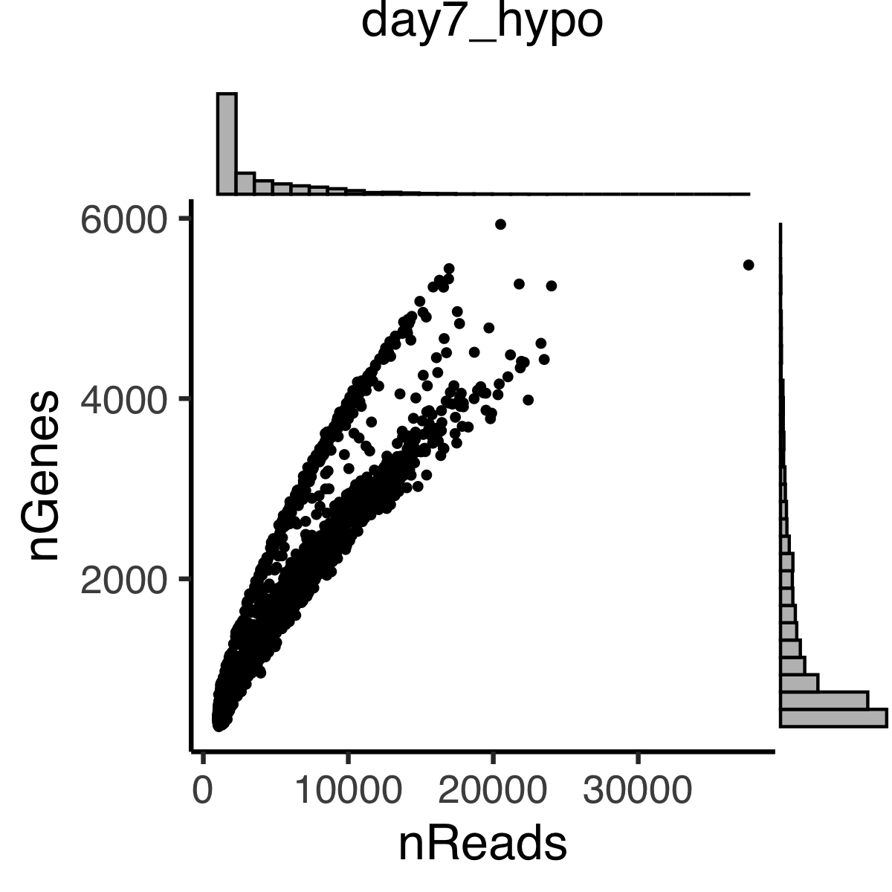
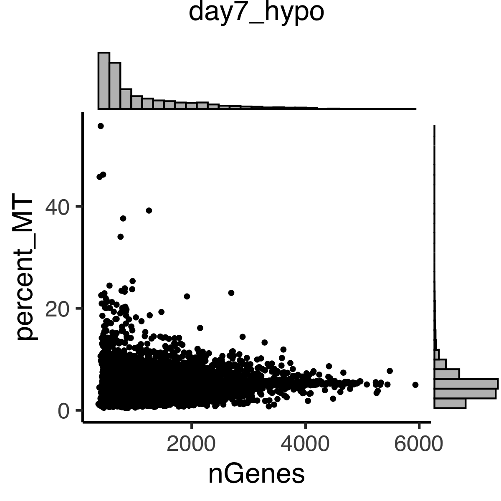


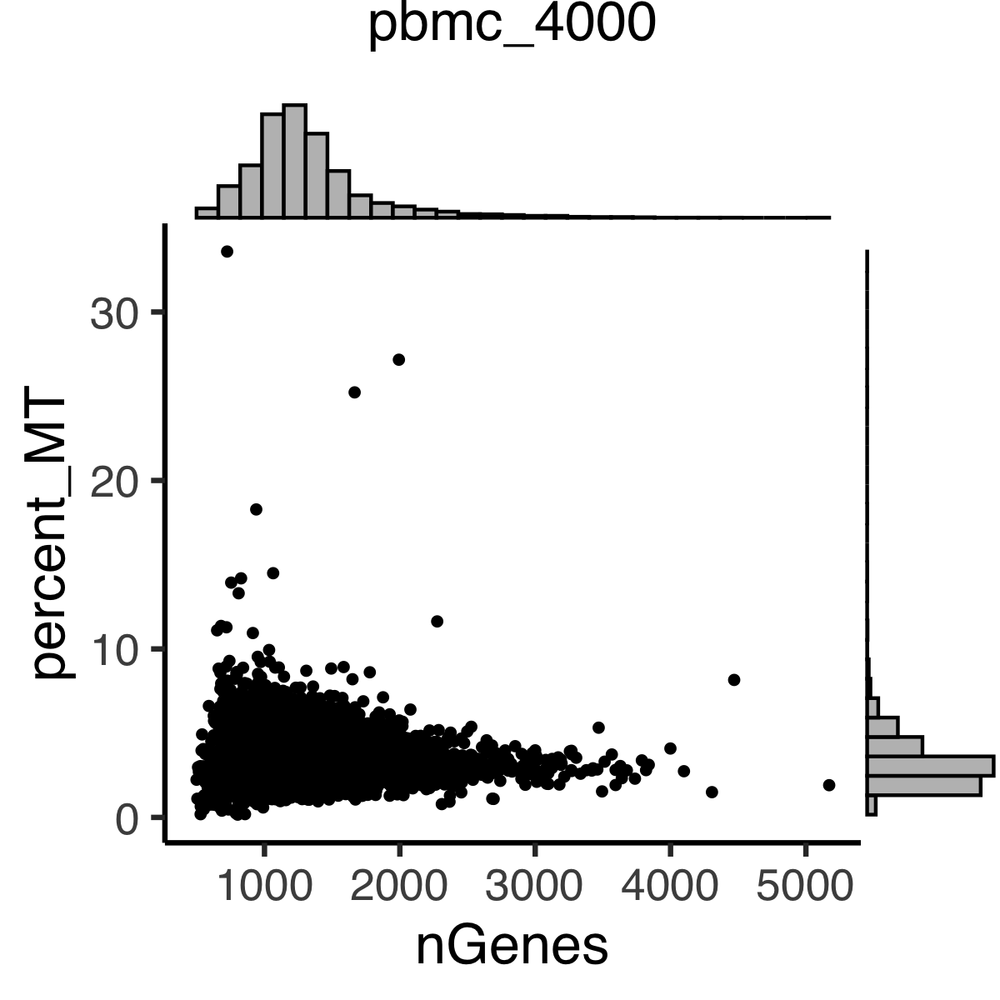
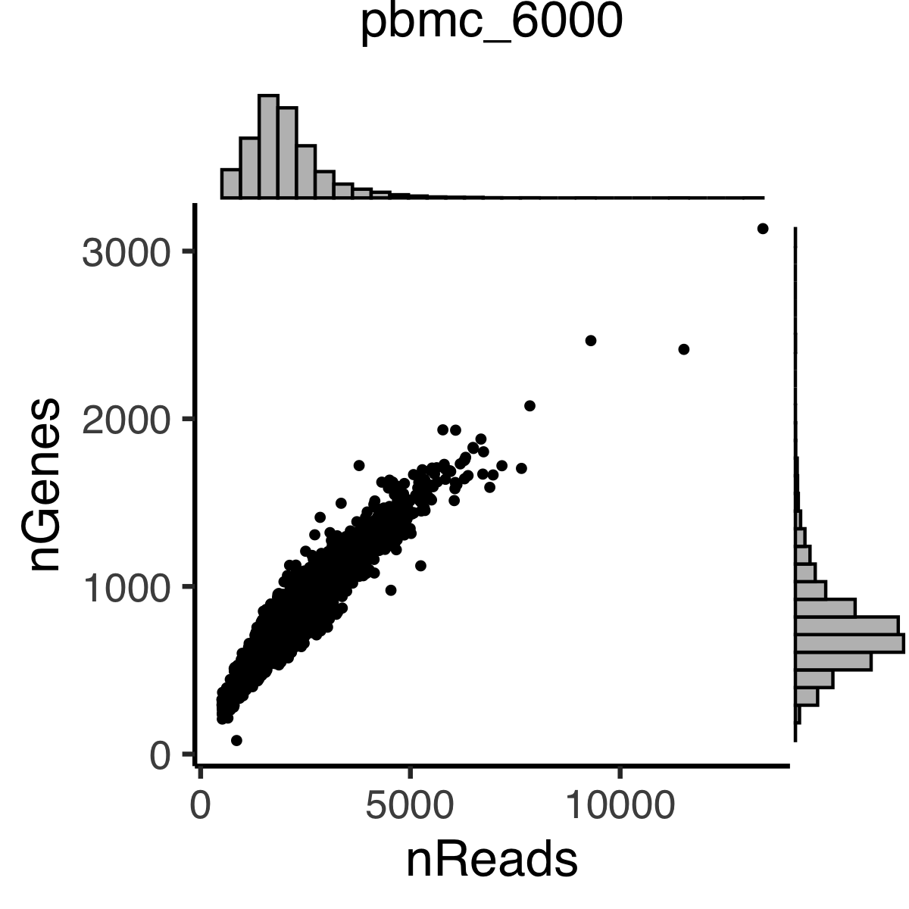
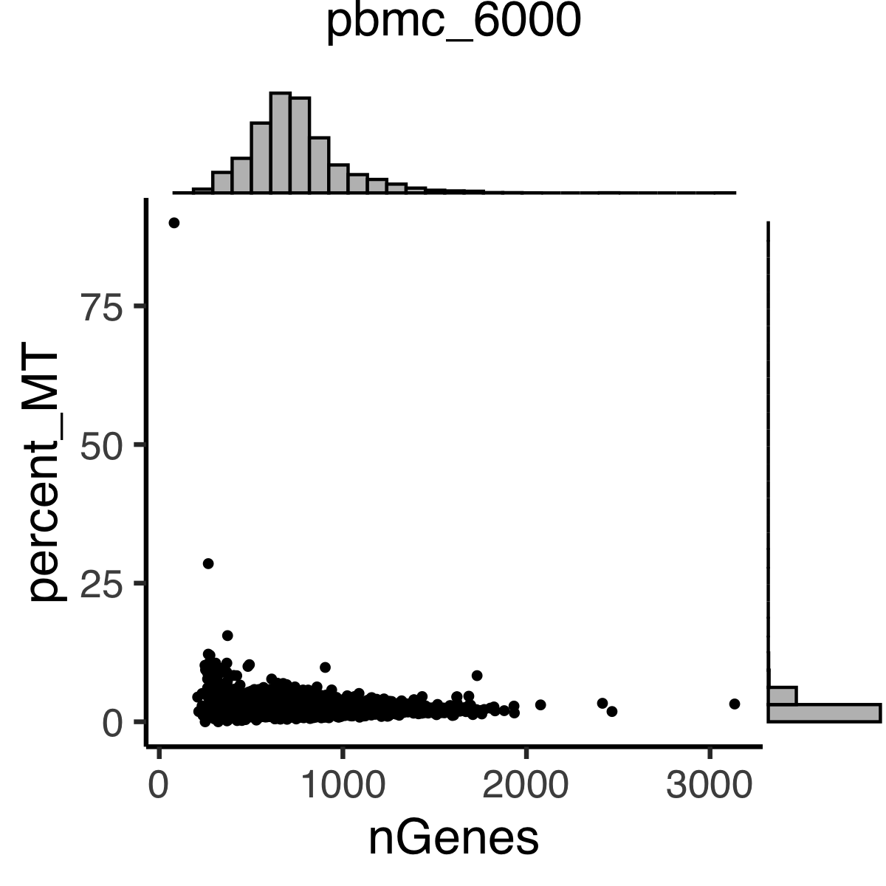

The following function `plot_metaData_wAnnotation()` outputs a scatter plot for
the meta data input, which is ranked according to their values.
The arguments are `vec` (one-dimensional vector of single-cell QC metrics,
e.g., one of `obj[["sample"]][["nReads"]]`, `obj[["sample"]][["nGenes"]]`),
`target_xRange` (x-axis interval in which one would like to find an
inflection point), `n` (number of dividing points for `target_xRange`),
`title`, `xlabel`, and `ylabel`.
Note that the inflection points are used for the cell filtering below.
Note that the calculated inflection points are approximated to the nearest
integers.
```{r, eval = FALSE}
my_func <- function(obj, metaname, target_xRange){
  vec <- obj[["sample"]][[metaname]]
  p <- plot_metaData_wAnnotation(
    vec = obj[["sample"]][[metaname]], target_xRange = target_xRange,
    n = round(0.1 * (target_xRange[2] - target_xRange[1])),
    title = obj[["history"]][["make_asurat_obj"]][["obj_name"]],
    title_size = 16, xlabel = "Ranked samples", ylabel = metaname
  )
  return(p)
}
# ----------------------------------------
# day1_norm
# ----------------------------------------
target_xRange <- c(100, 10000)
p <- my_func(day1_norm, metaname = "nReads", target_xRange = target_xRange)
filename <- "figures/figure_01_0020.png"
ggsave(file = filename, plot = p, dpi = 300, width = 4, height = 3.7)

target_xRange <- c(100, 10000)
p <- my_func(day1_norm, metaname = "nGenes", target_xRange = target_xRange)
filename <- "figures/figure_01_0021.png"
ggsave(file = filename, plot = p, dpi = 300, width = 4, height = 3.7)
```

```{r, eval = FALSE, echo = FALSE, results = "hide"}
# ----------------------------------------
# day7_hypo
# ----------------------------------------
target_xRange <- c(100, 5000)
p <- my_func(day7_hypo, metaname = "nReads", target_xRange = target_xRange)
filename <- "figures/figure_02_0020.png"
ggsave(file = filename, plot = p, dpi = 300, width = 4, height = 3.7)

target_xRange <- c(100, 5900)
p <- my_func(day7_hypo, metaname = "nGenes", target_xRange = target_xRange)
filename <- "figures/figure_02_0021.png"
ggsave(file = filename, plot = p, dpi = 300, width = 4, height = 3.7)
# ----------------------------------------
# sc68_vehi
# ----------------------------------------
target_xRange <- c(100, 4500)
p <- my_func(sc68_vehi, metaname = "nReads", target_xRange = target_xRange)
filename <- "figures/figure_03_0020.png"
ggsave(file = filename, plot = p, dpi = 300, width = 4, height = 3.7)

target_xRange <- c(100, 5400)
p <- my_func(sc68_vehi, metaname = "nGenes", target_xRange = target_xRange)
filename <- "figures/figure_03_0021.png"
ggsave(file = filename, plot = p, dpi = 300, width = 4, height = 3.7)
# ----------------------------------------
# sc68_cisp
# ----------------------------------------
target_xRange <- c(100, 3000)
p <- my_func(sc68_cisp, metaname = "nReads", target_xRange = target_xRange)
filename <- "figures/figure_04_0020.png"
ggsave(file = filename, plot = p, dpi = 300, width = 4, height = 3.7)

target_xRange <- c(100, 3000)
p <- my_func(sc68_cisp, metaname = "nGenes", target_xRange = target_xRange)
filename <- "figures/figure_04_0021.png"
ggsave(file = filename, plot = p, dpi = 300, width = 4, height = 3.7)
# ----------------------------------------
# pbmc_4000
# ----------------------------------------
target_xRange <- c(2000, 4000)
p <- my_func(pbmc_4000, metaname = "nReads", target_xRange = target_xRange)
filename <- "figures/figure_05_0020.png"
ggsave(file = filename, plot = p, dpi = 300, width = 4, height = 3.7)

target_xRange <- c(2000, 4000)
p <- my_func(pbmc_4000, metaname = "nGenes", target_xRange = target_xRange)
filename <- "figures/figure_05_0021.png"
ggsave(file = filename, plot = p, dpi = 300, width = 4, height = 3.7)
# ----------------------------------------
# pbmc_6000
# ----------------------------------------
target_xRange <- c(2000, 5000)
p <- my_func(pbmc_6000, metaname = "nReads", target_xRange = target_xRange)
filename <- "figures/figure_06_0020.png"
ggsave(file = filename, plot = p, dpi = 300, width = 4, height = 3.7)

target_xRange <- c(2000, 5000)
p <- my_func(pbmc_6000, metaname = "nGenes", target_xRange = target_xRange)
filename <- "figures/figure_06_0021.png"
ggsave(file = filename, plot = p, dpi = 300, width = 4, height = 3.7)
```

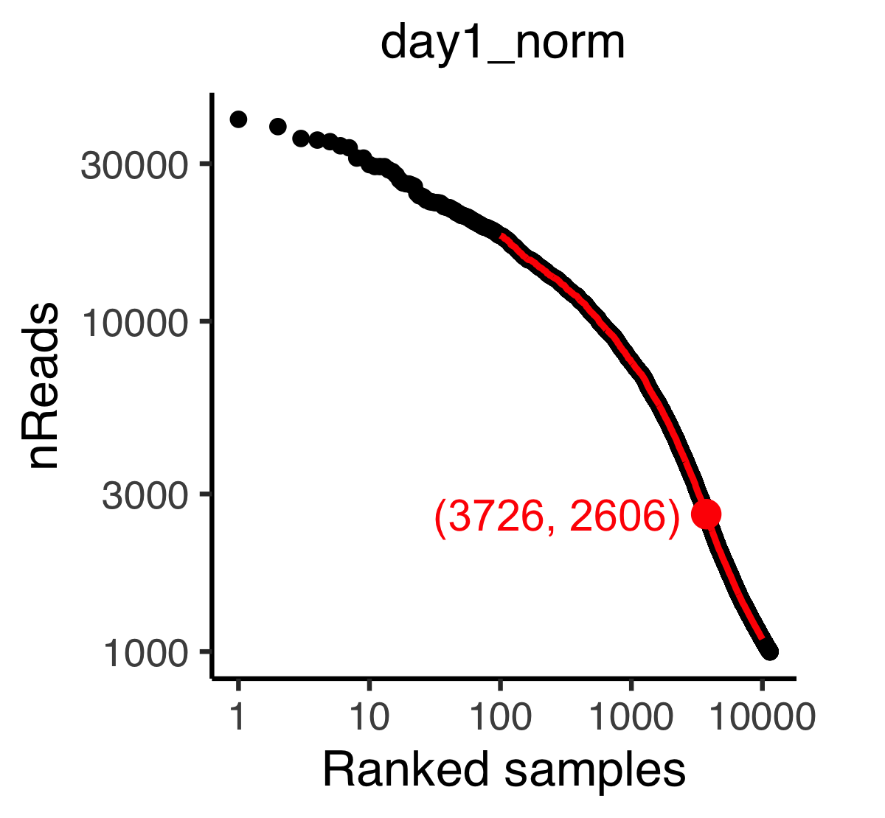

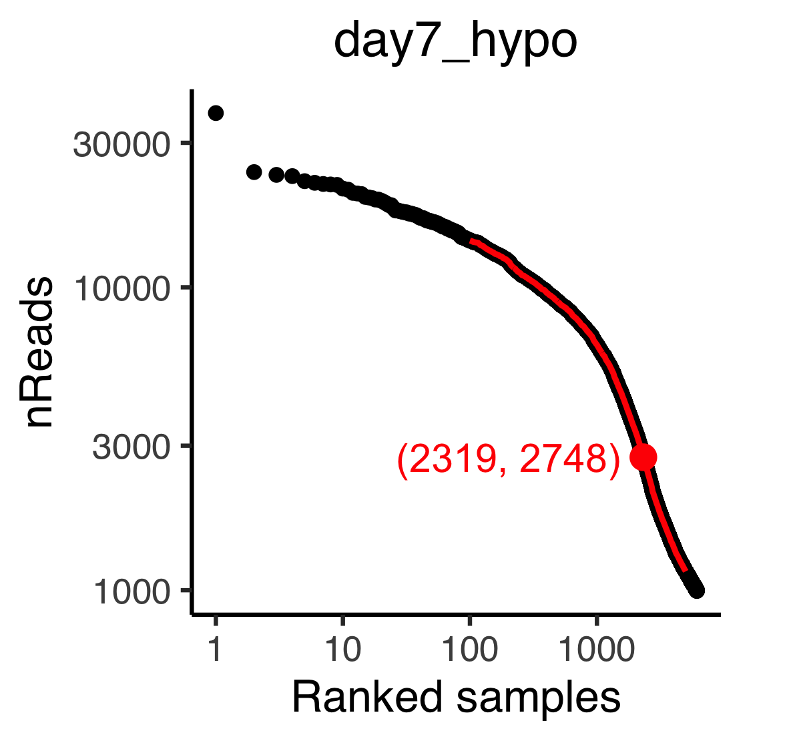


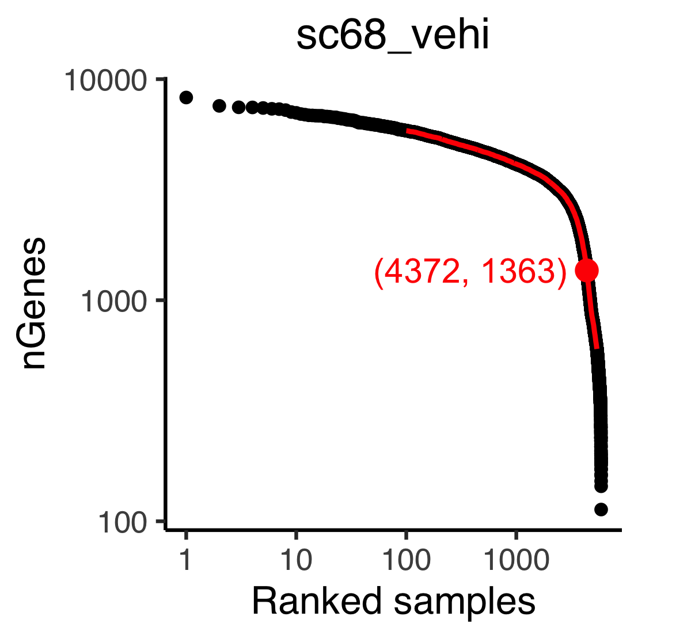
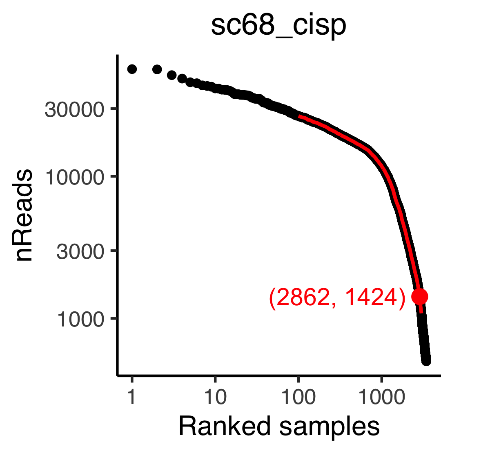


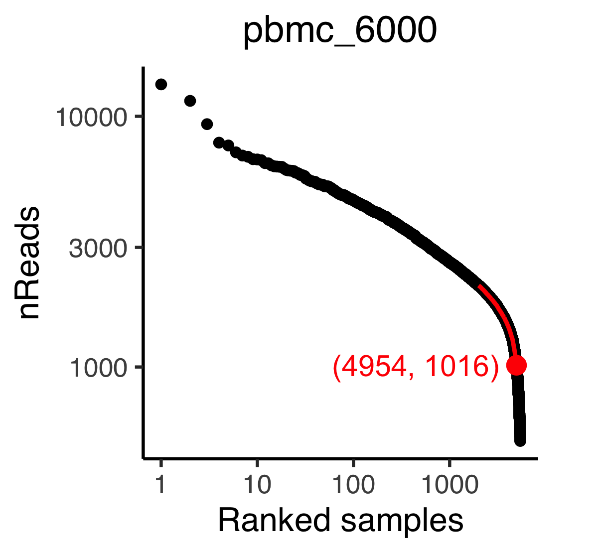


The following function `trim_samples()` filters out the low quality
cells by setting minimum and maximum values of the calculated QC metrics.
```{r, eval = FALSE}
day1_norm_red <- trim_samples(obj = day1_norm,
                              min_nReads = 2606, max_nReads = 30000,
                              min_nGenes = 993, max_nGenes = 1e+10,
                              min_percent_MT = 0, max_percent_MT = 14)
day7_hypo_red <- trim_samples(obj = day7_hypo,
                              min_nReads = 2748, max_nReads = 20000,
                              min_nGenes = 1205, max_nGenes = 1e+10,
                              min_percent_MT = 0, max_percent_MT = 12)
sc68_vehi_red <- trim_samples(obj = sc68_vehi,
                              min_nReads = 4828, max_nReads = 40000,
                              min_nGenes = 1363, max_nGenes = 1e+10,
                              min_percent_MT = 0, max_percent_MT = 13)
sc68_cisp_red <- trim_samples(obj = sc68_cisp,
                              min_nReads = 1424, max_nReads = 40000,
                              min_nGenes = 1138, max_nGenes = 1e+10,
                              min_percent_MT = 0, max_percent_MT = 15)
pbmc_4000_red <- trim_samples(obj = pbmc_4000,
                              min_nReads = 2239, max_nReads = 20000,
                              min_nGenes = 884, max_nGenes = 1e+10,
                              min_percent_MT = 0, max_percent_MT = 8)
pbmc_6000_red <- trim_samples(obj = pbmc_6000,
                              min_nReads = 1016, max_nReads = 7000,
                              min_nGenes = 457, max_nGenes = 1e+10,
                              min_percent_MT = 0, max_percent_MT = 8)
```

Save the objects.
```{r, eval = FALSE}
saveRDS(day1_norm_red, file = "backup/01_003_day1_norm_trim_samples.rds")
saveRDS(day7_hypo_red, file = "backup/02_003_day7_hypo_trim_samples.rds")
saveRDS(sc68_vehi_red, file = "backup/03_003_sc68_vehi_trim_samples.rds")
saveRDS(sc68_cisp_red, file = "backup/04_003_sc68_cisp_trim_samples.rds")
saveRDS(pbmc_4000_red, file = "backup/05_003_pbmc_4000_trim_samples.rds")
saveRDS(pbmc_6000_red, file = "backup/06_003_pbmc_6000_trim_samples.rds")
```


## Variable QC
Load the data.
```{r, eval = FALSE}
source("R/function_general.R")
source("R/plot.R")
day1_norm <- readRDS(file = "backup/01_003_day1_norm_trim_samples.rds")
day7_hypo <- readRDS(file = "backup/02_003_day7_hypo_trim_samples.rds")
sc68_vehi <- readRDS(file = "backup/03_003_sc68_vehi_trim_samples.rds")
sc68_cisp <- readRDS(file = "backup/04_003_sc68_cisp_trim_samples.rds")
pbmc_4000 <- readRDS(file = "backup/05_003_pbmc_4000_trim_samples.rds")
pbmc_6000 <- readRDS(file = "backup/06_003_pbmc_6000_trim_samples.rds")
```

Check the size of the gene-by-sample matrices.
```{r, eval = FALSE}
rbind(dim(day1_norm[["data"]][["raw"]]), dim(day7_hypo[["data"]][["raw"]]),
      dim(sc68_vehi[["data"]][["raw"]]), dim(sc68_cisp[["data"]][["raw"]]),
      dim(pbmc_4000[["data"]][["raw"]]), dim(pbmc_6000[["data"]][["raw"]]))
```

```
[1,] 16820 3663
[2,] 15795 1947
[3,] 16784 3923
[4,] 15605 2285
[5,] 13829 3815
[6,] 11946 4878
```

The following function `plot_meanReads_wAnnotation()` outputs a scatter plot for
mean of number of reads for each gene, which is ranked according to their
values.
The arguments are `obj`, `threshold` (set by trial and error),
`digits` (number of digits after the decimal point for the annotated value),
`title`, `xlabel`, and `ylabel`.
```{r, eval = FALSE}
my_func <- function(obj, threshold){
  p <- plot_meanReads_wAnnotation(
    obj = obj, threshold = threshold, digits = 2,
    title = obj[["history"]][["make_asurat_obj"]][["obj_name"]],
    title_size = 16, xlabel = "Ranked genes", ylabel = "Mean of raw read counts"
  )
  return(p)
}
# ----------------------------------------
# day1_norm
# ----------------------------------------
p <- my_func(obj = day1_norm, threshold = 0.2)
filename <- "figures/figure_01_0030.png"
ggsave(file = filename, plot = p, dpi = 300, width = 4, height = 3.7)
```

```{r, eval = FALSE, echo = FALSE, results = "hide"}
# ----------------------------------------
# day7_hypo
# ----------------------------------------
p <- my_func(obj = day7_hypo, threshold = 0.2)
filename <- "figures/figure_02_0030.png"
ggsave(file = filename, plot = p, dpi = 300, width = 4, height = 3.7)
# ----------------------------------------
# sc68_vehi
# ----------------------------------------
p <- my_func(obj = sc68_vehi, threshold = 0.2)
filename <- "figures/figure_03_0030.png"
ggsave(file = filename, plot = p, dpi = 300, width = 4, height = 3.7)
# ----------------------------------------
# sc68_cisp
# ----------------------------------------
p <- my_func(obj = sc68_cisp, threshold = 0.2)
filename <- "figures/figure_04_0030.png"
ggsave(file = filename, plot = p, dpi = 300, width = 4, height = 3.7)
# ----------------------------------------
# pbmc_4000
# ----------------------------------------
p <- my_func(obj = pbmc_4000, threshold = 0.05)
filename <- "figures/figure_05_0030.png"
ggsave(file = filename, plot = p, dpi = 300, width = 4, height = 3.7)
# ----------------------------------------
# pbmc_6000
# ----------------------------------------
p <- my_func(obj = pbmc_6000, threshold = 0.03)
filename <- "figures/figure_06_0030.png"
ggsave(file = filename, plot = p, dpi = 300, width = 4, height = 3.7)
```

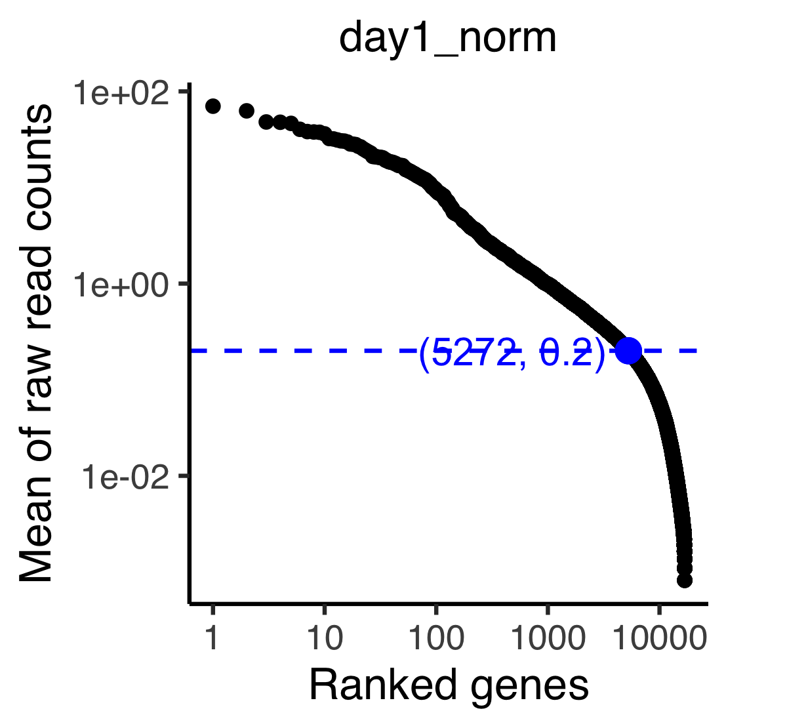
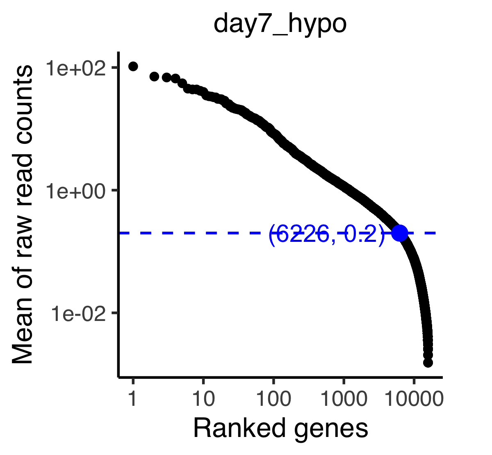
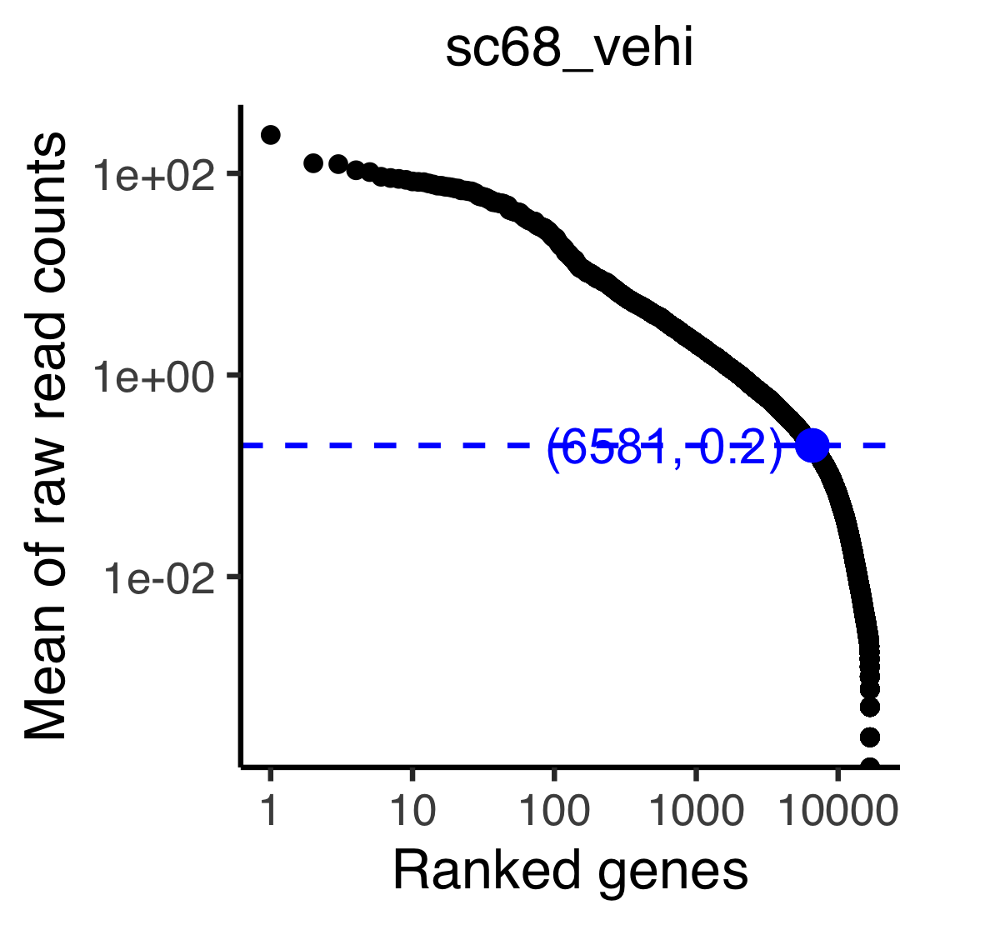
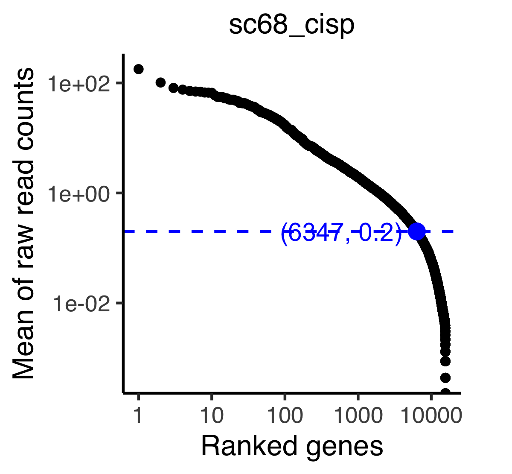


The following function `trim_variables()` filters out the low quality
genes by setting a minimum value as `min_meanReads`.
```{r, eval = FALSE}
day1_norm_red <- trim_variables(obj = day1_norm, min_meanReads = 0.2)
day7_hypo_red <- trim_variables(obj = day7_hypo, min_meanReads = 0.2)
sc68_vehi_red <- trim_variables(obj = sc68_vehi, min_meanReads = 0.2)
sc68_cisp_red <- trim_variables(obj = sc68_cisp, min_meanReads = 0.2)
pbmc_4000_red <- trim_variables(obj = pbmc_4000, min_meanReads = 0.05)
pbmc_6000_red <- trim_variables(obj = pbmc_6000, min_meanReads = 0.03)
```

Check the scatter plots between QC metrics for each cell
```{r, eval = FALSE}
my_func <- function(obj, metaname1, metaname2){
  df <- data.frame(x = obj[["sample"]][[metaname1]],
                   y = obj[["sample"]][[metaname2]])
  p <- plot_metaData(df = df,
                    title = obj[["history"]][["make_asurat_obj"]][["obj_name"]],
                    title_size = 16, xlabel = metaname1, ylabel = metaname2)
  return(p)
}
# ----------------------------------------
# For `day1_norm`
# ----------------------------------------
p <- my_func(day1_norm_red, metaname1 = "nReads", metaname2 = "nGenes")
filename <- "figures/figure_01_0035.png"
ggsave(file = filename, plot = p, dpi = 300, width = 4, height = 4)

p <- my_func(day1_norm_red, metaname1 = "nGenes", metaname2 = "percent_MT")
filename <- "figures/figure_01_0036.png"
ggsave(file = filename, plot = p, dpi = 300, width = 4, height = 4)
```

```{r, eval = FALSE, echo = FALSE, results = "hide"}
# ----------------------------------------
# For `day7_hypo`
# ----------------------------------------
p <- my_func(day7_hypo_red, metaname1 = "nReads", metaname2 = "nGenes")
filename <- "figures/figure_02_0035.png"
ggsave(file = filename, plot = p, dpi = 300, width = 4, height = 4)

p <- my_func(day7_hypo_red, metaname1 = "nGenes", metaname2 = "percent_MT")
filename <- "figures/figure_02_0036.png"
ggsave(file = filename, plot = p, dpi = 300, width = 4, height = 4)
# ----------------------------------------
# For `sc68_vehi`
# ----------------------------------------
p <- my_func(sc68_vehi_red, metaname1 = "nReads", metaname2 = "nGenes")
filename <- "figures/figure_03_0035.png"
ggsave(file = filename, plot = p, dpi = 300, width = 4, height = 4)

p <- my_func(sc68_vehi_red, metaname1 = "nGenes", metaname2 = "percent_MT")
filename <- "figures/figure_03_0036.png"
ggsave(file = filename, plot = p, dpi = 300, width = 4, height = 4)
# ----------------------------------------
# For `sc68_cisp`
# ----------------------------------------
p <- my_func(sc68_cisp_red, metaname1 = "nReads", metaname2 = "nGenes")
filename <- "figures/figure_04_0035.png"
ggsave(file = filename, plot = p, dpi = 300, width = 4, height = 4)

p <- my_func(sc68_cisp_red, metaname1 = "nGenes", metaname2 = "percent_MT")
filename <- "figures/figure_04_0036.png"
ggsave(file = filename, plot = p, dpi = 300, width = 4, height = 4)
# ----------------------------------------
# For `pbmc_4000`
# ----------------------------------------
p <- my_func(pbmc_4000_red, metaname1 = "nReads", metaname2 = "nGenes")
filename <- "figures/figure_05_0035.png"
ggsave(file = filename, plot = p, dpi = 300, width = 4, height = 4)

p <- my_func(pbmc_4000_red, metaname1 = "nGenes", metaname2 = "percent_MT")
filename <- "figures/figure_05_0036.png"
ggsave(file = filename, plot = p, dpi = 300, width = 4, height = 4)
# ----------------------------------------
# For `pbmc_6000`
# ----------------------------------------
p <- my_func(pbmc_6000_red, metaname1 = "nReads", metaname2 = "nGenes")
filename <- "figures/figure_06_0035.png"
ggsave(file = filename, plot = p, dpi = 300, width = 4, height = 4)

p <- my_func(pbmc_6000_red, metaname1 = "nGenes", metaname2 = "percent_MT")
filename <- "figures/figure_06_0036.png"
ggsave(file = filename, plot = p, dpi = 300, width = 4, height = 4)
```

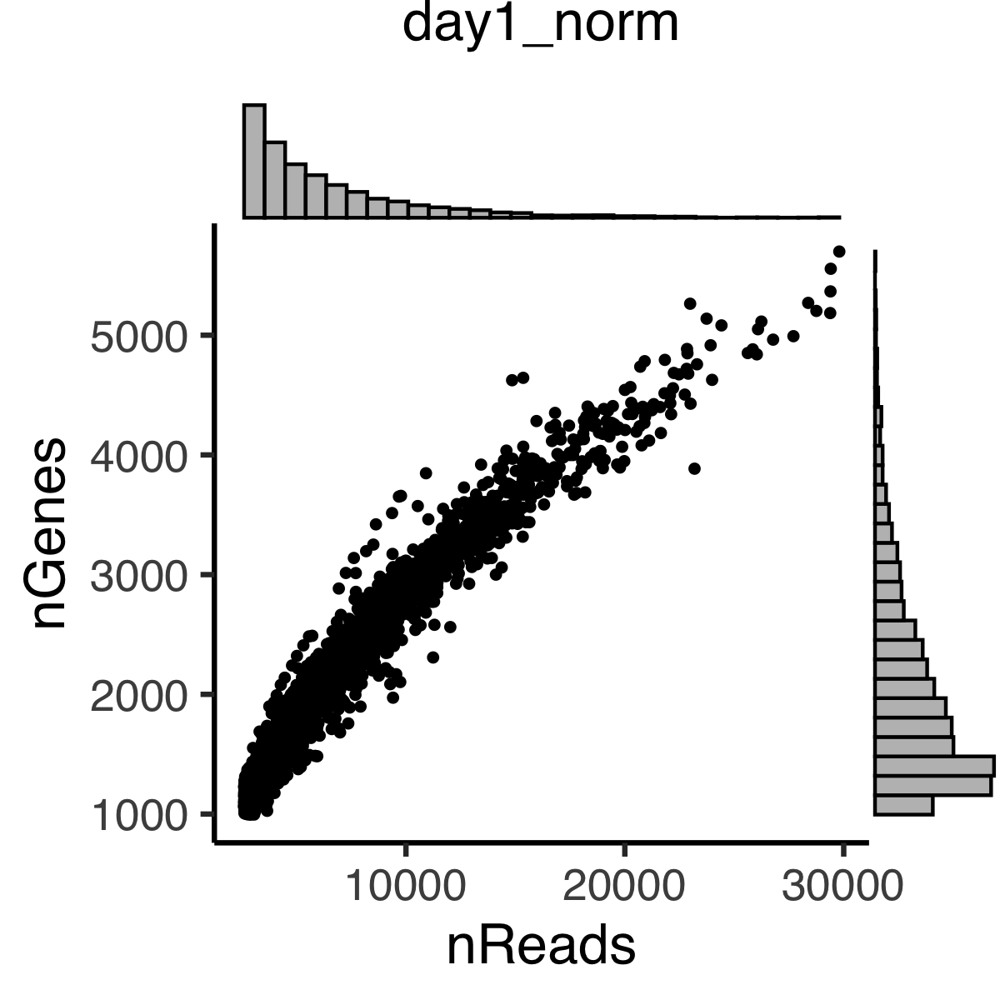

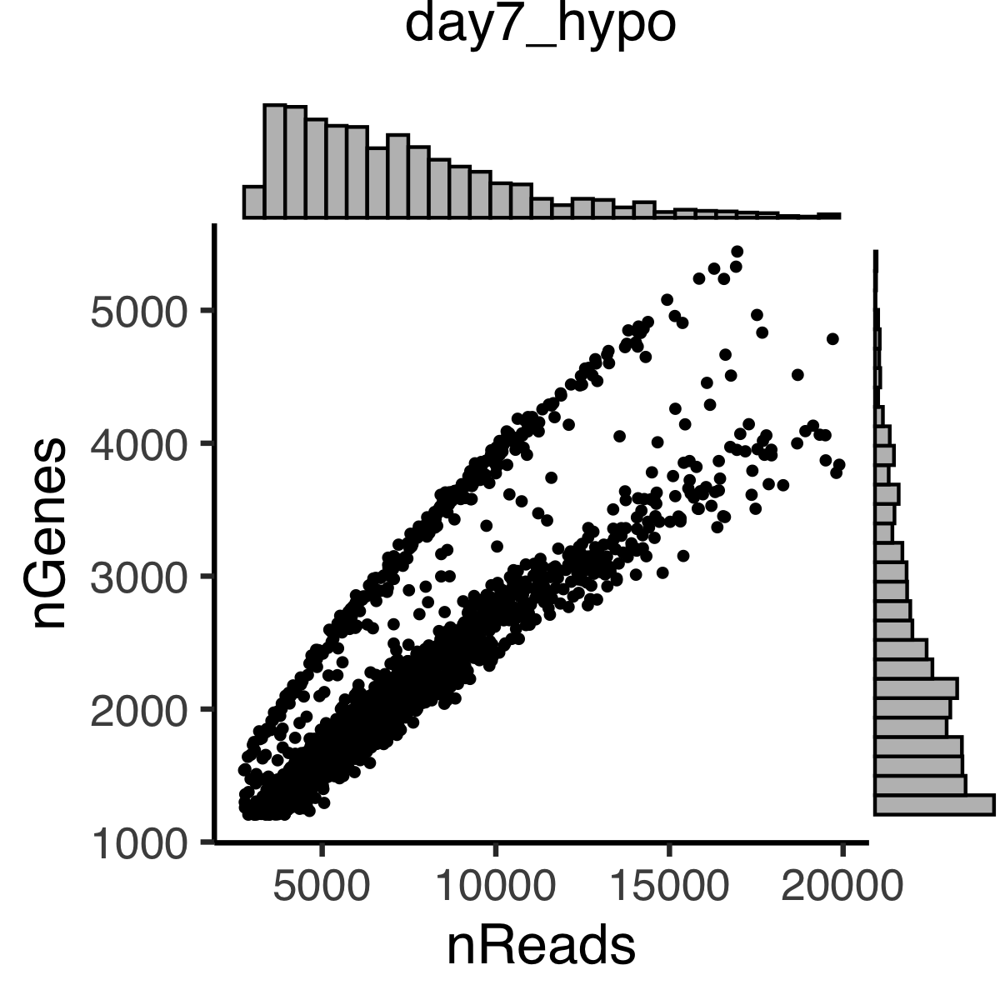
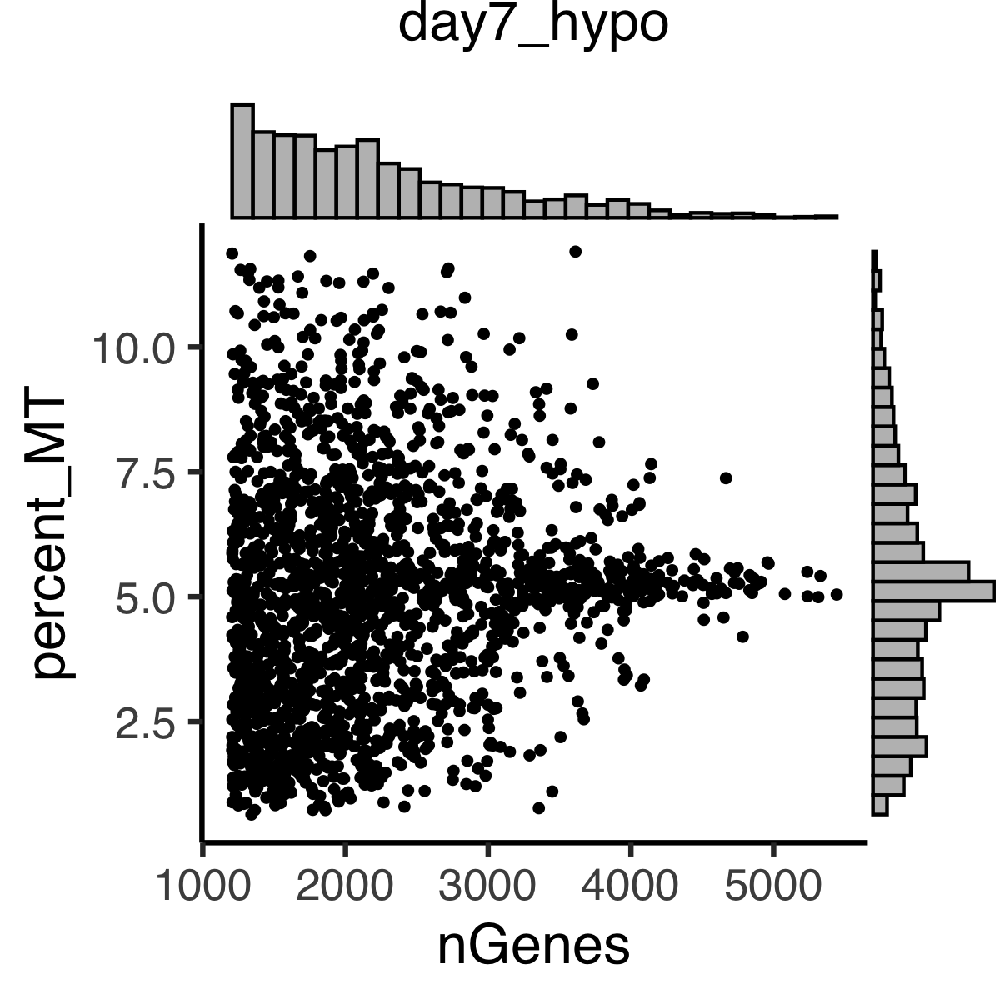


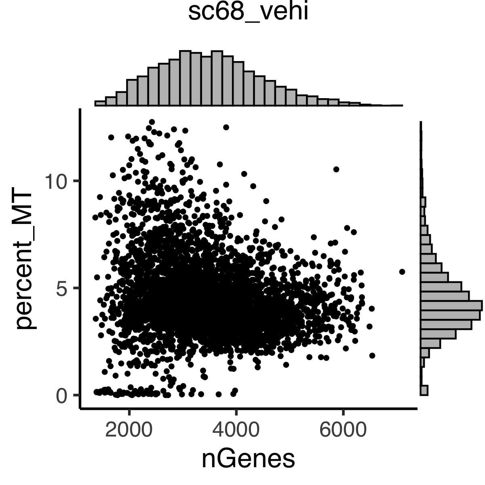
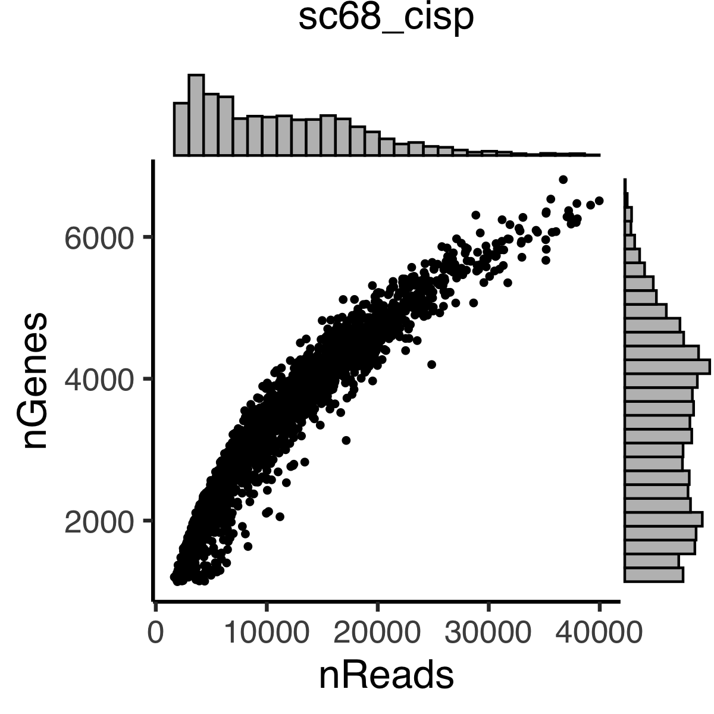


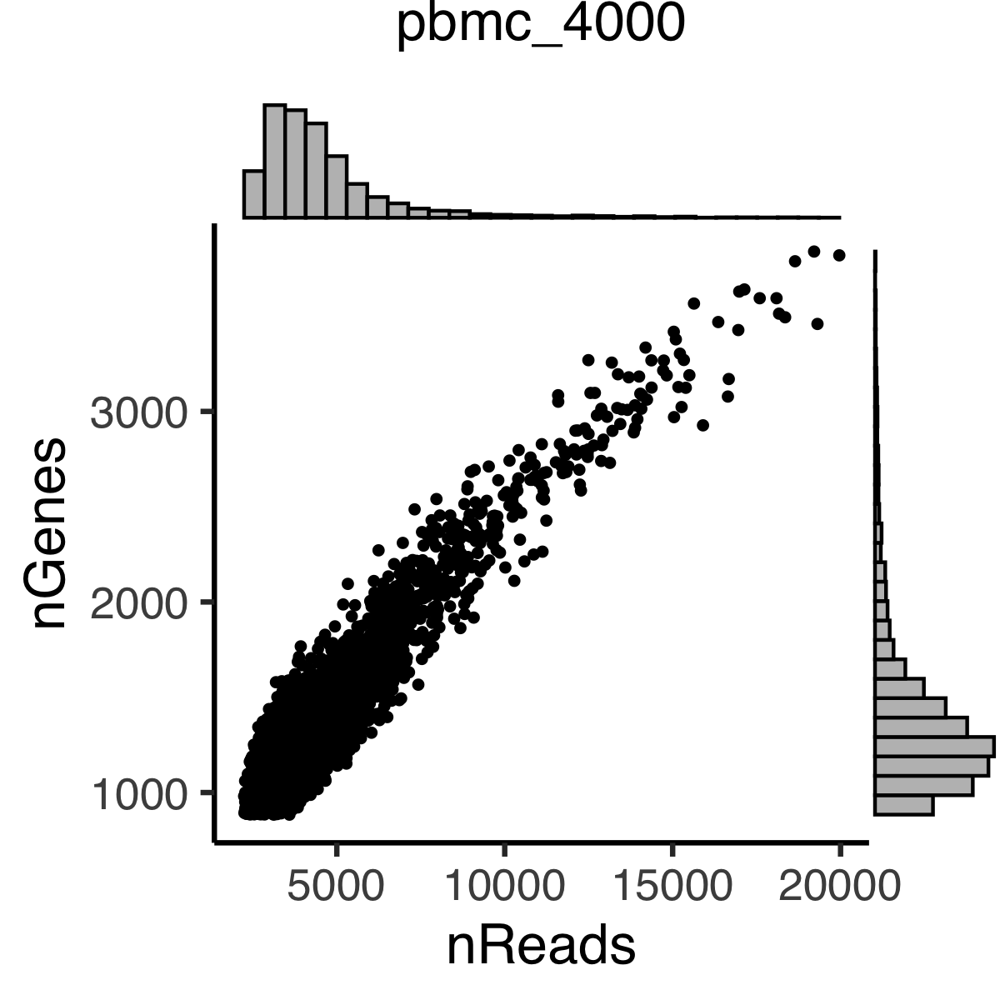
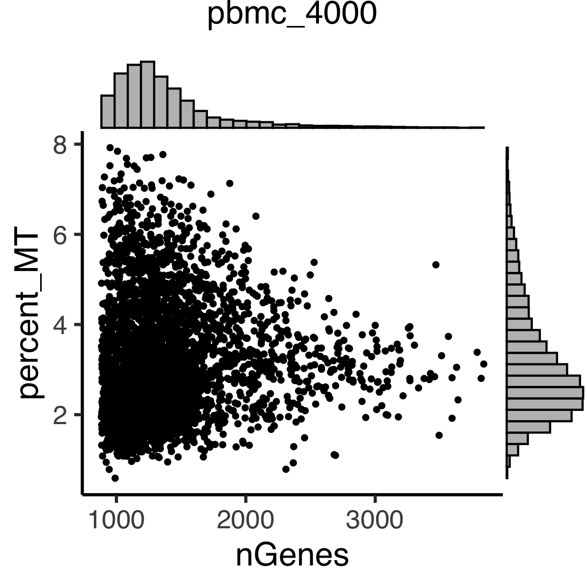
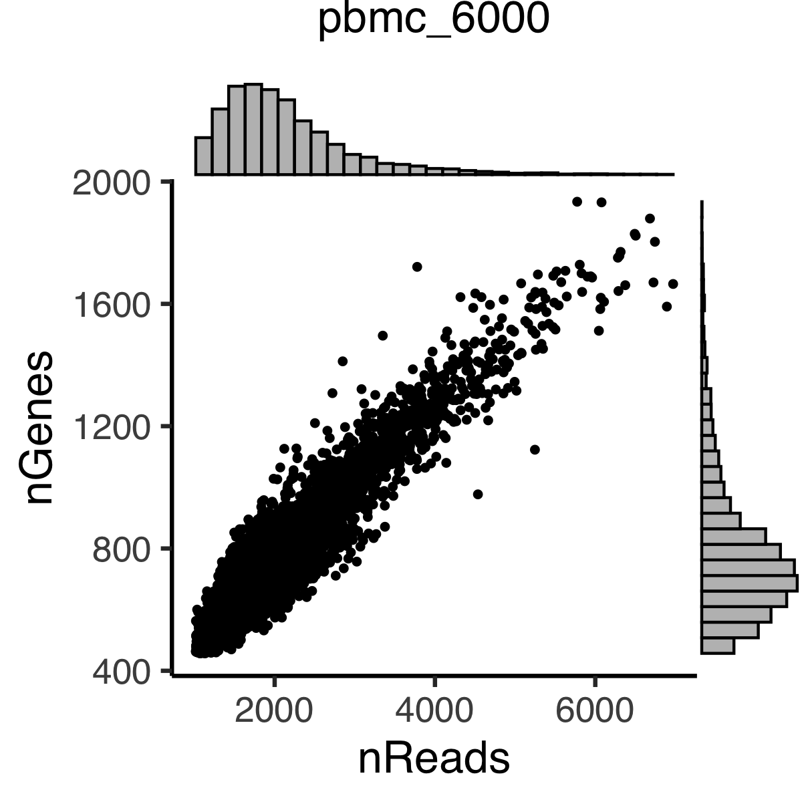


Check the size of the gene-by-sample matrices.
```{r, eval = FALSE}
rbind(dim(day1_norm_red[["data"]][["raw"]]),
      dim(day7_hypo_red[["data"]][["raw"]]),
      dim(sc68_vehi_red[["data"]][["raw"]]),
      dim(sc68_cisp_red[["data"]][["raw"]]),
      dim(pbmc_4000_red[["data"]][["raw"]]),
      dim(pbmc_6000_red[["data"]][["raw"]]))
```

```
[1,] 5272 3663
[2,] 6213 1947
[3,] 6581 3923
[4,] 6347 2285
[5,] 6658 3815
[6,] 5169 4878
```

Save the objects.
```{r, eval = FALSE}
saveRDS(day1_norm_red, file = "backup/01_004_day1_norm_trim_variables.rds")
saveRDS(day7_hypo_red, file = "backup/02_004_day7_hypo_trim_variables.rds")
saveRDS(sc68_vehi_red, file = "backup/03_004_sc68_vehi_trim_variables.rds")
saveRDS(sc68_cisp_red, file = "backup/04_004_sc68_cisp_trim_variables.rds")
saveRDS(pbmc_4000_red, file = "backup/05_004_pbmc_4000_trim_variables.rds")
saveRDS(pbmc_6000_red, file = "backup/06_004_pbmc_6000_trim_variables.rds")
```
