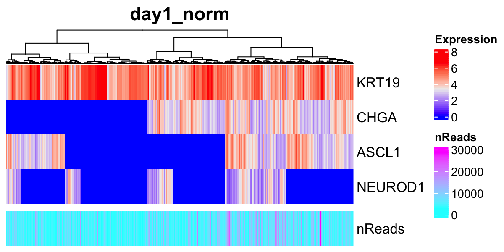
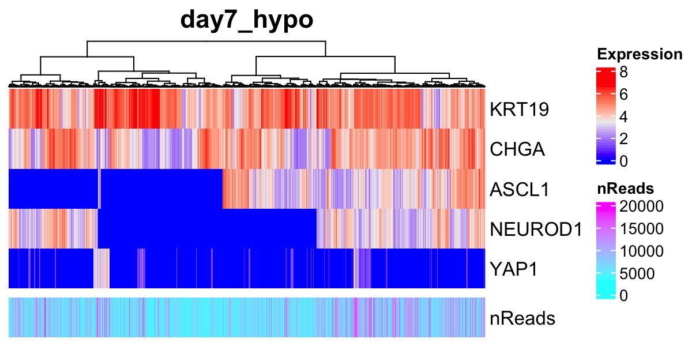
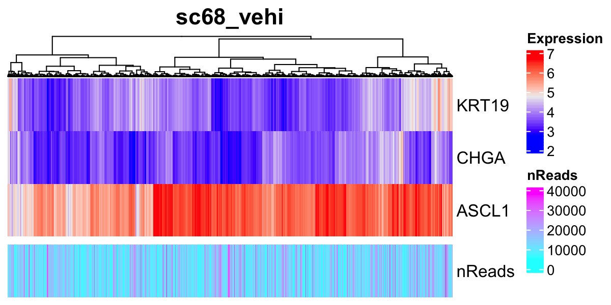

# Checking expression profiles of marker genes {#markergenes}
To confirm that important marker genes are detected in the datasets,
we recommend users to investigate the gene expression profiles of
expected marker genes before running ASURAT.

Load the normalized data.
```{r, eval = FALSE}
source("R/function_general.R")
source("R/plot.R")
day1_norm <- readRDS(file = "backup/01_005_day1_norm_normalized.rds")
day7_hypo <- readRDS(file = "backup/02_005_day7_hypo_normalized.rds")
sc68_vehi <- readRDS(file = "backup/03_005_sc68_vehi_normalized.rds")
sc68_cisp <- readRDS(file = "backup/04_005_sc68_cisp_normalized.rds")
pbmc_4000 <- readRDS(file = "backup/05_005_pbmc_4000_normalized.rds")
pbmc_6000 <- readRDS(file = "backup/06_005_pbmc_6000_normalized.rds")
```

The following function `plot_Heatmap_GenexSamp()` shows the gene-by-sample
matrix for a given gene set as a heatmap, using the results of 
`obj[["data"]][["log1p"]]`.
The arguments are `obj` (ASURAT object), `genes` (genes of interest, e.g.,
marker genes), `method` (agglomeration method to be used such as `complete`,
`ward.D2`, `average`, etc.), and `show_nReads` (if `TRUE`, the number of reads
is shown).
```{r, eval = FALSE}
# ----------------------------------------
# For `day1_norm`
# ----------------------------------------
filename <- "figures/figure_01_0040.png"
png(file = filename, height = 600, width = 1200, res = 200)
plot_Heatmap_GenexSamp(obj = day1_norm,
                       genes = c("KRT19", "CHGA", "ASCL1", "NEUROD1", "YAP1"),
                       method = "ward.D2", show_nReads = TRUE,
                       title = "day1_norm", name = "Expression")
dev.off()
```

```{r, eval = FALSE, echo = FALSE, results = "hide"}
# ----------------------------------------
# For `day7_hypo`
# ----------------------------------------
filename <- "figures/figure_02_0040.png"
png(file = filename, height = 600, width = 1200, res = 200)
plot_Heatmap_GenexSamp(obj = day7_hypo,
                       genes = c("KRT19", "CHGA", "ASCL1", "NEUROD1", "YAP1"),
                       method = "ward.D2", show_nReads = TRUE,
                       title = "day7_hypo", name = "Expression")
dev.off()
# ----------------------------------------
# For `sc68_vehi`
# ----------------------------------------
filename <- "figures/figure_03_0040.png"
png(file = filename, height = 600, width = 1200, res = 200)
plot_Heatmap_GenexSamp(obj = sc68_vehi,
                       genes = c("KRT19", "CHGA", "ASCL1", "NEUROD1", "YAP1"),
                       method = "ward.D2", show_nReads = TRUE,
                       title = "sc68_vehi", name = "Expression")
dev.off()
# ----------------------------------------
# For `sc68_cisp`
# ----------------------------------------
filename <- "figures/figure_04_0040.png"
png(file = filename, height = 600, width = 1200, res = 200)
plot_Heatmap_GenexSamp(obj = sc68_cisp,
                       genes = c("KRT19", "CHGA", "ASCL1", "NEUROD1", "YAP1"),
                       method = "ward.D2", show_nReads = TRUE,
                       title = "sc68_cisp", name = "Expression")
dev.off()
```





