# ASURAT using Cell Ontology database (optional)
In this section, we apply ASURAT on healthy donor-derived transcriptomes.
ASURAT transforms a single-cell transcriptome to cell-type or functional spectra
by extracting the system of signs on each of the thousands of biological terms
and the associated gene sets obtained from public databases.
The resulting matrices termed sign-by-sample matrices (SSMs) can be supplied
to the subsequent unsupervised clusterings.

**Tips:**
Cell Ontology DB is used for clustering non-disease samples.
Users should select proper databases.


## Creating sign-by-sample matrices
Input the data.
```{r, eval = FALSE}
rm(list = ls())
source("R/plot.R")
source("R/function_sign.R")
tidy_CO <- readRDS(file = "data/2020_001_databases/20201213_tidy_CO_human.rds")
IC_CO <- readRDS(file = "data/2020_001_databases/20201213_IC_CO_human.rds")
filename <- "data/2020_001_databases/20201213_treeTable_CO_human.rds"
treeTable_CO <- readRDS(file = filename)

pbmc_4000 <- readRDS(file = "backup/05_005_pbmc_4000_normalized.rds")
pbmc_6000 <- readRDS(file = "backup/06_005_pbmc_6000_normalized.rds")

pbmc_4000_cor <- readRDS(file = "backup/05_006_pbmc_4000_correlation.rds")
pbmc_6000_cor <- readRDS(file = "backup/06_006_pbmc_6000_correlation.rds")
```

To make the object small, unused items are removed.
```{r, eval = FALSE}
pbmc_4000[["data"]][["raw"]] <- NULL
pbmc_4000[["data"]][["bayNorm"]] <- NULL
pbmc_4000[["data"]][["beer"]] <- NULL

pbmc_6000[["data"]][["raw"]] <- NULL
pbmc_6000[["data"]][["bayNorm"]] <- NULL
pbmc_6000[["data"]][["beer"]] <- NULL
```

Input `tidy_CO` into the ASURAT objects.
```{r, eval = FALSE}
pbmc_4000[["sign"]][["CO"]] <- tidy_CO
pbmc_6000[["sign"]][["CO"]] <- tidy_CO
```

The following function `do_quickQC_sign()` takes an intersection of genes
between user's data and `tidy_CO`, and then excludes the IDs including too few
or too many genes by setting thresholds `min_ngenes` (minimal number of genes
which must be greater than one) and `max_ngenes` (maximal number of genes which
must be greater than one).
```{r, eval = FALSE}
pbmc_4000 <- do_quickQC_sign(obj = pbmc_4000, data_type = "CO",
                             min_ngenes = 2, max_ngenes = 1000)
pbmc_6000 <- do_quickQC_sign(obj = pbmc_6000, data_type = "CO",
                             min_ngenes = 2, max_ngenes = 1000)
```
The computational results are stored in `obj[["sign"]][["CO"]][["cell"]]`.

The following function `separate_variables_sign()` separates genes annotated
with each biological description into three groups, i.e., strongly correlated
gene set (SCG), variably correlated gene set (VCG), and weakly correlated gene
set (WCG).
The arguments are `obj`, `obj_cor`, `data_type`, `method = "spearman"` (one of
the arguments input in `do_cor_variables()`), `th_posi`, and `th_nega`
(threshold values of positive and negative correlation coefficients,
respectively).

**Tips:**
This decomposition sometimes produces unexpected results.
In fact the smaller values of `th_posi` and `th_nega` do not always result in
the larger sizes of SCG and VCG.
Hence we recommend users to carefully turn the parameters, checking if the
signs of interest are included in the results.
```{r, eval = FALSE}
pbmc_4000_red <- separate_variables_sign(obj = pbmc_4000,
                                         obj_cor = pbmc_4000_cor,
                                         data_type = "CO",
                                         method = "spearman",
                                         th_posi = 0.47, th_nega = -0.29)
pbmc_6000_red <- separate_variables_sign(obj = pbmc_6000,
                                         obj_cor = pbmc_6000_cor,
                                         data_type = "CO",
                                         method = "spearman",
                                         th_posi = 0.21, th_nega = -0.21)
```
The computational result is stored in `obj[["sign"]][["CO"]][["cell"]]`.

The following function `select_sign()` selects the signs by a user-defined
criteria, which has been preset as follows:

1. sum of the number of genes in SCG and VCG is greater than or equal to
`min_cnt`, and
2. the number of genes in WCG is greater than or equal to `min_cnt_weak`
(the default value is 2).

Users can modify the programming code indicated by "User-defined criteria"
in the file `R/function_sign.R`.
Note that the signs having at most one gene will be removed when creating
sign-by-sample matrices.
For example, given a certain parent sign having SCG = \{GENE_A, GENE_B\} and
VCG = \{GENE_C\}, the VCG will be removed from the downstream analysis.

**Tips:**
The larger the value of `min_cnt` is, the more reliable signs users can obtain.
However, one should pay attention to several bias problems such as annotation
bias, that is some biological terms are associated with many genes, while
others with few.
```{r, eval = FALSE}
pbmc_4000_red <- select_sign(obj = pbmc_4000_red, data_type = "CO",
                             min_cnt = 5, min_cnt_weak = 2)
pbmc_6000_red <- select_sign(obj = pbmc_6000_red, data_type = "CO",
                             min_cnt = 4, min_cnt_weak = 2)
```
The computational result is stored in `obj[["sign"]][["CO"]][["cell"]]`.

Save the objects.
```{r, eval = FALSE}
saveRDS(pbmc_4000_red, file = "backup/05_100_pbmc_4000_select_CO.rds")
saveRDS(pbmc_6000_red, file = "backup/06_100_pbmc_6000_select_CO.rds")
```

Load the objects.
```{r, eval = FALSE}
pbmc_4000_red <- readRDS(file = "backup/05_100_pbmc_4000_select_CO.rds")
pbmc_6000_red <- readRDS(file = "backup/06_100_pbmc_6000_select_CO.rds")
```

The following function `compute_SemSim_sign()` computes pairwise semantic
similarities between biological descriptions.
The arguments are `obj`, `data_type`, `measure` (one of `"Lin"` and `"Resnik"`),
`orgdb = NULL`, `treeTable = treeTable_CO`, and `IC = IC_CO`.
Note that the results are stored into `obj[["sign"]][["CO_Sim"]]`, but the row
and column names are in ascending order with respect to the values of
information content (IC).

**Tips:**
The optimal choice of `measure` depends on the ontology structure.
```{r, eval = FALSE}
pbmc_4000_red <- compute_SemSim_sign(obj = pbmc_4000_red, data_type = "CO",
                                     measure = "Lin", orgdb = NULL,
                                     treeTable = treeTable_CO, IC = IC_CO)
pbmc_6000_red <- compute_SemSim_sign(obj = pbmc_6000_red, data_type = "CO",
                                     measure = "Lin", orgdb = NULL,
                                     treeTable = treeTable_CO, IC = IC_CO)
```
The computational result is stored in
`obj[["sign"]][["GO_Sim"]][["cell"]]`.

The following function `reduce_sign()` removes the biological terms based on the
results of `compute_SemSim_sign()`.
The arguments are `obj`, `data_type`, `threshold` (threshold for regarding
two biological terms as similar ones), and `keep_rareID` (if `"TRUE"`, then the
biological terms with larger ICs are kept).
Note that the larger ICs are, the deeper the biological terms tend to be.
Users can access a correspondence table in `obj[["sign"]][["CO_Sim"]]`, where
SCG, VCG, and WCG are separated by `||`.

**Tips:**
The optimal value of `threshold` depends on the ontology structure as well as
the measure in `compute_SemSim_sign()`.
The logical argument `keep_rareID` should be carefully determined by the
research objective.
For example, if users will use CO for detailed sample annotation or
classification, it might be `keep_rareID = TRUE`.
Note that the smaller ICs of CO terms are, the more genes tend to be associated
with.
```{r, eval = FALSE}
pbmc_4000_red <- reduce_sign(obj = pbmc_4000_red, data_type = "CO",
                             threshold = 0.95, keep_rareID = TRUE)
pbmc_6000_red <- reduce_sign(obj = pbmc_6000_red, data_type = "CO",
                             threshold = 0.95, keep_rareID = TRUE)
```
The computational result is stored in
`obj[["sign"]][["CO_Sim"]][["cell"]][["report"]]`.

The following function `manual_curation_sign()` removes biological terms by
specifying the IDs or keywords.
The argument are `obj`, `data_type`, and `keywords` (list of keywords
separated by `|`).

**Tips:**
Users may take into account the following points:

1. correlation coefficients
2. information contents (ICs)
3. ratios of mitochondrial genes for SCG and VCG
4. biological terms which are obviously unrelated to the research objective

```{r, eval = FALSE}
keywords <- "foo|foofoo"
pbmc_4000_red <- manual_curation_sign(obj = pbmc_4000_red, data_type = "CO",
                                      keywords = keywords)
keywords <- "foo|foofoo"
pbmc_6000_red <- manual_curation_sign(obj = pbmc_6000_red, data_type = "CO",
                                      keywords = keywords)
```
The computational result is stored in `obj[["sign"]][["CO"]][["cell"]]`.

The following function `make_signxsample_matrix()` makes sign-by-sample
matrices.
The arguments are `obj`, `data_type`, `weight_strg` (weight parameter for SCG:
the default value is 0.5) and `weight_vari` (weight parameter for VCG:
the default value is 0.5).

**Tips:**
The bigger the weight constants are, the sharper the results may be.
However, setting `weight_strg` and `weight_vari` as 1 or 0 is not recommended
because there is a possibility that different signs have the same SCG, VCG, or
WCG, which makes the matrix singular.
```{r, eval = FALSE}
pbmc_4000_red <- make_signxsample_matrix(obj = pbmc_4000_red, data_type = "CO",
                                         weight_strg = 0.5, weight_vari = 0.5)
pbmc_6000_red <- make_signxsample_matrix(obj = pbmc_6000_red, data_type = "CO",
                                         weight_strg = 0.5, weight_vari = 0.5)
```
The computational result is stored in `obj[["sign"]][["COxSample"]][["cell"]]`.

The following command `plot_Heatmap_SignxSamp()` shows a heat map by using
`Heatmap()` in `ComplexHeatmap` package applied to the sign-by-sample matrices.
The arguments are `obj`, `data_type`, `category`, `algo_name = NULL`,
`method` (agglomeration method to be used such as `complete`, `ward.D2`,
`average`, etc.), `show_nReads` (if `TRUE`, the number of reads is shown),
`title` (title of the figure), `name` (name of the color bar),
`show_rownames_sign` (if `TRUE`, the name of sign is shown),
`show_rownames_label` (if `TRUE`, the name of label is shown),
`show_rownames_nReads` (if `TRUE`, the name of number of reads is shown), and
`default_color` (if `TRUE`, each cluster is colored by default color of ggplot,
otherwise by rainbow).
```{r, eval = FALSE}
# ----------------------------------------
# pbmc_4000
# ----------------------------------------
filename <- "figures/figure_05_0100.png"
png(file = filename, height = 1000, width = 1150, res = 200)
plot_Heatmap_SignxSamp(obj = pbmc_4000_red,
                       data_type = "CO", category = "cell",
                       algo_name = NULL, method = "ward.D2",
                       show_nReads = TRUE, title = "pbmc_4000 (CO: cell)",
                       name = "COxSamp", show_rownames_sign = FALSE,
                       show_rownames_label = FALSE,
                       show_rownames_nReads = FALSE, default_color = TRUE)
dev.off()
```


```{r, eval = FALSE, echo = FALSE, results = "hide"}
# ----------------------------------------
# pbmc_6000
# ----------------------------------------
filename <- "figures/figure_06_0100.png"
png(file = filename, height = 1000, width = 1150, res = 200)
plot_Heatmap_SignxSamp(obj = pbmc_6000_red,
                       data_type = "CO", category = "cell",
                       algo_name = NULL, method = "ward.D2",
                       show_nReads = TRUE, title = "pbmc_6000 (CO: cell)",
                       name = "COxSamp", show_rownames_sign = FALSE,
                       show_rownames_label = FALSE,
                       show_rownames_nReads = FALSE, default_color = TRUE)
dev.off()
```

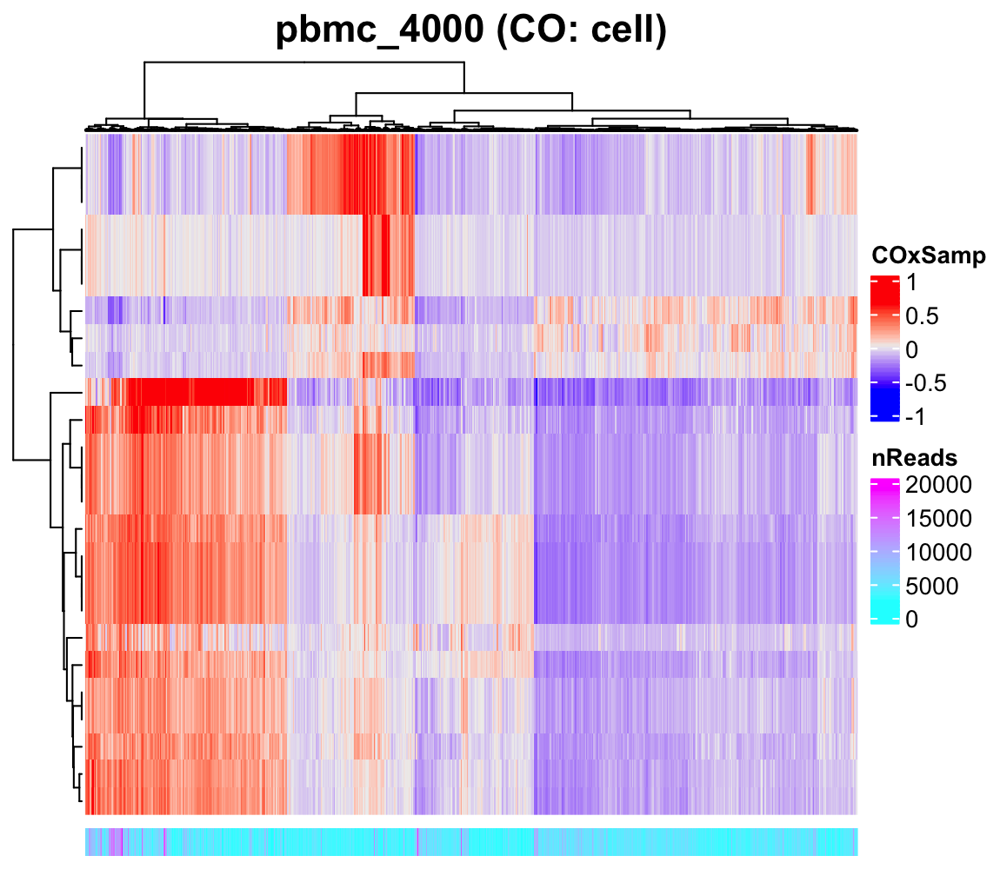


Save the objects.
```{r, eval = FALSE}
saveRDS(pbmc_4000_red, file = "backup/05_101_pbmc_4000_matrix_CO.rds")
saveRDS(pbmc_6000_red, file = "backup/06_101_pbmc_6000_matrix_CO.rds")
```


## Dimension reduction
Load the objects.
```{r, eval = FALSE}
rm(list = ls())
source("R/plot.R")
source("R/function_sign.R")
pbmc_4000 <- readRDS(file = "backup/05_101_pbmc_4000_matrix_CO.rds")
pbmc_6000 <- readRDS(file = "backup/06_101_pbmc_6000_matrix_CO.rds")
```

The following function `do_pca_sign()` performs principal component analysis
based on the sign-by-sample matrices of the input `data_type` and `category`.
```{r, eval = FALSE}
pbmc_4000 <- do_pca_sign(obj = pbmc_4000, data_type = "CO", category = "cell")
pbmc_6000 <- do_pca_sign(obj = pbmc_6000, data_type = "CO", category = "cell")
```
The computational result is stored in
`obj[["reduction"]][["pca"]][["CO"]][["cell"]]`.

The following function `do_tsne_sign()` performs `Rtsne()` in `Rtsne` package
based on the sign-by-sample matrices of the input `data_type` and `category`.
The arguments are `obj`, `data_type`, `category`, `pca_dim` (an integer:
dimension of principal component used for t-SNE, in which `NULL` is accepted if
users would like to compute t-SNE from the original sample-by-sign matrices),
and `tsne_dim` (t-SNE dimension: either `2` or `3`).
```{r, eval = FALSE}
pbmc_4000 <- do_tsne_sign(obj = pbmc_4000, data_type = "CO", category = "cell",
                          pca_dim = NULL, tsne_dim = 2)
pbmc_6000 <- do_tsne_sign(obj = pbmc_6000, data_type = "CO", category = "cell",
                          pca_dim = NULL, tsne_dim = 2)
```
The computational result is stored in
`obj[["reduction"]][["tsne"]][["CO"]][["cell"]]`.

The following function `plot_tsne_sign()` shows the data in a t-SNE space,
in which the space dimension is automatically given by `tsne_dim` used in
`do_tsne_sign()`.
The arguments are `obj`, `data_type`, `category`, `algo_name = NULL`, `theta`
(angle of view for 3D plots), `phi` (angle of view for 3D plots), `title`,
`xlabel`, `ylabel`, `zlabel`, and `default_color` (if `TRUE`, the default color
of ggplot is used, otherwise rainbow).
Here, `theta`, `phi`, `zlabel` are set only for 3D plots.
```{r, eval = FALSE}
# ----------------------------------------
# pbmc_4000
# ----------------------------------------
p <- plot_tsne_sign(obj = pbmc_4000, data_type = "CO", category = "cell",
                    algo_name = NULL, theta = NULL, phi = NULL,
                    title = "pbmc_4000 (CO: cell)", title_size = 18,
                    xlabel = "tSNE_1", ylabel = "tSNE_2", zlabel = NULL,
                    default_color = TRUE)
filename <- "figures/figure_05_0105.png"
ggsave(file = filename, plot = p, dpi = 200, width = 4.3, height = 4.5)
```

```{r, eval = FALSE, echo = FALSE, results = "hide"}
# ----------------------------------------
# pbmc_6000
# ----------------------------------------
p <- plot_tsne_sign(obj = pbmc_6000, data_type = "CO", category = "cell",
                    algo_name = NULL, theta = NULL, phi = NULL,
                    title = "pbmc_6000 (CO: cell)", title_size = 18,
                    xlabel = "tSNE_1", ylabel = "tSNE_2", zlabel = NULL,
                    default_color = TRUE)
filename <- "figures/figure_06_0105.png"
ggsave(file = filename, plot = p, dpi = 200, width = 4.3, height = 4.5)
```

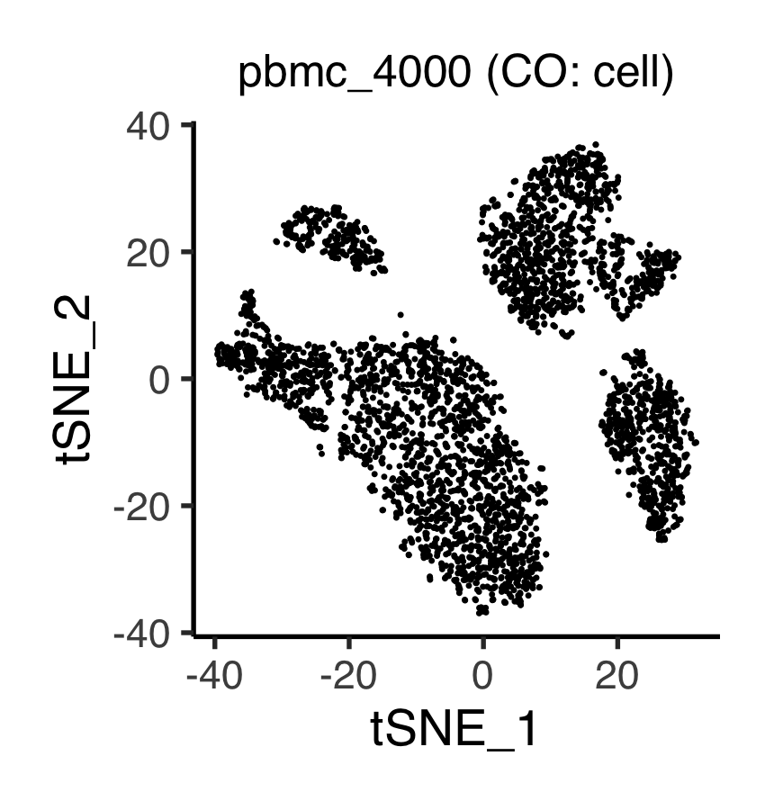
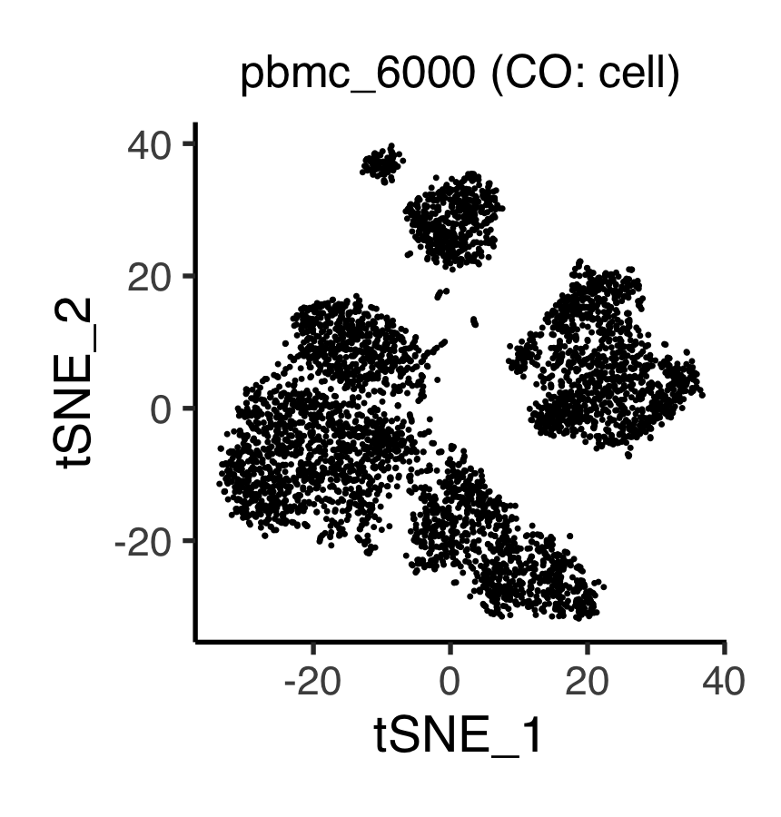

The following function `do_umap_sign()` performs `umap()` in `umap` package
based on the sign-by-sample matrices of the input `data_type` and `category`.
The arguments are `obj`, `data_type`, `category`, `pca_dim` (an integer:
dimension of principal component used for UMAP, in which `NULL` is accepted if
users would like to compute UMAP from the original sample-by-sign matrices),
and `umap_dim` (UMAP dimension: either `2` or `3`).
```{r, eval = FALSE}
pbmc_4000 <- do_umap_sign(obj = pbmc_4000, data_type = "CO",
                          category = "cell", pca_dim = NULL, umap_dim = 2)
pbmc_6000 <- do_umap_sign(obj = pbmc_6000, data_type = "CO",
                          category = "cell", pca_dim = NULL, umap_dim = 2)
```
The computational result is stored in
`obj[["reduction"]][["umap"]][["CO"]][["cell"]]`.

The following function `plot_umap_sign()` shows the data in a UMAP space,
in which the space dimension is automatically given by `umap_dim` used in
`do_umap_sign()`.
The arguments are `obj`, `data_type`, `category`, `algo_name = NULL`, `theta`
(angle of view for 3D plots), `phi` (angle of view for 3D plots), `title`,
`xlabel`, `ylabel`, `zlabel`, and `default_color` (if `TRUE`, the default color
of ggplot is used, otherwise rainbow).
Here, `theta`, `phi`, `zlabel` are set only for 3D plots.
```{r, eval = FALSE}
# ----------------------------------------
# pbmc_4000
# ----------------------------------------
p <- plot_umap_sign(obj = pbmc_4000, data_type = "CO", category = "cell",
                    algo_name = NULL, theta = NULL, phi = NULL,
                    title = "pbmc_4000 (CO: cell)", title_size = 18,
                    xlabel = "UMAP_1", ylabel = "UMAP_2", zlabel = NULL,
                    default_color = FALSE)
filename <- "figures/figure_05_0106.png"
ggsave(file = filename, plot = p, dpi = 300, width = 4.3, height = 4.5)
```

```{r, eval = FALSE, echo = FALSE, results = "hide"}
# ----------------------------------------
# pbmc_6000
# ----------------------------------------
p <- plot_umap_sign(obj = pbmc_6000, data_type = "CO", category = "cell",
                    algo_name = NULL, theta = NULL, phi = NULL,
                    title = "pbmc_6000 (CO: cell)", title_size = 18,
                    xlabel = "UMAP_1", ylabel = "UMAP_2", zlabel = NULL,
                    default_color = FALSE)
filename <- "figures/figure_06_0106.png"
ggsave(file = filename, plot = p, dpi = 300, width = 4.3, height = 4.5)
```


The following function `do_DiffusionMap_sign()` performs `DiffusionMap()` in
`destiny` package, where the arguments are preset as `sigma = "local"` and
`distance = "euclidean"`.
The arguments are `obj`, `data_type`, `category`, `sigma`
(argument of `DiffusionMap()`), `distance` (argument of `DiffusionMap()`), and
`pca_dim` (an integer: dimension of principal component used for UMAP, in which
`NULL` is accepted if users would like to compute UMAP from the original
sample-by-sign matrices)
```{r, eval = FALSE}
pbmc_4000 <- do_DiffusionMap_sign(obj = pbmc_4000, data_type = "CO",
                                  category = "cell", pca_dim = NULL)
pbmc_6000 <- do_DiffusionMap_sign(obj = pbmc_6000, data_type = "CO",
                                  category = "cell", pca_dim = NULL)
```
The computational result is stored in
`obj[["reduction"]][["dmap"]][["CO"]][["cell"]]`.

The following function `plot_DiffusionMap_sign()` shows the data in a diffusion
space.
The arguments are `obj`, `data_type`, `category`, `algo_name = NULL`, `dims`
(dimension vector for the plot), `theta` (angle of view), `phi` (angle of view),
`title`, `title_size`, `xlabel`, `ylabel`, and `zlabel`, and `default_color`
(if `TRUE`, the default color of ggplot is used, otherwise rainbow).
Here, `theta`, `phi`, `zlabel` are set only for 3D plots.
```{r, eval = FALSE}
# ----------------------------------------
# pbmc_4000
# ----------------------------------------
filename <- "figures/figure_05_0110.png"
png(file = filename, height = 1200, width = 1200, res = 250)
plot_DiffusionMap_sign(obj = pbmc_4000, data_type = "CO", category = "cell",
                       algo_name = NULL, dims = 1:3, theta = 90, phi = 30,
                       title = "pbmc_4000 (CO: cell)", title_size = 1.2,
                       xlabel = "DC_1", ylabel = "DC_2", zlabel = "DC_3",
                       default_color = TRUE)
dev.off()
#
# Below is a memo for using plot_ly()
#
# library(plotly)
# x <- pbmc_4000[["reduction"]][["dmap"]][["CO"]][["cell"]]@eigenvectors
# df <- as.data.frame(x)
# plot_ly(df, x = df[,1], y = df[,2], z = df[,3], mode = "markers",
# type = "scatter3d", marker = list(opacity = 1, showlegend = T, size = 2))
```

```{r, eval = FALSE, echo = FALSE, results = "hide"}
# ----------------------------------------
# pbmc_6000
# ----------------------------------------
filename <- "figures/figure_06_0110.png"
png(file = filename, height = 1200, width = 1200, res = 250)
plot_DiffusionMap_sign(obj = pbmc_6000, data_type = "CO", category = "cell",
                       algo_name = NULL, dims = 1:3, theta = 0, phi = 30,
                       title = "pbmc_6000 (CO: cell)", title_size = 1.2,
                       xlabel = "DC_1", ylabel = "DC_2", zlabel = "DC_3",
                       default_color = TRUE)
dev.off()
```


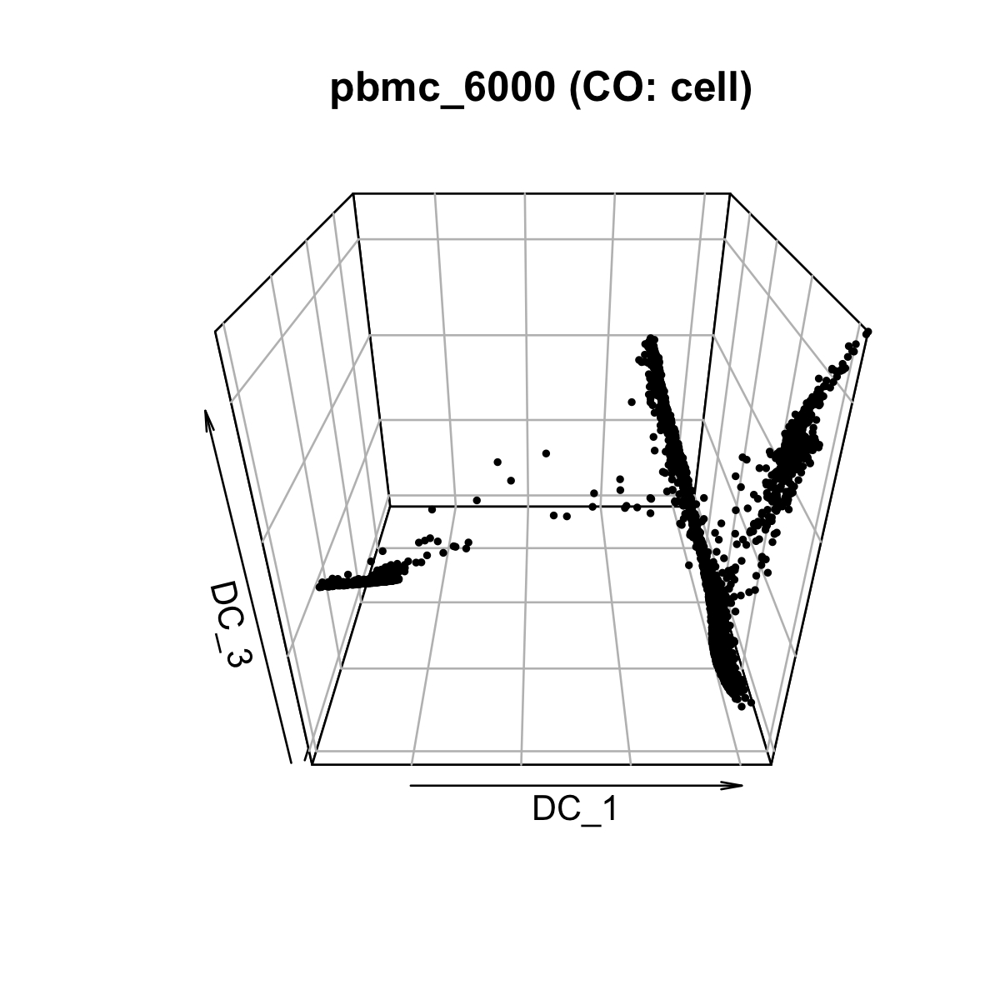

Save the objects.
```{r, eval = FALSE}
saveRDS(pbmc_4000, file = "backup/05_102_pbmc_4000_reduction_CO.rds")
saveRDS(pbmc_6000, file = "backup/06_102_pbmc_6000_reduction_CO.rds")
```

Load the objects.
```{r, eval = FALSE}
pbmc_4000 <- readRDS(file = "backup/05_102_pbmc_4000_reduction_CO.rds")
pbmc_6000 <- readRDS(file = "backup/06_102_pbmc_6000_reduction_CO.rds")
```


## Sample clustering
Load the objects.
```{r, eval = FALSE}
rm(list = ls())
source("R/plot.R")
source("R/function_sign.R")
pbmc_4000 <- readRDS(file = "backup/05_102_pbmc_4000_reduction_CO.rds")
pbmc_6000 <- readRDS(file = "backup/06_102_pbmc_6000_reduction_CO.rds")
```

If the clusters of samples are well separated in the low dimensional space,
they have a chance to be clustered in the original space spanned by the row
vectors of sign-by-sample matrices.
Here users can choose one of the following unsupervised clustering methods.

**Tips:**
A medoid-and-flat type of unsupervised clustering such as k-medoids method is
the most intuitive way, but their classification results do not always match to
the clusters in the low dimensional space.
On the other hand, though Louvain algorithm with k-nearest neighbor graph
(see below) is a more flexible way, it should be better to try first using more
simple and translatable method.

**1. Partitioning around medoids (PAM)**

The following function `classify_samples_pam_sign()` performs `pam()` in
`cluster` package.
The arguments are `obj`, `data_type`, `category`, and `k` (argument of `pam()`).
```{r, eval = FALSE}
# pbmc_4000 <- classify_samples_pam_sign(
#   obj = pbmc_4000, data_type = "CO",category = "cell", k = 4)

#
# Below is a memo for plotting the result.
#
# mat <- pbmc_4000[["reduction"]][["tsne"]][["CO"]][["cell"]]$Y
# lab <- pbmc_4000[["sample"]][["pam_CO_cell"]]
# col <- rainbow(length(unique(lab)))
# plot(mat, pch=21, bg=col[lab])
# legend("bottomright", legend=unique(sort(lab)), pch=21, pt.bg=col)
```
If the above is conducted, the computational results are stored in
`obj[["classification"]][["pam"]][["CO"]][["cell"]]` and
`obj[["sample"]][["pam_CO_cell"]]`.

**2. Hierarchical clustering and cutting tree**

The following function `classify_samples_hclustCutree_sign()` performs
`hclust()` and `cutree()` in `stats` package.
The arguments are `obj`, `data_type`, `category`, `method`
(argument of `hclust()`) and `k` (argument of `cutree()`).
```{r, eval = FALSE}
# pbmc_4000 <- classify_samples_hclustCutree_sign(
#   obj = pbmc_4000, data_type = "CO", category = "cell",
#   method = "ward.D2", k = 4)

#
# Below is a memo for plotting the result.
#
# mat <- pbmc_4000[["reduction"]][["tsne"]][["CO"]][["cell"]]$Y
# lab <- pbmc_4000[["sample"]][["hclustCutree_CO_cell"]]
# col <- rainbow(length(unique(lab)))
# plot(mat, pch=21, bg=col[lab])
# legend("bottomright", legend=unique(sort(lab)), pch=21, pt.bg=col)
```
If the above is conducted, the computational results are stored in
`obj[["classification"]][["hclustCutree"]][["CO"]][["cell"]]` and
`obj[["sample"]][["hclustCutree_CO_cell"]]`.

**3. Community detection algorithm with k-nearest neighbor (KNN) graph**

The following function `classify_samples_seuratFindClusters_sign()` performs
`CreateSeuratObject()`, `ScaleData()`, `RunPCA()`, `FindNeighbors()`, and
`FindClusters()` in `Seurat` package.
The arguments are `obj`, `data_type`, `category`, `reduction`, `dims`,
`k.param`, `prune.SNN`, `resolution`, and `algorithm`, where the latter six
parameters are used in `FindNeighbors()` and `FindClusters()`.
```{r, eval = FALSE}
pbmc_4000 <- classify_samples_seuratFindClusters_sign(
  obj = pbmc_4000, data_type = "CO", category = "cell", reduction = "pca",
  dims = 1:20, k.param = 10, prune.SNN = 1./15, resolution = 0.15,
  algorithm = 1)

pbmc_6000 <- classify_samples_seuratFindClusters_sign(
  obj = pbmc_6000, data_type = "CO", category = "cell", reduction = "pca",
  dims = 1:20, k.param = 10, prune.SNN = 1./15, resolution = 0.16,
  algorithm = 1)

#
# Below is a memo for plotting the result.
#
# mat <- pbmc_4000[["reduction"]][["tsne"]][["CO"]][["cell"]]$Y
# lab <- pbmc_4000[["sample"]][["seuratFindClusters_CO_cell"]]
# col <- rainbow(length(unique(lab)))
# plot(mat, pch=21, bg=col[lab])
# legend("bottomright", legend=unique(sort(lab)), pch=21, pt.bg=col)
```
The computational results are stored in
`obj[["sample"]][["seuratFindClusters_CO_cell"]]` and
`obj[["classification"]][["seuratFindClusters"]][["CO"]][["cell"]]`.

**4. Clustering by branch detection along pseudotime**

In this subsection, we do not use the branch-based clustering.
Please see the previous subsection for the details.

Save the objects.
```{r, eval = FALSE}
saveRDS(pbmc_4000, file = "backup/05_103_pbmc_4000_classification_CO.rds")
saveRDS(pbmc_6000, file = "backup/06_103_pbmc_6000_classification_CO.rds")
```

Load the objects.
```{r, eval = FALSE}
pbmc_4000 <- readRDS(file = "backup/05_103_pbmc_4000_classification_CO.rds")
pbmc_6000 <- readRDS(file = "backup/06_103_pbmc_6000_classification_CO.rds")
```


## Visualizing
In this subsection, the clustering results are visualized.

The following function `plot_Heatmap_SignxSamp()` visualizes the result of
sample clustering by identifying `algo_name` (in the current version,
one of `"pam"`, `"hclustCutree"`, `"seuratFindClusters"`, and `"merlot"`).
```{r, eval = FALSE}
# ----------------------------------------
# For `pbmc_4000`
# ----------------------------------------
filename <- "figures/figure_05_0130.png"
png(file = filename, height = 1000, width = 1250, res = 200)
plot_Heatmap_SignxSamp(obj = pbmc_4000, data_type = "CO", category = "cell",
                       algo_name = "seuratFindClusters", method = "ward.D2",
                       show_nReads = FALSE, title = "pbmc_4000 (CO: cell)",
                       name = "COxSamp",
                       show_rownames_sign = FALSE, show_rownames_label = FALSE,
                       show_rownames_nReads = FALSE, default_color = TRUE)
dev.off()
```

```{r, eval = FALSE, echo = FALSE, results = "hide"}
# ----------------------------------------
# For `pbmc_6000`
# ----------------------------------------
filename <- "figures/figure_06_0130.png"
png(file = filename, height = 1000, width = 1250, res = 200)
plot_Heatmap_SignxSamp(obj = pbmc_6000, data_type = "CO", category = "cell",
                       algo_name = "seuratFindClusters", method = "ward.D2",
                       show_nReads = FALSE, title = "pbmc_6000 (CO: cell)",
                       name = "COxSamp",
                       show_rownames_sign = FALSE, show_rownames_label = FALSE,
                       show_rownames_nReads = FALSE, default_color = TRUE)
dev.off()
```

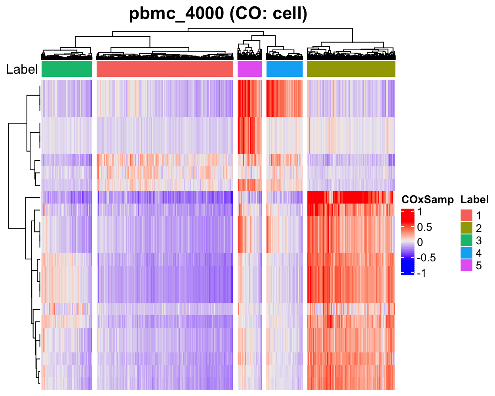


```{r, eval = FALSE}
# ----------------------------------------
# For `pbmc_4000`
# ----------------------------------------
p <- plot_tsne_sign(obj = pbmc_4000, data_type = "CO", category = "cell",
                    algo_name = "seuratFindClusters",
                    theta = NULL, phi = NULL,
                    title = "pbmc_4000 (CO: cell)", title_size = 16,
                    xlabel = "tSNE_1", ylabel = "tSNE_2", zlabel = NULL,
                    default_color = TRUE)
filename <- "figures/figure_05_0131.png"
ggsave(file = filename, plot =  p, dpi = 250, width = 4.9, height = 4)
```

```{r, eval = FALSE, echo = FALSE, results = "hide"}
# ----------------------------------------
# For `pbmc_6000`
# ----------------------------------------
p <- plot_tsne_sign(obj = pbmc_6000, data_type = "CO", category = "cell",
                    algo_name = "seuratFindClusters",
                    theta = NULL, phi = NULL,
                    title = "pbmc_6000 (CO: cell)", title_size = 16,
                    xlabel = "tSNE_1", ylabel = "tSNE_2", zlabel = NULL,
                    default_color = TRUE)
filename <- "figures/figure_06_0131.png"
ggsave(file = filename, plot =  p, dpi = 250, width = 4.9, height = 4)
```

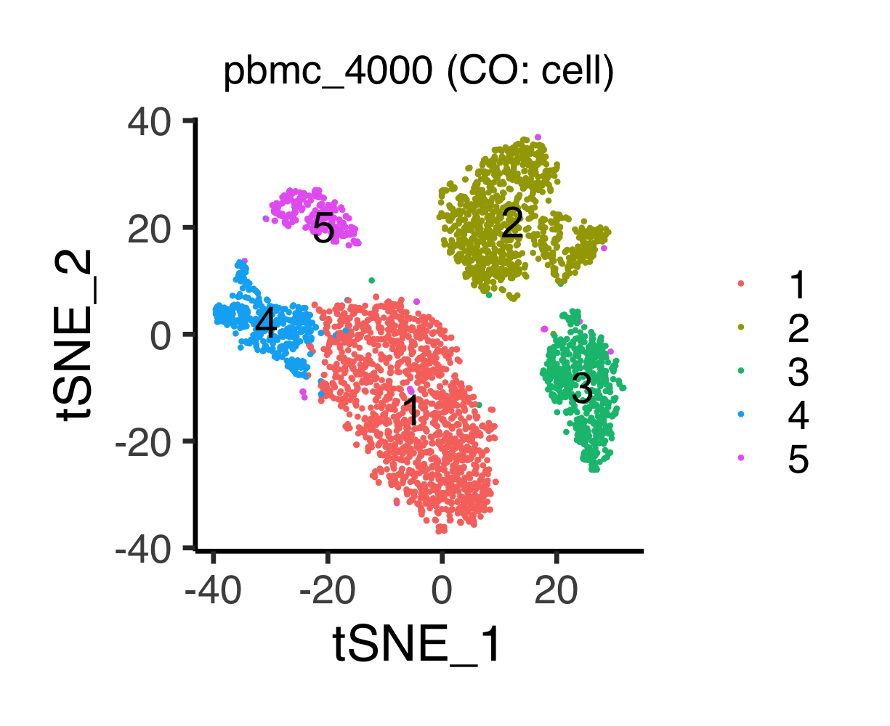
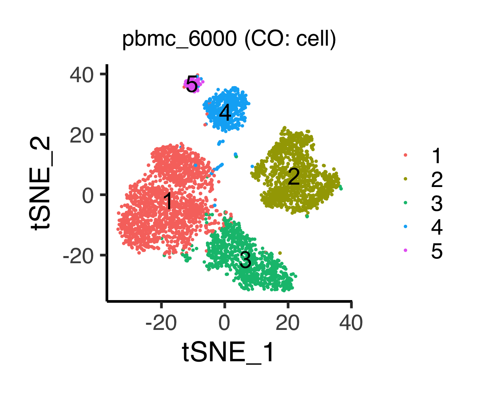

The following command shows the population sizes by bar graph.
```{r, eval = FALSE}
# ----------------------------------------
# For `pbmc_4000`
# ----------------------------------------
p <- plot_bargraph_sign(obj = pbmc_4000, data_type = "CO", category = "cell",
                        algo_name = "seuratFindClusters",
                        title = "pbmc_4000", title_size = 20,
                        xlabel = "Label (CO: cell)",
                        ylabel = "Number of samples", ymax = 2000)
filename <- "figures/figure_05_0135.png"
ggsave(file = filename, plot = p, dpi = 200, width = 4.3, height = 4)
```

```{r, eval = FALSE, echo = FALSE, results = "hide"}
# ----------------------------------------
# For `pbmc_6000`
# ----------------------------------------
p <- plot_bargraph_sign(obj = pbmc_6000, data_type = "CO", category = "cell",
                        algo_name = "seuratFindClusters",
                        title = "pbmc_6000", title_size = 20,
                        xlabel = "Label (CO: cell)",
                        ylabel = "Number of samples", ymax = 2500)
filename <- "figures/figure_06_0135.png"
ggsave(file = filename, plot = p, dpi = 200, width = 4.3, height = 4)
```

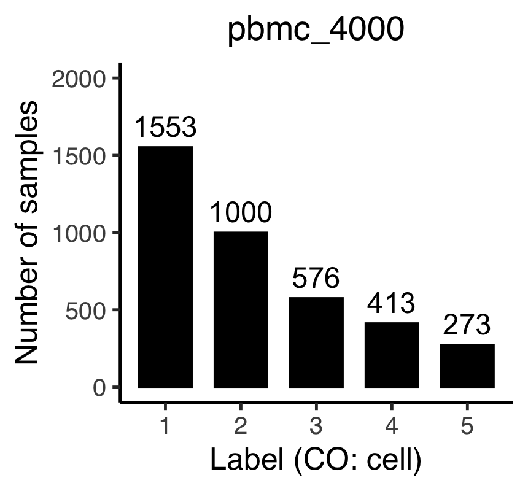


## Significant signs
In this subsection, signs of which the sign scores are specifically upregulated
in some cluster are detected by computing the separation indices.

Load the objects.
```{r, eval = FALSE}
rm(list = ls())
source("R/plot.R")
source("R/function_sign.R")
pbmc_4000 <- readRDS(file = "backup/05_103_pbmc_4000_classification_CO.rds")
pbmc_6000 <- readRDS(file = "backup/06_103_pbmc_6000_classification_CO.rds")
```

The following function `auto_find_marker_sign()` executes another original
function `find_marker_sign()` in a loop manner.
Here `find_marker_sign()` computes separation indices (i.e., non-parametric
measure of degree in separation of two random variable sets) of signs of
interest for each subpopulation.
The arguments are `obj`, `data_type_for_label` (`data_type` used for sample
classification), `category_for_label` (`category` used for sample
classification), `algo_name_for_label` (`algo_name` used for sample
classification), `data_type_for_expr` (`data_type` of interest for
investigating gene expression), `category_for_expr` (`category` of interest for
investigating gene expression), and `label_1` and `label_2` (cluster labels to
be compared: both integer and vector forms are accepted).
This function helps users find positive and negative marker signs of `label_1`
with the positive and negative values of the indices, respectively.
```{r, eval = FALSE}
pbmc_4000 <- auto_find_marker_sign(obj = pbmc_4000, data_type_for_label = "CO",
                                   category_for_label = "cell",
                                   algo_name_for_label = "seuratFindClusters",
                                   data_type_for_expr = "CO",
                                   category_for_expr = "cell")
pbmc_6000 <- auto_find_marker_sign(obj = pbmc_6000, data_type_for_label = "CO",
                                   category_for_label = "cell",
                                   algo_name_for_label = "seuratFindClusters",
                                   data_type_for_expr = "CO",
                                   category_for_expr = "cell")
```
The computational results are stored in
`obj[["marker"]][["CO"]][["cell"]][["Label_CO_cell_1_vs_2/3"]]`,
`obj[["marker"]][["CO"]][["cell"]][["Label_CO_cell_2_vs_1/3"]]`,
`obj[["marker"]][["CO"]][["cell"]][["Label_CO_cell_3_vs_1/2"]]`, and
`obj[["marker"]][["CO"]][["cell"]][["all"]]`.
Here `sep_I` stands for the separation index of the sign, which quantifies the
extent of separation between two different sets of random variables.
Note that `auto_find_marker_sign()` computes `sep_I` for the given group versus
all other cells.
```{r, eval = FALSE}
datatable(pbmc_4000[["marker"]][["CO"]][["cell"]][["all"]], rownames = FALSE)
datatable(pbmc_6000[["marker"]][["CO"]][["cell"]][["all"]], rownames = FALSE)
```

* `pbmc_4000`

<iframe src="figures/pbmc_4000_CO_cell.html" style="width:100%; height:300px;"></iframe>

<br><br><br><br><br><br><br><br><br><br>

The following function `plot_violin_signScore()` shows the distribution of
expression levels of a given sign across subpopulations by violin plots.
The arguments are `obj`, `sign_name`, `data_type_for_label` (`data_type` used
for sample classification), `category_for_label` (`category` used for sample
classification), `algo_name_for_label` (`algo_name` used for sample
classification), `data_type_for_expr` (`data_type` of interest for investigating
gene expression), `category_for_expr` (`category` of interest for investigating
gene expression), `title`, `title_size`, and `default_color` (if `TRUE`,
the default color of ggplot is used, otherwise rainbow).
```{r, eval = FALSE}
# ----------------------------------------
# For `pbmc_4000`
# ----------------------------------------
p <- plot_violin_signScore(
  obj = pbmc_4000, sign_name = "CL:0000576_S",
  data_type_for_label = "CO", category_for_label = "cell",
  algo_name_for_label = "seuratFindClusters",
  data_type_for_expr = "CO", category_for_expr = "cell",
  title = "CL:0000576_S\nMonocyte\n(MEF2C/LYN/CCL3/..)",
  title_size = 16, default_color = TRUE)
filename <- "figures/figure_05_0140.png"
ggsave(file = filename, plot = p, dpi = 200, width = 4, height = 4)
```

```{r, eval = FALSE, echo = FALSE, results = "hide"}
# ----------------------------------------
# For `pbmc_4000`
# ----------------------------------------
p <- plot_violin_signScore(
  obj = pbmc_4000, sign_name = "CL:0000623_V",
  data_type_for_label = "CO", category_for_label = "cell",
  algo_name_for_label = "seuratFindClusters",
  data_type_for_expr = "CO", category_for_expr = "cell",
  title = "CL:0000623_V\nNatural killer cell\n(SH2D1A/KLRD1/..)",
  title_size = 16, default_color = TRUE)
filename <- "figures/figure_05_0141.png"
ggsave(file = filename, plot = p, dpi = 200, width = 4, height = 4)

p <- plot_violin_signScore(
  obj = pbmc_4000, sign_name = "CL:0000789_S",
  data_type_for_label = "CO", category_for_label = "cell",
  algo_name_for_label = "seuratFindClusters",
  data_type_for_expr = "CO", category_for_expr = "cell",
  title = "CL:0000789_S\nAlpha-beta T cell\n(CD3E/CD3D/..)",
  title_size = 16, default_color = TRUE)
filename <- "figures/figure_05_0142.png"
ggsave(file = filename, plot = p, dpi = 200, width = 4, height = 4)
# ----------------------------------------
# For `pbmc_6000`
# ----------------------------------------
p <- plot_violin_signScore(
  obj = pbmc_6000, sign_name = "CL:0000234_S",
  data_type_for_label = "CO", category_for_label = "cell",
  algo_name_for_label = "seuratFindClusters",
  data_type_for_expr = "CO", category_for_expr = "cell",
  title = "CL:0000234_S\nPhagocyte\n(CD14/FGR/..)",
  title_size = 16, default_color = TRUE)
filename <- "figures/figure_06_0140.png"
ggsave(file = filename, plot = p, dpi = 200, width = 4, height = 4)

p <- plot_violin_signScore(
  obj = pbmc_6000, sign_name = "CL:0000623_S",
  data_type_for_label = "CO", category_for_label = "cell",
  algo_name_for_label = "seuratFindClusters",
  data_type_for_expr = "CO", category_for_expr = "cell",
  title = "CL:0000623_S\nNatural killer cell\n(CD160/KLRD1/..)",
  title_size = 16, default_color = TRUE)
filename <- "figures/figure_06_0141.png"
ggsave(file = filename, plot = p, dpi = 200, width = 4, height = 4)

p <- plot_violin_signScore(
  obj = pbmc_6000, sign_name = "CL:0000782_V",
  data_type_for_label = "CO", category_for_label = "cell",
  algo_name_for_label = "seuratFindClusters",
  data_type_for_expr = "CO", category_for_expr = "cell",
  title = "CL:0000782_V\nMyeloid dendritic cell\n(CD2/CCR7/..)",
  title_size = 16, default_color = TRUE)
filename <- "figures/figure_06_0142.png"
ggsave(file = filename, plot = p, dpi = 200, width = 4, height = 4)

p <- plot_violin_signScore(
  obj = pbmc_6000, sign_name = "CL:0000451_V",
  data_type_for_label = "CO", category_for_label = "cell",
  algo_name_for_label = "seuratFindClusters",
  data_type_for_expr = "CO", category_for_expr = "cell",
  title = "CL:0000451_V\nDendritic cell\n(FCGR2B/BLK/..)",
  title_size = 16, default_color = TRUE)
filename <- "figures/figure_06_0143.png"
ggsave(file = filename, plot = p, dpi = 200, width = 4, height = 4)
```

* `pbmc_4000`


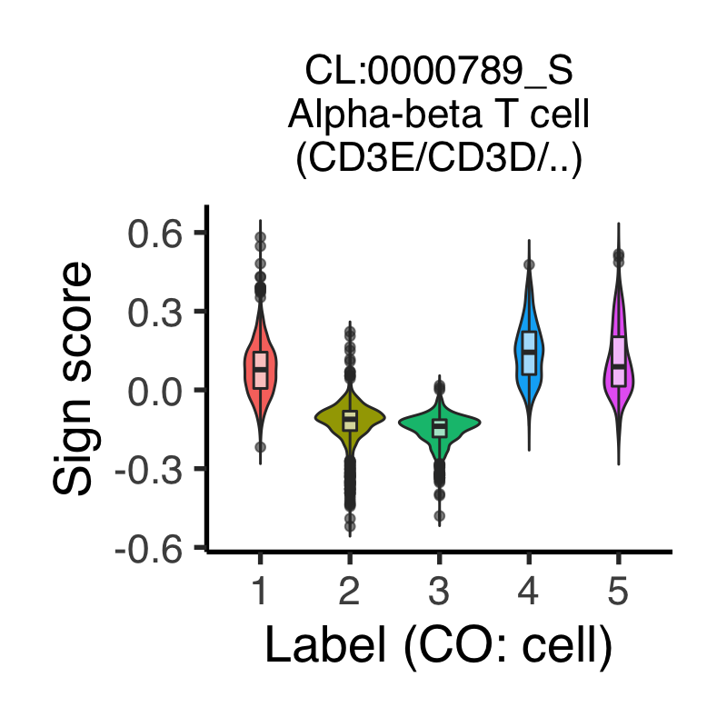

* `pbmc_6000`

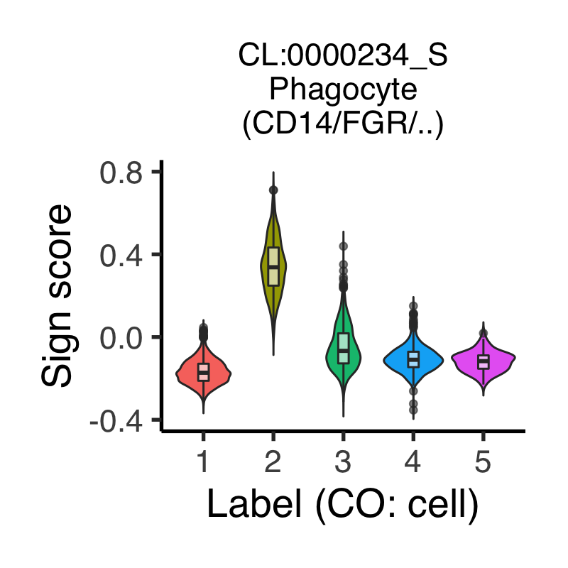
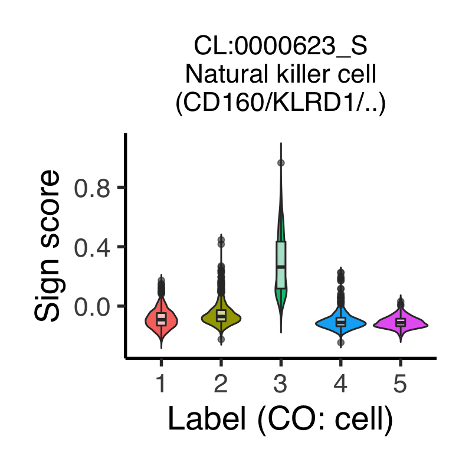
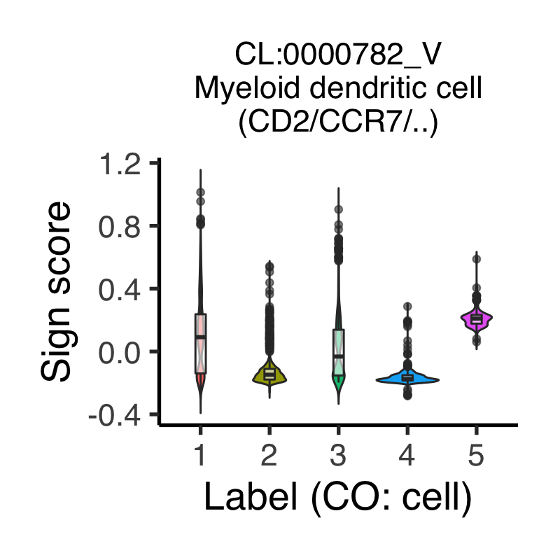
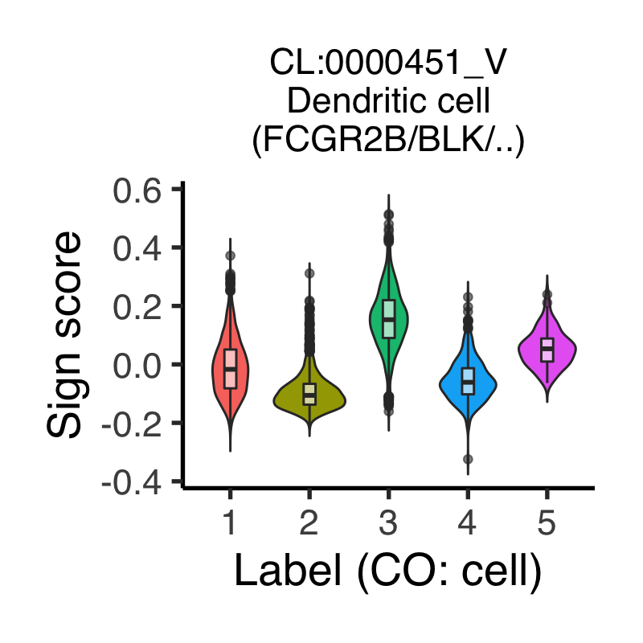

The function `plot_tsne_signScore()`, `plot_umap_signScore()`, and
`plot_dmap_signScore()` show the sign score of a given sign on the t-SNE,
UMAP, and diffusion map spaces, respectively.
```{r, eval = FALSE}
# ----------------------------------------
# For `pbmc_4000`
# ----------------------------------------
p <- plot_tsne_signScore(
  obj = pbmc_4000, sign_name = "CL:0000576_S",
  data_type_for_tsne = "CO", category_for_tsne = "cell",
  data_type_for_expr = "CO", category_for_expr = "cell",
  theta = NULL, phi = NULL,
  title = "CL:0000576_S\nMonocyte\n(MEF2C/LYN/CCL3/..)",
  title_size = 16, label_name = "Sign score",
  xlabel = "tSNE_1", ylabel = "tSNE_2", zlabel = NULL)
filename <- "figures/figure_05_0150.png"
ggsave(file = filename, plot = p, dpi = 300, width = 5.6, height = 4.4)
```

```{r, eval = FALSE, echo = FALSE, results = "hide"}
# ----------------------------------------
# For `pbmc_4000`
# ----------------------------------------
p <- plot_tsne_signScore(
  obj = pbmc_4000, sign_name = "CL:0000623_V",
  data_type_for_tsne = "CO", category_for_tsne = "cell",
  data_type_for_expr = "CO", category_for_expr = "cell",
  theta = NULL, phi = NULL,
  title = "CL:0000623_V\nNatural killer cell\n(SH2D1A/KLRD1/..)",
  title_size = 16, label_name = "Sign score",
  xlabel = "tSNE_1", ylabel = "tSNE_2", zlabel = NULL)
filename <- "figures/figure_05_0151.png"
ggsave(file = filename, plot = p, dpi = 300, width = 5.6, height = 4.4)

p <- plot_tsne_signScore(
  obj = pbmc_4000, sign_name = "CL:0000789_S",
  data_type_for_tsne = "CO", category_for_tsne = "cell",
  data_type_for_expr = "CO", category_for_expr = "cell",
  theta = NULL, phi = NULL,
  title = "CL:0000789_S\nAlpha-beta T cell\n(CD3E/CD3D/..)",
  title_size = 16, label_name = "Sign score",
  xlabel = "tSNE_1", ylabel = "tSNE_2", zlabel = NULL)
filename <- "figures/figure_05_0152.png"
ggsave(file = filename, plot = p, dpi = 300, width = 5.6, height = 4.4)

p <- plot_umap_signScore(
  obj = pbmc_4000, sign_name = "CL:0000576_S",
  data_type_for_umap = "CO", category_for_umap = "cell",
  data_type_for_expr = "CO", category_for_expr = "cell",
  theta = NULL, phi = NULL,
  title = "CL:0000576_S\nMonocyte\n(MEF2C/LYN/CCL3/..)",
  title_size = 16, label_name = "Sign score",
  xlabel = "UMAP_1", ylabel = "UMAP_2", zlabel = NULL)
filename <- "figures/figure_05_0153.png"
ggsave(file = filename, plot = p, dpi = 300, width = 5.6, height = 4.4)

p <- plot_umap_signScore(
  obj = pbmc_4000, sign_name = "CL:0000623_V",
  data_type_for_umap = "CO", category_for_umap = "cell",
  data_type_for_expr = "CO", category_for_expr = "cell",
  theta = NULL, phi = NULL,
  title = "CL:0000623_V\nNatural killer cell\n(SH2D1A/KLRD1/..)",
  title_size = 16, label_name = "Sign score",
  xlabel = "UMAP_1", ylabel = "UMAP_2", zlabel = NULL)
filename <- "figures/figure_05_0154.png"
ggsave(file = filename, plot = p, dpi = 300, width = 5.6, height = 4.4)

p <- plot_umap_signScore(
  obj = pbmc_4000, sign_name = "CL:0000789_S",
  data_type_for_umap = "CO", category_for_umap = "cell",
  data_type_for_expr = "CO", category_for_expr = "cell",
  theta = NULL, phi = NULL,
  title = "CL:0000789_S\nAlpha-beta T cell\n(CD3E/CD3D/..)",
  title_size = 16, label_name = "Sign score",
  xlabel = "UMAP_1", ylabel = "UMAP_2", zlabel = NULL)
filename <- "figures/figure_05_0155.png"
ggsave(file = filename, plot = p, dpi = 300, width = 5.6, height = 4.4)
# ----------------------------------------
# For `pbmc_6000`
# ----------------------------------------
p <- plot_tsne_signScore(
  obj = pbmc_6000, sign_name = "CL:0000234_S",
  data_type_for_tsne = "CO", category_for_tsne = "cell",
  data_type_for_expr = "CO", category_for_expr = "cell",
  theta = NULL, phi = NULL,
  title = "CL:0000234_S\nPhagocyte\n(CD14/FGR/..)",
  title_size = 16, label_name = "Sign score",
  xlabel = "tSNE_1", ylabel = "tSNE_2", zlabel = NULL)
filename <- "figures/figure_06_0150.png"
ggsave(file = filename, plot = p, dpi = 300, width = 5.6, height = 4.4)

p <- plot_tsne_signScore(
  obj = pbmc_6000, sign_name = "CL:0000623_S",
  data_type_for_tsne = "CO", category_for_tsne = "cell",
  data_type_for_expr = "CO", category_for_expr = "cell",
  theta = NULL, phi = NULL,
  title = "CL:0000623_S\nNatural killer cell\n(CD160/KLRD1/..)",
  title_size = 16, label_name = "Sign score",
  xlabel = "tSNE_1", ylabel = "tSNE_2", zlabel = NULL)
filename <- "figures/figure_06_0151.png"
ggsave(file = filename, plot = p, dpi = 300, width = 5.6, height = 4.4)

p <- plot_umap_signScore(
  obj = pbmc_6000, sign_name = "CL:0000234_S",
  data_type_for_umap = "CO", category_for_umap = "cell",
  data_type_for_expr = "CO", category_for_expr = "cell",
  theta = NULL, phi = NULL,
  title = "CL:0000234_S\nPhagocyte\n(CD14/FGR/..)",
  title_size = 16, label_name = "Sign score",
  xlabel = "UMAP_1", ylabel = "UMAP_2", zlabel = NULL)
filename <- "figures/figure_06_0152.png"
ggsave(file = filename, plot = p, dpi = 300, width = 5.6, height = 4.4)

p <- plot_umap_signScore(
  obj = pbmc_6000, sign_name = "CL:0000623_S",
  data_type_for_umap = "CO", category_for_umap = "cell",
  data_type_for_expr = "CO", category_for_expr = "cell",
  theta = NULL, phi = NULL,
  title = "CL:0000623_S\nNatural killer cell\n(CD160/KLRD1/..)",
  title_size = 16, label_name = "Sign score",
  xlabel = "UMAP_1", ylabel = "UMAP_2", zlabel = NULL)
filename <- "figures/figure_06_0153.png"
ggsave(file = filename, plot = p, dpi = 300, width = 5.6, height = 4.4)
```

* `pbmc_4000`

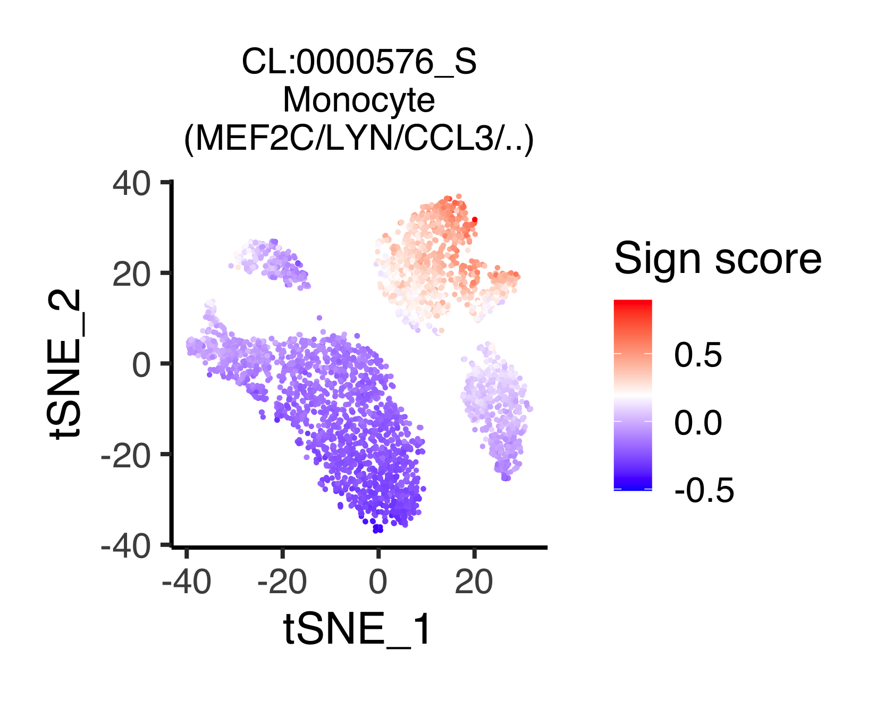

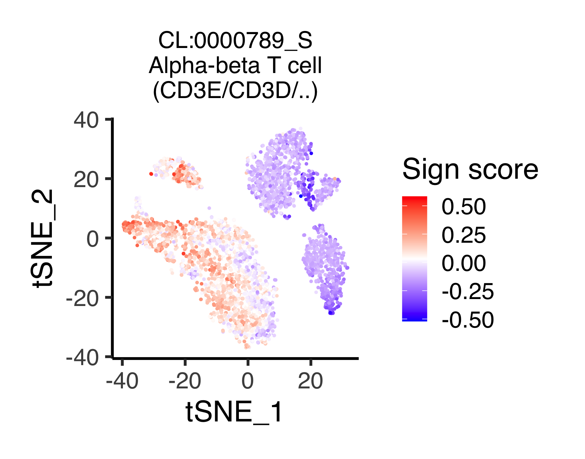

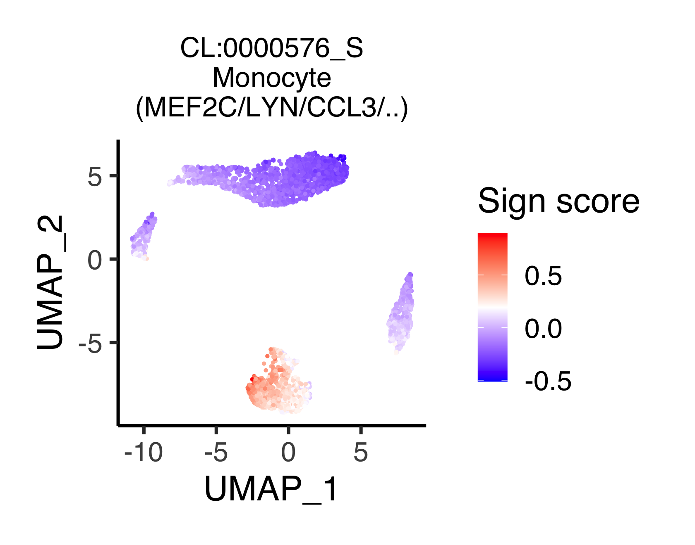

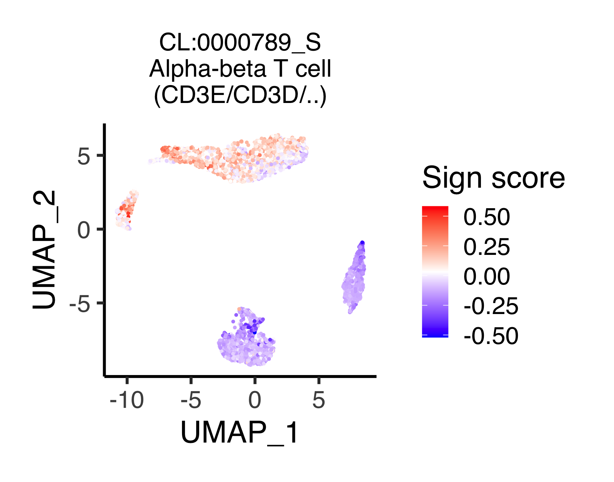

* `pbmc_6000`


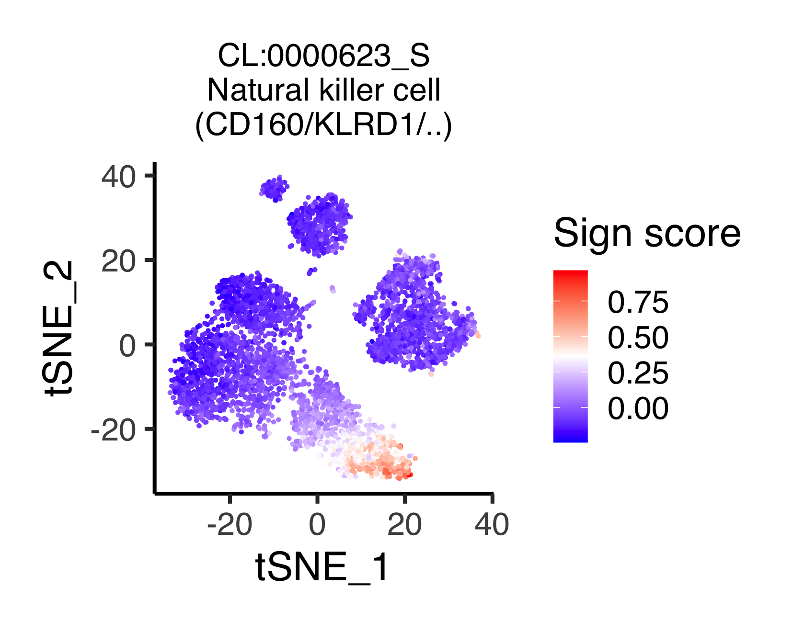


The function `plot_tsne_geneExpression()`, `plot_umap_geneExpression()`, and
`plot_dmap_geneExpression()` show the mean of normalized gene expression levels
(if `zscore = TRUE`, the expression levels are converted into z-score) for
the input genes (`gene_names`) on the low-dimensional space.
```{r, eval = FALSE}
# ----------------------------------------
# For `pbmc_4000`
# ----------------------------------------
p <- plot_tsne_geneExpression(
  obj = pbmc_4000, gene_names = c("CCL3"), zscore = FALSE,
  data_type_for_tsne = "CO", category_for_tsne = "cell",
  theta = 0, phi = 0,
  title = "pbmc_4000 (CO: cell)", title_size = 16,
  label_name = "CCL3",
  xlabel = "tSNE_1", ylabel = "tSNE_2", zlabel = NULL)
filename <- "figures/figure_05_0160.png"
ggsave(file = filename, plot = p, dpi = 300, width = 5, height = 4)
```

```{r, eval = FALSE, echo = FALSE, results = "hide"}
# ----------------------------------------
# For `pbmc_6000`
# ----------------------------------------
p <- plot_tsne_geneExpression(
  obj = pbmc_6000, gene_names = "CD14", zscore = FALSE,
  data_type_for_tsne = "CO", category_for_tsne = "cell",
  theta = 0, phi = 0,
  title = "pbmc_6000 (CO: cell)", title_size = 16,
  label_name = "CD14",
  xlabel = "tSNE_1", ylabel = "tSNE_2", zlabel = NULL)
filename <- "figures/figure_06_0160.png"
ggsave(file = filename, plot = p, dpi = 300, width = 5, height = 4)

p <- plot_tsne_geneExpression(
  obj = pbmc_6000, gene_names = "CCR7", zscore = FALSE,
  data_type_for_tsne = "CO", category_for_tsne = "cell",
  theta = 0, phi = 0,
  title = "pbmc_6000 (CO: cell)", title_size = 16,
  label_name = "CCR7",
  xlabel = "tSNE_1", ylabel = "tSNE_2", zlabel = NULL)
filename <- "figures/figure_06_0161.png"
ggsave(file = filename, plot = p, dpi = 300, width = 5, height = 4)
```

* `pbmc_4000`


* `pbmc_6000`

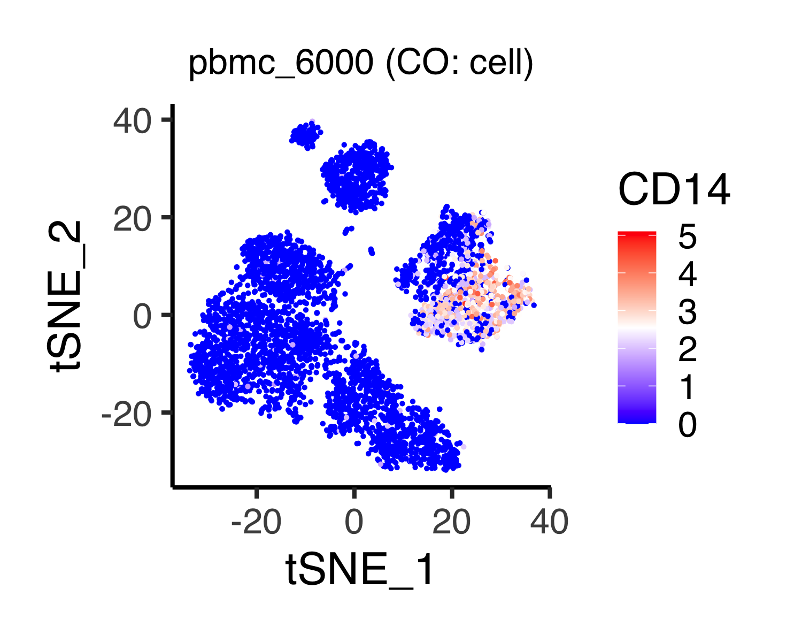


The following function `plot_pseudotime_vs_signscore()` is not used here.
Please see the previous subsection for the details.

Save the objects.
```{r, eval = FALSE}
saveRDS(pbmc_4000, file = "backup/05_104_pbmc_4000_DES_CO.rds")
saveRDS(pbmc_6000, file = "backup/06_104_pbmc_6000_DES_CO.rds")
```

Load the objects.
```{r, eval = FALSE}
pbmc_4000 <- readRDS(file = "backup/05_104_pbmc_4000_DES_CO.rds")
pbmc_6000 <- readRDS(file = "backup/06_104_pbmc_6000_DES_CO.rds")
```
