# ASURAT using Gene Ontology database (optional)
In this section, we apply ASURAT on cancer patient- and healthy donor-derived
single-cell transcriptomes.
ASURAT transforms a single-cell transcriptome to cell-type or functional
spectrum matrix by extracting the system of signs on each of the thousands of
biological terms and the associated gene sets obtained from public databases.
The resulting matrices termed sign-by-sample matrices (SSMs) can be supplied
to the subsequent unsupervised clusterings.


## Creating sign-by-sample matrices
Input the data.
```{r, eval = FALSE}
source("R/plot.R")
source("R/function_sign.R")
tidy_GO <- readRDS(file = "data/2020_001_databases/20201213_tidy_GO_human.rds")
IC_GO <- readRDS(file = "data/2020_001_databases/20201213_IC_GO_human.rds")

day1_norm <- readRDS(file = "backup/01_005_day1_norm_normalized.rds")
day7_hypo <- readRDS(file = "backup/02_005_day7_hypo_normalized.rds")
sc68_vehi <- readRDS(file = "backup/03_005_sc68_vehi_normalized.rds")
sc68_cisp <- readRDS(file = "backup/04_005_sc68_cisp_normalized.rds")
pbmc_4000 <- readRDS(file = "backup/05_005_pbmc_4000_normalized.rds")
pbmc_6000 <- readRDS(file = "backup/06_005_pbmc_6000_normalized.rds")

day1_norm_cor <- readRDS(file = "backup/01_006_day1_norm_correlation.rds")
day7_hypo_cor <- readRDS(file = "backup/02_006_day7_hypo_correlation.rds")
sc68_vehi_cor <- readRDS(file = "backup/03_006_sc68_vehi_correlation.rds")
sc68_cisp_cor <- readRDS(file = "backup/04_006_sc68_cisp_correlation.rds")
pbmc_4000_cor <- readRDS(file = "backup/05_006_pbmc_4000_correlation.rds")
pbmc_6000_cor <- readRDS(file = "backup/06_006_pbmc_6000_correlation.rds")
```

To make the object small, unused items are removed.
```{r, eval = FALSE}
myfunc <- function(obj){
  obj[["data"]][["raw"]] <- NULL
  obj[["data"]][["bayNorm"]] <- NULL
  obj[["data"]][["beer"]] <- NULL
  return(obj)
}

day1_norm <- myfunc(day1_norm)
day7_hypo <- myfunc(day7_hypo)
sc68_vehi <- myfunc(sc68_vehi)
sc68_cisp <- myfunc(sc68_cisp)
pbmc_4000 <- myfunc(pbmc_4000)
pbmc_6000 <- myfunc(pbmc_6000)
```

Input a formatted Gene Ontology database `tidy_GO` into the ASURAT object.
```{r, eval = FALSE}
day1_norm[["sign"]][["GO"]] <- tidy_GO
day7_hypo[["sign"]][["GO"]] <- tidy_GO
sc68_vehi[["sign"]][["GO"]] <- tidy_GO
sc68_cisp[["sign"]][["GO"]] <- tidy_GO
pbmc_4000[["sign"]][["GO"]] <- tidy_GO
pbmc_6000[["sign"]][["GO"]] <- tidy_GO
```

The following function `do_quickQC_sign()` takes an intersection of genes
between user's data and `tidy_GO`, and then excludes the IDs including too
few or too many genes by setting thresholds `min_ngenes` (minimal number of
genes which must be greater than one) and `max_ngenes` (maximal number of genes
which must be greater than one).
Here, the values of `min_ngenes` and `max_ngenes` were set as 2 and 1000,
respectively, as default values.
```{r, eval = FALSE}
day1_norm <- do_quickQC_sign(obj = day1_norm, data_type = "GO",
                             min_ngenes = 2, max_ngenes = 1000)
day7_hypo <- do_quickQC_sign(obj = day7_hypo, data_type = "GO",
                             min_ngenes = 2, max_ngenes = 1000)
sc68_vehi <- do_quickQC_sign(obj = sc68_vehi, data_type = "GO",
                             min_ngenes = 2, max_ngenes = 1000)
sc68_cisp <- do_quickQC_sign(obj = sc68_cisp, data_type = "GO",
                             min_ngenes = 2, max_ngenes = 1000)
pbmc_4000 <- do_quickQC_sign(obj = pbmc_4000, data_type = "GO",
                             min_ngenes = 2, max_ngenes = 1000)
pbmc_6000 <- do_quickQC_sign(obj = pbmc_6000, data_type = "GO",
                             min_ngenes = 2, max_ngenes = 1000)
```
The results are stored in `obj[["sign"]][["GO"]][["MF"]]`,
`obj[["sign"]][["GO"]][["BP"]]`, and `obj[["sign"]][["GO"]][["CC"]]`.

The following function `separate_variables_sign()` classifies genes annotated
with each biological description into three groups, i.e., strongly correlated
gene set (SCG), variably correlated gene set (VCG), and weakly correlated gene
set (WCG).
The arguments are `obj` (ASURAT object), `obj_cor`, `data_type`,
`method = "spearman"` (one of the arguments input in `do_cor_variables()`),
`th_posi`, and `th_nega` (threshold values of positive and negative correlation
coefficients, respectively).

**Tips:**
This decomposition sometimes produces unexpected results.
In fact the smaller values of `th_posi` and `th_nega` do not always result in
the larger sizes of SCG and VCG.
Hence we recommend users to carefully tune the parameters, checking if the
biological terms (signs) of interest are included in the results.
```{r, eval = FALSE}
day1_norm_red <- separate_variables_sign(obj = day1_norm,
                                         obj_cor = day1_norm_cor,
                                         data_type = "GO", method = "spearman",
                                         th_posi = 0.39, th_nega = -0.25)
day7_hypo_red <- separate_variables_sign(obj = day7_hypo,
                                         obj_cor = day7_hypo_cor,
                                         data_type = "GO", method = "spearman",
                                         th_posi = 0.48, th_nega = -0.30)
sc68_vehi_red <- separate_variables_sign(obj = sc68_vehi,
                                         obj_cor = sc68_vehi_cor,
                                         data_type = "GO", method = "spearman",
                                         th_posi = 0.49, th_nega = -0.39)
sc68_cisp_red <- separate_variables_sign(obj = sc68_cisp,
                                         obj_cor = sc68_cisp_cor,
                                         data_type = "GO", method = "spearman",
                                         th_posi = 0.34, th_nega = -0.20)
pbmc_4000_red <- separate_variables_sign(obj = pbmc_4000,
                                         obj_cor = pbmc_4000_cor,
                                         data_type = "GO", method = "spearman",
                                         th_posi = 0.25, th_nega = -0.25)
pbmc_6000_red <- separate_variables_sign(obj = pbmc_6000,
                                         obj_cor = pbmc_6000_cor,
                                         data_type = "GO", method = "spearman",
                                         th_posi = 0.25, th_nega = -0.22)
```
The results are stored in `obj[["sign"]][["GO"]][["MF"]]`,
`obj[["sign"]][["GO"]][["BP"]]`, and `obj[["sign"]][["GO"]][["CC"]]`.

The following function `select_sign()` selects the signs by a user-defined
criteria, which has been preset as follows:

1. sum of the number of genes in SCG and VCG is greater than or equal to
`min_cnt`, and
2. the number of genes in WCG is greater than or equal to `min_cnt_weak`
(the default value is 2).

Users can modify the programming code indicated by "User-defined criteria"
in the file `R/function_sign.R`.
Note that the signs having at most one gene will be removed when creating
sign-by-sample matrices.
For example, given a certain parent sign having SCG = \{GENE_A, GENE_B\} and
VCG = \{GENE_C\}, the VCG will be removed from the downstream analysis.

**Tips:**
The larger the value of `min_cnt` is, the more reliable signs users can obtain.
However, one should pay attention to several bias problems such as annotation
bias, that is some biological terms are associated with many genes, while
others with few.
```{r, eval = FALSE}
day1_norm_red <- select_sign(obj = day1_norm_red, data_type = "GO",
                             min_cnt = 2, min_cnt_weak = 2)
day7_hypo_red <- select_sign(obj = day7_hypo_red, data_type = "GO",
                             min_cnt = 2, min_cnt_weak = 2)
sc68_vehi_red <- select_sign(obj = sc68_vehi_red, data_type = "GO",
                             min_cnt = 4, min_cnt_weak = 2)
sc68_cisp_red <- select_sign(obj = sc68_cisp_red, data_type = "GO",
                             min_cnt = 4, min_cnt_weak = 2)
pbmc_4000_red <- select_sign(obj = pbmc_4000_red, data_type = "GO",
                             min_cnt = 4, min_cnt_weak = 2)
pbmc_6000_red <- select_sign(obj = pbmc_6000_red, data_type = "GO",
                             min_cnt = 4, min_cnt_weak = 2)
```
The results are stored in `obj[["sign"]][["GO"]][["MF"]]`,
`obj[["sign"]][["GO"]][["BP"]]`, and `obj[["sign"]][["GO"]][["CC"]]`.

Save the objects.
```{r, eval = FALSE}
saveRDS(day1_norm_red, file = "backup/01_200_day1_norm_select_GO.rds")
saveRDS(day7_hypo_red, file = "backup/02_200_day7_hypo_select_GO.rds")
saveRDS(sc68_vehi_red, file = "backup/03_200_sc68_vehi_select_GO.rds")
saveRDS(sc68_cisp_red, file = "backup/04_200_sc68_cisp_select_GO.rds")
saveRDS(pbmc_4000_red, file = "backup/05_200_pbmc_4000_select_GO.rds")
saveRDS(pbmc_6000_red, file = "backup/06_200_pbmc_6000_select_GO.rds")
```

Load the objects.
```{r, eval = FALSE}
day1_norm_red <- readRDS(file = "backup/01_200_day1_norm_select_GO.rds")
day7_hypo_red <- readRDS(file = "backup/02_200_day7_hypo_select_GO.rds")
sc68_vehi_red <- readRDS(file = "backup/03_200_sc68_vehi_select_GO.rds")
sc68_cisp_red <- readRDS(file = "backup/04_200_sc68_cisp_select_GO.rds")
pbmc_4000_red <- readRDS(file = "backup/05_200_pbmc_4000_select_GO.rds")
pbmc_6000_red <- readRDS(file = "backup/06_200_pbmc_6000_select_GO.rds")
```

The following function `compute_SemSim_sign()` computes pairwise semantic
similarities between the biological terms.
The arguments are `obj` (ASURAT object), `data_type`,
`measure` (argument of `GOSemSim()` function `mgoSim`: one of `"Resnik"`,
`"Rel"`, `"Jiang"`, and  `"Lin"`), `orgdb` (annotation data package such as
`org.Hs.eg.db` and `org.Mm.eg.db`), `treeTable = NULL`, and `IC = IC_GO`.
Note that the results are stored into `obj[["sign"]][["GO_Sim"]]`, but the row
and column names are in ascending order with respect to the values of
information content (IC).

**Tips:**
The similarity between biological terms are computed based on `measure`, and
the optimal choice depends on the ontology structure.
```{r, eval = FALSE}
day1_norm_red <- compute_SemSim_sign(obj = day1_norm_red, data_type = "GO",
                                     measure = "Jiang", orgdb = org.Hs.eg.db,
                                     treeTable = NULL, IC = IC_GO)
day7_hypo_red <- compute_SemSim_sign(obj = day7_hypo_red, data_type = "GO",
                                     measure = "Jiang", orgdb = org.Hs.eg.db,
                                     treeTable = NULL, IC = IC_GO)
sc68_vehi_red <- compute_SemSim_sign(obj = sc68_vehi_red, data_type = "GO",
                                     measure = "Jiang", orgdb = org.Hs.eg.db,
                                     treeTable = NULL, IC = IC_GO)
sc68_cisp_red <- compute_SemSim_sign(obj = sc68_cisp_red, data_type = "GO",
                                     measure = "Jiang", orgdb = org.Hs.eg.db,
                                     treeTable = NULL, IC = IC_GO)
pbmc_4000_red <- compute_SemSim_sign(obj = pbmc_4000_red, data_type = "GO",
                                     measure = "Jiang", orgdb = org.Hs.eg.db,
                                     treeTable = NULL, IC = IC_GO)
pbmc_6000_red <- compute_SemSim_sign(obj = pbmc_6000_red, data_type = "GO",
                                     measure = "Jiang", orgdb = org.Hs.eg.db,
                                     treeTable = NULL, IC = IC_GO)
```
The results are stored in `obj[["sign"]][["GO_Sim"]][["MF"]][["matrix"]]`,
`obj[["sign"]][["GO_Sim"]][["BP"]][["matrix"]]`, and
`obj[["sign"]][["GO_Sim"]][["CC"]][["matrix"]]`.

The following function `reduce_sign()` removes the biological terms based on the
results of `compute_SemSim_sign()`.
The arguments are `obj`, `data_type`, `threshold` (threshold for regarding
two biological terms as similar ones), and `keep_rareID` (if `"TRUE"`, then the
biological terms with larger ICs are kept).
Note that the larger ICs are, the deeper the biological terms tend to be.
Users can access a correspondence table in `obj[["sign"]][["GO_Sim"]]`, where
SCG, VCG, and WCG are separated by `||`.

**Tips:**
The optimal value of `threshold` depends on the ontology structure as well as
the measure in `compute_SemSim_sign()`.
The logical argument `keep_rareID` should be carefully determined by the
research objective.
For example, if users will use GO for detailed sample annotation or
classification, it might be `keep_rareID = TRUE`.
Note that the smaller ICs of GO terms are, the more genes tend to be associated
with.
```{r, eval = FALSE}
day1_norm_red <- reduce_sign(obj = day1_norm_red, data_type = "GO",
                             threshold = 0.8, keep_rareID = TRUE)
day7_hypo_red <- reduce_sign(obj = day7_hypo_red, data_type = "GO",
                             threshold = 0.7, keep_rareID = TRUE)
sc68_vehi_red <- reduce_sign(obj = sc68_vehi_red, data_type = "GO",
                             threshold = 0.8, keep_rareID = TRUE)
sc68_cisp_red <- reduce_sign(obj = sc68_cisp_red, data_type = "GO",
                             threshold = 0.8, keep_rareID = TRUE)
pbmc_4000_red <- reduce_sign(obj = pbmc_4000_red, data_type = "GO",
                             threshold = 0.7, keep_rareID = TRUE)
pbmc_6000_red <- reduce_sign(obj = pbmc_6000_red, data_type = "GO",
                             threshold = 0.7, keep_rareID = TRUE)
```
The results are stored in `obj[["sign"]][["GO_Sim"]][["MF"]][["report"]]`,
`obj[["sign"]][["GO_Sim"]][["BP"]][["report"]]`, and
`obj[["sign"]][["GO_Sim"]][["CC"]][["report"]]`.

The following function `manual_curation_sign()` removes biological terms by
specifying the IDs or keywords.
The argument are `obj`, `data_type`, and `keywords` (list of keywords
separated by `|`).

**Tips:**
Users may take into account the following points:

1. correlation coefficients (small value means that the sign has low relevance)
2. information contents (ICs) (small value means that the biological term
is less specific)
3. ratios of mitochondrial genes for SCG and VCG
4. biological terms which are obviously unrelated to the research objective

```{r, eval = FALSE}
keywords <- "foo|foofoo"
day1_norm_red <- manual_curation_sign(obj = day1_norm_red, data_type = "GO",
                                      keywords = keywords)
keywords <- "foo|foofoo"
day7_hypo_red <- manual_curation_sign(obj = day7_hypo_red, data_type = "GO",
                                      keywords = keywords)
keywords <- "foo|foofoo"
sc68_vehi_red <- manual_curation_sign(obj = sc68_vehi_red, data_type = "GO",
                                      keywords = keywords)
keywords <- "foo|foofoo"
sc68_cisp_red <- manual_curation_sign(obj = sc68_cisp_red, data_type = "GO",
                                      keywords = keywords)
keywords <- "foo|foofoo"
pbmc_4000_red <- manual_curation_sign(obj = pbmc_4000_red, data_type = "GO",
                                      keywords = keywords)
keywords <- "foo|foofoo"
pbmc_6000_red <- manual_curation_sign(obj = pbmc_6000_red, data_type = "GO",
                                      keywords = keywords)
```
The results are stored in `obj[["sign"]][["GO"]][["MF"]]`,
`obj[["sign"]][["GO"]][["BP"]]`, and `obj[["sign"]][["GO"]][["CC"]]`.

The following function `make_signxsample_matrix()` makes sign-by-sample
matrices.
The arguments are `obj`, `data_type`, `weight_strg` (weight parameter for SCG:
the default value is 0.5) and `weight_vari` (weight parameter for VCG:
the default value is 0.5).
```{r, eval = FALSE}
day1_norm_red <- make_signxsample_matrix(obj = day1_norm_red, data_type = "GO",
                                         weight_strg = 0.5, weight_vari = 0.5)
day7_hypo_red <- make_signxsample_matrix(obj = day7_hypo_red, data_type = "GO",
                                         weight_strg = 0.5, weight_vari = 0.5)
sc68_vehi_red <- make_signxsample_matrix(obj = sc68_vehi_red, data_type = "GO",
                                         weight_strg = 0.5, weight_vari = 0.5)
sc68_cisp_red <- make_signxsample_matrix(obj = sc68_cisp_red, data_type = "GO",
                                         weight_strg = 0.5, weight_vari = 0.5)
pbmc_4000_red <- make_signxsample_matrix(obj = pbmc_4000_red, data_type = "GO",
                                         weight_strg = 0.5, weight_vari = 0.5)
pbmc_6000_red <- make_signxsample_matrix(obj = pbmc_6000_red, data_type = "GO",
                                         weight_strg = 0.5, weight_vari = 0.5)
```
The results are stored in `obj[["sign"]][["GOxSample"]][["MF"]]`,
`obj[["sign"]][["GOxSample"]][["BP"]]`, and
`obj[["sign"]][["GOxSample"]][["CC"]]`.

The following command `plot_Heatmap_SignxSamp()` plots a heat map by using
`Heatmap()` in `ComplexHeatmap` package applied to the sign-by-sample matrices.
The arguments are `obj`, `data_type`, `category`, `algo_name = NULL`,
`method` (agglomeration method to be used such as `complete`, `ward.D2`,
`average`, etc.), and `show_nReads` (if `TRUE`, the number of reads is shown).
```{r, eval = FALSE}
# ----------------------------------------
# day1_norm
# ----------------------------------------
filename <- "figures/figure_01_0200.png"
png(file = filename, height = 1000, width = 1150, res = 200)
plot_Heatmap_SignxSamp(obj = day1_norm_red,
                       data_type = "GO", category = "BP",
                       algo_name = NULL, method = "ward.D2",
                       show_nReads = TRUE, title = "day1_norm (GO: BP)",
                       name = "GOxSamp", show_rownames_sign = FALSE,
                       show_rownames_label = FALSE,
                       show_rownames_nReads = FALSE, default_color = TRUE)
dev.off()
```

```{r, eval = FALSE, echo = FALSE, results = "hide"}
# ----------------------------------------
# day7_hypo
# ----------------------------------------
filename <- "figures/figure_02_0200.png"
png(file = filename, height = 1000, width = 1150, res = 200)
plot_Heatmap_SignxSamp(obj = day7_hypo_red,
                       data_type = "GO", category = "BP",
                       algo_name = NULL, method = "ward.D2",
                       show_nReads = TRUE, title = "day7_hypo (GO: BP)",
                       name = "GOxSamp", show_rownames_sign = FALSE,
                       show_rownames_label = FALSE,
                       show_rownames_nReads = FALSE, default_color = TRUE)
dev.off()
# ----------------------------------------
# sc68_vehi
# ----------------------------------------
filename <- "figures/figure_03_0200.png"
png(file = filename, height = 1000, width = 1150, res = 200)
plot_Heatmap_SignxSamp(obj = sc68_vehi_red,
                       data_type = "GO", category = "BP",
                       algo_name = NULL, method = "ward.D2",
                       show_nReads = TRUE, title = "sc68_vehi (GO: BP))",
                       name = "GOxSamp", show_rownames_sign = FALSE,
                       show_rownames_label = FALSE,
                       show_rownames_nReads = FALSE, default_color = TRUE)
dev.off()
# ----------------------------------------
# sc68_cisp
# ----------------------------------------
filename <- "figures/figure_04_0200.png"
png(file = filename, height = 1000, width = 1150, res = 200)
plot_Heatmap_SignxSamp(obj = sc68_cisp_red,
                       data_type = "GO", category = "BP",
                       algo_name = NULL, method = "ward.D2",
                       show_nReads = TRUE, title = "sc68_cisp (GO: BP)",
                       name = "GOxSamp", show_rownames_sign = FALSE,
                       show_rownames_label = FALSE,
                       show_rownames_nReads = FALSE, default_color = TRUE)
dev.off()
# ----------------------------------------
# pbmc_4000
# ----------------------------------------
filename <- "figures/figure_05_0200.png"
png(file = filename, height = 1000, width = 1150, res = 200)
plot_Heatmap_SignxSamp(obj = pbmc_4000_red,
                       data_type = "GO", category = "BP",
                       algo_name = NULL, method = "ward.D2",
                       show_nReads = TRUE, title = "pbmc_4000 (GO: BP)",
                       name = "GOxSamp", show_rownames_sign = FALSE,
                       show_rownames_label = FALSE,
                       show_rownames_nReads = FALSE, default_color = TRUE)
dev.off()
# ----------------------------------------
# pbmc_6000
# ----------------------------------------
filename <- "figures/figure_06_0200.png"
png(file = filename, height = 1000, width = 1150, res = 200)
plot_Heatmap_SignxSamp(obj = pbmc_6000_red,
                       data_type = "GO", category = "BP",
                       algo_name = NULL, method = "ward.D2",
                       show_nReads = TRUE, title = "pbmc_6000 (GO: BP)",
                       name = "GOxSamp", show_rownames_sign = FALSE,
                       show_rownames_label = FALSE,
                       show_rownames_nReads = FALSE, default_color = TRUE)
dev.off()
```


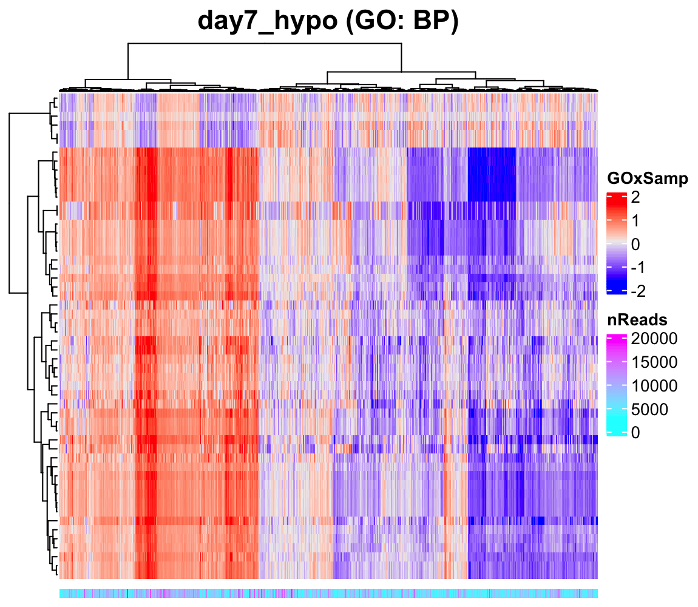
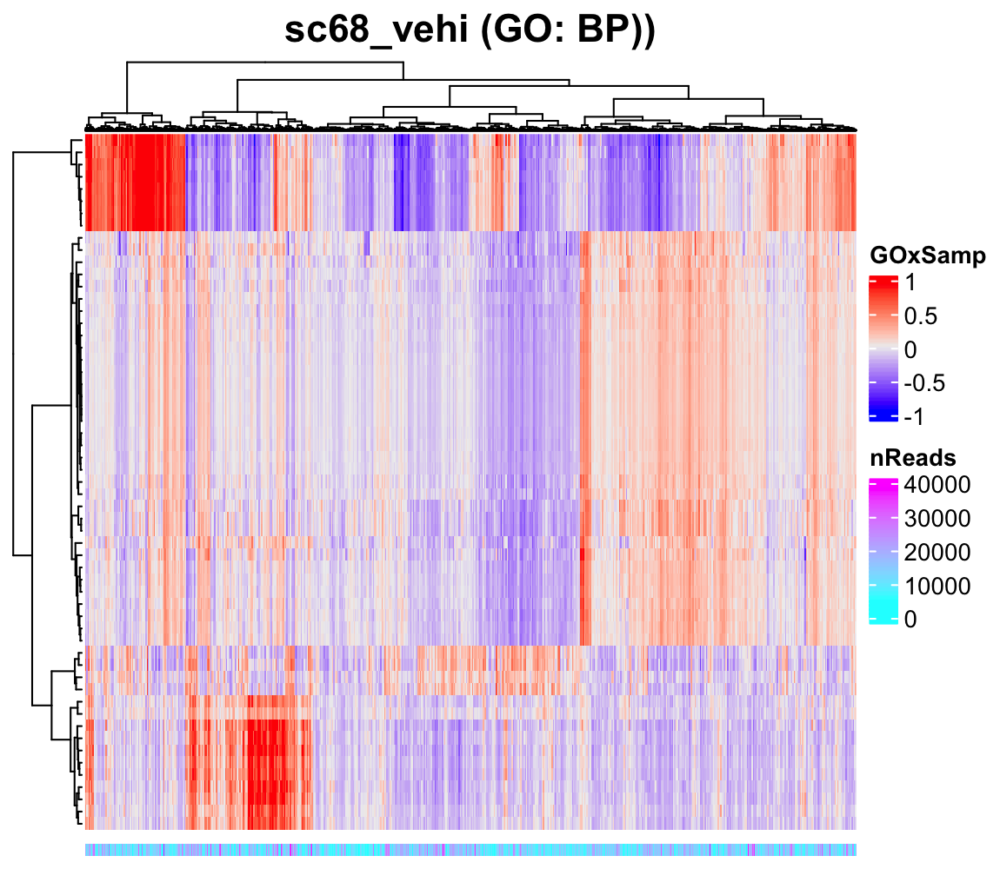


Save the objects.
```{r, eval = FALSE}
saveRDS(day1_norm_red, file = "backup/01_201_day1_norm_matrix_GO.rds")
saveRDS(day7_hypo_red, file = "backup/02_201_day7_hypo_matrix_GO.rds")
saveRDS(sc68_vehi_red, file = "backup/03_201_sc68_vehi_matrix_GO.rds")
saveRDS(sc68_cisp_red, file = "backup/04_201_sc68_cisp_matrix_GO.rds")
saveRDS(pbmc_4000_red, file = "backup/05_201_pbmc_4000_matrix_GO.rds")
saveRDS(pbmc_6000_red, file = "backup/06_201_pbmc_6000_matrix_GO.rds")
```


## Dimensionality reduction
Load the objects.
```{r, eval = FALSE}
source("R/plot.R")
source("R/function_sign.R")
day1_norm <- readRDS(file = "backup/01_201_day1_norm_matrix_GO.rds")
day7_hypo <- readRDS(file = "backup/02_201_day7_hypo_matrix_GO.rds")
sc68_vehi <- readRDS(file = "backup/03_201_sc68_vehi_matrix_GO.rds")
sc68_cisp <- readRDS(file = "backup/04_201_sc68_cisp_matrix_GO.rds")
pbmc_4000 <- readRDS(file = "backup/05_201_pbmc_4000_matrix_GO.rds")
pbmc_6000 <- readRDS(file = "backup/06_201_pbmc_6000_matrix_GO.rds")
```

The following function `do_pca_sign()` performs principal component analysis
based on the sign-by-sample matrices of the input `data_type` and `category`.
```{r, eval = FALSE}
day1_norm <- do_pca_sign(obj = day1_norm, data_type = "GO", category = "BP")
day7_hypo <- do_pca_sign(obj = day7_hypo, data_type = "GO", category = "BP")
sc68_vehi <- do_pca_sign(obj = sc68_vehi, data_type = "GO", category = "BP")
sc68_cisp <- do_pca_sign(obj = sc68_cisp, data_type = "GO", category = "BP")
pbmc_4000 <- do_pca_sign(obj = pbmc_4000, data_type = "GO", category = "BP")
pbmc_6000 <- do_pca_sign(obj = pbmc_6000, data_type = "GO", category = "BP")
```
The result is stored in `obj[["reduction"]][["pca"]][["GO"]][["BP"]]`.

The following function `do_tsne_sign()` performs `Rtsne()` in `Rtsne` package
based on the sign-by-sample matrices of the input `data_type` and `category`.
The arguments are `obj` (ASURAT object), `data_type`, `category`,
`pca_dim` (dimension of principal component used for t-SNE, in which `NULL` is
accepted if users would like to compute t-SNE from the original sample-by-sign
matrices), and `tsne_dim` (t-SNE dimension: either `2` or `3`).
```{r, eval = FALSE}
day1_norm <- do_tsne_sign(obj = day1_norm, data_type = "GO", category = "BP",
                          pca_dim = NULL, tsne_dim = 2)
day7_hypo <- do_tsne_sign(obj = day7_hypo, data_type = "GO", category = "BP",
                          pca_dim = NULL, tsne_dim = 2)
sc68_vehi <- do_tsne_sign(obj = sc68_vehi, data_type = "GO", category = "BP",
                          pca_dim = NULL, tsne_dim = 2)
sc68_cisp <- do_tsne_sign(obj = sc68_cisp, data_type = "GO", category = "BP",
                          pca_dim = NULL, tsne_dim = 2)
pbmc_4000 <- do_tsne_sign(obj = pbmc_4000, data_type = "GO", category = "BP",
                          pca_dim = NULL, tsne_dim = 2)
pbmc_6000 <- do_tsne_sign(obj = pbmc_6000, data_type = "GO", category = "BP",
                          pca_dim = NULL, tsne_dim = 2)
```
The result is stored in `obj[["reduction"]][["tsne"]][["GO"]][["BP"]]`.

The following function `plot_tsne_sign()` shows the data in a t-SNE space,
in which the space dimension is automatically given by `tsne_dim` used in
`do_tsne_sign()`.
The arguments are `obj`, `data_type`, `category`, `algo_name = NULL`, `theta`
(angle of view for 3D plots), and `phi` (angle of view for 3D plots).
```{r, eval = FALSE}
# ----------------------------------------
# day1_norm
# ----------------------------------------
p <- plot_tsne_sign(obj = day1_norm, data_type = "GO", category = "BP",
                    algo_name = NULL, theta = NULL, phi = NULL,
                    title = "day1_norm (GO: BP)", title_size = 18,
                    xlabel = "tSNE_1", ylabel = "tSNE_2", zlabel = NULL,
                    default_color = FALSE)
filename <- "figures/figure_01_0205.png"
ggsave(file = filename, plot = p, dpi = 200, width = 4.3, height = 4.5)
```

```{r, eval = FALSE, echo = FALSE, results = "hide"}
# ----------------------------------------
# day7_hypo
# ----------------------------------------
p <- plot_tsne_sign(obj = day7_hypo, data_type = "GO", category = "BP",
                    algo_name = NULL, theta = NULL, phi = NULL,
                    title = "day7_hypo (GO: BP)", title_size = 18,
                    xlabel = "tSNE_1", ylabel = "tSNE_2", zlabel = NULL,
                    default_color = FALSE)
filename <- "figures/figure_02_0205.png"
ggsave(file = filename, plot = p, dpi = 200, width = 4.3, height = 4.5)
# ----------------------------------------
# sc68_vehi
# ----------------------------------------
p <- plot_tsne_sign(obj = sc68_vehi, data_type = "GO", category = "BP",
                    algo_name = NULL, theta = NULL, phi = NULL,
                    title = "sc68_vehi (GO: BP)", title_size = 18,
                    xlabel = "tSNE_1", ylabel = "tSNE_2", zlabel = NULL,
                    default_color = FALSE)
filename <- "figures/figure_03_0205.png"
ggsave(file = filename, plot = p, dpi = 200, width = 4.3, height = 4.5)
# ----------------------------------------
# sc68_cisp
# ----------------------------------------
p <- plot_tsne_sign(obj = sc68_cisp, data_type = "GO", category = "BP",
                    algo_name = NULL, theta = NULL, phi = NULL,
                    title = "sc68_cisp (GO: BP)", title_size = 18,
                    xlabel = "tSNE_1", ylabel = "tSNE_2", zlabel = NULL,
                    default_color = FALSE)
filename <- "figures/figure_04_0205.png"
ggsave(file = filename, plot = p, dpi = 200, width = 4.3, height = 4.5)
# ----------------------------------------
# pbmc_4000
# ----------------------------------------
p <- plot_tsne_sign(obj = pbmc_4000, data_type = "GO", category = "BP",
                    algo_name = NULL, theta = NULL, phi = NULL,
                    title = "pbmc_4000 (GO: BP)", title_size = 18,
                    xlabel = "tSNE_1", ylabel = "tSNE_2", zlabel = NULL,
                    default_color = FALSE)
filename <- "figures/figure_05_0205.png"
ggsave(file = filename, plot = p, dpi = 200, width = 4.3, height = 4.5)
# ----------------------------------------
# pbmc_6000
# ----------------------------------------
p <- plot_tsne_sign(obj = pbmc_6000, data_type = "GO", category = "BP",
                    algo_name = NULL, theta = NULL, phi = NULL,
                    title = "pbmc_6000 (GO: BP)", title_size = 18,
                    xlabel = "tSNE_1", ylabel = "tSNE_2", zlabel = NULL,
                    default_color = FALSE)
filename <- "figures/figure_06_0205.png"
ggsave(file = filename, plot = p, dpi = 200, width = 4.3, height = 4.5)
```

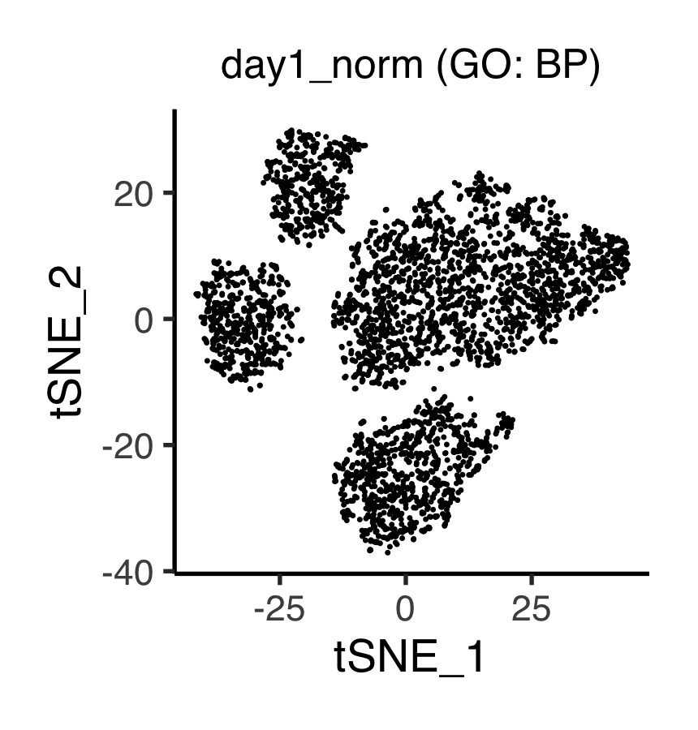


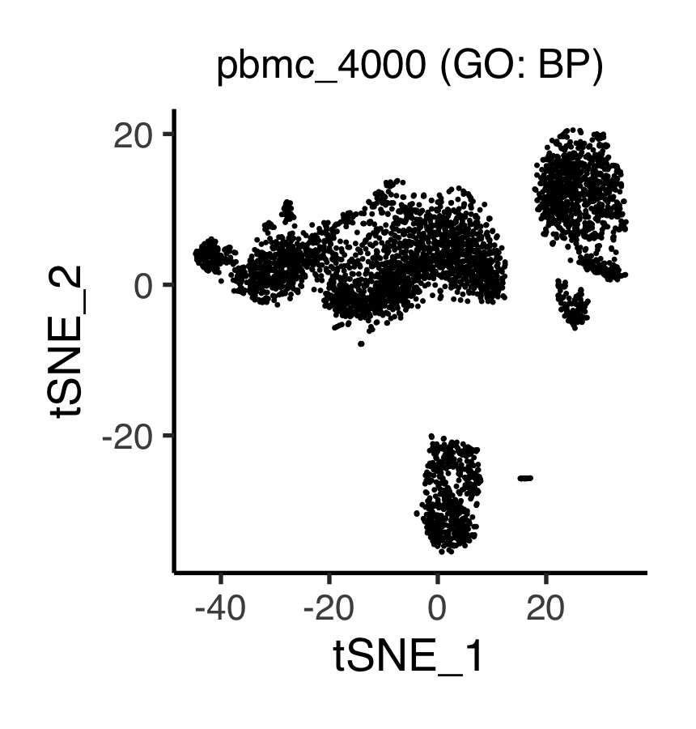
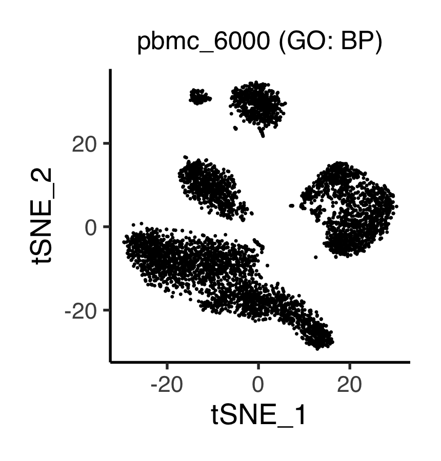

The following function `do_umap_sign()` performs `umap()` in `umap` package
based on the sign-by-sample matrices of the input `data_type` and `category`.
The arguments are `obj`, `data_type`, `category`, `pca_dim` (dimension of
principal component used for UMAP, in which `NULL` is accepted if users would
like to compute UMAP from the original sample-by-sign matrices), and
`umap_dim` (UMAP dimension: either `2` or `3`).
```{r, eval = FALSE}
day1_norm <- do_umap_sign(obj = day1_norm, data_type = "GO", category = "BP",
                          pca_dim = NULL, umap_dim = 2)
day7_hypo <- do_umap_sign(obj = day7_hypo, data_type = "GO", category = "BP",
                          pca_dim = NULL, umap_dim = 2)
sc68_vehi <- do_umap_sign(obj = sc68_vehi, data_type = "GO", category = "BP",
                          pca_dim = NULL, umap_dim = 2)
sc68_cisp <- do_umap_sign(obj = sc68_cisp, data_type = "GO", category = "BP",
                          pca_dim = NULL, umap_dim = 2)
pbmc_4000 <- do_umap_sign(obj = pbmc_4000, data_type = "GO", category = "BP",
                          pca_dim = NULL, umap_dim = 2)
pbmc_6000 <- do_umap_sign(obj = pbmc_6000, data_type = "GO", category = "BP",
                          pca_dim = NULL, umap_dim = 2)
```
The result is stored in `obj[["reduction"]][["umap"]][["GO"]][["BP"]]`.

The following function `plot_umap_sign()` shows the data in a UMAP space,
in which the space dimension is automatically given by `umap_dim` used in
`do_umap_sign()`.
The arguments are `obj`, `data_type`, `category`, `algo_name = NULL`, `theta`
(angle of view for 3D plots), and `phi` (angle of view for 3D plots).
```{r, eval = FALSE}
# ----------------------------------------
# day1_norm
# ----------------------------------------
p <- plot_umap_sign(obj = day1_norm, data_type = "GO", category = "BP",
                    algo_name = NULL, theta = NULL, phi = NULL,
                    title = "day1_norm (GO: BP)", title_size = 18,
                    xlabel = "UMAP_1", ylabel = "UMAP_2", zlabel = NULL,
                    default_color = FALSE)
filename <- "figures/figure_01_0206.png"
ggsave(file = filename, plot = p, dpi = 200, width = 4.3, height = 4.5)
```

```{r, eval = FALSE, echo = FALSE, results = "hide"}
# ----------------------------------------
# day7_hypo
# ----------------------------------------
p <- plot_umap_sign(obj = day7_hypo, data_type = "GO", category = "BP",
                    algo_name = NULL, theta = NULL, phi = NULL,
                    title = "day7_hypo (GO: BP)", title_size = 18,
                    xlabel = "UMAP_1", ylabel = "UMAP_2", zlabel = NULL,
                    default_color = FALSE)
filename <- "figures/figure_02_0206.png"
ggsave(file = filename, plot = p, dpi = 200, width = 4.3, height = 4.5)
# ----------------------------------------
# sc68_vehi
# ----------------------------------------
p <- plot_umap_sign(obj = sc68_vehi, data_type = "GO", category = "BP",
                    algo_name = NULL, theta = NULL, phi = NULL,
                    title = "sc68_vehi (GO: BP)", title_size = 18,
                    xlabel = "UMAP_1", ylabel = "UMAP_2", zlabel = NULL,
                    default_color = FALSE)
filename <- "figures/figure_03_0206.png"
ggsave(file = filename, plot = p, dpi = 200, width = 4.3, height = 4.5)
# ----------------------------------------
# sc68_cisp
# ----------------------------------------
p <- plot_umap_sign(obj = sc68_cisp, data_type = "GO", category = "BP",
                    algo_name = NULL, theta = NULL, phi = NULL,
                    title = "sc68_cisp (GO: BP)", title_size = 18,
                    xlabel = "UMAP_1", ylabel = "UMAP_2", zlabel = NULL,
                    default_color = FALSE)
filename <- "figures/figure_04_0206.png"
ggsave(file = filename, plot = p, dpi = 200, width = 4.3, height = 4.5)
# ----------------------------------------
# pbmc_4000
# ----------------------------------------
p <- plot_umap_sign(obj = pbmc_4000, data_type = "GO", category = "BP",
                    algo_name = NULL, theta = NULL, phi = NULL,
                    title = "pbmc_6000 (GO: BP)", title_size = 18,
                    xlabel = "UMAP_1", ylabel = "UMAP_2", zlabel = NULL,
                    default_color = FALSE)
filename <- "figures/figure_05_0206.png"
ggsave(file = filename, plot = p, dpi = 200, width = 4.3, height = 4.5)
# ----------------------------------------
# pbmc_6000
# ----------------------------------------
p <- plot_umap_sign(obj = pbmc_6000, data_type = "GO", category = "BP",
                    algo_name = NULL, theta = NULL, phi = NULL,
                    title = "pbmc_6000 (GO: BP)", title_size = 18,
                    xlabel = "UMAP_1", ylabel = "UMAP_2", zlabel = NULL,
                    default_color = FALSE)
filename <- "figures/figure_06_0206.png"
ggsave(file = filename, plot = p, dpi = 200, width = 4.3, height = 4.5)
```

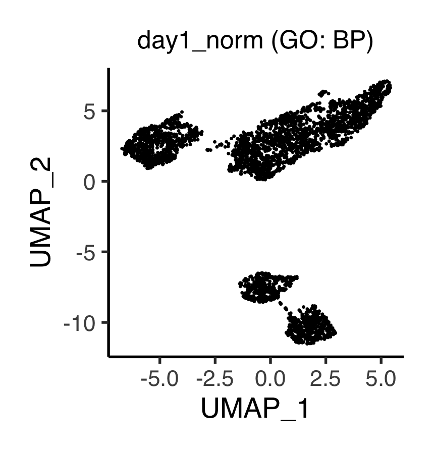


The following function `do_DiffusionMap_sign()` performs `DiffusionMap()` using
`destiny` package, where the arguments are preset as `sigma = "local"` and
`distance = "euclidean"`.
The arguments are `obj`, `data_type`, `category`, `sigma`
(argument of `DiffusionMap()`), `distance` (argument of `DiffusionMap()`), and
`pca_dim` (an integer: dimension of principal component used for UMAP, in which
`NULL` is accepted if users would like to compute UMAP from the original
sample-by-sign matrices)

**Tips:**
If the resulting diffusion map is distorted by outliers, tuning of `pca_dim`
will be required.
```{r, eval = FALSE}
day1_norm <- do_DiffusionMap_sign(obj = day1_norm, data_type = "GO",
                                  category = "BP", pca_dim = NULL)
day7_hypo <- do_DiffusionMap_sign(obj = day7_hypo, data_type = "GO",
                                  category = "BP", pca_dim = NULL)
sc68_vehi <- do_DiffusionMap_sign(obj = sc68_vehi, data_type = "GO",
                                  category = "BP", pca_dim = NULL)
sc68_cisp <- do_DiffusionMap_sign(obj = sc68_cisp, data_type = "GO",
                                  category = "BP", pca_dim = 10)
pbmc_4000 <- do_DiffusionMap_sign(obj = pbmc_4000, data_type = "GO",
                                  category = "BP", pca_dim = NULL)
pbmc_6000 <- do_DiffusionMap_sign(obj = pbmc_6000, data_type = "GO",
                                  category = "BP", pca_dim = NULL)
```
The result is stored in `obj[["reduction"]][["dmap"]][["GO"]][["BP"]]`.

The following function `plot_DiffusionMap_sign()` shows the data in a diffusion
space.
The arguments are `obj`, `data_type`, `category`, `algo_name = NULL`, `dims`
(dimension vector for the plot), `theta` (angle of view), and
`phi` (angle of view).
```{r, eval = FALSE}
# ----------------------------------------
# day1_norm
# ----------------------------------------
filename <- "figures/figure_01_0210.png"
png(file = filename, height = 1200, width = 1200, res = 250)
plot_DiffusionMap_sign(obj = day1_norm, data_type = "GO", category = "BP",
                       algo_name = NULL, dims = 1:3, theta = 90, phi = 30,
                       title = "day1_norm (GO: BP)", title_size = 1.2,
                       xlabel = "DC_1", ylabel = "DC_2", zlabel = "DC_3",
                       default_color = FALSE)
dev.off()
#
# Below is a memo for using plot_ly()
#
# library(plotly)
# x <- day1_norm[["reduction"]][["dmap"]][["GO"]][["BP"]]@eigenvectors
# df <- as.data.frame(x)
# plot_ly(df, x = df[,1], y = df[,2], z = df[,3], mode = "markers",
# type = "scatter3d", marker = list(opacity = 1, showlegend = T, size = 2))
```

```{r, eval = FALSE, echo = FALSE, results = "hide"}
# ----------------------------------------
# day7_hypo
# ----------------------------------------
filename <- "figures/figure_02_0210.png"
png(file = filename, height = 1200, width = 1200, res = 250)
plot_DiffusionMap_sign(obj = day7_hypo, data_type = "GO", category = "BP",
                       algo_name = NULL, dims = 1:3, theta = 90, phi = 30,
                       title = "day7_hypo (GO: BP)", title_size = 1.2,
                       xlabel = "DC_1", ylabel = "DC_2", zlabel = "DC_3",
                       default_color = FALSE)
dev.off()
# ----------------------------------------
# sc68_vehi
# ----------------------------------------
filename <- "figures/figure_03_0210.png"
png(file = filename, height = 1200, width = 1200, res = 250)
plot_DiffusionMap_sign(obj = sc68_vehi, data_type = "GO", category = "BP",
                       algo_name = NULL, dims = 1:3, theta = 90, phi = 30,
                       title = "sc68_vehi (GO: BP)", title_size = 1.2,
                       xlabel = "DC_1", ylabel = "DC_2", zlabel = "DC_3",
                       default_color = FALSE)
dev.off()
# ----------------------------------------
# sc68_cisp
# ----------------------------------------
filename <- "figures/figure_04_0210.png"
png(file = filename, height = 1200, width = 1200, res = 250)
plot_DiffusionMap_sign(obj = sc68_cisp, data_type = "GO", category = "BP",
                       algo_name = NULL, dims = 1:3, theta = 90, phi = 30,
                       title = "sc68_cisp (GO: BP)", title_size = 1.2,
                       xlabel = "DC_1", ylabel = "DC_2", zlabel = "DC_3",
                       default_color = FALSE)
dev.off()
# ----------------------------------------
# pbmc_4000
# ----------------------------------------
filename <- "figures/figure_05_0210.png"
png(file = filename, height = 1200, width = 1200, res = 250)
plot_DiffusionMap_sign(obj = pbmc_4000, data_type = "GO", category = "BP",
                       algo_name = NULL, dims = 1:3, theta = 90, phi = 30,
                       title = "pbmc_4000 (GO: BP)", title_size = 1.2,
                       xlabel = "DC_1", ylabel = "DC_2", zlabel = "DC_3",
                       default_color = FALSE)
dev.off()
# ----------------------------------------
# pbmc_6000
# ----------------------------------------
filename <- "figures/figure_06_0210.png"
png(file = filename, height = 1200, width = 1200, res = 250)
plot_DiffusionMap_sign(obj = pbmc_6000, data_type = "GO", category = "BP",
                       algo_name = NULL, dims = 1:3, theta = 90, phi = 30,
                       title = "pbmc_6000 (GO: BP)", title_size = 1.2,
                       xlabel = "DC_1", ylabel = "DC_2", zlabel = "DC_3",
                       default_color = FALSE)
dev.off()
```


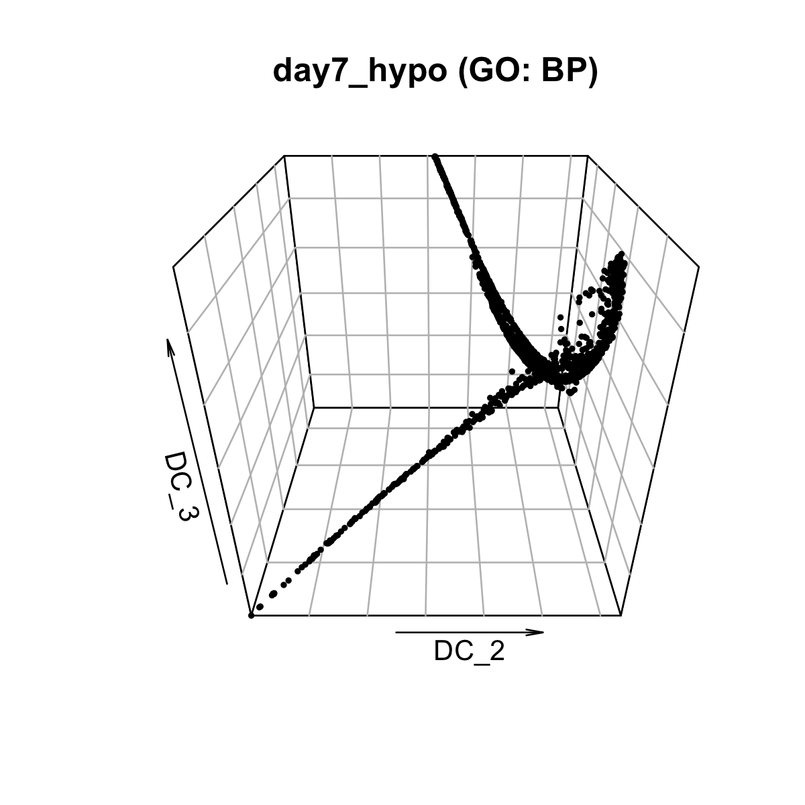
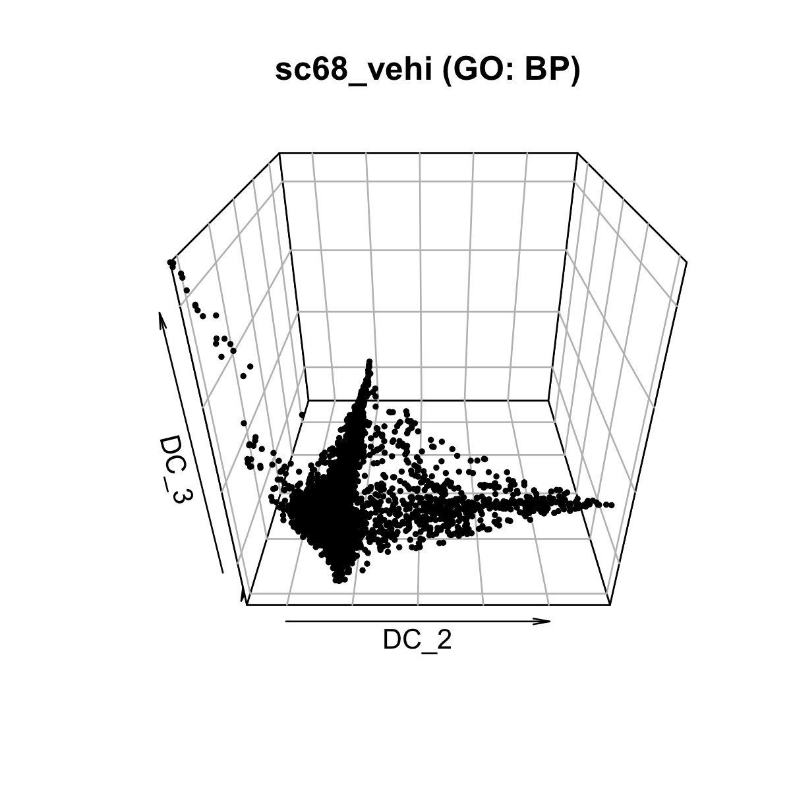


Save the objects.
```{r, eval = FALSE}
saveRDS(day1_norm, file = "backup/01_202_day1_norm_reduction_GO.rds")
saveRDS(day7_hypo, file = "backup/02_202_day7_hypo_reduction_GO.rds")
saveRDS(sc68_vehi, file = "backup/03_202_sc68_vehi_reduction_GO.rds")
saveRDS(sc68_cisp, file = "backup/04_202_sc68_cisp_reduction_GO.rds")
saveRDS(pbmc_4000, file = "backup/05_202_pbmc_4000_reduction_GO.rds")
saveRDS(pbmc_6000, file = "backup/06_202_pbmc_6000_reduction_GO.rds")
```

Load the objects.
```{r, eval = FALSE}
day1_norm <- readRDS(file = "backup/01_202_day1_norm_reduction_GO.rds")
day7_hypo <- readRDS(file = "backup/02_202_day7_hypo_reduction_GO.rds")
sc68_vehi <- readRDS(file = "backup/03_202_sc68_vehi_reduction_GO.rds")
sc68_cisp <- readRDS(file = "backup/04_202_sc68_cisp_reduction_GO.rds")
pbmc_4000 <- readRDS(file = "backup/05_202_pbmc_4000_reduction_GO.rds")
pbmc_6000 <- readRDS(file = "backup/06_202_pbmc_6000_reduction_GO.rds")
```


## Cell clustering
Load the objects.
```{r, eval = FALSE}
source("R/plot.R")
source("R/function_sign.R")
day1_norm <- readRDS(file = "backup/01_202_day1_norm_reduction_GO.rds")
day7_hypo <- readRDS(file = "backup/02_202_day7_hypo_reduction_GO.rds")
sc68_vehi <- readRDS(file = "backup/03_202_sc68_vehi_reduction_GO.rds")
sc68_cisp <- readRDS(file = "backup/04_202_sc68_cisp_reduction_GO.rds")
pbmc_4000 <- readRDS(file = "backup/05_202_pbmc_4000_reduction_GO.rds")
pbmc_6000 <- readRDS(file = "backup/06_202_pbmc_6000_reduction_GO.rds")
```

Here users can choose one of the following unsupervised clustering methods.

**Tips:**
A medoid-and-flat type of unsupervised clustering such as k-medoids method is
the most intuitive way, but their classification results do not always match to
the clusters in the low dimensional space.
On the other hand, though Louvain algorithm with k-nearest neighbor graph
(see below) is a more flexible way, it might be better to try first using more
simple and translatable method.

**1. Partitioning around medoids (PAM)**

The following function `classify_samples_pam_sign()` performs `pam()` in
`cluster` package.
The arguments are `obj`, `data_type`, `category`, and `k` (argument of `pam()`).
```{r, eval = FALSE}
# day1_norm <- classify_samples_pam_sign(
#   obj = day1_norm, data_type = "GO",category = "BP", k = 4)

#
# Below is a memo for plotting the result.
#
# mat <- day1_norm[["reduction"]][["tsne"]][["GO"]][["BP"]]$Y
# lab <- day1_norm[["sample"]][["pam_GO_BP"]]
# col <- rainbow(length(unique(lab)))
# plot(mat, pch=21, bg=col[lab])
# legend("bottomright", legend=unique(sort(lab)), pch=21, pt.bg=col)
```
The results are stored in `obj[["classification"]][["pam"]][["GO"]][["BP"]]` and
`obj[["sample"]][["pam_GO_BP"]]`.

**2. Hierarchical clustering and cutting tree**

The following function `classify_samples_hclustCutree_sign()` performs
`hclust()` and `cutree()` in `stats` package.
The arguments are `obj`, `data_type`, `category`, `method`
(argument of `hclust()`) and `k` (argument of `cutree()`).
```{r, eval = FALSE}
# pbmc_4000 <- classify_samples_hclustCutree_sign(
#  obj = pbmc_4000, data_type = "GO", category = "BP",
#  method = "ward.D2", k = 4)

#
# Below is a memo for plotting the result.
#
# mat <- pbmc_4000[["reduction"]][["tsne"]][["GO"]][["BP"]]$Y
# lab <- pbmc_4000[["sample"]][["hclustCutree_GO_BP"]]
# col <- rainbow(length(unique(lab)))
# plot(mat, pch=21, bg=col[lab])
# legend("bottomright", legend=unique(sort(lab)), pch=21, pt.bg=col)
```
The computational results are stored in
`obj[["classification"]][["hclustCutree"]][["GO"]][["BP"]]` and
`obj[["sample"]][["hclustCutree_GO_BP"]]`.

**3. Community detection algorithm with k-nearest neighbor (KNN) graph**

The following function `classify_samples_seuratFindClusters_sign()` performs
`CreateSeuratObject()`, `ScaleData()`, `RunPCA()`, `FindNeighbors()`, and
`FindClusters()` in `Seurat` package.
The arguments are `obj`, `data_type`, `category`, `reduction`, `dims`,
`k.param`, `prune.SNN`, `resolution`, and `algorithm`, where the latter six
parameters are used in `FindNeighbors()` and `FindClusters()`.
```{r, eval = FALSE}
day1_norm <- classify_samples_seuratFindClusters_sign(
  obj = day1_norm, data_type = "GO", category = "BP", reduction = "pca",
  dims = 1:20, k.param = 10, prune.SNN = 1./15, resolution = 0.25,
  algorithm = 1)

day7_hypo <- classify_samples_seuratFindClusters_sign(
  obj = day7_hypo, data_type = "GO", category = "BP", reduction = "pca",
  dims = 1:20, k.param = 10, prune.SNN = 1./15, resolution = 0.20,
  algorithm = 1)

sc68_vehi <- classify_samples_seuratFindClusters_sign(
  obj = sc68_vehi, data_type = "GO", category = "BP", reduction = "pca",
  dims = 1:40, k.param = 10, prune.SNN = 1./15, resolution = 0.05,
  algorithm = 1)

pbmc_4000 <- classify_samples_seuratFindClusters_sign(
  obj = pbmc_4000, data_type = "GO", category = "BP", reduction = "pca",
  dims = 1:20, k.param = 10, prune.SNN = 1./15, resolution = 0.10,
  algorithm = 1)

pbmc_6000 <- classify_samples_seuratFindClusters_sign(
  obj = pbmc_6000, data_type = "GO", category = "BP", reduction = "pca",
  dims = 1:20, k.param = 10, prune.SNN = 1./15, resolution = 0.08,
  algorithm = 1)

#
# Below is a memo for plotting the result.
#
# mat <- day1_norm[["reduction"]][["tsne"]][["GO"]][["BP"]]$Y
# lab <- day1_norm[["sample"]][["seuratFindClusters_GO_BP"]]
# col <- rainbow(length(unique(lab)))
# plot(mat, pch=21, bg=col[lab])
# legend("bottomright", legend=unique(sort(lab)), pch=21, pt.bg=col)
```
The results are stored in `obj[["sample"]][["seuratFindClusters_GO_BP"]]` and
`obj[["classification"]][["seuratFindClusters"]][["GO"]][["BP"]]`.

**4. Clustering by branch detection along pseudotime**

The following function `do_CalculateScaffoldTree_dmap()` computes a scaffold
tree by using `CalculateScaffoldTree()` in `merlot` package, which is based on
the result of diffusion map.
The arguments are `obj`, `data_type`, `category`, `dims` (dimensions of the
diffusion map: only two or three dimensional vector is accepted), `NEndpoints`
(number of end points of the scaffold tree), and `random_seed` (random seed to
be passed on to Python to ensure reproducibility).
```{r, eval = FALSE}
sc68_cisp <- do_CalculateScaffoldTree_dmap(
  obj = sc68_cisp, data_type = "GO", category = "BP",
  dims = 1:3, NEndpoints = 3, random_seed = 8)
```
The result is stored in
`obj[["classification"]][["merlot"]][["GO"]][["BP"]][["ScaffoldTree"]]`.

The following function `do_CalculateElasticTree_dmap()` computes a elastic
principal tree by using `CalculateElasticTree()` in `merlot` package,
which is based on the result of two-dimensional diffusion map.
The arguments are `obj`, `data_type`, `category`, and `N_yk`
(number of support nodes).
```{r, eval = FALSE}
sc68_cisp <- do_CalculateElasticTree_dmap(
  obj = sc68_cisp, data_type = "GO", category = "BP", N_yk = 30)
```
The computational result is stored in
`obj[["classification"]][["merlot"]][["GO"]][["BP"]][["ElasticTree"]]`.

The following function `plot_ElasticTree_dmap()` visualizes the result of
`do_CalculateElasticTree_dmap()`.
```{r, eval = FALSE}
filename <- "figures/figure_04_0215.png"
png(file = filename, height = 1200, width = 1200, res = 250)
plot_ElasticTree_dmap(obj = sc68_cisp, data_type = "GO", category = "BP",
                      theta = 0, phi = 30,
                      title = "sc68_cisp (GO: BP)", title_size = 1.2,
                      xlabel = "DC_1", ylabel = "DC_2", zlabel = "DC_3",
                      default_color = FALSE)
dev.off()
```

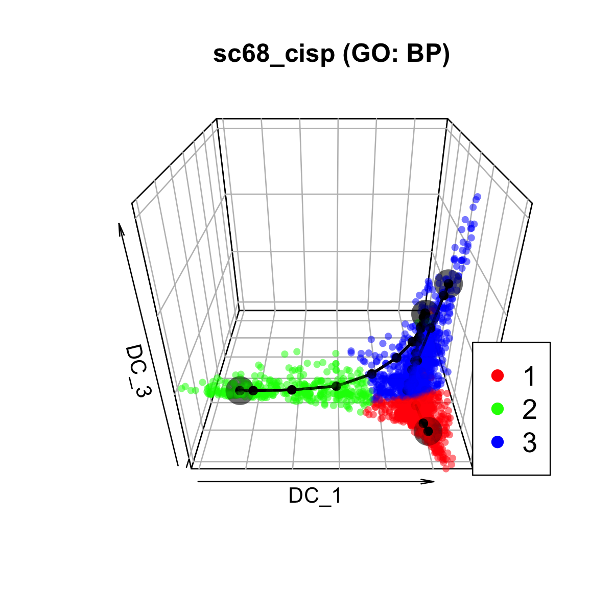

The following function `do_SignSpaceEmbedding_dmap()` embeds the elastic
principal tree into the original space spanned by the row vectors of
sign-by-sample matrices by using `GenesSpaceEmbedding()` in `merlot` package,
in which Gene is read as Sign here.
```{r, eval = FALSE}
sc68_cisp <- do_SignSpaceEmbedding_dmap(
  obj = sc68_cisp, data_type = "GO", category = "BP")
```
The computational result is stored in
`obj[["classification"]][["merlot"]][["GO"]][["BP"]][["EmbeddedTree"]]`.

The following function `do_CalculatePseudotimes_dmap()` computes a pseudotime
for each cell by using `CalculatePseudotimes()` in `merlot` package.
The arguments are `obj`, `data_type`, `category`, and `T0` (endpoint used at
time zero).
```{r, eval = FALSE}
sc68_cisp <- do_CalculatePseudotimes_dmap(
  obj = sc68_cisp, data_type = "GO", category = "BP", T0 = 1)
```
The result is stored in
`obj[["classification"]][["merlot"]][["GO"]][["BP"]][["Pseudotimes"]]`.

The following function `plot_Pseudotime_dmap()` shows the result of
`do_CalculatePseudotimes_dmap()` in a two dimensional space.
```{r, eval = FALSE}
filename <- "figures/figure_04_0220.png"
png(file = filename, height = 1200, width = 1200, res = 250)
plot_Pseudotime_dmap(obj = sc68_cisp, data_type = "GO", category = "BP",
                     theta = 0, phi = 30,
                     title = "sc68_cisp (GO: BP)", title_size = 1.2,
                     xlabel = "DC_1", ylabel = "DC_2", zlabel = "DC_3")
dev.off()
```

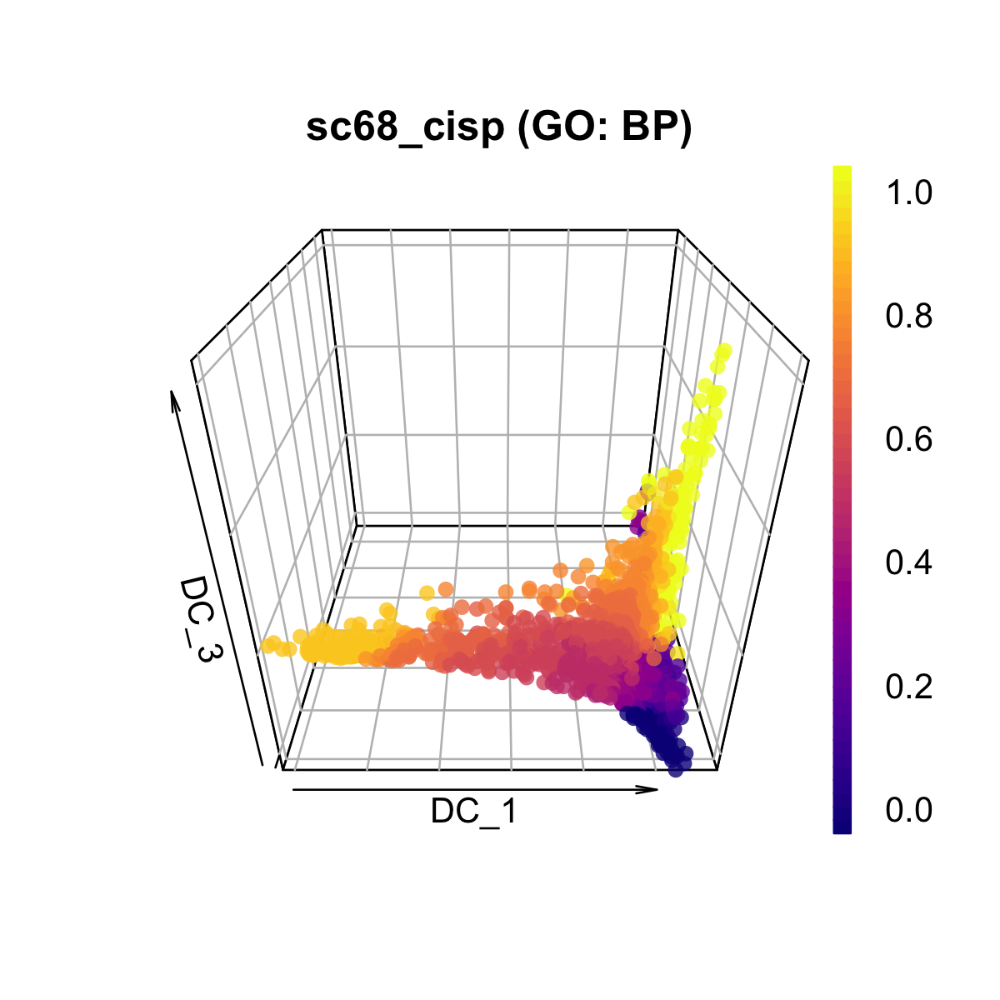

The following function `classify_samples_merlot_sign()` classifies samples
according to the labels of branches.
```{r, eval = FALSE}
sc68_cisp <- classify_samples_merlot_sign(
  obj = sc68_cisp, data_type = "GO", category = "BP")
```
The result is stored in `obj[["sample"]][["merlot_GO_BP"]]`.

Save the objects.
```{r, eval = FALSE}
saveRDS(day1_norm, file = "backup/01_203_day1_norm_classification_GO.rds")
saveRDS(day7_hypo, file = "backup/02_203_day7_hypo_classification_GO.rds")
saveRDS(sc68_vehi, file = "backup/03_203_sc68_vehi_classification_GO.rds")
saveRDS(sc68_cisp, file = "backup/04_203_sc68_cisp_classification_GO.rds")
saveRDS(pbmc_4000, file = "backup/05_203_pbmc_4000_classification_GO.rds")
saveRDS(pbmc_6000, file = "backup/06_203_pbmc_6000_classification_GO.rds")
```

Load the objects.
```{r, eval = FALSE}
day1_norm <- readRDS(file = "backup/01_203_day1_norm_classification_GO.rds")
day7_hypo <- readRDS(file = "backup/02_203_day7_hypo_classification_GO.rds")
sc68_vehi <- readRDS(file = "backup/03_203_sc68_vehi_classification_GO.rds")
sc68_cisp <- readRDS(file = "backup/04_203_sc68_cisp_classification_GO.rds")
pbmc_4000 <- readRDS(file = "backup/05_203_pbmc_4000_classification_GO.rds")
pbmc_6000 <- readRDS(file = "backup/06_203_pbmc_6000_classification_GO.rds")
```


## Visualization
In this subsection, the clustering results are visualized.

The following function `plot_Heatmap_SignxSamp()` visualizes the result of
sample clustering by identifying `algo_name` (in the current version,
one of `"pam"`, `"hclustCutree"`, `"seuratFindClusters"`, and `"merlot"`).
```{r, eval = FALSE}
# ----------------------------------------
# For `day1_norm`
# ----------------------------------------
filename <- "figures/figure_01_0230.png"
png(file = filename, height = 1000, width = 1250, res = 200)
plot_Heatmap_SignxSamp(obj = day1_norm, data_type = "GO", category = "BP",
                       algo_name = "seuratFindClusters", method = "ward.D2",
                       show_nReads = FALSE, title = "day1_norm (GO: BP)",
                       name = "GOxSamp",
                       show_rownames_sign = FALSE, show_rownames_label = FALSE,
                       show_rownames_nReads = FALSE, default_color = FALSE)
dev.off()
```

```{r, eval = FALSE, echo = FALSE, results = "hide"}
# ----------------------------------------
# For `day7_hypo`
# ----------------------------------------
filename <- "figures/figure_02_0230.png"
png(file = filename, height = 1000, width = 1250, res = 200)
plot_Heatmap_SignxSamp(obj = day7_hypo, data_type = "GO", category = "BP",
                       algo_name = "seuratFindClusters", method = "ward.D2",
                       show_nReads = FALSE, title = "day7_hypo (GO: BP)",
                       name = "GOxSamp",
                       show_rownames_sign = FALSE, show_rownames_label = FALSE,
                       show_rownames_nReads = FALSE, default_color = FALSE)
dev.off()
# ----------------------------------------
# For `sc68_vehi`
# ----------------------------------------
filename <- "figures/figure_03_0230.png"
png(file = filename, height = 1000, width = 1250, res = 200)
plot_Heatmap_SignxSamp(obj = sc68_vehi, data_type = "GO", category = "BP",
                       algo_name = "seuratFindClusters", method = "ward.D2",
                       show_nReads = FALSE, title = "sc68_vehi (GO: BP)",
                       name = "GOxSamp",
                       show_rownames_sign = FALSE, show_rownames_label = FALSE,
                       show_rownames_nReads = FALSE, default_color = FALSE)
dev.off()
# ----------------------------------------
# For `sc68_cisp`
# ----------------------------------------
filename <- "figures/figure_04_0230.png"
png(file = filename, height = 1000, width = 1250, res = 200)
plot_Heatmap_SignxSamp(obj = sc68_cisp, data_type = "GO", category = "BP",
                       algo_name = "merlot", method = "ward.D2",
                       show_nReads = FALSE, title = "sc68_cisp (GO: BP)",
                       name = "GOxSamp",
                       show_rownames_sign = FALSE, show_rownames_label = FALSE,
                       show_rownames_nReads = FALSE, default_color = FALSE)
dev.off()
# ----------------------------------------
# For `pbmc_4000`
# ----------------------------------------
filename <- "figures/figure_05_0230.png"
png(file = filename, height = 1000, width = 1250, res = 200)
plot_Heatmap_SignxSamp(obj = pbmc_4000, data_type = "GO", category = "BP",
                       algo_name = "seuratFindClusters", method = "ward.D2",
                       show_nReads = FALSE, title = "pbmc_4000 (GO: BP)",
                       name = "GOxSamp",
                       show_rownames_sign = FALSE, show_rownames_label = FALSE,
                       show_rownames_nReads = FALSE, default_color = FALSE)
dev.off()
# ----------------------------------------
# For `pbmc_6000`
# ----------------------------------------
filename <- "figures/figure_06_0230.png"
png(file = filename, height = 1000, width = 1250, res = 200)
plot_Heatmap_SignxSamp(obj = pbmc_6000, data_type = "GO", category = "BP",
                       algo_name = "seuratFindClusters", method = "ward.D2",
                       show_nReads = FALSE, title = "pbmc_6000 (GO: BP)",
                       name = "GOxSamp",
                       show_rownames_sign = FALSE, show_rownames_label = FALSE,
                       show_rownames_nReads = FALSE, default_color = FALSE)
dev.off()
```

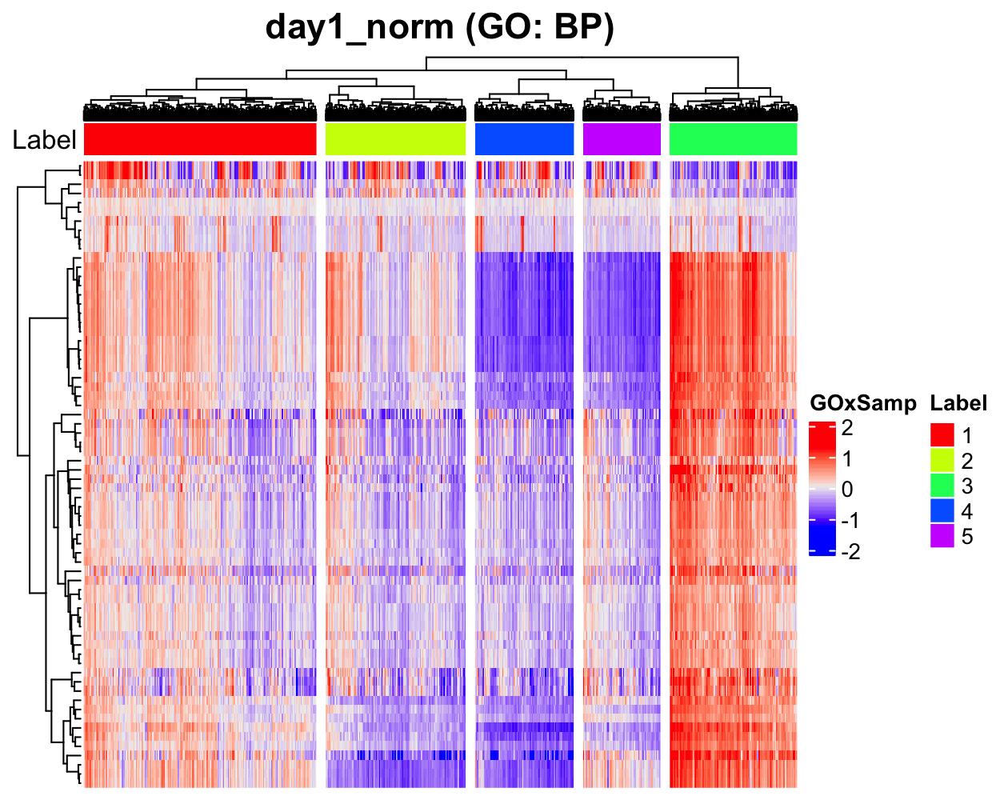
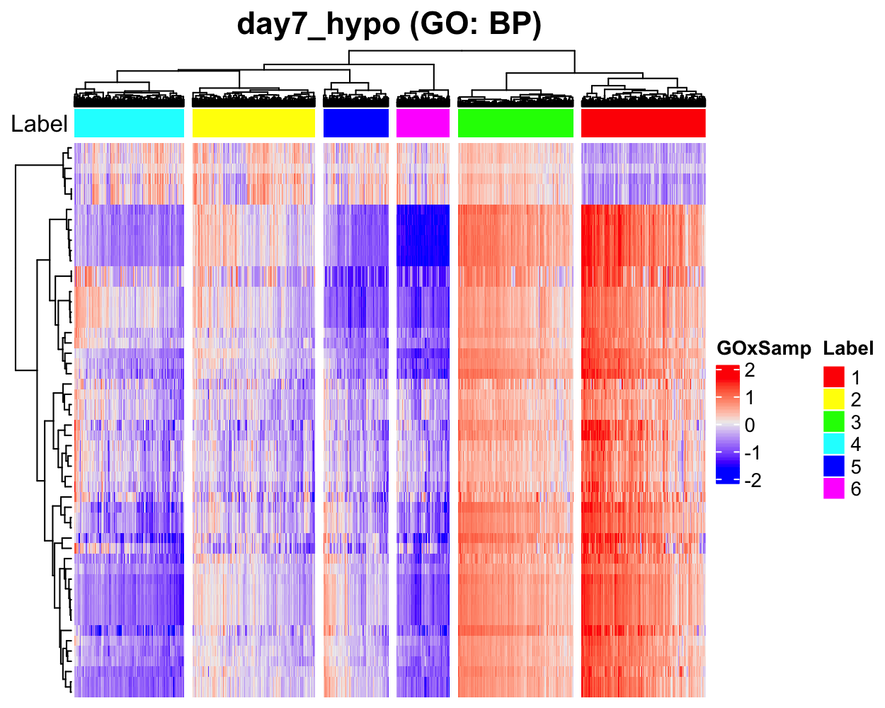

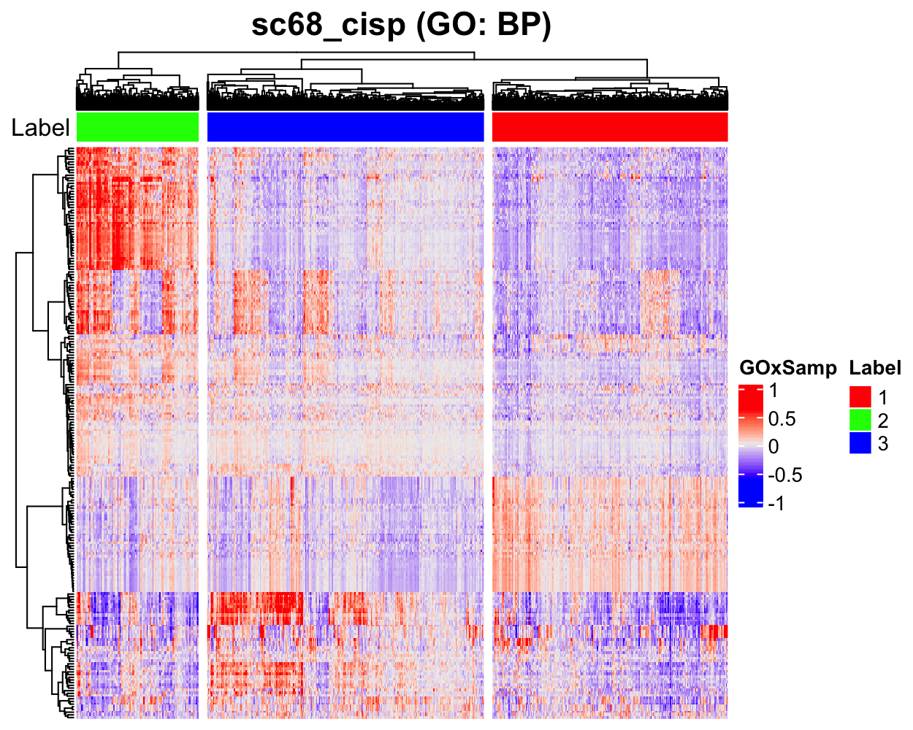


```{r, eval = FALSE}
# ----------------------------------------
# For `day1_norm`
# ----------------------------------------
p <- plot_tsne_sign(obj = day1_norm, data_type = "GO", category = "BP",
                    algo_name = "seuratFindClusters",
                    theta = NULL, phi = NULL,
                    title = "day1_norm (GO: BP)", title_size = 16,
                    xlabel = "tSNE_1", ylabel = "tSNE_2", zlabel = NULL,
                    default_color = FALSE)
filename <- "figures/figure_01_0231.png"
ggsave(file = filename, plot = p, dpi = 250, width = 4.9, height = 4)
```

```{r, eval = FALSE, echo = FALSE, results = "hide"}
# ----------------------------------------
# For `day7_hypo`
# ----------------------------------------
p <- plot_tsne_sign(obj = day7_hypo, data_type = "GO", category = "BP",
                    algo_name = "seuratFindClusters",
                    theta = NULL, phi = NULL,
                    title = "day7_hypo (GO: BP)", title_size = 16,
                    xlabel = "tSNE_1", ylabel = "tSNE_2", zlabel = NULL,
                    default_color = FALSE)
filename <- "figures/figure_02_0231.png"
ggsave(file = filename, plot = p, dpi = 250, width = 4.9, height = 4)
# ----------------------------------------
# For `sc68_vehi`
# ----------------------------------------
p <- plot_tsne_sign(obj = sc68_vehi, data_type = "GO", category = "BP",
                    algo_name = "seuratFindClusters",
                    theta = NULL, phi = NULL,
                    title = "sc68_vehi (GO: BP)", title_size = 16,
                    xlabel = "tSNE_1", ylabel = "tSNE_2", zlabel = NULL,
                    default_color = FALSE)
filename <- "figures/figure_03_0231.png"
ggsave(file = filename, plot = p, dpi = 250, width = 4.9, height = 4)
# ----------------------------------------
# For `sc68_cisp`
# ----------------------------------------
filename <- "figures/figure_04_0231.png"
png(file = filename, height = 1200, width = 1200, res = 300)
plot_DiffusionMap_sign(obj = sc68_cisp, data_type = "GO", category = "BP",
                       algo_name = "merlot",
                       dims = 1:3, theta = 0, phi = 30,
                       title = "sc68_cisp (GO: BP)", title_size = 1.2,
                       xlabel = "DC_1", ylabel = "DC_2", zlabel = "DC_3",
                       default_color = FALSE)
dev.off()
# ----------------------------------------
# For `pbmc_4000`
# ----------------------------------------
p <- plot_tsne_sign(obj = pbmc_4000, data_type = "GO", category = "BP",
                    algo_name = "seuratFindClusters",
                    theta = NULL, phi = NULL,
                    title = "pbmc_4000 (GO: BP)", title_size = 16,
                    xlabel = "tSNE_1", ylabel = "tSNE_2", zlabel = NULL,
                    default_color = FALSE)
filename <- "figures/figure_05_0231.png"
ggsave(file = filename, plot = p, dpi = 250, width = 4.9, height = 4)
# ----------------------------------------
# For `pbmc_6000`
# ----------------------------------------
p <- plot_tsne_sign(obj = pbmc_6000, data_type = "GO", category = "BP",
                    algo_name = "seuratFindClusters",
                    theta = NULL, phi = NULL,
                    title = "pbmc_6000 (GO: BP)", title_size = 16,
                    xlabel = "tSNE_1", ylabel = "tSNE_2", zlabel = NULL,
                    default_color = FALSE)
filename <- "figures/figure_06_0231.png"
ggsave(file = filename, plot = p, dpi = 250, width = 4.9, height = 4)
```

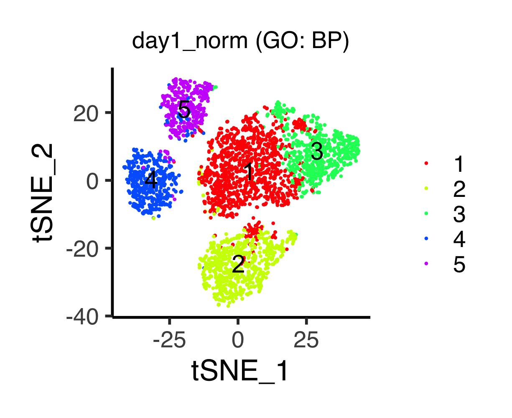
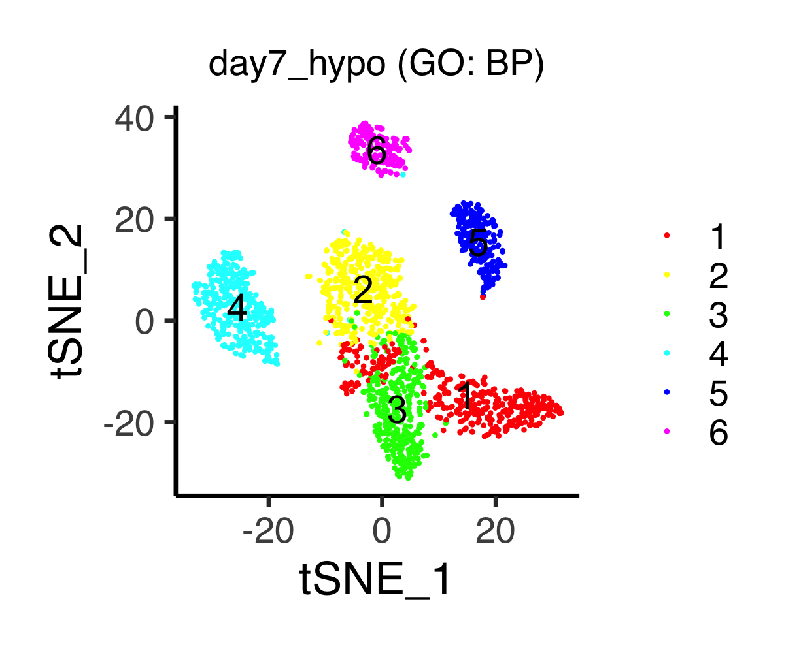

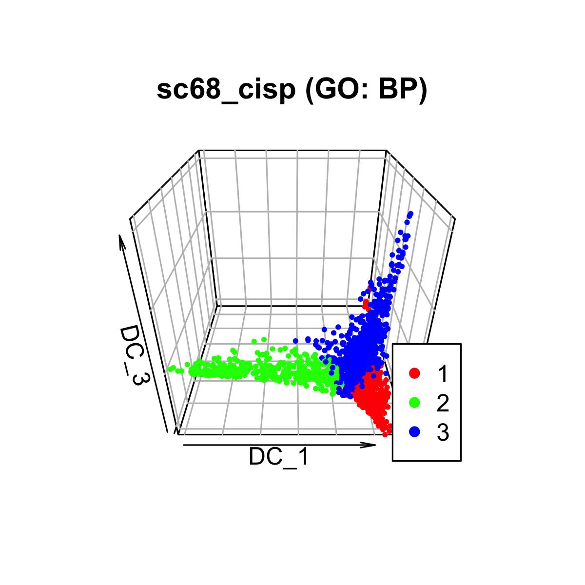
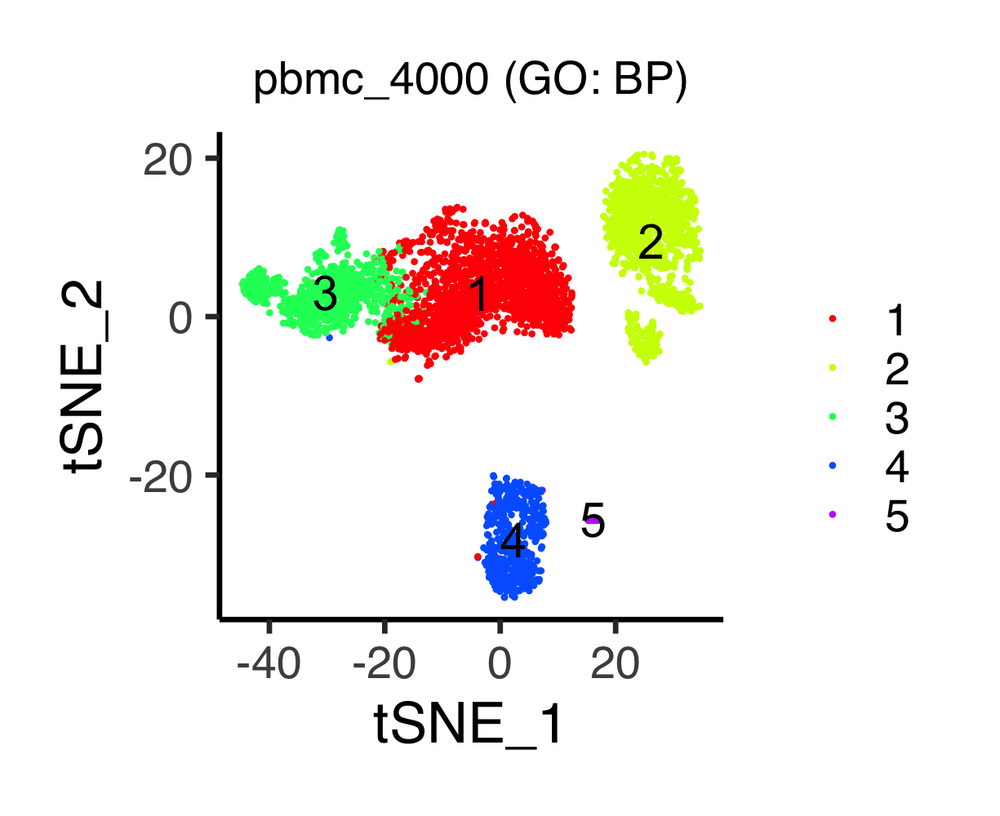


The following command shows the number of cells per cluster visualized
using bar graph.
```{r, eval = FALSE}
# ----------------------------------------
# For `day1_norm`
# ----------------------------------------
p <- plot_bargraph_sign(obj = day1_norm, data_type = "GO", category = "BP",
                        algo_name = "seuratFindClusters",
                        title = "day1_norm", title_size = 20,
                        xlabel = "Label (GO: BP)",
                        ylabel = "Number of samples", ymax = 1500)
filename <- "figures/figure_01_0235.png"
ggsave(file = filename, plot = p, dpi = 200, width = 4.3, height = 4)
```

```{r, eval = FALSE, echo = FALSE, results = "hide"}
# ----------------------------------------
# For `day7_hypo`
# ----------------------------------------
p <- plot_bargraph_sign(obj = day7_hypo, data_type = "GO", category = "BP",
                        algo_name = "seuratFindClusters",
                        title = "day7_hypo", title_size = 20,
                        xlabel = "Label (GO: BP)",
                        ylabel = "Number of samples", ymax = 500)
filename <- "figures/figure_02_0235.png"
ggsave(file = filename, plot = p, dpi = 200, width = 4.3, height = 4)
# ----------------------------------------
# For `sc68_vehi`
# ----------------------------------------
p <- plot_bargraph_sign(obj = sc68_vehi, data_type = "GO", category = "BP",
                        algo_name = "seuratFindClusters",
                        title = "sc68_vehi", title_size = 20,
                        xlabel = "Label (GO: BP)",
                        ylabel = "Number of samples", ymax = 4000)
filename <- "figures/figure_03_0235.png"
ggsave(file = filename, plot = p, dpi = 200, width = 4.3, height = 4)
# ----------------------------------------
# For `sc68_cisp`
# ----------------------------------------
p <- plot_bargraph_sign(obj = sc68_cisp, data_type = "GO", category = "BP",
                        algo_name = "merlot",
                        title = "sc68_cisp", title_size = 20,
                        xlabel = "Label (GO: BP)",
                        ylabel = "Number of samples", ymax = 1500)
filename <- "figures/figure_04_0235.png"
ggsave(file = filename, plot = p, dpi = 200, width = 4.3, height = 4)
# ----------------------------------------
# For `pbmc_4000`
# ----------------------------------------
p <- plot_bargraph_sign(obj = pbmc_4000, data_type = "GO", category = "BP",
                        algo_name = "seuratFindClusters",
                        title = "pbmc_4000", title_size = 20,
                        xlabel = "Label (GO: BP)",
                        ylabel = "Number of samples", ymax = 2000)
filename <- "figures/figure_05_0235.png"
ggsave(file = filename, plot = p, dpi = 200, width = 4.3, height = 4)
# ----------------------------------------
# For `pbmc_6000`
# ----------------------------------------
p <- plot_bargraph_sign(obj = pbmc_6000, data_type = "GO", category = "BP",
                        algo_name = "seuratFindClusters",
                        title = "pbmc_6000", title_size = 20,
                        xlabel = "Label (GO: BP)",
                        ylabel = "Number of samples", ymax = 2500)
filename <- "figures/figure_06_0235.png"
ggsave(file = filename, plot = p, dpi = 200, width = 4.3, height = 4)
```

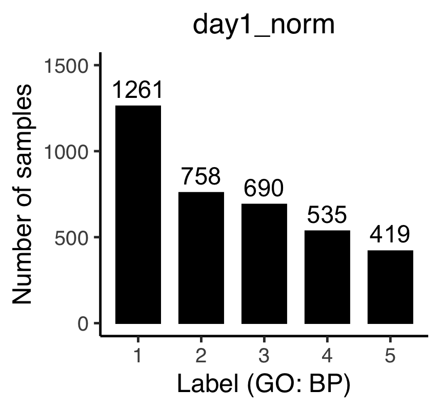


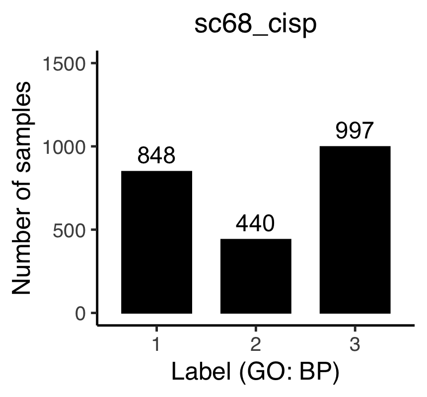
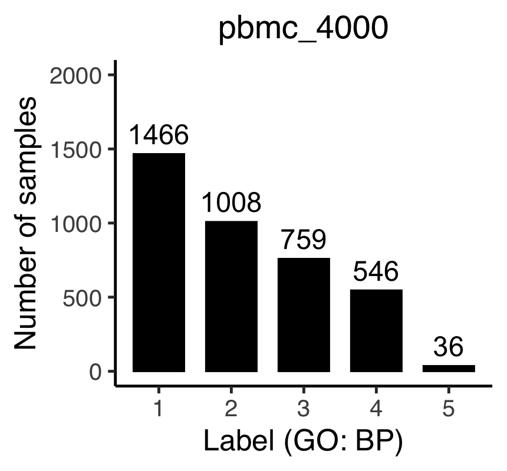


## Significant signs
In this subsection, signs of which the sign scores are specifically upregulated
in some cluster are detected by computing the separation indices.
The concept of significant sign is similar to that of differentially expressed
genes (DEGs).

Load the objects.
```{r, eval = FALSE}
source("R/plot.R")
source("R/function_sign.R")
day1_norm <- readRDS(file = "backup/01_203_day1_norm_classification_GO.rds")
day7_hypo <- readRDS(file = "backup/02_203_day7_hypo_classification_GO.rds")
sc68_vehi <- readRDS(file = "backup/03_203_sc68_vehi_classification_GO.rds")
sc68_cisp <- readRDS(file = "backup/04_203_sc68_cisp_classification_GO.rds")
pbmc_4000 <- readRDS(file = "backup/05_203_pbmc_4000_classification_GO.rds")
pbmc_6000 <- readRDS(file = "backup/06_203_pbmc_6000_classification_GO.rds")
```

The following function `auto_find_marker_sign()` computes separation indices
(i.e., non-parametric measure of degree in separation of two random variable
sets) of signs of interest for each subpopulation.
The arguments are `obj`, `data_type_for_label` (`data_type` used for sample
classification), `category_for_label` (`category` used for sample
classification), `algo_name_for_label` (`algo_name` used for sample
classification), `data_type_for_expr` (`data_type` of interest for
investigating gene expression), `category_for_expr` (`category` of interest for
investigating gene expression), and `label_1` and `label_2` (cluster labels to
be compared: both integer and vector forms are accepted).
This function helps users find positive and negative marker signs of `label_1`
with the positive and negative values of the indices, respectively.
```{r, eval = FALSE}
day1_norm <- auto_find_marker_sign(obj = day1_norm, data_type_for_label = "GO",
                                   category_for_label = "BP",
                                   algo_name_for_label = "seuratFindClusters",
                                   data_type_for_expr = "GO",
                                   category_for_expr = "BP")
day7_hypo <- auto_find_marker_sign(obj = day7_hypo, data_type_for_label = "GO",
                                   category_for_label = "BP",
                                   algo_name_for_label = "seuratFindClusters",
                                   data_type_for_expr = "GO",
                                   category_for_expr = "BP")
sc68_vehi <- auto_find_marker_sign(obj = sc68_vehi, data_type_for_label = "GO",
                                   category_for_label = "BP",
                                   algo_name_for_label = "seuratFindClusters",
                                   data_type_for_expr = "GO",
                                   category_for_expr = "BP")
sc68_cisp <- auto_find_marker_sign(obj = sc68_cisp, data_type_for_label = "GO",
                                   category_for_label = "BP",
                                   algo_name_for_label = "merlot",
                                   data_type_for_expr = "GO",
                                   category_for_expr = "BP")
pbmc_4000 <- auto_find_marker_sign(obj = pbmc_4000, data_type_for_label = "GO",
                                   category_for_label = "BP",
                                   algo_name_for_label = "seuratFindClusters",
                                   data_type_for_expr = "GO",
                                   category_for_expr = "BP")
pbmc_6000 <- auto_find_marker_sign(obj = pbmc_6000, data_type_for_label = "GO",
                                   category_for_label = "BP",
                                   algo_name_for_label = "seuratFindClusters",
                                   data_type_for_expr = "GO",
                                   category_for_expr = "BP")
```
The results are stored in
`obj[["marker"]][["GO"]][["BP"]][["Label_GO_BP_1_vs_2/3"]]`,
`obj[["marker"]][["GO"]][["BP"]][["Label_GO_BP_2_vs_1/3"]]`,
`obj[["marker"]][["GO"]][["BP"]][["Label_GO_BP_3_vs_1/2"]]`, and
`obj[["marker"]][["GO"]][["BP"]][["all"]]`.
Here `sep_I` stands for the separation index of the sign, which quantifies the
extent of separation between two different sets of random variables.
Note that `auto_find_marker_sign()` computes `sep_I` for the given group versus
all other cells.
```{r, eval = FALSE}
datatable(day1_norm[["marker"]][["GO"]][["BP"]][["all"]], rownames = FALSE)
datatable(day7_hypo[["marker"]][["GO"]][["BP"]][["all"]], rownames = FALSE)
datatable(sc68_vehi[["marker"]][["GO"]][["BP"]][["all"]], rownames = FALSE)
datatable(sc68_cisp[["marker"]][["GO"]][["BP"]][["all"]], rownames = FALSE)
datatable(pbmc_4000[["marker"]][["GO"]][["BP"]][["all"]], rownames = FALSE)
datatable(pbmc_6000[["marker"]][["GO"]][["BP"]][["all"]], rownames = FALSE)
```

* `day1_norm`

<iframe src="figures/day1_norm_GO_BP.html" style="width:100%; height:300px;"></iframe>

<br><br><br><br><br><br><br><br><br><br>

The following function `plot_violin_signScore()` shows the distribution of
expression levels of a given sign across subpopulations by violin plots.
The arguments are `obj`, `sign_name`, `data_type_for_label` (`data_type` used
for sample classification), `category_for_label` (`category` used for sample
classification), `algo_name_for_label` (`algo_name` used for sample
classification), `data_type_for_expr` (`data_type` of interest for investigating
gene expression), and `category_for_expr` (`category` of interest for
investigating gene expression).
```{r, eval = FALSE}
# ----------------------------------------
# For `day1_norm`
# ----------------------------------------
p <- plot_violin_signScore(
  obj = day1_norm, sign_name = "GO:0097191_S",
  data_type_for_label = "GO", category_for_label = "BP",
  algo_name_for_label = "seuratFindClusters",
  data_type_for_expr = "GO", category_for_expr = "BP",
  title = "GO:0097191_S\nExtrinsic apoptotic signaling..\n(KRT18/LGALS3/..)",
  title_size = 16, default_color = FALSE)
filename <- "figures/figure_01_0240.png"
ggsave(file = filename, plot = p, dpi = 200, width = 4, height = 4)
```

```{r, eval = FALSE, echo = FALSE, results = "hide"}
# ----------------------------------------
# For `day1_norm`
# ----------------------------------------
p <- plot_violin_signScore(
  obj = day1_norm, sign_name = "GO:0006869_S",
  data_type_for_label = "GO", category_for_label = "BP",
  algo_name_for_label = "seuratFindClusters",
  data_type_for_expr = "GO", category_for_expr = "BP",
  title = "GO:0006869_S\nLipid transport\n(ANXA1/ANXA2/..)",
  title_size = 16, default_color = FALSE)
filename <- "figures/figure_01_0241.png"
ggsave(file = filename, plot = p, dpi = 200, width = 4, height = 4)
# ----------------------------------------
# For `day7_hypo`
# ----------------------------------------
p <- plot_violin_signScore(
  obj = day7_hypo, sign_name = "GO:0009725_V",
  data_type_for_label = "GO", category_for_label = "BP",
  algo_name_for_label = "seuratFindClusters",
  data_type_for_expr = "GO", category_for_expr = "BP",
  title = "GO:0009725_V\nResponse to hormone \n(SST/IGFBP2/..)",
  title_size = 16, default_color = FALSE)
filename <- "figures/figure_02_0240.png"
ggsave(file = filename, plot = p, dpi = 200, width = 4, height = 4)

p <- plot_violin_signScore(
  obj = day7_hypo, sign_name = "GO:0097191_S",
  data_type_for_label = "GO", category_for_label = "BP",
  algo_name_for_label = "seuratFindClusters",
  data_type_for_expr = "GO", category_for_expr = "BP",
  title = "GO:0097191_S\nExtrinsic apoptotic signaling..\n(KRT18/LGALS3/..)",
  title_size = 16, default_color = FALSE)
filename <- "figures/figure_02_0241.png"
ggsave(file = filename, plot = p, dpi = 200, width = 4, height = 4)

p <- plot_violin_signScore(
  obj = day7_hypo, sign_name = "GO:0006869_S",
  data_type_for_label = "GO", category_for_label = "BP",
  algo_name_for_label = "seuratFindClusters",
  data_type_for_expr = "GO", category_for_expr = "BP",
  title = "GO:0006869_S\nLipid transport\n(ANXA1/ANXA2/..)",
  title_size = 16, default_color = FALSE)
filename <- "figures/figure_02_0242.png"
ggsave(file = filename, plot = p, dpi = 200, width = 4, height = 4)
# ----------------------------------------
# For `sc68_vehi`
# ----------------------------------------
p <- plot_violin_signScore(
  obj = sc68_vehi, sign_name = "GO:0140013_S",
  data_type_for_label = "GO", category_for_label = "BP",
  algo_name_for_label = "seuratFindClusters",
  data_type_for_expr = "GO", category_for_expr = "BP",
  title = "GO:0140013_S\nMeiotic nuclear division\n(CDC20/PTTG1/..)",
  title_size = 16, default_color = FALSE)
filename <- "figures/figure_03_0240.png"
ggsave(file = filename, plot = p, dpi = 200, width = 4, height = 4)
# ----------------------------------------
# For `sc68_cisp`
# ----------------------------------------
p <- plot_violin_signScore(
  obj = sc68_cisp, sign_name = "GO:0006886_S",
  data_type_for_label = "GO", category_for_label = "BP",
  algo_name_for_label = "merlot",
  data_type_for_expr = "GO", category_for_expr = "BP",
  title = "GO:0006886_S\nIntracellular protein transport\n(RPL22/RPL11/..)",
  title_size = 16, default_color = FALSE)
filename <- "figures/figure_04_0240.png"
ggsave(file = filename, plot = p, dpi = 200, width = 4, height = 4)

p <- plot_violin_signScore(
  obj = sc68_cisp, sign_name = "GO:0000280_S",
  data_type_for_label = "GO", category_for_label = "BP",
  algo_name_for_label = "merlot",
  data_type_for_expr = "GO", category_for_expr = "BP",
  title = "GO:0000280_S\nNuclear division\n(CDC20/KIF2C/..)",
  title_size = 16, default_color = FALSE)
filename <- "figures/figure_04_0241.png"
ggsave(file = filename, plot = p, dpi = 200, width = 4, height = 4)

p <- plot_violin_signScore(
  obj = sc68_cisp, sign_name = "GO:0038093_S",
  data_type_for_label = "GO", category_for_label = "BP",
  algo_name_for_label = "merlot",
  data_type_for_expr = "GO", category_for_expr = "BP",
  title = "GO:0038093_S\nFc receptor signaling pathway\n(JUN/FOS/..)",
  title_size = 16, default_color = FALSE)
filename <- "figures/figure_04_0242.png"
ggsave(file = filename, plot = p, dpi = 200, width = 4, height = 4)
# ----------------------------------------
# For `pbmc_4000`
# ----------------------------------------
p <- plot_violin_signScore(
  obj = pbmc_4000, sign_name = "GO:0051092_S",
  data_type_for_label = "GO", category_for_label = "BP",
  algo_name_for_label = "seuratFindClusters",
  data_type_for_expr = "GO", category_for_expr = "BP",
  title = "GO:0051092_S\nPositive regulation of NF-kappa..\n(NPM1/RPS3/..)",
  title_size = 16, default_color = FALSE)
filename <- "figures/figure_05_0240.png"
ggsave(file = filename, plot = p, dpi = 200, width = 4, height = 4)

p <- plot_violin_signScore(
  obj = pbmc_4000, sign_name = "GO:0051092_V",
  data_type_for_label = "GO", category_for_label = "BP",
  algo_name_for_label = "seuratFindClusters",
  data_type_for_expr = "GO", category_for_expr = "BP",
  title = "GO:0051092_V\nPositive regulation of NF-kappa..\n(S100A9/CD36/..)",
  title_size = 16, default_color = FALSE)
filename <- "figures/figure_05_0241.png"
ggsave(file = filename, plot = p, dpi = 200, width = 4, height = 4)

p <- plot_violin_signScore(
  obj = pbmc_4000, sign_name = "GO:0001914_S",
  data_type_for_label = "GO", category_for_label = "BP",
  algo_name_for_label = "seuratFindClusters",
  data_type_for_expr = "GO", category_for_expr = "BP",
  title = "GO:0001914_S\nRegulation of T cell mediated..\n(PTPRC/IL7R/..)",
  title_size = 16, default_color = FALSE)
filename <- "figures/figure_05_0242.png"
ggsave(file = filename, plot = p, dpi = 200, width = 4, height = 4)

p <- plot_violin_signScore(
  obj = pbmc_4000, sign_name = "GO:0050853_V",
  data_type_for_label = "GO", category_for_label = "BP",
  algo_name_for_label = "seuratFindClusters",
  data_type_for_expr = "GO", category_for_expr = "BP",
  title = "GO:0050853_V\nB cell differentiation\n(CD19/CD79B/..)",
  title_size = 16, default_color = FALSE)
filename <- "figures/figure_05_0243.png"
ggsave(file = filename, plot = p, dpi = 200, width = 4, height = 4)

p <- plot_violin_signScore(
  obj = pbmc_4000, sign_name = "GO:0002755_V",
  data_type_for_label = "GO", category_for_label = "BP",
  algo_name_for_label = "seuratFindClusters",
  data_type_for_expr = "GO", category_for_expr = "BP",
  title = "GO:0002755_V\nMyD88-dependent toll-like..\n(UBC/UBB/..)",
  title_size = 16, default_color = FALSE)
filename <- "figures/figure_05_0244.png"
ggsave(file = filename, plot = p, dpi = 200, width = 4, height = 4)
# ----------------------------------------
# For `pbmc_6000`
# ----------------------------------------
p <- plot_violin_signScore(
  obj = pbmc_6000, sign_name = "GO:0050852_V",
  data_type_for_label = "GO", category_for_label = "BP",
  algo_name_for_label = "seuratFindClusters",
  data_type_for_expr = "GO", category_for_expr = "BP",
  title = "GO:0050852_V\nT cell receptor signaling..\n(CD3E/CD247/..)",
  title_size = 16, default_color = FALSE)
filename <- "figures/figure_06_0240.png"
ggsave(file = filename, plot = p, dpi = 200, width = 4, height = 4)

p <- plot_violin_signScore(
  obj = pbmc_6000, sign_name = "GO:0030101_S",
  data_type_for_label = "GO", category_for_label = "BP",
  algo_name_for_label = "seuratFindClusters",
  data_type_for_expr = "GO", category_for_expr = "BP",
  title = "GO:0030101_S\nNatural killer cell activation\n(FGR/ITGB2/..)",
  title_size = 16, default_color = FALSE)
filename <- "figures/figure_06_0241.png"
ggsave(file = filename, plot = p, dpi = 200, width = 4, height = 4)

p <- plot_violin_signScore(
  obj = pbmc_6000, sign_name = "GO:0030224_S",
  data_type_for_label = "GO", category_for_label = "BP",
  algo_name_for_label = "seuratFindClusters",
  data_type_for_expr = "GO", category_for_expr = "BP",
  title = "GO:0030224_S\nMonocyte differentiation\n(MEF2C/CD74/..)",
  title_size = 16, default_color = FALSE)
filename <- "figures/figure_06_0242.png"
ggsave(file = filename, plot = p, dpi = 200, width = 4, height = 4)

p <- plot_violin_signScore(
  obj = pbmc_6000, sign_name = "GO:0002577_V",
  data_type_for_label = "GO", category_for_label = "BP",
  algo_name_for_label = "seuratFindClusters",
  data_type_for_expr = "GO", category_for_expr = "BP",
  title = paste("GO:0002577_V\n",
                "Regulation of antigen process..\n(HLA-DOB/CCR7/..)",
                sep = ""),
  title_size = 16, default_color = FALSE)
filename <- "figures/figure_06_0243.png"
ggsave(file = filename, plot = p, dpi = 200, width = 4, height = 4)
```

* `day1_norm`

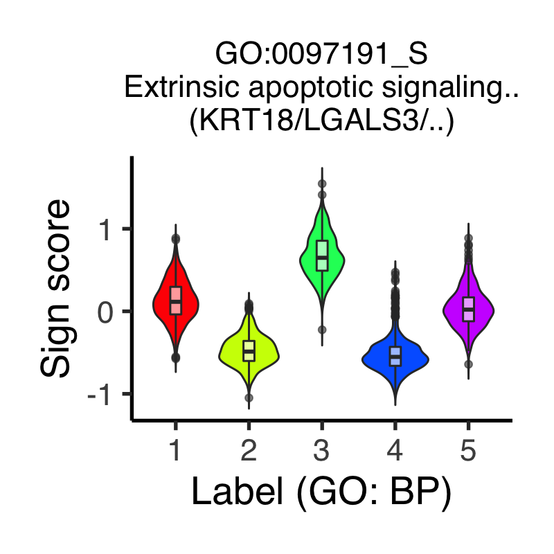


* `day7_hypo`


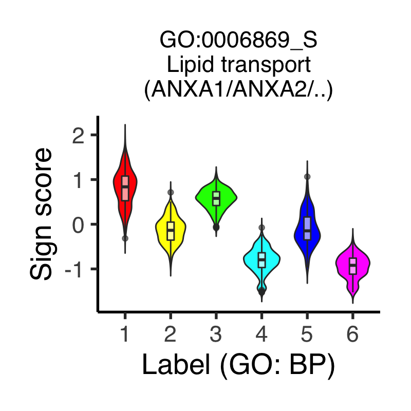

* `sc68_vehi`


* `sc68_cisp`


* `pbmc_4000`


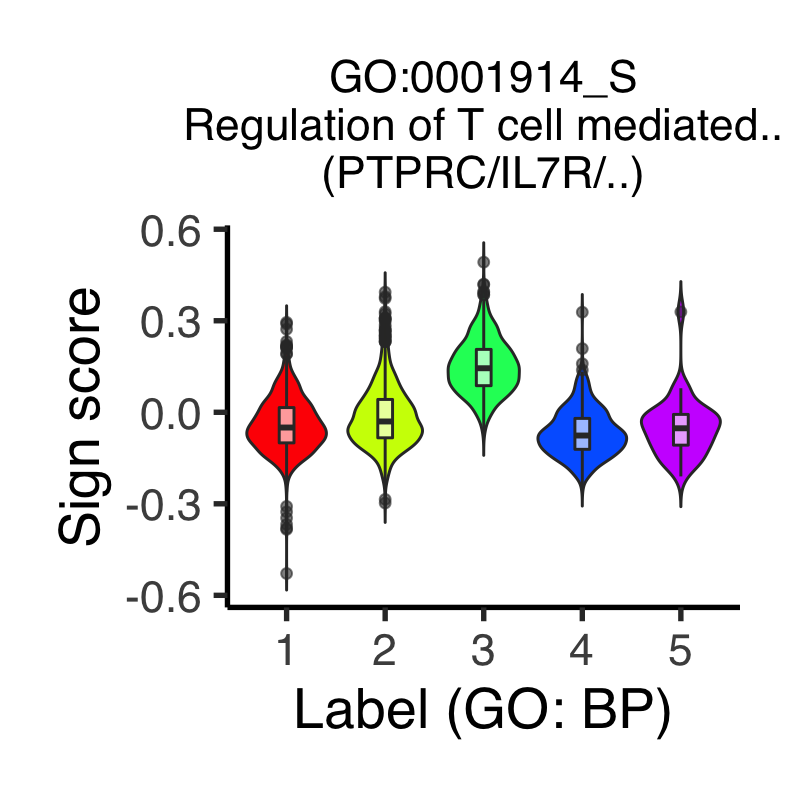

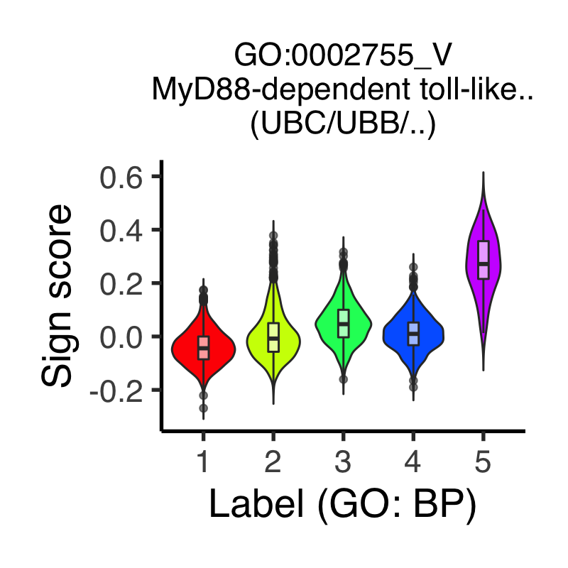

* `pbmc_6000`

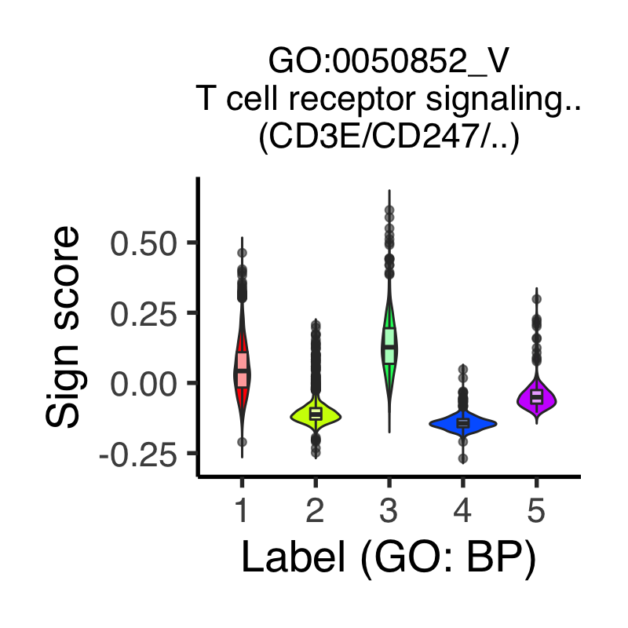
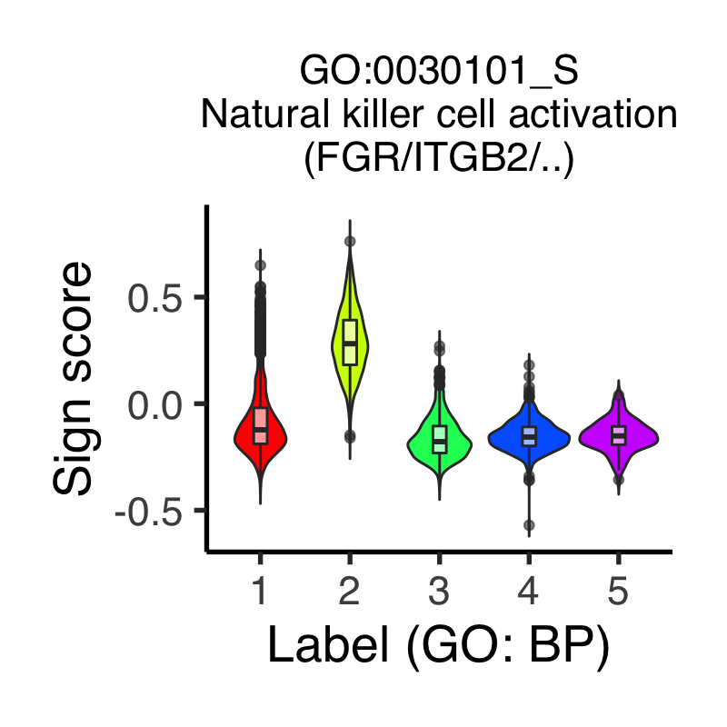
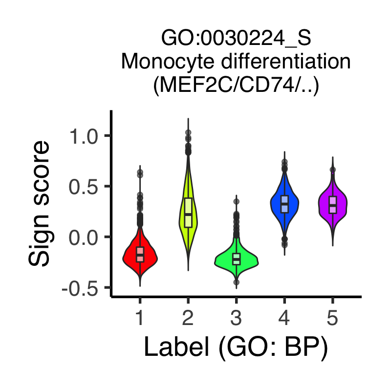


The functions `plot_tsne_signScore()`, `plot_umap_signScore()`, and
`plot_dmap_signScore()` show the sign score of a given sign on the t-SNE,
UMAP, and diffusion map spaces, respectively.
```{r, eval = FALSE}
# ----------------------------------------
# For `day1_norm`
# ----------------------------------------
p <- plot_tsne_signScore(
  obj = day1_norm, sign_name = "GO:0097191_S",
  data_type_for_tsne = "GO", category_for_tsne = "BP",
  data_type_for_expr = "GO", category_for_expr = "BP",
  theta = NULL, phi = NULL,
  title = "GO:0097191_S\nExtrinsic apoptotic signaling..\n(KRT18/LGALS3/..)",
  title_size = 16, label_name = "Sign score",
  xlabel = "tSNE_1", ylabel = "tSNE_2", zlabel = NULL)
filename <- "figures/figure_01_0250.png"
ggsave(file = filename, plot = p, dpi = 300, width = 5.6, height = 4.4)
```

* `day1_norm`


The following function `plot_pseudotime_vs_signscore()` plots expression
levels versus pseudotime for a given sign, in which filled circles, bold lines,
and the shade regions stand for the expression values of samples, mean
expression levels, and standard deviations (this value is 0 if there are less
than three samples), respectively.
The arguments `data_type_for_tree` and `category_for_tree` are the data type
and category used for the branch-based classification of samples (i.e., the
labels assigned to the branches), while `data_type_for_expr` and
`category_for_expr` for the expression levels of signs of interest.
```{r, eval = FALSE}
# ----------------------------------------
# For `sc68_cisp`
# ----------------------------------------
p <- plot_pseudotime_vs_signscore(
  obj = sc68_cisp, sign_name = "GO:0016071_S",
  data_type_for_tree = "GO", category_for_tree = "BP",
  data_type_for_expr = "GO", category_for_expr = "BP",
  title = "GO:0016071_S\nmRNA metabolic process\n(HNRNPA1/HNRNPD/..)",
  title_size = 22, label_name = "Label\n(GO: BP)",
  xlabel = "Pseudotime (GO: BP)", ylabel = "Sign score")
filename <- "figures/figure_04_0270.png"
ggsave(file = filename, plot = p, dpi = 200, width = 7.5, height = 5)
```


Save the objects.
```{r, eval = FALSE}
saveRDS(day1_norm, file = "backup/01_204_day1_norm_DES_GO.rds")
saveRDS(day7_hypo, file = "backup/02_204_day7_hypo_DES_GO.rds")
saveRDS(sc68_vehi, file = "backup/03_204_sc68_vehi_DES_GO.rds")
saveRDS(sc68_cisp, file = "backup/04_204_sc68_cisp_DES_GO.rds")
saveRDS(pbmc_4000, file = "backup/05_204_pbmc_4000_DES_GO.rds")
saveRDS(pbmc_6000, file = "backup/06_204_pbmc_6000_DES_GO.rds")
```

Load the objects.
```{r, eval = FALSE}
day1_norm <- readRDS(file = "backup/01_204_day1_norm_DES_GO.rds")
day7_hypo <- readRDS(file = "backup/02_204_day7_hypo_DES_GO.rds")
sc68_vehi <- readRDS(file = "backup/03_204_sc68_vehi_DES_GO.rds")
sc68_cisp <- readRDS(file = "backup/04_204_sc68_cisp_DES_GO.rds")
pbmc_4000 <- readRDS(file = "backup/05_204_pbmc_4000_DES_GO.rds")
pbmc_6000 <- readRDS(file = "backup/06_204_pbmc_6000_DES_GO.rds")
```
