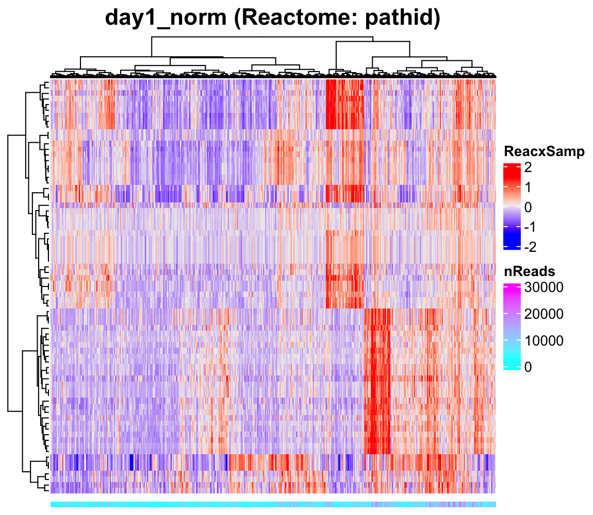
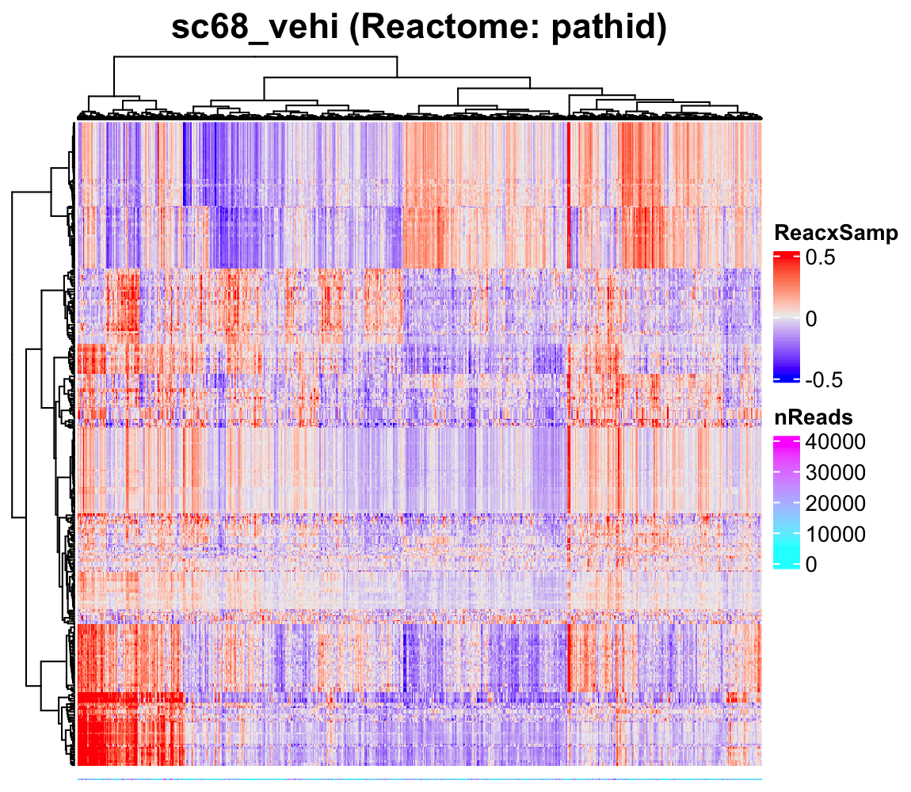
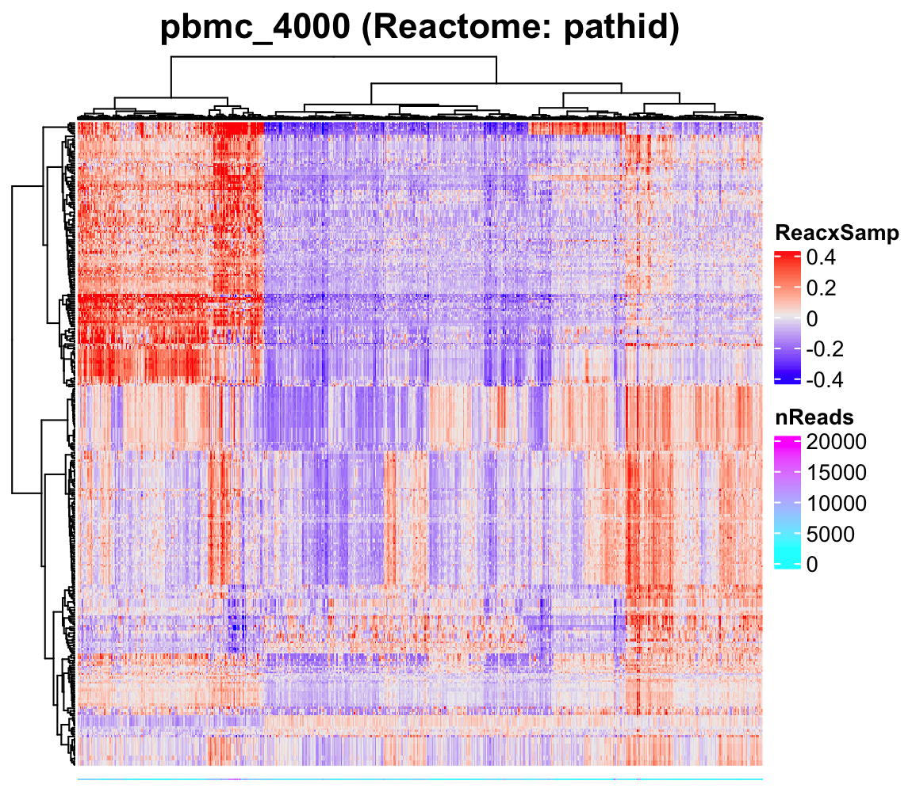
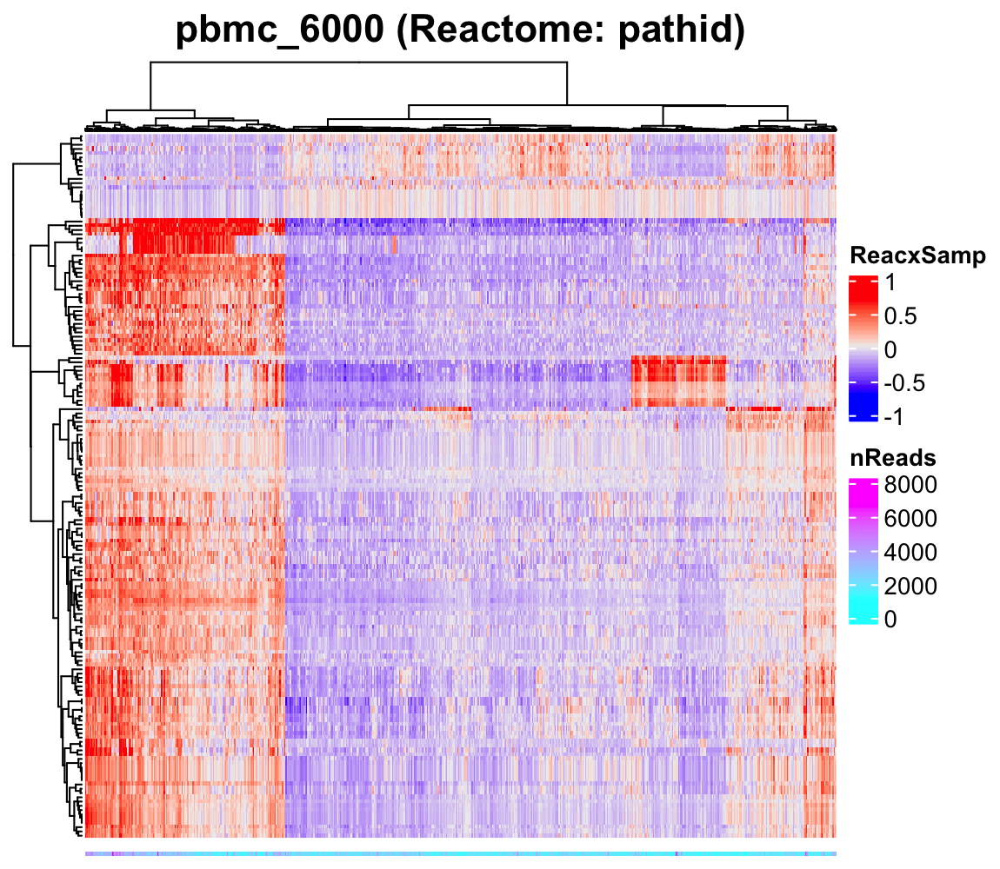
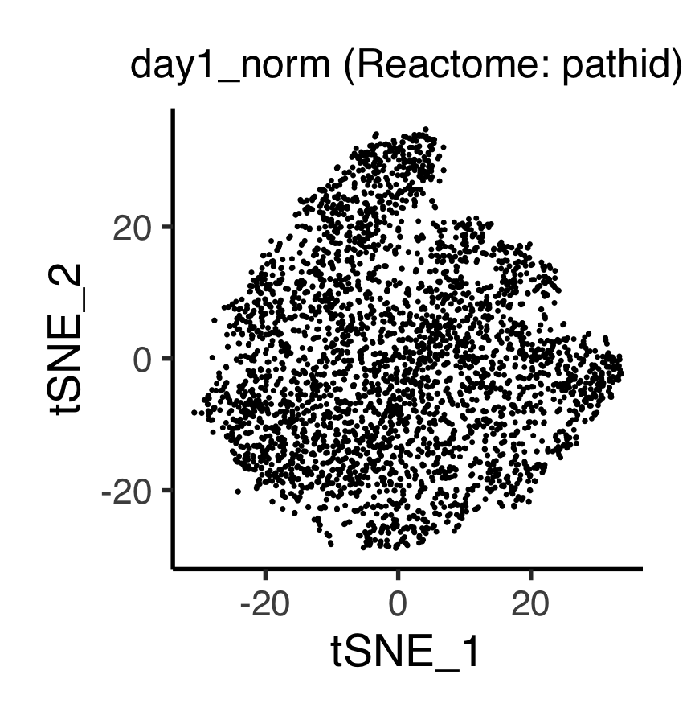
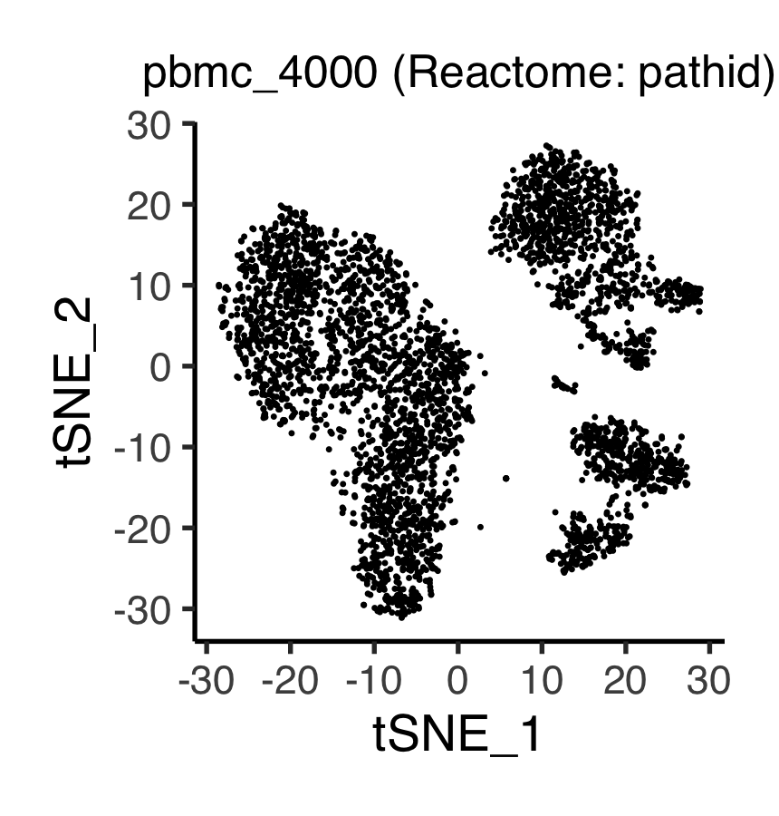
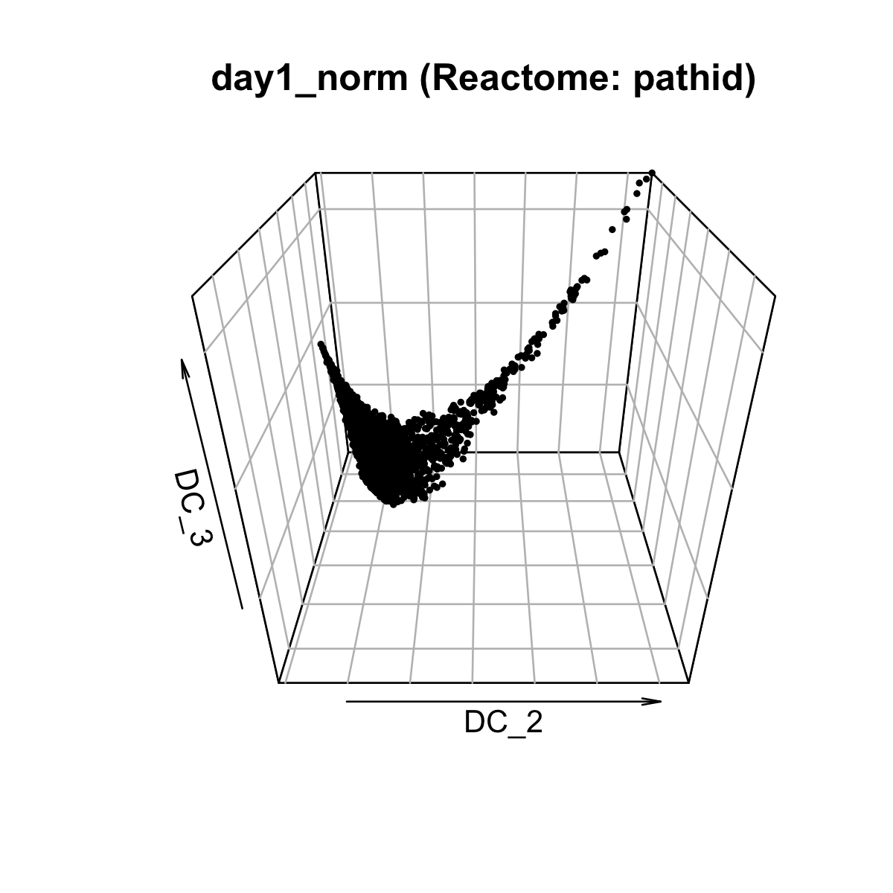
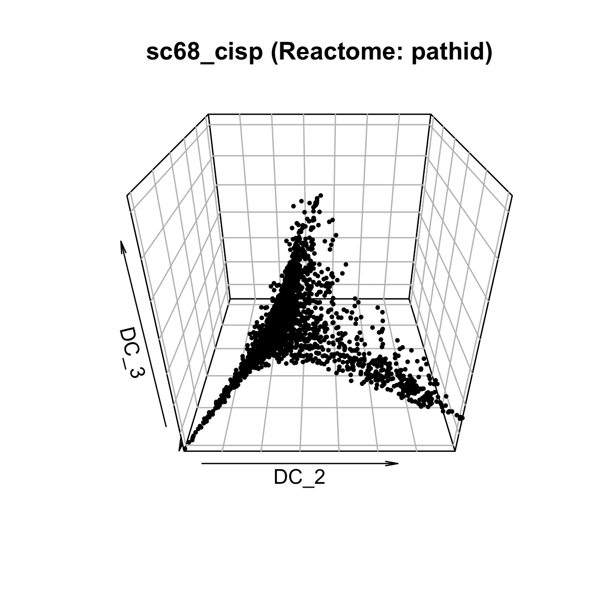
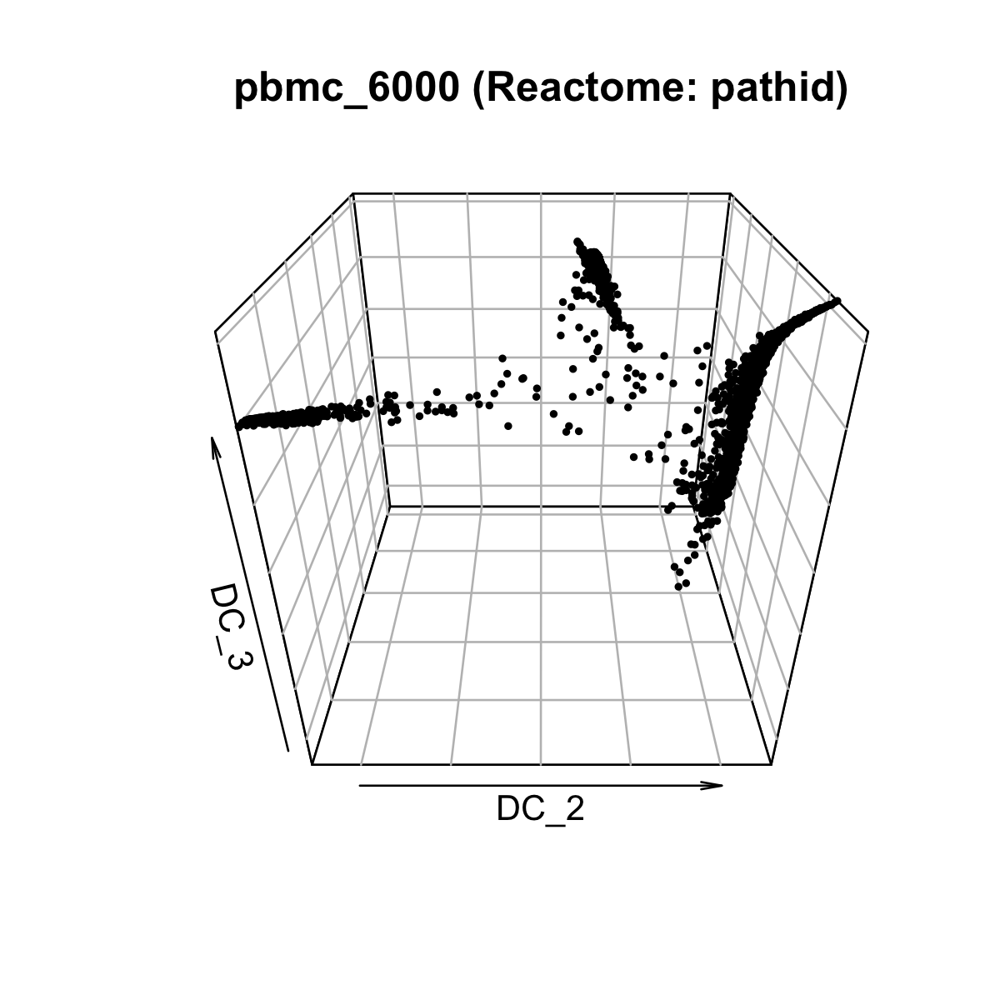

# ASURAT using Reactome (optional)
In this section, we apply ASURAT on cancer patient- and healthy donor-derived
single-cell transcriptomes.
ASURAT transforms a single-cell transcriptome to cell-type or functional spectra
by extracting the system of signs on each of the thousands of biological terms
and the associated gene sets obtained from public databases.
The resulting matrices termed sign-by-sample matrices (SSMs) can be supplied
to the subsequent unsupervised clusterings.


## Creating sign-by-sample matrices
Input the data.
```{r, eval = FALSE}
rm(list = ls())
source("R/plot.R")
source("R/function_sign.R")
tidy_Reactome <-
  readRDS(file = "data/2020_001_databases/20201213_tidy_Reactome_human.rds")

day1_norm <- readRDS(file = "backup/01_005_day1_norm_normalized.rds")
day7_hypo <- readRDS(file = "backup/02_005_day7_hypo_normalized.rds")
sc68_vehi <- readRDS(file = "backup/03_005_sc68_vehi_normalized.rds")
sc68_cisp <- readRDS(file = "backup/04_005_sc68_cisp_normalized.rds")
pbmc_4000 <- readRDS(file = "backup/05_005_pbmc_4000_normalized.rds")
pbmc_6000 <- readRDS(file = "backup/06_005_pbmc_6000_normalized.rds")

day1_norm_cor <- readRDS(file = "backup/01_006_day1_norm_correlation.rds")
day7_hypo_cor <- readRDS(file = "backup/02_006_day7_hypo_correlation.rds")
sc68_vehi_cor <- readRDS(file = "backup/03_006_sc68_vehi_correlation.rds")
sc68_cisp_cor <- readRDS(file = "backup/04_006_sc68_cisp_correlation.rds")
pbmc_4000_cor <- readRDS(file = "backup/05_006_pbmc_4000_correlation.rds")
pbmc_6000_cor <- readRDS(file = "backup/06_006_pbmc_6000_correlation.rds")
```

Input `tidy_KEGG` into the ASURAT objects.
```{r, eval = FALSE}
day1_norm[["sign"]][["Reactome"]] <- tidy_Reactome
day7_hypo[["sign"]][["Reactome"]] <- tidy_Reactome
sc68_vehi[["sign"]][["Reactome"]] <- tidy_Reactome
sc68_cisp[["sign"]][["Reactome"]] <- tidy_Reactome
pbmc_4000[["sign"]][["Reactome"]] <- tidy_Reactome
pbmc_6000[["sign"]][["Reactome"]] <- tidy_Reactome
```

The following function `do_quickQC_sign()` takes an intersection of genes
between user's data and `tidy_KEGG`, and then excludes the IDs including too few
or too many genes by setting thresholds `min_ngenes` (minimal number of genes
which must be greater than one) and `max_ngenes` (maximal number of genes
which must be greater than one).
```{r, eval = FALSE}
day1_norm <- do_quickQC_sign(obj = day1_norm, data_type = "Reactome",
                             min_ngenes = 2, max_ngenes = 1000)
day7_hypo <- do_quickQC_sign(obj = day7_hypo, data_type = "Reactome",
                             min_ngenes = 2, max_ngenes = 1000)
sc68_vehi <- do_quickQC_sign(obj = sc68_vehi, data_type = "Reactome",
                             min_ngenes = 2, max_ngenes = 1000)
sc68_cisp <- do_quickQC_sign(obj = sc68_cisp, data_type = "Reactome",
                             min_ngenes = 2, max_ngenes = 1000)
pbmc_4000 <- do_quickQC_sign(obj = pbmc_4000, data_type = "Reactome",
                             min_ngenes = 2, max_ngenes = 1000)
pbmc_6000 <- do_quickQC_sign(obj = pbmc_6000, data_type = "Reactome",
                             min_ngenes = 2, max_ngenes = 1000)
```
The computational results are stored in
`obj[["sign"]][["Reactome"]][["pathid"]]`.

The following function `separate_variables_sign()` separates genes annotated
with each biological description into three groups, i.e., strongly correlated
gene set (SCG), variably correlated gene set (VCG), and weakly correlated gene
set (WCG).
The arguments are `obj`, `obj_cor`, `data_type`, `method = "spearman"` (one of
the arguments input in `do_cor_variables()`), `th_posi`, and `th_nega`
(threshold values of positive and negative correlation coefficients,
respectively).

**Tips:**
This decomposition sometimes produces unexpected results.
In fact the smaller values of `th_posi` and `th_nega` do not always result in
the larger sizes of SCG and VCG.
Hence we recommend users to carefully turn the parameters, checking if the
signs of interest are included in the results.
```{r, eval = FALSE}
day1_norm_red <- separate_variables_sign(obj = day1_norm,
                                         obj_cor = day1_norm_cor,
                                         data_type = "Reactome",
                                         method = "spearman",
                                         th_posi = 0.20, th_nega = -0.20)
day7_hypo_red <- separate_variables_sign(obj = day7_hypo,
                                         obj_cor = day7_hypo_cor,
                                         data_type = "Reactome",
                                         method = "spearman",
                                         th_posi = 0.15, th_nega = -0.15)
sc68_vehi_red <- separate_variables_sign(obj = sc68_vehi,
                                         obj_cor = sc68_vehi_cor,
                                         data_type = "Reactome",
                                         method = "spearman",
                                         th_posi = 0.20, th_nega = -0.20)
sc68_cisp_red <- separate_variables_sign(obj = sc68_cisp,
                                         obj_cor = sc68_cisp_cor,
                                         data_type = "Reactome",
                                         method = "spearman",
                                         th_posi = 0.20, th_nega = -0.20)
pbmc_4000_red <- separate_variables_sign(obj = pbmc_4000,
                                         obj_cor = pbmc_4000_cor,
                                         data_type = "Reactome",
                                         method = "spearman",
                                         th_posi = 0.25, th_nega = -0.20)
pbmc_6000_red <- separate_variables_sign(obj = pbmc_6000,
                                         obj_cor = pbmc_6000_cor,
                                         data_type = "Reactome",
                                         method = "spearman",
                                         th_posi = 0.25, th_nega = -0.20)
```
The computational result is stored in `obj[["sign"]][["Reactome"]][["pathid"]]`.

The following function `select_sign()` selects the signs by a user-defined
criteria, which has been preset as follows:

1. sum of the number of genes in SCG and VCG is greater than or equal to
`min_cnt`, and
2. the number of genes in WCG is greater than or equal to `min_cnt_weak`
(the default value is 2).

Users can modify the programming code indicated by "User-defined criteria"
in the file `R/function_sign.R`.
Note that the signs having at most one gene will be removed when creating
sign-by-sample matrices.
For example, given a certain parent sign having SCG = \{GENE_A, GENE_B\} and
VCG = \{GENE_C\}, the VCG will be removed from the downstream analysis.

**Tips:**
The larger the value of `min_cnt` is, the more reliable signs users can obtain.
However, one should pay attention to several bias problems such as annotation
bias, that is some biological terms are associated with many genes, while
others with few.
```{r, eval = FALSE}
day1_norm_red <- select_sign(obj = day1_norm_red, data_type = "Reactome",
                             min_cnt = 3, min_cnt_weak = 2)
day7_hypo_red <- select_sign(obj = day7_hypo_red, data_type = "Reactome",
                             min_cnt = 3, min_cnt_weak = 2)
sc68_vehi_red <- select_sign(obj = sc68_vehi_red, data_type = "Reactome",
                             min_cnt = 3, min_cnt_weak = 2)
sc68_cisp_red <- select_sign(obj = sc68_cisp_red, data_type = "Reactome",
                             min_cnt = 3, min_cnt_weak = 2)
pbmc_4000_red <- select_sign(obj = pbmc_4000_red, data_type = "Reactome",
                             min_cnt = 3, min_cnt_weak = 2)
pbmc_6000_red <- select_sign(obj = pbmc_6000_red, data_type = "Reactome",
                             min_cnt = 3, min_cnt_weak = 2)
```
The computational result is stored in `obj[["sign"]][["Reactome"]][["pathid"]]`.

Save the objects.
```{r, eval = FALSE}
saveRDS(day1_norm_red, file = "backup/01_400_day1_norm_select_Reactome.rds")
saveRDS(day7_hypo_red, file = "backup/02_400_day7_hypo_select_Reactome.rds")
saveRDS(sc68_vehi_red, file = "backup/03_400_sc68_vehi_select_Reactome.rds")
saveRDS(sc68_cisp_red, file = "backup/04_400_sc68_cisp_select_Reactome.rds")
saveRDS(pbmc_4000_red, file = "backup/05_400_pbmc_4000_select_Reactome.rds")
saveRDS(pbmc_6000_red, file = "backup/06_400_pbmc_6000_select_Reactome.rds")
```

Load the objects.
```{r, eval = FALSE}
day1_norm_red <- readRDS(file = "backup/01_400_day1_norm_select_Reactome.rds")
day7_hypo_red <- readRDS(file = "backup/02_400_day7_hypo_select_Reactome.rds")
sc68_vehi_red <- readRDS(file = "backup/03_400_sc68_vehi_select_Reactome.rds")
sc68_cisp_red <- readRDS(file = "backup/04_400_sc68_cisp_select_Reactome.rds")
pbmc_4000_red <- readRDS(file = "backup/05_400_pbmc_4000_select_Reactome.rds")
pbmc_6000_red <- readRDS(file = "backup/06_400_pbmc_6000_select_Reactome.rds")
```

The following function `manual_curation_sign()` removes biological terms by
specifying the IDs or keywords.
The argument are `obj`, `data_type`, and `keywords` (list of keywords
separated by `|`).

**Tips:**
Users may take into account the following points:

1. correlation coefficients
2. information contents (ICs)
3. ratios of mitochondrial genes for SCG and VCG
4. biological terms which are obviously unrelated to the research objective

```{r, eval = FALSE}
keywords <- "SARS|SARS-CoV|foo"
day1_norm_red <- manual_curation_sign(
  obj = day1_norm_red, data_type = "Reactome", keywords = keywords)

keywords <- "SARS|SARS-CoV|foo"
day7_hypo_red <- manual_curation_sign(
  obj = day7_hypo_red, data_type = "Reactome", keywords = keywords)

keywords <- "SARS|SARS-CoV|foo"
sc68_vehi_red <- manual_curation_sign(
  obj = sc68_vehi_red, data_type = "Reactome", keywords = keywords)

keywords <- "SARS|SARS-CoV|foo"
sc68_cisp_red <- manual_curation_sign(
  obj = sc68_cisp_red, data_type = "Reactome", keywords = keywords)

keywords <- "SARS|SARS-CoV|foo"
pbmc_4000_red <- manual_curation_sign(
  obj = pbmc_4000_red, data_type = "Reactome", keywords = keywords)

keywords <- "SARS|SARS-CoV|foo"
pbmc_6000_red <- manual_curation_sign(
  obj = pbmc_6000_red, data_type = "Reactome", keywords = keywords)
```
The computational result is stored in `obj[["sign"]][["Reactome"]][["pathid"]]`.

The following function `make_signxsample_matrix()` makes sign-by-sample
matrices.
The arguments are `obj`, `data_type`, `weight_strg` (weight parameter for SCG:
the default value is 0.5) and `weight_vari` (weight parameter for VCG:
the default value is 0.5).

**Tips:**
The bigger the weight constants are, the sharper the results may be.
However, setting `weight_strg` and `weight_vari` as 1 or 0 is not recommended
because there is a possibility that different signs have the same SCG, VCG, or
WCG, which makes the matrix singular.
```{r, eval = FALSE}
day1_norm_red <- make_signxsample_matrix(obj = day1_norm_red,
                                         data_type = "Reactome",
                                         weight_strg = 0.5, weight_vari = 0.5)
day7_hypo_red <- make_signxsample_matrix(obj = day7_hypo_red,
                                         data_type = "Reactome",
                                         weight_strg = 0.5, weight_vari = 0.5)
sc68_vehi_red <- make_signxsample_matrix(obj = sc68_vehi_red,
                                         data_type = "Reactome",
                                         weight_strg = 0.5, weight_vari = 0.5)
sc68_cisp_red <- make_signxsample_matrix(obj = sc68_cisp_red,
                                         data_type = "Reactome",
                                         weight_strg = 0.5, weight_vari = 0.5)
pbmc_4000_red <- make_signxsample_matrix(obj = pbmc_4000_red,
                                         data_type = "Reactome",
                                         weight_strg = 0.5, weight_vari = 0.5)
pbmc_6000_red <- make_signxsample_matrix(obj = pbmc_6000_red,
                                         data_type = "Reactome",
                                         weight_strg = 0.5, weight_vari = 0.5)
```
The computational result is stored in
`obj[["sign"]][["ReactomexSample"]][["pathid"]]`.

The following function `plot_Heatmap_SignxSamp()` shows a heat map by using
`Heatmap()` in `ComplexHeatmap` package applied to the sign-by-sample matrices.
The arguments are `obj`, `data_type`, `category`, `algo_name = NULL`,
`method` (agglomeration method to be used such as `complete`, `ward.D2`,
`average`, etc.), `show_nReads` (if `TRUE`, the number of reads is shown),
`title` (title of the figure), `name` (name of the color bar),
`show_rownames_sign` (if `TRUE`, the name of sign is shown),
`show_rownames_label` (if `TRUE`, the name of label is shown),
`show_rownames_nReads` (if `TRUE`, the name of number of reads is shown), and
`default_color` (if `TRUE`, the default color of ggplot is used, otherwise
rainbow).
```{r, eval = FALSE}
# ----------------------------------------
# day1_norm
# ----------------------------------------
filename <- "figures/figure_01_0400.png"
png(file = filename, height = 1000, width = 1150, res = 200)
plot_Heatmap_SignxSamp(obj = day1_norm_red,
                       data_type = "Reactome", category = "pathid",
                       algo_name = NULL, method = "ward.D2",
                       show_nReads = TRUE,
                       title = "day1_norm (Reactome: pathid)",
                       name = "ReacxSamp", show_rownames_sign = FALSE,
                       show_rownames_label = FALSE,
                       show_rownames_nReads = FALSE, default_color = TRUE)
dev.off()
```

```{r, eval = FALSE, echo = FALSE, results = "hide"}
# ----------------------------------------
# day7_hypo
# ----------------------------------------
filename <- "figures/figure_02_0400.png"
png(file = filename, height = 1000, width = 1150, res = 200)
plot_Heatmap_SignxSamp(obj = day7_hypo_red,
                       data_type = "Reactome", category = "pathid",
                       algo_name = NULL, method = "ward.D2",
                       show_nReads = TRUE,
                       title = "day7_hypo (Reactome: pathid)",
                       name = "ReacxSamp", show_rownames_sign = FALSE,
                       show_rownames_label = FALSE,
                       show_rownames_nReads = FALSE, default_color = TRUE)
dev.off()
# ----------------------------------------
# sc68_vehi
# ----------------------------------------
filename <- "figures/figure_03_0400.png"
png(file = filename, height = 1000, width = 1150, res = 200)
plot_Heatmap_SignxSamp(obj = sc68_vehi_red,
                       data_type = "Reactome", category = "pathid",
                       algo_name = NULL, method = "ward.D2",
                       show_nReads = TRUE,
                       title = "sc68_vehi (Reactome: pathid)",
                       name = "ReacxSamp", show_rownames_sign = FALSE,
                       show_rownames_label = FALSE,
                       show_rownames_nReads = FALSE, default_color = TRUE)
dev.off()
# ----------------------------------------
# sc68_cisp
# ----------------------------------------
filename <- "figures/figure_04_0400.png"
png(file = filename, height = 1000, width = 1150, res = 200)
plot_Heatmap_SignxSamp(obj = sc68_cisp_red,
                       data_type = "Reactome", category = "pathid",
                       algo_name = NULL, method = "ward.D2",
                       show_nReads = TRUE,
                       title = "sc68_cisp (Reactome: pathid)",
                       name = "ReacxSamp", show_rownames_sign = FALSE,
                       show_rownames_label = FALSE,
                       show_rownames_nReads = FALSE, default_color = TRUE)
dev.off()
# ----------------------------------------
# pbmc_4000
# ----------------------------------------
filename <- "figures/figure_05_0400.png"
png(file = filename, height = 1000, width = 1150, res = 200)
plot_Heatmap_SignxSamp(obj = pbmc_4000_red,
                       data_type = "Reactome", category = "pathid",
                       algo_name = NULL, method = "ward.D2",
                       show_nReads = TRUE,
                       title = "pbmc_4000 (Reactome: pathid)",
                       name = "ReacxSamp", show_rownames_sign = FALSE,
                       show_rownames_label = FALSE,
                       show_rownames_nReads = FALSE, default_color = TRUE)
dev.off()
# ----------------------------------------
# pbmc_6000
# ----------------------------------------
filename <- "figures/figure_06_0400.png"
png(file = filename, height = 1000, width = 1150, res = 200)
plot_Heatmap_SignxSamp(obj = pbmc_6000_red,
                       data_type = "Reactome", category = "pathid",
                       algo_name = NULL, method = "ward.D2",
                       show_nReads = TRUE,
                       title = "pbmc_6000 (Reactome: pathid)",
                       name = "ReacxSamp", show_rownames_sign = FALSE,
                       show_rownames_label = FALSE,
                       show_rownames_nReads = FALSE, default_color = TRUE)
dev.off()
```








Save the objects.
```{r, eval = FALSE}
saveRDS(day1_norm_red, file = "backup/01_401_day1_norm_matrix_Reactome.rds")
saveRDS(day7_hypo_red, file = "backup/02_401_day7_hypo_matrix_Reactome.rds")
saveRDS(sc68_vehi_red, file = "backup/03_401_sc68_vehi_matrix_Reactome.rds")
saveRDS(sc68_cisp_red, file = "backup/04_401_sc68_cisp_matrix_Reactome.rds")
saveRDS(pbmc_4000_red, file = "backup/05_401_pbmc_4000_matrix_Reactome.rds")
saveRDS(pbmc_6000_red, file = "backup/06_401_pbmc_6000_matrix_Reactome.rds")
```


## Dimension reduction
Load the objects.
```{r, eval = FALSE}
rm(list = ls())
source("R/plot.R")
source("R/function_sign.R")
day1_norm <- readRDS(file = "backup/01_401_day1_norm_matrix_Reactome.rds")
day7_hypo <- readRDS(file = "backup/02_401_day7_hypo_matrix_Reactome.rds")
sc68_vehi <- readRDS(file = "backup/03_401_sc68_vehi_matrix_Reactome.rds")
sc68_cisp <- readRDS(file = "backup/04_401_sc68_cisp_matrix_Reactome.rds")
pbmc_4000 <- readRDS(file = "backup/05_401_pbmc_4000_matrix_Reactome.rds")
pbmc_6000 <- readRDS(file = "backup/06_401_pbmc_6000_matrix_Reactome.rds")
```

The following function `do_pca_sign()` performs principal component analysis
based on the sign-by-sample matrices of the input `data_type` and `category`.
```{r, eval = FALSE}
day1_norm <- do_pca_sign(obj = day1_norm,
                         data_type = "Reactome", category = "pathid")
day7_hypo <- do_pca_sign(obj = day7_hypo,
                         data_type = "Reactome", category = "pathid")
sc68_vehi <- do_pca_sign(obj = sc68_vehi,
                         data_type = "Reactome", category = "pathid")
sc68_cisp <- do_pca_sign(obj = sc68_cisp,
                         data_type = "Reactome", category = "pathid")
pbmc_4000 <- do_pca_sign(obj = pbmc_4000,
                         data_type = "Reactome", category = "pathid")
pbmc_6000 <- do_pca_sign(obj = pbmc_6000,
                         data_type = "Reactome", category = "pathid")
```
The computational result is stored in
`obj[["reduction"]][["pca"]][["Reactome"]][["pathid"]]`.

The following function `do_tsne_sign()` performs `Rtsne()` in `Rtsne` package
based on the sign-by-sample matrices of the input `data_type` and `category`.
The arguments are `obj`, `data_type`, `category`, `pca_dim` (an integer:
dimension of principal component used for t-SNE, in which `NULL` is accepted if
users would like to compute t-SNE from the original sample-by-sign matrices),
and `tsne_dim` (t-SNE dimension: either `2` or `3`).
```{r, eval = FALSE}
day1_norm <- do_tsne_sign(obj = day1_norm,
                          data_type = "Reactome", category = "pathid",
                          pca_dim = NULL, tsne_dim = 2)
day7_hypo <- do_tsne_sign(obj = day7_hypo,
                          data_type = "Reactome", category = "pathid",
                          pca_dim = NULL, tsne_dim = 2)
sc68_vehi <- do_tsne_sign(obj = sc68_vehi,
                          data_type = "Reactome", category = "pathid",
                          pca_dim = NULL, tsne_dim = 2)
sc68_cisp <- do_tsne_sign(obj = sc68_cisp,
                          data_type = "Reactome", category = "pathid",
                          pca_dim = NULL, tsne_dim = 2)
pbmc_4000 <- do_tsne_sign(obj = pbmc_4000,
                          data_type = "Reactome", category = "pathid",
                          pca_dim = NULL, tsne_dim = 2)
pbmc_6000 <- do_tsne_sign(obj = pbmc_6000,
                          data_type = "Reactome", category = "pathid",
                          pca_dim = NULL, tsne_dim = 2)
```
The computational result is stored in
`obj[["reduction"]][["tsne"]][["Reactome"]][["pathid"]]`.

The following function `plot_tsne_sign()` shows the data in a t-SNE space,
in which the space dimension is automatically given by `tsne_dim` used in
`do_tsne_sign()`.
The arguments are `obj`, `data_type`, `category`, `algo_name = NULL`, `theta`
(angle of view for 3D plots), `phi` (angle of view for 3D plots), `title`,
`xlabel`, `ylabel`, `zlabel`, and `default_color` (if `TRUE`, the default color
of ggplot is used, otherwise rainbow).
Here, `theta`, `phi`, `zlabel` are set only for 3D plots.
```{r, eval = FALSE}
# ----------------------------------------
# day1_norm
# ----------------------------------------
p <- plot_tsne_sign(obj = day1_norm,
                    data_type = "Reactome", category = "pathid",
                    algo_name = NULL, theta = NULL, phi = NULL,
                    title = "day1_norm (Reactome: pathid)", title_size = 18,
                    xlabel = "tSNE_1", ylabel = "tSNE_2", zlabel = NULL,
                    default_color = FALSE)
filename <- "figures/figure_01_0405.png"
ggsave(file = filename, plot = p, dpi = 200, width = 4.3, height = 4.5)
```

```{r, eval = FALSE, echo = FALSE, results = "hide"}
# ----------------------------------------
# day7_hypo
# ----------------------------------------
p <- plot_tsne_sign(obj = day7_hypo,
                    data_type = "Reactome", category = "pathid",
                    algo_name = NULL, theta = NULL, phi = NULL,
                    title = "day7_hypo (Reactome: pathid)", title_size = 18,
                    xlabel = "tSNE_1", ylabel = "tSNE_2", zlabel = NULL,
                    default_color = FALSE)
filename <- "figures/figure_02_0405.png"
ggsave(file = filename, plot = p, dpi = 200, width = 4.3, height = 4.5)
# ----------------------------------------
# sc68_vehi
# ----------------------------------------
p <- plot_tsne_sign(obj = sc68_vehi,
                    data_type = "Reactome", category = "pathid",
                    algo_name = NULL, theta = NULL, phi = NULL,
                    title = "sc68_vehi (Reactome: pathid)", title_size = 18,
                    xlabel = "tSNE_1", ylabel = "tSNE_2", zlabel = NULL,
                    default_color = FALSE)
filename <- "figures/figure_03_0405.png"
ggsave(file = filename, plot = p, dpi = 200, width = 4.3, height = 4.5)
# ----------------------------------------
# sc68_cisp
# ----------------------------------------
p <- plot_tsne_sign(obj = sc68_cisp,
                    data_type = "Reactome", category = "pathid",
                    algo_name = NULL, theta = NULL, phi = NULL,
                    title = "sc68_cisp (Reactome: pathid)", title_size = 18,
                    xlabel = "tSNE_1", ylabel = "tSNE_2", zlabel = NULL,
                    default_color = FALSE)
filename <- "figures/figure_04_0405.png"
ggsave(file = filename, plot = p, dpi = 200, width = 4.3, height = 4.5)
# ----------------------------------------
# pbmc_4000
# ----------------------------------------
p <- plot_tsne_sign(obj = pbmc_4000,
                    data_type = "Reactome", category = "pathid",
                    algo_name = NULL, theta = NULL, phi = NULL,
                    title = "pbmc_4000 (Reactome: pathid)", title_size = 18,
                    xlabel = "tSNE_1", ylabel = "tSNE_2", zlabel = NULL,
                    default_color = FALSE)
filename <- "figures/figure_05_0405.png"
ggsave(file = filename, plot = p, dpi = 200, width = 4.3, height = 4.5)
# ----------------------------------------
# pbmc_6000
# ----------------------------------------
p <- plot_tsne_sign(obj = pbmc_6000,
                    data_type = "Reactome", category = "pathid",
                    algo_name = NULL, theta = NULL, phi = NULL,
                    title = "pbmc_6000 (Reactome: pathid)", title_size = 18,
                    xlabel = "tSNE_1", ylabel = "tSNE_2", zlabel = NULL,
                    default_color = FALSE)
filename <- "figures/figure_06_0405.png"
ggsave(file = filename, plot = p, dpi = 200, width = 4.3, height = 4.5)
```







The following function `do_umap_sign()` performs `umap()` in `umap` package
based on the sign-by-sample matrices of the input `data_type` and `category`.
The arguments are `obj`, `data_type`, `category`, `pca_dim` (an integer:
dimension of principal component used for UMAP, in which `NULL` is accepted if
users would like to compute UMAP from the original sample-by-sign matrices),
and `umap_dim` (UMAP dimension: either `2` or `3`).
```{r, eval = FALSE}
#
# Below is an additional code.
#
obj <- do_umap_sign(obj = obj, data_type = "Reactome", category = "pathid",
                    pca_dim = NULL, umap_dim = 2)
```
The computational result is stored in
`obj[["reduction"]][["umap"]][["Reactome"]][["pathid"]]`.

The following function `plot_umap_sign()` shows the data in a UMAP space,
in which the space dimension is automatically given by `umap_dim` used in
`do_umap_sign()`.
The arguments are `obj`, `data_type`, `category`, `algo_name = NULL`, `theta`
(angle of view for 3D plots), `phi` (angle of view for 3D plots), `title`,
`xlabel`, `ylabel`, `zlabel`, and `default_color` (if `TRUE`, the default color
of ggplot is used, otherwise rainbow).
Here, `theta`, `phi`, `zlabel` are set only for 3D plots.
```{r, eval = FALSE}
#
# Below is an additional code.
#
plot_umap_sign(obj = obj, data_type = "Reactome", category = "pathid",
               algo_name = NULL, theta = NULL, phi = NULL,
               title = "obj (Reactome: pathid)", title_size = 18,
               xlabel = "UMAP_1", ylabel = "UMAP_2", zlabel = NULL,
              default_color = FALSE)
```

The following function `do_DiffusionMap_sign()` performs `DiffusionMap()` in
`destiny` package, where the arguments are preset as `sigma = "local"` and
`distance = "euclidean"`.
The arguments are `obj`, `data_type`, `category`, `sigma`
(argument of `DiffusionMap()`), `distance` (argument of `DiffusionMap()`), and
`pca_dim` (an integer: dimension of principal component used for UMAP, in which
`NULL` is accepted if users would like to compute UMAP from the original
sample-by-sign matrices)
```{r, eval = FALSE}
day1_norm <- do_DiffusionMap_sign(obj = day1_norm, data_type = "Reactome",
                                  category = "pathid", pca_dim = NULL)
day7_hypo <- do_DiffusionMap_sign(obj = day7_hypo, data_type = "Reactome",
                                  category = "pathid", pca_dim = NULL)
sc68_vehi <- do_DiffusionMap_sign(obj = sc68_vehi, data_type = "Reactome",
                                  category = "pathid", pca_dim = NULL)
sc68_cisp <- do_DiffusionMap_sign(obj = sc68_cisp, data_type = "Reactome",
                                  category = "pathid" pca_dim = NULL)
pbmc_4000 <- do_DiffusionMap_sign(obj = pbmc_4000, data_type = "Reactome",
                                  category = "pathid", pca_dim = NULL)
pbmc_6000 <- do_DiffusionMap_sign(obj = pbmc_6000, data_type = "Reactome",
                                  category = "pathid", pca_dim = NULL)
```
The computational result is stored in
`obj[["reduction"]][["dmap"]][["Reactome"]][["pathid"]]`.

The following function `plot_DiffusionMap_sign()` shows the data in a diffusion
space.
The arguments are `obj`, `data_type`, `category`, `algo_name = NULL`, `dims`
(dimension vector for the plot), `theta` (angle of view), `phi` (angle of view),
`title`, `title_size`, `xlabel`, `ylabel`, `zlabel`, and `default_color`
(if `TRUE`, the default color of ggplot is used, otherwise rainbow).
Here, `theta`, `phi`, `zlabel` are set only for 3D plots.
```{r, eval = FALSE}
# ----------------------------------------
# day1_norm
# ----------------------------------------
filename <- "figures/figure_01_0410.png"
png(file = filename, height = 1200, width = 1200, res = 250)
plot_DiffusionMap_sign(
  obj = day1_norm, data_type = "Reactome", category = "pathid",
  algo_name = NULL, dims = 1:3, theta = 90, phi = 30,
  title = "day1_norm (Reactome: pathid)", title_size = 1.2,
  xlabel = "DC_1", ylabel = "DC_2", zlabel = "DC_3", default_color = FALSE)
dev.off()
#
# Below is a memo for using plot_ly()
#
# library(plotly)
# x <- day1_norm[["reduction"]][["dmap"]][["Reactome"]][["pathid"]]@eigenvectors
# df <- as.data.frame(x)
# plot_ly(df, x = df[,1], y = df[,2], z = df[,3], mode = "markers",
# type = "scatter3d", marker = list(opacity = 1, showlegend = T, size = 2))
```

```{r, eval = FALSE, echo = FALSE, results = "hide"}
# ----------------------------------------
# day7_hypo
# ----------------------------------------
filename <- "figures/figure_02_0410.png"
png(file = filename, height = 1200, width = 1200, res = 250)
plot_DiffusionMap_sign(
  obj = day7_hypo, data_type = "Reactome", category = "pathid",
  algo_name = NULL, dims = 1:3, theta = 90, phi = 30,
  title = "day7_hypo (Reactome: pathid)", title_size = 1.2,
  xlabel = "DC_1", ylabel = "DC_2", zlabel = "DC_3", default_color = FALSE)
dev.off()
# ----------------------------------------
# sc68_vehi
# ----------------------------------------
filename <- "figures/figure_03_0410.png"
png(file = filename, height = 1200, width = 1200, res = 250)
plot_DiffusionMap_sign(
  obj = sc68_vehi, data_type = "Reactome", category = "pathid",
  algo_name = NULL, dims = 1:3, theta = 90, phi = 30,
  title = "sc68_vehi (Reactome: pathid)", title_size = 1.2,
  xlabel = "DC_1", ylabel = "DC_2", zlabel = "DC_3", default_color = FALSE)
dev.off()
# ----------------------------------------
# sc68_cisp
# ----------------------------------------
filename <- "figures/figure_04_0410.png"
png(file = filename, height = 1200, width = 1200, res = 250)
plot_DiffusionMap_sign(
  obj = sc68_cisp, data_type = "Reactome", category = "pathid",
  algo_name = NULL, dims = 1:3, theta = 90, phi = 30,
  title = "sc68_cisp (Reactome: pathid)", title_size = 1.2,
  xlabel = "DC_1", ylabel = "DC_2", zlabel = "DC_3", default_color = FALSE)
dev.off()
# ----------------------------------------
# pbmc_4000
# ----------------------------------------
filename <- "figures/figure_05_0410.png"
png(file = filename, height = 1200, width = 1200, res = 250)
plot_DiffusionMap_sign(
  obj = pbmc_4000, data_type = "Reactome", category = "pathid",
  algo_name = NULL, dims = 1:3, theta = 90, phi = 30,
  title = "pbmc_4000 (Reactome: pathid)", title_size = 1.2,
  xlabel = "DC_1", ylabel = "DC_2", zlabel = "DC_3", default_color = FALSE)
dev.off()
# ----------------------------------------
# pbmc_6000
# ----------------------------------------
filename <- "figures/figure_06_0410.png"
png(file = filename, height = 1200, width = 1200, res = 250)
plot_DiffusionMap_sign(
  obj = pbmc_6000, data_type = "Reactome", category = "pathid",
  algo_name = NULL, dims = 1:3, theta = 90, phi = 30,
  title = "pbmc_6000 (Reactome: pathid)", title_size = 1.2,
  xlabel = "DC_1", ylabel = "DC_2", zlabel = "DC_3", default_color = FALSE)
dev.off()
```








Save the objects.
```{r, eval = FALSE}
saveRDS(day1_norm, file = "backup/01_402_day1_norm_reduction_Reactome.rds")
saveRDS(day7_hypo, file = "backup/02_402_day7_hypo_reduction_Reactome.rds")
saveRDS(sc68_vehi, file = "backup/03_402_sc68_vehi_reduction_Reactome.rds")
saveRDS(sc68_cisp, file = "backup/04_402_sc68_cisp_reduction_Reactome.rds")
saveRDS(pbmc_4000, file = "backup/05_402_pbmc_4000_reduction_Reactome.rds")
saveRDS(pbmc_6000, file = "backup/06_402_pbmc_6000_reduction_Reactome.rds")
```

Load the objects.
```{r, eval = FALSE}
day1_norm <- readRDS(file = "backup/01_402_day1_norm_reduction_Reactome.rds")
day7_hypo <- readRDS(file = "backup/02_402_day7_hypo_reduction_Reactome.rds")
sc68_vehi <- readRDS(file = "backup/03_402_sc68_vehi_reduction_Reactome.rds")
sc68_cisp <- readRDS(file = "backup/04_402_sc68_cisp_reduction_Reactome.rds")
pbmc_4000 <- readRDS(file = "backup/05_402_pbmc_4000_reduction_Reactome.rds")
pbmc_6000 <- readRDS(file = "backup/06_402_pbmc_6000_reduction_Reactome.rds")
```


## Sample clustering
In this section, we do not cluster samples.
Please see the previous section for the details.
