# Multiple sign analysis by concatenating DO, CO, GO, KEGG, and Reactome
In this section, we concatenate all the SSMs by using ASURAT's functions.

Load the data.
```{r, eval = FALSE}
rm(list = ls())
source("R/plot.R")
source("R/function_sign.R")
day1_norm_DO <- readRDS(file = "backup/01_104_day1_norm_DES_DO.rds")
day7_hypo_DO <- readRDS(file = "backup/02_104_day7_hypo_DES_DO.rds")
sc68_vehi_DO <- readRDS(file = "backup/03_104_sc68_vehi_DES_DO.rds")
sc68_cisp_DO <- readRDS(file = "backup/04_104_sc68_cisp_DES_DO.rds")
pbmc_4000_CO <- readRDS(file = "backup/05_104_pbmc_4000_DES_CO.rds")
pbmc_6000_CO <- readRDS(file = "backup/06_104_pbmc_6000_DES_CO.rds")

day1_norm_GO <- readRDS(file = "backup/01_204_day1_norm_DES_GO.rds")
day7_hypo_GO <- readRDS(file = "backup/02_204_day7_hypo_DES_GO.rds")
sc68_vehi_GO <- readRDS(file = "backup/03_204_sc68_vehi_DES_GO.rds")
sc68_cisp_GO <- readRDS(file = "backup/04_204_sc68_cisp_DES_GO.rds")
pbmc_4000_GO <- readRDS(file = "backup/05_204_pbmc_4000_DES_GO.rds")
pbmc_6000_GO <- readRDS(file = "backup/06_204_pbmc_6000_DES_GO.rds")
```

The following function `concatenate_obj_sign()` concatenates `obj2` at the end
of `obj1`.
```{r, eval = FALSE}
day1_norm <- concatenate_obj_sign(obj1 = day1_norm_DO, obj2 = day1_norm_GO)
day7_hypo <- concatenate_obj_sign(obj1 = day7_hypo_DO, obj2 = day7_hypo_GO)
sc68_vehi <- concatenate_obj_sign(obj1 = sc68_vehi_DO, obj2 = sc68_vehi_GO)
sc68_cisp <- concatenate_obj_sign(obj1 = sc68_cisp_DO, obj2 = sc68_cisp_GO)
pbmc_4000 <- concatenate_obj_sign(obj1 = pbmc_4000_CO, obj2 = pbmc_4000_GO)
pbmc_6000 <- concatenate_obj_sign(obj1 = pbmc_6000_CO, obj2 = pbmc_6000_GO)

rm(day1_norm_DO, day7_hypo_DO, sc68_vehi_DO, sc68_cisp_DO,
   pbmc_4000_CO, pbmc_6000_CO,
   day1_norm_GO, day7_hypo_GO, sc68_vehi_GO, sc68_cisp_GO,
   pbmc_4000_GO, pbmc_6000_GO)

day1_norm_KEGG <- readRDS(file = "backup/01_302_day1_norm_reduction_KEGG.rds")
day7_hypo_KEGG <- readRDS(file = "backup/02_302_day7_hypo_reduction_KEGG.rds")
sc68_vehi_KEGG <- readRDS(file = "backup/03_302_sc68_vehi_reduction_KEGG.rds")
sc68_cisp_KEGG <- readRDS(file = "backup/04_302_sc68_cisp_reduction_KEGG.rds")
pbmc_4000_KEGG <- readRDS(file = "backup/05_304_pbmc_4000_DES_KEGG.rds")
pbmc_6000_KEGG <- readRDS(file = "backup/06_304_pbmc_6000_DES_KEGG.rds")

day1_norm <- concatenate_obj_sign(obj1 = day1_norm, obj2 = day1_norm_KEGG)
day7_hypo <- concatenate_obj_sign(obj1 = day7_hypo, obj2 = day7_hypo_KEGG)
sc68_vehi <- concatenate_obj_sign(obj1 = sc68_vehi, obj2 = sc68_vehi_KEGG)
sc68_cisp <- concatenate_obj_sign(obj1 = sc68_cisp, obj2 = sc68_cisp_KEGG)
pbmc_4000 <- concatenate_obj_sign(obj1 = pbmc_4000, obj2 = pbmc_4000_KEGG)
pbmc_6000 <- concatenate_obj_sign(obj1 = pbmc_6000, obj2 = pbmc_6000_KEGG)

rm(day1_norm_KEGG, day7_hypo_KEGG, sc68_vehi_KEGG, sc68_cisp_KEGG,
   pbmc_4000_KEGG, pbmc_6000_KEGG)

day1_norm_Reactome <-
  readRDS(file = "backup/01_402_day1_norm_reduction_Reactome.rds")
day7_hypo_Reactome <-
  readRDS(file = "backup/02_402_day7_hypo_reduction_Reactome.rds")
sc68_vehi_Reactome <-
  readRDS(file = "backup/03_402_sc68_vehi_reduction_Reactome.rds")
sc68_cisp_Reactome <-
  readRDS(file = "backup/04_402_sc68_cisp_reduction_Reactome.rds")
pbmc_4000_Reactome <-
  readRDS(file = "backup/05_402_pbmc_4000_reduction_Reactome.rds")
pbmc_6000_Reactome <-
  readRDS(file = "backup/06_402_pbmc_6000_reduction_Reactome.rds")

day1_norm <- concatenate_obj_sign(obj1 = day1_norm, obj2 = day1_norm_Reactome)
day7_hypo <- concatenate_obj_sign(obj1 = day7_hypo, obj2 = day7_hypo_Reactome)
sc68_vehi <- concatenate_obj_sign(obj1 = sc68_vehi, obj2 = sc68_vehi_Reactome)
sc68_cisp <- concatenate_obj_sign(obj1 = sc68_cisp, obj2 = sc68_cisp_Reactome)
pbmc_4000 <- concatenate_obj_sign(obj1 = pbmc_4000, obj2 = pbmc_4000_Reactome)
pbmc_6000 <- concatenate_obj_sign(obj1 = pbmc_6000, obj2 = pbmc_6000_Reactome)

rm(day1_norm_Reactome, day7_hypo_Reactome,
   sc68_vehi_Reactome, sc68_cisp_Reactome,
   pbmc_4000_Reactome, pbmc_6000_Reactome)
```

The following function `plot_multiHeatmaps_SignxSamp()` vertically concatenates
two or more heat maps.
The arguments are `obj`, `data_types` (vector of data types, where the first
element is used for the sample clustering), `categories` (vector of categories,
where the first element is used for the sample clustering), `algo_names`
(vector of the name of algorithm used for the sample classification: in the
current version, one of `NULL` (not `"NULL"` but `NULL`), `"pam"`,
`"hclustCutree"`, `"seuratFindClusters"`, and `"merlot"`), `show_classes`
(vector of `TRUE` or `FALSE`: if `TRUE`, the classification is shown), `split`
(if `TRUE`, the heat map is split by the first element of `data_type`), `method`
(agglomeration method to be used, e.g., `complete`, `ward.D2`, `average`, etc.),
`show_nReads` (if `TRUE`, number of reads is shown), `title`, `names`
(vector of names of the color bar), `show_rownames_sign` (if `TRUE`, the name of
sign is shown), `show_rownames_label` (if `TRUE`, the name of label is shown),
`show_rownames_nReads` (if `TRUE`, the name of number of reads is shown), and
`default_colors` (vector of `TRUE` or `FALSE` for each classification:
if `TRUE`, the default color of ggplot is used, otherwise rainbow).

**Tips:**
If you forget the methods for the clustering, see `obj[["sample"]]`.
```{r, eval = FALSE}
# ----------------------------------------
# For `day1_norm`
# ----------------------------------------
filename <- "figures/figure_01_0500.png"
png(file = filename, height = 2500, width = 1500, res = 300)
plot_MultiHeatmaps_SignxSamp(
  obj = day1_norm,
  data_types = c("DO", "GO", "KEGG"),
  categories = c("disease", "BP", "pathway"),
  algo_names = c("seuratFindClusters", "seuratFindClusters", NULL),
  show_classes = c(TRUE, TRUE, FALSE),
  split = TRUE, method = "ward.D2", show_nReads = FALSE,
  title = "day1_norm",
  names = c("DO: disease", "GO: BP", "KEGG: pathway"),
  show_rownames_sign = FALSE, show_rownames_label = FALSE,
  show_rownames_nReads = FALSE, default_colors = c(TRUE, FALSE, FALSE))
dev.off()
```

```{r, eval = FALSE, echo = FALSE, results = "hide"}
# ----------------------------------------
# For `day7_hypo`
# ----------------------------------------
filename <- "figures/figure_02_0500.png"
png(file = filename, height = 2500, width = 1500, res = 300)
plot_MultiHeatmaps_SignxSamp(
  obj = day7_hypo,
  data_types = c("DO", "GO", "KEGG"),
  categories = c("disease", "BP", "pathway"),
  algo_names = c("merlot", "seuratFindClusters", NULL),
  show_classes = c(TRUE, TRUE, FALSE),
  split = TRUE, method = "ward.D2", show_nReads = FALSE,
  title = "day7_hypo",
  names = c("DO: disease", "GO: BP", "KEGG: pathway"),
  show_rownames_sign = FALSE, show_rownames_label = FALSE,
  show_rownames_nReads = FALSE, default_colors = c(TRUE, FALSE, FALSE))
dev.off()
# ----------------------------------------
# For `sc68_vehi`
# ----------------------------------------
filename <- "figures/figure_03_0500.png"
png(file = filename, height = 2500, width = 1500, res = 300)
plot_MultiHeatmaps_SignxSamp(
  obj = sc68_vehi,
  data_types = c("DO", "GO", "KEGG"),
  categories = c("disease", "BP", "pathway"),
  algo_names = c("seuratFindClusters", "seuratFindClusters", NULL),
  show_classes = c(TRUE, TRUE, FALSE),
  split = TRUE, method = "ward.D2", show_nReads = FALSE,
  title = "sc68_vehi",
  names = c("DO: disease", "GO: BP", "KEGG: pathway"),
  show_rownames_sign = FALSE, show_rownames_label = FALSE,
  show_rownames_nReads = FALSE, default_colors = c(TRUE, FALSE, FALSE))
dev.off()
# ----------------------------------------
# For `sc68_cisp`
# ----------------------------------------
filename <- "figures/figure_04_0500.png"
png(file = filename, height = 2500, width = 1500, res = 300)
plot_MultiHeatmaps_SignxSamp(
  obj = sc68_cisp,
  data_types = c("DO", "GO", "KEGG"),
  categories = c("disease", "BP", "pathway"),
  algo_names = c("merlot", NULL, NULL),
  show_classes = c(TRUE, FALSE, FALSE),
  split = TRUE, method = "ward.D2", show_nReads = FALSE,
  title = "sc68_cisp",
  names = c("DO: disease", "GO: BP", "KEGG: pathway"),
  show_rownames_sign = FALSE, show_rownames_label = FALSE,
  show_rownames_nReads = FALSE, default_colors = c(TRUE, FALSE, FALSE))
dev.off()
# ----------------------------------------
# For `pbmc_4000`
# ----------------------------------------
filename <- "figures/figure_05_0500.png"
png(file = filename, height = 2500, width = 1500, res = 300)
plot_MultiHeatmaps_SignxSamp(
  obj = pbmc_4000,
  data_types = c("CO", "GO", "KEGG", "Reactome"),
  categories = c("cell", "BP", "pathway", "pathid"),
  algo_names = c("seuratFindClusters", "seuratFindClusters",
                 "seuratFindClusters", NULL),
  show_classes = c(TRUE, TRUE, TRUE, FALSE),
  split = TRUE, method = "ward.D2", show_nReads = FALSE,
  title = "pbmc_4000",
  names = c("CO: cell", "GO: BP", "KEGG: pathway", "Reactome: pathid"),
  show_rownames_sign = FALSE, show_rownames_label = FALSE,
  show_rownames_nReads = FALSE, default_colors = c(TRUE, FALSE, FALSE, FALSE))
dev.off()
# ----------------------------------------
# For `pbmc_6000`
# ----------------------------------------
filename <- "figures/figure_06_0500.png"
png(file = filename, height = 2500, width = 1500, res = 300)
plot_MultiHeatmaps_SignxSamp(
  obj = pbmc_6000,
  data_types = c("CO", "GO", "KEGG", "Reactome"),
  categories = c("cell", "BP", "pathway", "pathid"),
  algo_names = c("seuratFindClusters", "seuratFindClusters",
                 "seuratFindClusters", NULL),
  show_classes = c(TRUE, TRUE, TRUE, FALSE),
  split = TRUE, method = "ward.D2", show_nReads = FALSE,
  title = "pbmc_6000",
  names = c("CO: cell", "GO: BP", "KEGG: pathway", "Reactome: pathid"),
  show_rownames_sign = FALSE, show_rownames_label = FALSE,
  show_rownames_nReads = FALSE, default_colors = c(TRUE, FALSE, FALSE, FALSE))
dev.off()
```

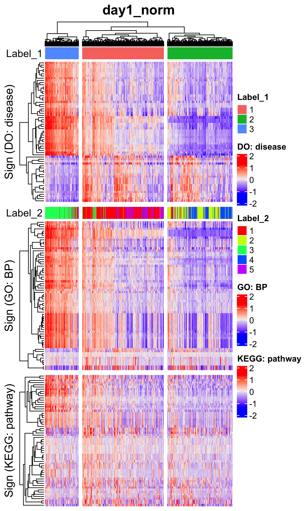
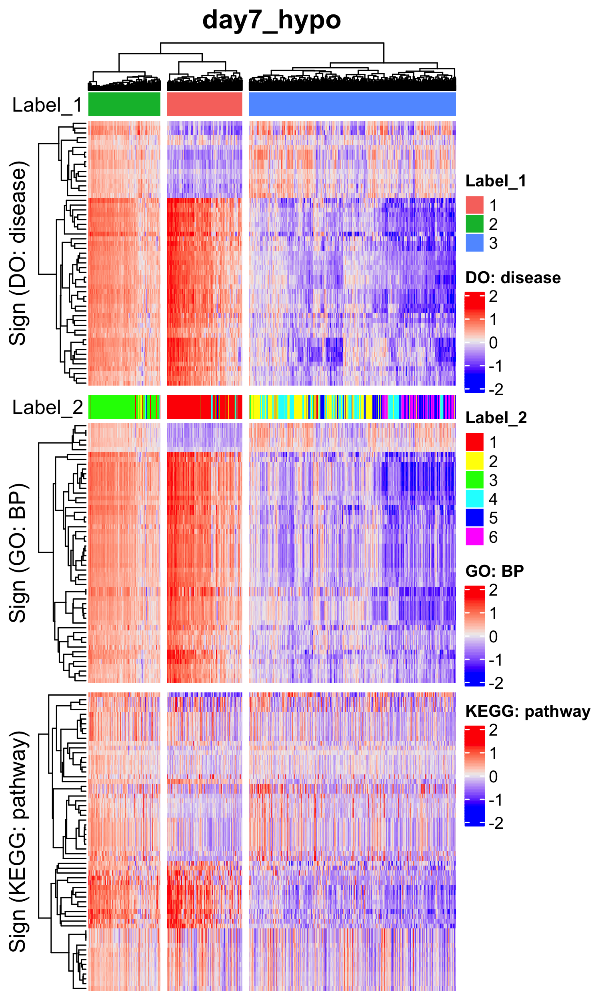


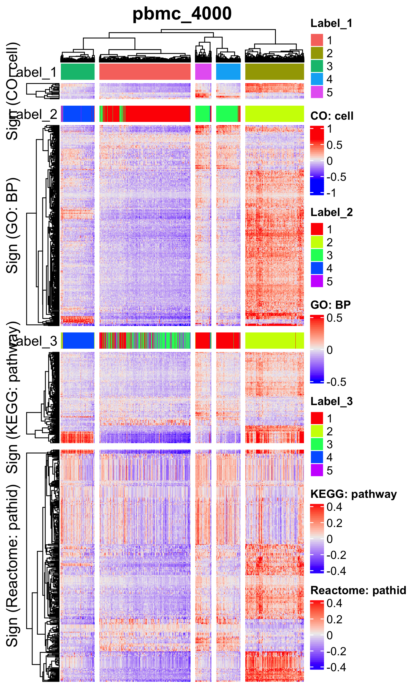


The following function `plot_MultiBargraphs_sign()` shows the population sizes
by two-variable bar graphs.
The arguments are `obj`, `data_type_1` (for the data type in x-axis),
`category_1` (for x-axis), `algo_name_1` (for x-axix), `data_type_2` (for the
data type in y-axis), `category_2` (for y-axis), `algo_name_2` (for y-axis),
`title`, `title_size`, `cbar_title` (label of the color bar), `xlabel`,
`ylabel`, `ymax`, and `default_color` (if `TRUE`, the default color of ggplot
is used, otherwise rainbow).
```{r, eval = FALSE}
# ----------------------------------------
# For `day1_norm`
# ----------------------------------------
p <- plot_MultiBargraphs_sign(
  obj = day1_norm, data_type_1 = "DO", category_1 = "disease",
  algo_name_1 = "seuratFindClusters",
  data_type_2 = "GO", category_2 = "BP",
  algo_name_2 = "seuratFindClusters",
  title = "day1_norm", title_size = 18, cbar_title = "Label\n(GO: BP)",
  xlabel = "Label (DO: disease)", ylabel = "Number of samples", ymax = 2000,
  default_color = FALSE)
filename <- "figures/figure_01_0501.png"
ggsave(file = filename, plot = p, dpi = 300, width = 5.5, height = 4)
```

```{r, eval = FALSE, echo = FALSE, results = "hide"}
# ----------------------------------------
# For `day7_hypo`
# ----------------------------------------
p <- plot_MultiBargraphs_sign(
  obj = day7_hypo, data_type_1 = "DO", category_1 = "disease",
  algo_name_1 = "merlot",
  data_type_2 = "GO", category_2 = "BP",
  algo_name_2 = "seuratFindClusters",
  title = "day7_hypo", title_size = 18, cbar_title = "Label\n(GO: BP)",
  xlabel = "Label (DO: disease)", ylabel = "Number of samples", ymax = 1500,
  default_color = FALSE)
filename <- "figures/figure_02_0501.png"
ggsave(file = filename, plot = p, dpi = 300, width = 5.5, height = 4)
# ----------------------------------------
# For `sc68_vehi`
# ----------------------------------------
p <- plot_MultiBargraphs_sign(
  obj = sc68_vehi, data_type_1 = "DO", category_1 = "disease",
  algo_name_1 = "seuratFindClusters",
  data_type_2 = "GO", category_2 = "BP",
  algo_name_2 = "seuratFindClusters",
  title = "sc68_vehi", title_size = 18, cbar_title = "Label\n(GO: BP)",
  xlabel = "Label (DO: disease)", ylabel = "Number of samples", ymax = 3500,
  default_color = FALSE)
filename <- "figures/figure_03_0501.png"
ggsave(file = filename, plot = p, dpi = 300, width = 5.5, height = 4)
# ----------------------------------------
# For `sc68_cisp`
# ----------------------------------------
p <- plot_MultiBargraphs_sign(
  obj = sc68_cisp, data_type_1 = "DO", category_1 = "disease",
  algo_name_1 = "merlot",
  data_type_2 = "GO", category_2 = "BP",
  algo_name_2 = "merlot",
  title = "sc68_cisp", title_size = 18, cbar_title = "Label\n(GO: BP)",
  xlabel = "Label (DO: disease)", ylabel = "Number of samples", ymax = 1000,
  default_color = FALSE)
filename <- "figures/figure_04_0501.png"
ggsave(file = filename, plot = p, dpi = 300, width = 5.5, height = 4)
# ----------------------------------------
# For `pbmc_4000`
# ----------------------------------------
p <- plot_MultiBargraphs_sign(
  obj = pbmc_4000, data_type_1 = "CO", category_1 = "cell",
  algo_name_1 = "seuratFindClusters",
  data_type_2 = "GO", category_2 = "BP",
  algo_name_2 = "seuratFindClusters",
  title = "pbmc_4000", title_size = 18, cbar_title = "Label\n(GO: BP)",
  xlabel = "Label (CO: cell)", ylabel = "Number of samples", ymax = 2000,
  default_color = FALSE)
filename <- "figures/figure_05_0501.png"
ggsave(file = filename, plot = p, dpi = 300, width = 5.5, height = 4)

p <- plot_MultiBargraphs_sign(
  obj = pbmc_4000, data_type_1 = "CO", category_1 = "cell",
  algo_name_1 = "seuratFindClusters",
  data_type_2 = "KEGG", category_2 = "pathway",
  algo_name_2 = "seuratFindClusters",
  title = "pbmc_4000", title_size = 18, cbar_title = "Label\n(KEGG: pathway)",
  xlabel = "Label (CO: cell)", ylabel = "Number of samples", ymax = 2000,
  default_color = FALSE)
filename <- "figures/figure_05_0502.png"
ggsave(file = filename, plot = p, dpi = 300, width = 6.3, height = 4)
# ----------------------------------------
# For `pbmc_6000`
# ----------------------------------------
p <- plot_MultiBargraphs_sign(
  obj = pbmc_6000, data_type_1 = "CO", category_1 = "cell",
  algo_name_1 = "seuratFindClusters",
  data_type_2 = "GO", category_2 = "BP",
  algo_name_2 = "seuratFindClusters",
  title = "pbmc_6000", title_size = 18, cbar_title = "Label\n(GO: BP)",
  xlabel = "Label (CO: cell)", ylabel = "Number of samples", ymax = 2000,
  default_color = FALSE)
filename <- "figures/figure_06_0501.png"
ggsave(file = filename, plot = p, dpi = 300, width = 5.5, height = 4)

p <- plot_MultiBargraphs_sign(
  obj = pbmc_6000, data_type_1 = "CO", category_1 = "cell",
  algo_name_1 = "seuratFindClusters",
  data_type_2 = "KEGG", category_2 = "pathway",
  algo_name_2 = "seuratFindClusters",
  title = "pbmc_6000", title_size = 18, cbar_title = "Label\n(KEGG: pathway)",
  xlabel = "Label (CO: cell)", ylabel = "Number of samples", ymax = 2000,
  default_color = FALSE)
filename <- "figures/figure_06_0502.png"
ggsave(file = filename, plot = p, dpi = 300, width = 6.3, height = 4)
```


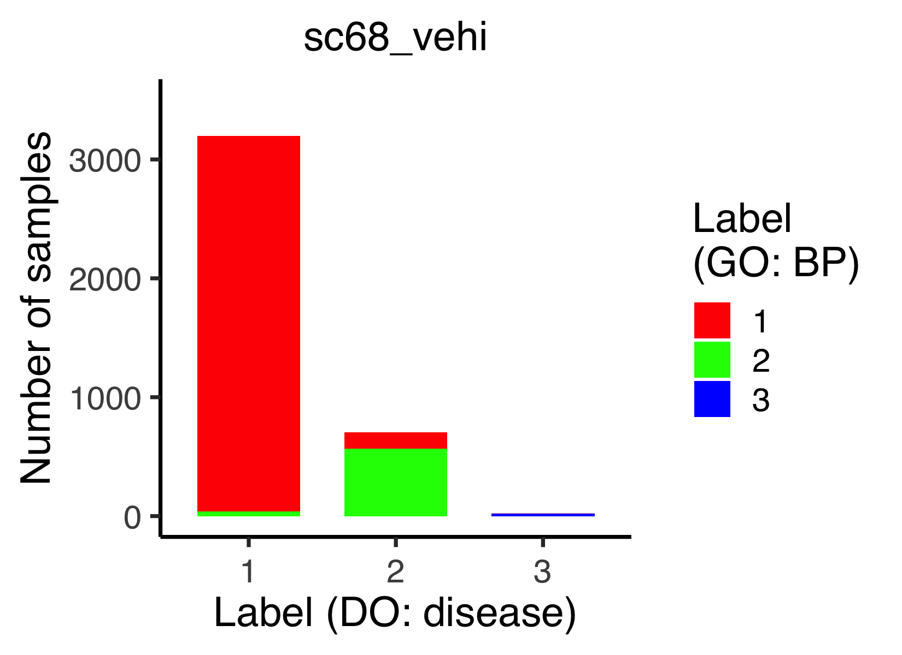


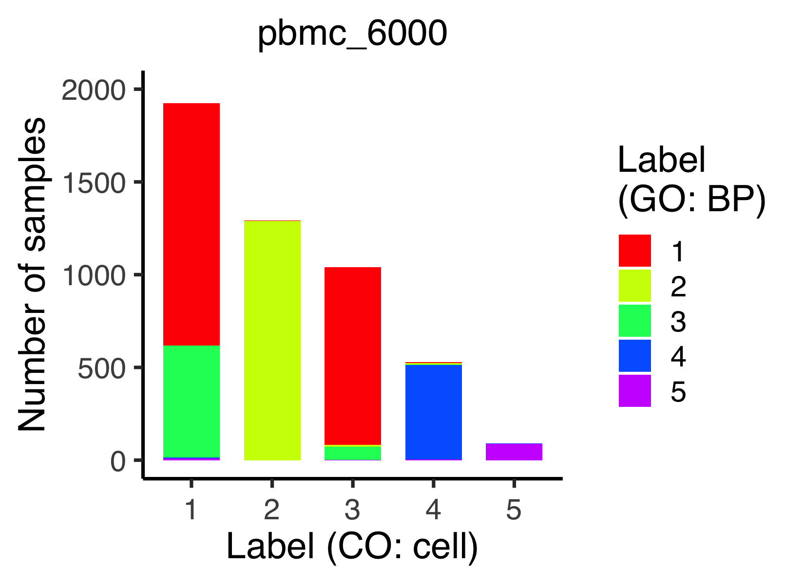
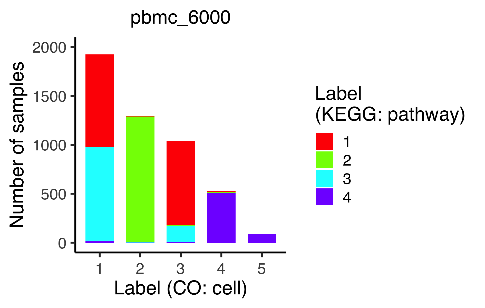

The function `plot_tsne_signScore()`, `plot_umap_signScore()`, and
`plot_dmap_signScore()` show the sign score of a given sign on the t-SNE,
UMAP, and diffusion map spaces, respectively.
```{r, eval = FALSE}
# ----------------------------------------
# For `sc68_vehi`
# ----------------------------------------
p <- plot_tsne_signScore(
  obj = sc68_vehi, sign_name = "DOID:5409_S",
  data_type_for_tsne = "GO", category_for_tsne = "BP",
  data_type_for_expr = "DO", category_for_expr = "disease",
  theta = NULL, phi = NULL,
  title = "DOID:5409_S\nLung small cell carcinoma\n(ASCL1/GRP/..)",
  title_size = 16, label_name = "Sign score",
  xlabel = "tSNE_1 (GO: BP)", ylabel = "tSNE_2 (GO: BP)", zlabel = NULL)
filename <- "figures/figure_03_0505.png"
ggsave(file = filename, plot = p, dpi = 300, width = 5.6, height = 4.4)
```

```{r, eval = FALSE, echo = FALSE, results = "hide"}
# ----------------------------------------
# For `sc68_vehi`
# ----------------------------------------
p <- plot_tsne_signScore(
  obj = sc68_vehi, sign_name = "DOID:5409_V",
  data_type_for_tsne = "GO", category_for_tsne = "BP",
  data_type_for_expr = "DO", category_for_expr = "disease",
  theta = NULL, phi = NULL,
  title = "DOID:5409_V\nLung small cell carcinoma\n(MKI67/BIRC5/..)",
  title_size = 16, label_name = "Sign score",
  xlabel = "tSNE_1 (GO: BP)", ylabel = "tSNE_2 (GO: BP)", zlabel = NULL)
filename <- "figures/figure_03_0506.png"
ggsave(file = filename, plot = p, dpi = 300, width = 5.6, height = 4.4)
```

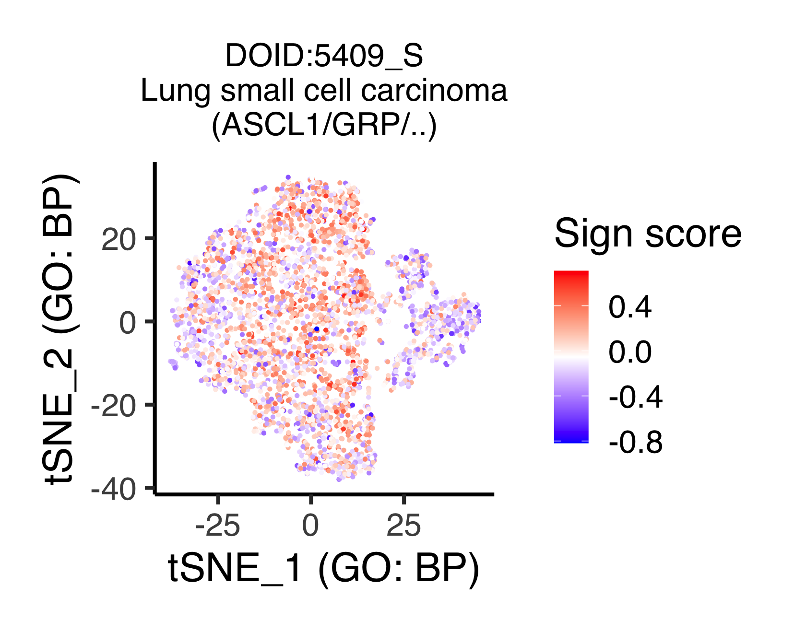
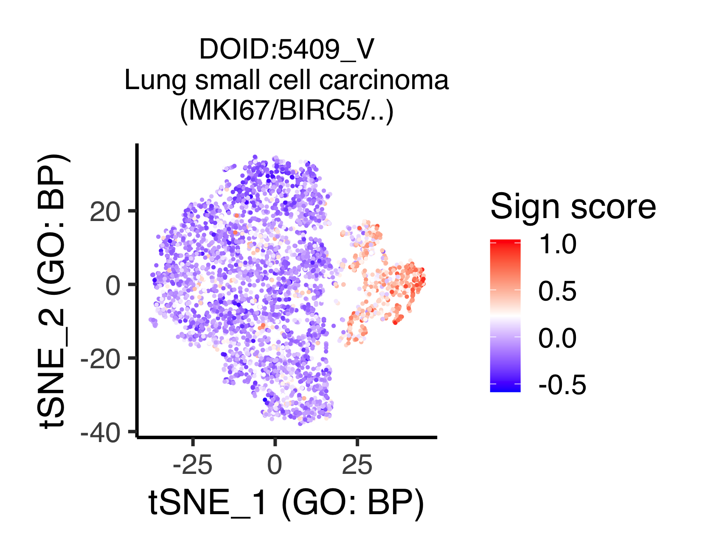

The following function `plot_violin_signScore()` shows the distribution of
expression levels of a given sign across subpopulations by violin plots.
The arguments are `obj`, `sign_name`, `data_type_for_label` (`data_type` used
for sample classification), `category_for_label` (`category` used for sample
classification), `algo_name_for_label` (`algo_name` used for sample
classification), `data_type_for_expr` (`data_type` of interest for investigating
gene expression), `category_for_expr` (`category` of interest for investigating
gene expression), `title`, `title_size`, and `default_color` (if `TRUE`,
the default color of ggplot is used, otherwise rainbow).
```{r, eval = FALSE}
# ----------------------------------------
# For `sc68_vehi`
# ----------------------------------------
p <- plot_violin_signScore(
  obj = sc68_vehi, sign_name = "DOID:5409_S",
  data_type_for_label = "GO", category_for_label = "BP",
  algo_name_for_label = "seuratFindClusters",
  data_type_for_expr = "DO", category_for_expr = "disease",
  title = "DOID:5409_S\nLung small cell carcinoma\n(ASCL1/GRP/..)",
  title_size = 16, default_color = FALSE)
filename <- "figures/figure_03_0510.png"
ggsave(file = filename, plot = p, dpi = 300, width = 4, height = 4)
```

```{r, eval = FALSE, echo = FALSE, results = "hide"}
# ----------------------------------------
# For `sc68_vehi`
# ----------------------------------------
p <- plot_violin_signScore(
  obj = sc68_vehi, sign_name = "DOID:5409_V",
  data_type_for_label = "GO", category_for_label = "BP",
  algo_name_for_label = "seuratFindClusters",
  data_type_for_expr = "DO", category_for_expr = "disease",
  title = "DOID:5409_V\nLung small cell carcinoma\n(MKI67/BIRC5/..)",
  title_size = 16, default_color = FALSE)
filename <- "figures/figure_03_0511.png"
ggsave(file = filename, plot = p, dpi = 300, width = 4, height = 4)

p <- plot_violin_signScore(
  obj = sc68_vehi, sign_name = "path:hsa01524_S",
  data_type_for_label = "GO", category_for_label = "BP",
  algo_name_for_label = "seuratFindClusters",
  data_type_for_expr = "KEGG", category_for_expr = "pathway",
  title = "KEGG:hsa01524_S\nPlatinum drug resistance\n(TOP2A/BIRC5/..)",
  title_size = 16, default_color = FALSE)
filename <- "figures/figure_03_0512.png"
ggsave(file = filename, plot = p, dpi = 300, width = 4, height = 4)
```


The following function `plot_pseudotime_vs_signscore()` plots expression
levels versus pseudotime for a given sign, in which filled circles, bold lines,
and the shade regions stand for the expression values of samples, mean
expression levels, and standard deviations (this value is 0 if there are less
than three samples), respectively.
The arguments `data_type_for_tree` and `category_for_tree` are the data type
and category used for the branch-based classification of samples (i.e., the
labels assigned to the branches), while `data_type_for_expr` and
`category_for_expr` for the expression levels of signs of interest.
```{r, eval = FALSE}
# ----------------------------------------
# For `sc68_cisp`
# ----------------------------------------
p <- plot_pseudotime_vs_signscore(
  obj = sc68_cisp, sign_name = "path:hsa01524_S",
  data_type_for_tree = "DO", category_for_tree = "disease",
  data_type_for_expr = "KEGG", category_for_expr = "pathway",
  title = "KEGG:hsa01524_S\nPlatinum drug resistance\n(TOP2A/BIRC5/..)",
  title_size = 22, label_name = "Label\n(DO: disease)",
  xlabel = "Pseudotime (DO: disease)", ylabel = "Sign score")
filename <- "figures/figure_04_0510.png"
ggsave(file = filename, plot = p, dpi = 300, width = 7.5, height = 5)
```

```{r, eval = FALSE, echo = FALSE, results = "hide"}
# ----------------------------------------
# For `sc68_cisp`
# ----------------------------------------
p <- plot_pseudotime_vs_signscore(
  obj = sc68_cisp, sign_name = "path:hsa05235_S",
  data_type_for_tree = "DO", category_for_tree = "disease",
  data_type_for_expr = "KEGG", category_for_expr = "pathway",
  title = "KEGG:hsa05235_S\nPD-L1 expression..\n(NFKBI1/HIF1A/..)",
  title_size = 22, label_name = "Label\n(DO: disease)",
  xlabel = "Pseudotime (DO: disease)", ylabel = "Sign score")
filename <- "figures/figure_04_0511.png"
ggsave(file = filename, plot = p, dpi = 300, width = 7.5, height = 5)

p <- plot_pseudotime_vs_signscore(
  obj = sc68_cisp, sign_name = "GO:0006886_S",
  data_type_for_tree = "DO", category_for_tree = "disease",
  data_type_for_expr = "GO", category_for_expr = "BP",
  title = "GO:0006886_S\nIntracellular protein transport\n(CD24/SEC61G/..)",
  title_size = 22, label_name = "Label\n(DO: disease)",
  xlabel = "Pseudotime (DO: disease)", ylabel = "Sign score")
filename <- "figures/figure_04_0512.png"
ggsave(file = filename, plot = p, dpi = 300, width = 7.5, height = 5)
```

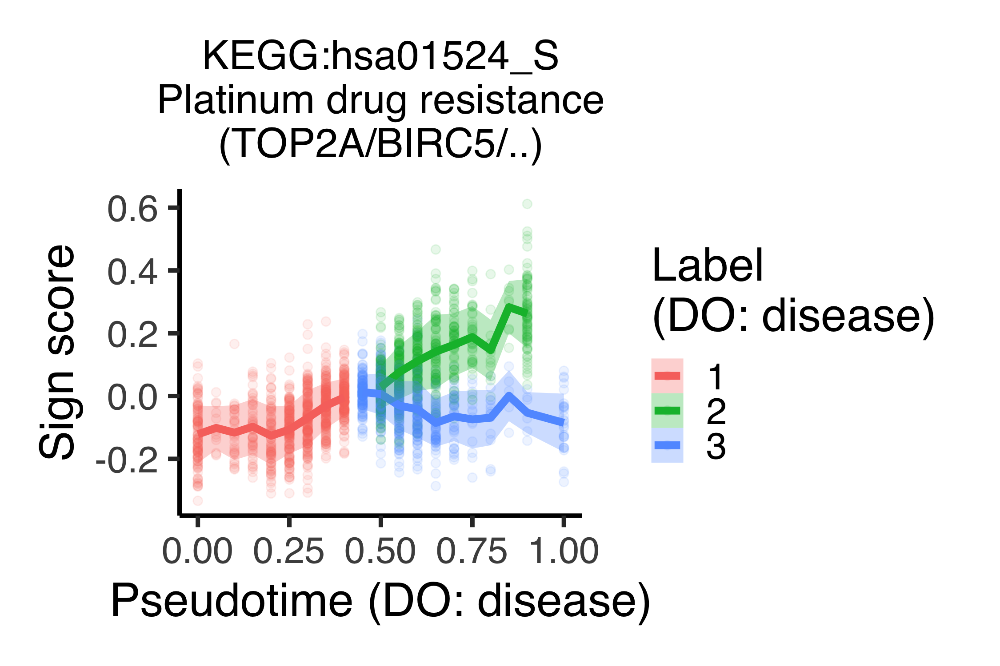
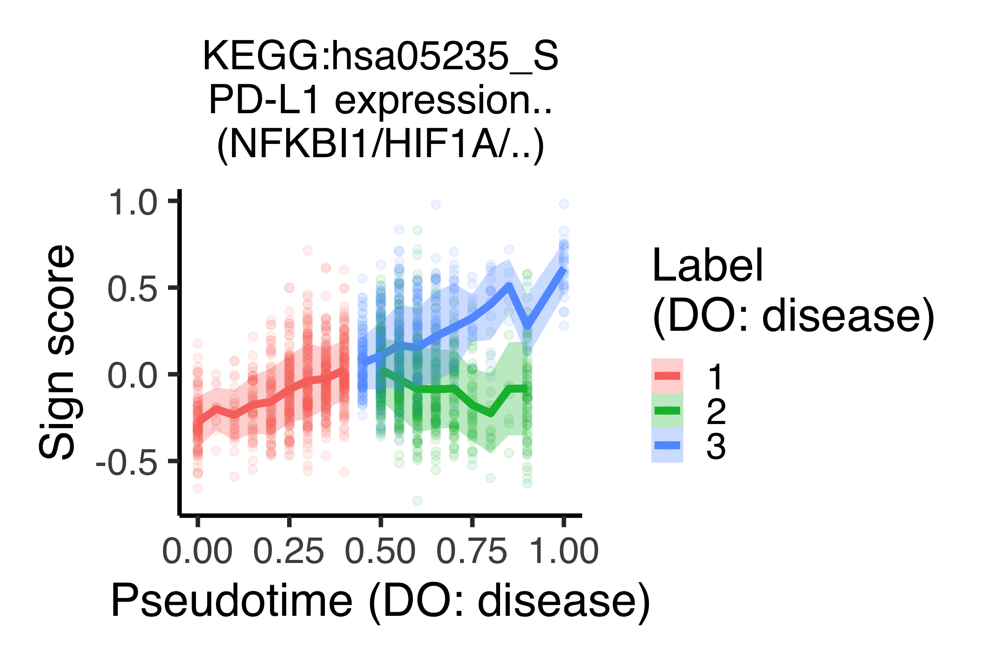
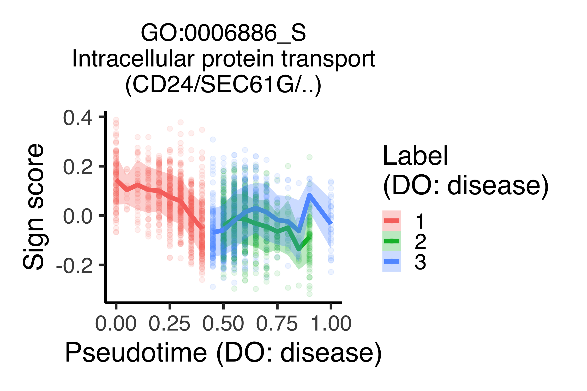

Save the objects.
```{r, eval = FALSE}
saveRDS(day1_norm, file = "backup/01_500_day1_norm_all.rds")
saveRDS(day7_hypo, file = "backup/02_500_day7_hypo_all.rds")
saveRDS(sc68_vehi, file = "backup/03_500_sc68_vehi_all.rds")
saveRDS(sc68_cisp, file = "backup/04_500_sc68_cisp_all.rds")
saveRDS(pbmc_4000, file = "backup/05_500_pbmc_4000_all.rds")
saveRDS(pbmc_6000, file = "backup/06_500_pbmc_6000_all.rds")
```

Load the objects.
```{r, eval = FALSE}
day1_norm <- readRDS(file = "backup/01_500_day1_norm_all.rds")
day7_hypo <- readRDS(file = "backup/02_500_day7_hypo_all.rds")
sc68_vehi <- readRDS(file = "backup/03_500_sc68_vehi_all.rds")
sc68_cisp <- readRDS(file = "backup/04_500_sc68_cisp_all.rds")
pbmc_4000 <- readRDS(file = "backup/05_500_pbmc_4000_all.rds")
pbmc_6000 <- readRDS(file = "backup/06_500_pbmc_6000_all.rds")
```

```{r}
sessionInfo()
```

```
R version 4.0.4 (2021-02-15)
Platform: x86_64-apple-darwin17.0 (64-bit)
Running under: macOS Big Sur 10.16

Matrix products: default
LAPACK: /Library/Frameworks/R.framework/Versions/4.0/Resources/lib/libRlapack.dylib

locale:
[1] en_US.UTF-8/en_US.UTF-8/en_US.UTF-8/C/en_US.UTF-8/en_US.UTF-8

attached base packages:
 [1] grid      parallel  stats4    stats     graphics  grDevices utils     datasets  methods   base     

other attached packages:
 [1] gridExtra_2.3          plotly_4.9.3           reactome.db_1.74.0     KEGGREST_1.30.1       
 [5] GOSemSim_2.16.1        clusterProfiler_3.18.1 ontoProc_1.12.0        ontologyIndex_2.7     
 [9] DOSE_3.16.0            merlot_0.2.2           destiny_3.4.0          SeuratObject_4.0.0    
[13] Seurat_4.0.1           cluster_2.1.2          Rcpp_1.0.6             umap_0.2.7.0          
[17] Rtsne_0.15             limma_3.46.0           sva_3.38.0             BiocParallel_1.24.1   
[21] genefilter_1.72.1      mgcv_1.8-35            nlme_3.1-152           bayNorm_1.8.0         
[25] viridis_0.6.0          viridisLite_0.4.0      DT_0.18                circlize_0.4.12       
[29] ComplexHeatmap_2.6.2   plot3D_1.3             ggrepel_0.9.1          ggExtra_0.9           
[33] org.Hs.eg.db_3.12.0    AnnotationDbi_1.52.0   IRanges_2.24.1         S4Vectors_0.28.1      
[37] Biobase_2.50.0         BiocGenerics_0.36.0    Matrix_1.3-2           forcats_0.5.1         
[41] stringr_1.4.0          dplyr_1.0.5            purrr_0.3.4            readr_1.4.0           
[45] tidyr_1.1.3            tibble_3.1.1           ggplot2_3.3.3          tidyverse_1.3.1       

loaded via a namespace (and not attached):
  [1] rgl_0.106.6                 vcd_1.4-8                   ica_1.0-2                  
  [4] class_7.3-18                foreach_1.5.1               lmtest_0.9-38              
  [7] crayon_1.4.1                laeken_0.5.1                spatstat.core_2.1-2        
 [10] MASS_7.3-53.1               backports_1.2.1             reprex_2.0.0               
 [13] rlang_0.4.10                XVector_0.30.0              ROCR_1.0-11                
 [16] readxl_1.3.1                irlba_2.3.3                 smoother_1.1               
 [19] rjson_0.2.20                manipulateWidget_0.10.1     bit64_4.0.5                
 [22] glue_1.4.2                  sctransform_0.3.2           spatstat.sparse_2.0-0      
 [25] dotCall64_1.0-1             tcltk_4.0.4                 spatstat.geom_2.1-0        
 [28] haven_2.4.0                 tidyselect_1.1.0            SummarizedExperiment_1.20.0
 [31] rio_0.5.26                  fitdistrplus_1.1-3          XML_3.99-0.6               
 [34] zoo_1.8-9                   xtable_1.8-4                RcppHNSW_0.3.0             
 [37] magrittr_2.0.1              evaluate_0.14               cli_2.4.0                  
 [40] zlibbioc_1.36.0             rstudioapi_0.13             miniUI_0.1.1.1             
 [43] sp_1.4-5                    bslib_0.2.4                 rpart_4.1-15               
 [46] fastmatch_1.1-0             RcppEigen_0.3.3.9.1         maps_3.3.0                 
 [49] fields_11.6                 shiny_1.6.0                 xfun_0.22                  
 [52] askpass_1.1                 clue_0.3-59                 tidygraph_1.2.0            
 [55] pcaMethods_1.82.0           doSNOW_1.0.19               ElPiGraph.R_1.0.0          
 [58] listenv_0.8.0               Biostrings_2.58.0           png_0.1-7                  
 [61] future_1.21.0               withr_2.4.2                 bitops_1.0-6               
 [64] ggforce_0.3.3               ranger_0.12.1               plyr_1.8.6                 
 [67] cellranger_1.1.0            e1071_1.7-6                 pillar_1.6.0               
 [70] GlobalOptions_0.1.2         cachem_1.0.4                fs_1.5.0                   
 [73] scatterplot3d_0.3-41        TTR_0.24.2                  GetoptLong_1.0.5           
 [76] xts_0.12.1                  vctrs_0.3.7                 ellipsis_0.3.1             
 [79] generics_0.1.0              tools_4.0.4                 foreign_0.8-81             
 [82] munsell_0.5.0               tweenr_1.0.2                fgsea_1.16.0               
 [85] proxy_0.4-25                DelayedArray_0.16.3         fastmap_1.1.0              
 [88] compiler_4.0.4              paintmap_1.0                abind_1.4-5                
 [91] httpuv_1.5.5                GenomeInfoDbData_1.2.4      edgeR_3.32.1               
 [94] lattice_0.20-41             deldir_0.2-10               snow_0.4-3                 
 [97] utf8_1.2.1                  later_1.1.0.1               BiocFileCache_1.14.0       
[100] jsonlite_1.7.2              ggplot.multistats_1.0.0     scales_1.1.1               
[103] graph_1.68.0                pbapply_1.4-3               carData_3.0-4              
[106] lazyeval_0.2.2              promises_1.2.0.1            car_3.0-10                 
[109] goftest_1.2-2               spatstat.utils_2.1-0        reticulate_1.19            
[112] rmarkdown_2.7               openxlsx_4.2.3              cowplot_1.1.1              
[115] webshot_0.5.2               downloader_0.4              uwot_0.1.10                
[118] igraph_1.2.6                survival_3.2-10             yaml_2.2.1                 
[121] htmltools_0.5.1.1           memoise_2.0.0               locfit_1.5-9.4             
[124] graphlayouts_0.7.1          digest_0.6.27               assertthat_0.2.1           
[127] mime_0.10                   rappdirs_0.3.3              spam_2.6-0                 
[130] RSQLite_2.2.6               LSD_4.1-0                   future.apply_1.7.0         
[133] misc3d_0.9-0                data.table_1.14.0           blob_1.2.1                 
[136] labeling_0.4.2              splines_4.0.4               Cairo_1.5-12.2             
[139] RCurl_1.98-1.3              broom_0.7.6                 hms_1.0.0                  
[142] modelr_0.1.8                colorspace_2.0-0            BiocManager_1.30.12        
[145] GenomicRanges_1.42.0        shape_1.4.5                 nnet_7.3-15                
[148] sass_0.3.1                  bookdown_0.21               RANN_2.6.1                 
[151] enrichplot_1.10.2           fansi_0.4.2                 VIM_6.1.0                  
[154] parallelly_1.24.0           R6_2.5.0                    ggridges_0.5.3             
[157] lifecycle_1.0.0             zip_2.1.1                   curl_4.3                   
[160] jquerylib_0.1.3             leiden_0.3.7                robustbase_0.93-7          
[163] DO.db_2.9                   qvalue_2.22.0               RcppAnnoy_0.0.18           
[166] RColorBrewer_1.1-2          iterators_1.0.13            htmlwidgets_1.5.3          
[169] polyclip_1.10-0             crosstalk_1.1.1             shadowtext_0.0.7           
[172] rvest_1.0.0                 globals_0.14.0              openssl_1.4.3              
[175] patchwork_1.1.1             codetools_0.2-18            matrixStats_0.58.0         
[178] lubridate_1.7.10            GO.db_3.12.1                SingleCellExperiment_1.12.0
[181] dbplyr_2.1.1                RSpectra_0.16-0             GenomeInfoDb_1.26.7        
[184] gtable_0.3.0                DBI_1.1.1                   tensor_1.5                 
[187] httr_1.4.2                  KernSmooth_2.23-18          stringi_1.5.3              
[190] reshape2_1.4.4              farver_2.1.0                ontologyPlot_1.6           
[193] annotate_1.68.0             ggthemes_4.2.4              hexbin_1.28.2              
[196] Rgraphviz_2.34.0            xml2_1.3.2                  rvcheck_0.1.8              
[199] boot_1.3-27                 scattermore_0.7             DEoptimR_1.0-8             
[202] bit_4.0.4                   scatterpie_0.1.5            MatrixGenerics_1.2.1       
[205] spatstat.data_2.1-0         ggraph_2.0.5                pkgconfig_2.0.3            
[208] knn.covertree_1.0           knitr_1.32
```