# Appendix A: comparing performances of ASURAT and existing methods
In this section, we assess the clustering performances of existing algorithms
and ASURAT, which are listed below:

* Seurat 4 (version 4.0.1)
* Monocle 3 (version 0.2.3.0)
* SC3 (version 1.18.0)
* Principal component analysis (PCA)
* ASURAT (version 0.0.0.9000)

Our strategy to compare the clustering performances consists of the following
steps:

1. prepare cancer patient- and healthy donor-derived single-cell RNA sequencing
datasets, which are symbolized by `day1_norm`, `day7_hypo`, `sc68_vehi`,
`sc68_cisp`, `pbmc_4000`, and `pbmc_6000`.

2. remove the outlier cells from `sc68_vehi`, which is detected by ASURAT;

3. obtain the low-dimensional representations by means of t-SNE and UMAP
except for SC3 because SC3 uses distance matrices for sample clustering;

4. perform k-means clusterings upon the results of the low-dimensional
representations;

5. compute several indices measuring clustering quality by using `NbClust`;

6. compare the indices across the above clustering methods; and

7. infer the cell types in the datasets, `pmbc_4000` and `pbmc_6000`, by using
Seurat, Monocle3 plus Garnett, SC3, and ASURAT.


## Installation
The following libraries are used.
```{r, eval = FALSE}
# General
library(tidyverse)       # For efficient handling of data.frame
# Below is a memo for attaching org.Hs.eg.db
# options(connectionObserver = NULL)
library(org.Hs.eg.db)    # For using human genome annotation package

# Plot
library(ggExtra)         # For graphics
library(ggrepel)         # For graphics with labeling
library(plot3D)          # For 3-dimensional scatter plot
library(ComplexHeatmap)  # For ComplexHeatmap
library(circlize)        # For color mapping function in ComplexHeatmap
library(DT)              # For using datatable
library(viridis)         # For using color palette `plasma`
library(RColorBrewer)    # For using color palette

# Utilities
library(NbClust)         # For using NbClust
library(Rtsne)           # For using Rtsne
library(umap)            # For using umap
library(Rcpp)            # For using external C++ codes
library(cluster)         # For using pam
library(Seurat)          # For using Seurat
library(garnett)         # For using Garnett along with monocle 3
library(monocle3)        # For using Monocle
library(SC3)                    # For using SC3
library(scater)                 # For using SC3
library(SingleCellExperiment)   # For using SC3
library(openxlsx)        # For outputting excel file with multiple sheets

# Databases
library(DOSE)            # For using DB for Disease Ontology
library(ontoProc)        # For using DB for Cell Ontology
library(clusterProfiler) # For using DB for Gene Ontology
library(GOSemSim)        # For using godata in GOSemSim package
```

```{r}
packageVersion("Seurat")
```

```{r}
packageVersion("monocle3")
```

```{r}
packageVersion("garnett")
```

```{r}
packageVersion("SC3")
```


## Removing the outlier cells detected by ASURAT
Below are the R codes to obtain the low-dimensional representation of the data.
Please see Chapter 8 "ASURAT using Disease Ontology DB" for the details.
```{r, eval = FALSE}
source("R/plot.R")
source("R/function_sign.R")

sc68_vehi <- readRDS(file = "backup/03_104_sc68_vehi_DES_DO.rds")
sc68_vehi <- do_umap_sign(obj = sc68_vehi,
                          data_type = "DO", category = "disease",
                          pca_dim = NULL, umap_dim = 2)
# ----------------------------------------
# For `sc68_vehi`
# ----------------------------------------
p <- plot_umap_sign(obj = sc68_vehi,
                    data_type = "DO", category = "disease",
                    algo_name = NULL, theta = NULL, phi = NULL,
                    title = "sc68_vehi (DO: disease)", title_size = 16,
                    xlabel = "UMAP_1", ylabel = "UMAP_2", zlabel = NULL)
filename <- "figures/figure_13_0010.png"
ggsave(file = filename, plot = p, dpi = 300, width = 4, height = 4.2)
```


As can be seen, there exist non-negligible outliers, referred to as `blacklist`.
Indeed, if the outliers are included in the downstream analysis, we can obtain
very large ASWs depending on the parameter settings, which seems to be unfair.
Hence, we remove these outliers.
```{r, eval = FALSE}
# ----------------------------------------
# For `sc68_vehi`
# ----------------------------------------
mat <- sc68_vehi[["reduction"]][["umap"]][["DO"]][["disease"]][["layout"]]
tmp <- mat[order(mat[,1], decreasing = TRUE),]
blacklist <- setdiff(rownames(tmp), rownames(tmp[-(1:22),]))
saveRDS(blacklist, file = "backup/13_001_sc68_vehi_blacklist.rds")
```


## Assessing clustering performances

### Seurat
Load the data.
```{r, eval = FALSE}
source("R/function_seurat.R")
day1_norm <- readRDS(file = "backup/01_005_day1_norm_normalized.rds")
day7_hypo <- readRDS(file = "backup/02_005_day7_hypo_normalized.rds")
sc68_vehi <- readRDS(file = "backup/03_005_sc68_vehi_normalized.rds")
sc68_cisp <- readRDS(file = "backup/04_005_sc68_cisp_normalized.rds")
pbmc_4000 <- readRDS(file = "backup/05_005_pbmc_4000_normalized.rds")
pbmc_6000 <- readRDS(file = "backup/06_005_pbmc_6000_normalized.rds")
sc68_vehi_bl <- readRDS(file = "backup/13_001_sc68_vehi_blacklist.rds")
```

Remove the outlier cells from `sc68_vehi`.
```{r, eval = FALSE}
# ----------------------------------------
# For `sc68_vehi`
# ----------------------------------------
mat <- sc68_vehi[["data"]][["bayNorm"]][["Bay_out"]]
inds <- which(colnames(mat) %in% sc68_vehi_bl)
sc68_vehi[["data"]][["bayNorm"]][["Bay_out"]] <- mat[, -inds]
```

Create Seurat objects.
```{r, eval = FALSE}
day1_norm <- CreateSeuratObject(
  counts = day1_norm[["data"]][["bayNorm"]][["Bay_out"]],
  project = day1_norm[["history"]][["make_asurat_obj"]][["obj_name"]])
day7_hypo <- CreateSeuratObject(
  counts = day7_hypo[["data"]][["bayNorm"]][["Bay_out"]],
  project = day7_hypo[["history"]][["make_asurat_obj"]][["obj_name"]])
sc68_vehi <- CreateSeuratObject(
  counts = sc68_vehi[["data"]][["bayNorm"]][["Bay_out"]],
  project = sc68_vehi[["history"]][["make_asurat_obj"]][["obj_name"]])
sc68_cisp <- CreateSeuratObject(
  counts = sc68_cisp[["data"]][["bayNorm"]][["Bay_out"]],
  project = sc68_cisp[["history"]][["make_asurat_obj"]][["obj_name"]])
pbmc_4000 <- CreateSeuratObject(
  counts = pbmc_4000[["data"]][["bayNorm"]][["Bay_out"]],
  project = pbmc_4000[["history"]][["make_asurat_obj"]][["obj_name"]])
pbmc_6000 <- CreateSeuratObject(
  counts = pbmc_6000[["data"]][["bayNorm"]][["Bay_out"]],
  project = pbmc_6000[["history"]][["make_asurat_obj"]][["obj_name"]])
```

The following function `process_001_seurat()` (1) normalizes the data by using
`NormalizeData()` in Seurat package with the argument
`normalization.method = LogNormalize`, (2) performs variance stabilizing
transform (VST) by using `FindVariableFeatures()` setting the number of
variable feature `nfeatures`, (3) scales the data, and (4) reduce the dimension
by principal component analysis (PCA), using `RunPCA()` with the argument
`features = VariableFeatures(obj)`.

**Tips:**
As mentioned in Cruz and Wishart, Cancer Inform. 2, 59-77 (2006),
`nfeatures` was set as the sample-per-variable feature ratio being 5:1.
```{r, eval = FALSE}
day1_norm <- process_001_seurat(
  obj = day1_norm,
  nfeatures = round(0.2 * day1_norm@assays[["RNA"]]@counts@Dim[1]))
day7_hypo <- process_001_seurat(
  obj = day7_hypo,
  nfeatures = round(0.2 * day7_hypo@assays[["RNA"]]@counts@Dim[1]))
sc68_vehi <- process_001_seurat(
  obj = sc68_vehi,
  nfeatures = round(0.2 * sc68_vehi@assays[["RNA"]]@counts@Dim[1]))
sc68_cisp <- process_001_seurat(
  obj = sc68_cisp,
  nfeatures = round(0.2 * sc68_cisp@assays[["RNA"]]@counts@Dim[1]))
pbmc_4000 <- process_001_seurat(
  obj = pbmc_4000,
  nfeatures = round(0.2 * pbmc_4000@assays[["RNA"]]@counts@Dim[1]))
pbmc_6000 <- process_001_seurat(
  obj = pbmc_6000,
  nfeatures = round(0.2 * pbmc_6000@assays[["RNA"]]@counts@Dim[1]))
```

The following command can calculate the cumulative sum over whole sum.
These results are used to determine the dimensions of the principal components.
In what follows, we use the PCs whose contribution ratio is greater than
or equal to 0.9 for the first time.
```{r, eval = FALSE}
day1_norm_pc <- which(cumsum(day1_norm@reductions[["pca"]]@stdev) /
                        sum(day1_norm@reductions[["pca"]]@stdev) > 0.9)[1]
day7_hypo_pc <- which(cumsum(day7_hypo@reductions[["pca"]]@stdev) /
                        sum(day7_hypo@reductions[["pca"]]@stdev) > 0.9)[1]
sc68_vehi_pc <- which(cumsum(sc68_vehi@reductions[["pca"]]@stdev) /
                        sum(sc68_vehi@reductions[["pca"]]@stdev) > 0.9)[1]
sc68_cisp_pc <- which(cumsum(sc68_cisp@reductions[["pca"]]@stdev) /
                        sum(sc68_cisp@reductions[["pca"]]@stdev) > 0.9)[1]
pbmc_4000_pc <- which(cumsum(pbmc_4000@reductions[["pca"]]@stdev) /
                        sum(pbmc_4000@reductions[["pca"]]@stdev) > 0.9)[1]
pbmc_6000_pc <- which(cumsum(pbmc_6000@reductions[["pca"]]@stdev) /
                        sum(pbmc_6000@reductions[["pca"]]@stdev) > 0.9)[1]
```

The following functions computes t-SNE and UMAP.
```{r, eval = FALSE}
day1_norm <- FindNeighbors(day1_norm, reduction = "pca", dim = 1:day1_norm_pc)
day7_hypo <- FindNeighbors(day7_hypo, reduction = "pca", dim = 1:day7_hypo_pc)
sc68_vehi <- FindNeighbors(sc68_vehi, reduction = "pca", dim = 1:sc68_vehi_pc)
sc68_cisp <- FindNeighbors(sc68_cisp, reduction = "pca", dim = 1:sc68_cisp_pc)
pbmc_4000 <- FindNeighbors(pbmc_4000, reduction = "pca", dim = 1:pbmc_4000_pc)
pbmc_6000 <- FindNeighbors(pbmc_6000, reduction = "pca", dim = 1:pbmc_6000_pc)
# ----------------------------------------
# t-SNE
# ----------------------------------------
day1_norm <- RunTSNE(day1_norm, dims.use = 1:2, reduction = "pca",
                     dims = 1:day1_norm_pc, do.fast = FALSE, perplexity = 30)
day7_hypo <- RunTSNE(day7_hypo, dims.use = 1:2, reduction = "pca",
                     dims = 1:day7_hypo_pc, do.fast = FALSE, perplexity = 30)
sc68_vehi <- RunTSNE(sc68_vehi, dims.use = 1:2, reduction = "pca",
                     dims = 1:sc68_vehi_pc, do.fast = FALSE, perplexity = 30)
sc68_cisp <- RunTSNE(sc68_cisp, dims.use = 1:2, reduction = "pca",
                     dims = 1:sc68_cisp_pc, do.fast = FALSE, perplexity = 30)
pbmc_4000 <- RunTSNE(pbmc_4000, dims.use = 1:2, reduction = "pca",
                     dims = 1:pbmc_4000_pc, do.fast = FALSE, perplexity = 30)
pbmc_6000 <- RunTSNE(pbmc_6000, dims.use = 1:2, reduction = "pca",
                     dims = 1:pbmc_6000_pc, do.fast = FALSE, perplexity = 30)
# ----------------------------------------
# UMAP
# ----------------------------------------
day1_norm <- RunUMAP(day1_norm, dims = 1:day1_norm_pc)
day7_hypo <- RunUMAP(day7_hypo, dims = 1:day7_hypo_pc)
sc68_vehi <- RunUMAP(sc68_vehi, dims = 1:sc68_vehi_pc)
sc68_cisp <- RunUMAP(sc68_cisp, dims = 1:sc68_cisp_pc)
pbmc_4000 <- RunUMAP(pbmc_4000, dims = 1:pbmc_4000_pc)
pbmc_6000 <- RunUMAP(pbmc_6000, dims = 1:pbmc_6000_pc)
```

Save the objects.
```{r, eval = FALSE}
saveRDS(day1_norm, file = "backup/11_020_day1_norm_seurat.rds")
saveRDS(day7_hypo, file = "backup/12_020_day7_hypo_seurat.rds")
saveRDS(sc68_vehi, file = "backup/13_020_sc68_vehi_seurat.rds")
saveRDS(sc68_cisp, file = "backup/14_020_sc68_cisp_seurat.rds")
saveRDS(pbmc_4000, file = "backup/15_020_pbmc_4000_seurat.rds")
saveRDS(pbmc_6000, file = "backup/16_020_pbmc_6000_seurat.rds")
```

Load the objects.
```{r, eval = FALSE}
day1_norm <- readRDS(file = "backup/11_020_day1_norm_seurat.rds")
day7_hypo <- readRDS(file = "backup/12_020_day7_hypo_seurat.rds")
sc68_vehi <- readRDS(file = "backup/13_020_sc68_vehi_seurat.rds")
sc68_cisp <- readRDS(file = "backup/14_020_sc68_cisp_seurat.rds")
pbmc_4000 <- readRDS(file = "backup/15_020_pbmc_4000_seurat.rds")
pbmc_6000 <- readRDS(file = "backup/16_020_pbmc_6000_seurat.rds")
```

The following function `plot_manifold()` shows sample states on t-SNE or UMAP
space.
```{r, eval = FALSE}
plot_manifold <- function(obj, plot_type, title, title_size, xlabel, ylabel){
  if(plot_type == "umap"){
    df <- obj@reductions[["umap"]]@cell.embeddings
  }else if(plot_type == "tsne"){
    df <- obj@reductions[["tsne"]]@cell.embeddings
  }
  p <- ggplot() +
    geom_point(aes(x=df[,1], y=df[,2]), color="black", size=0.5, alpha=1.0) +
    labs(title=title, x=xlabel, y=ylabel) +
    theme_classic(base_size=20, base_family="Helvetica") +
    theme(plot.title=element_text(hjust=0.5, size=title_size),
      plot.margin=unit(c(1.5,1.5,1.5,1.5), "lines"), legend.position="right")
  return(p)
}

data <- list(day1_norm, day7_hypo, sc68_vehi, sc68_cisp, pbmc_4000, pbmc_6000)
names <- c("day1_norm", "day7_hypo", "sc68_vehi", "sc68_cisp",
           "pbmc_4000", "pbmc_6000")
for(i in 1:length(data)){
  p <- plot_manifold(obj = data[[i]], plot_type = "umap",
                     title = paste(names[i], " (Seurat: UMAP)", sep = ""),
                     title_size = 16, xlabel = "UMAP_1", ylabel = "UMAP_2")
  filename <- paste("figures/figure_", sprintf("%02d", 10 + i), "_0020.png",
                    sep = "")
  ggsave(file = filename, plot = p, dpi = 300, width = 4, height = 4.2)
}
for(i in 1:length(data)){
  p <- plot_manifold(obj = data[[i]], plot_type = "tsne",
                     title = paste(names[i], " (Seurat: tSNE)", sep = ""),
                     title_size = 16, xlabel = "tSNE_1", ylabel = "tSNE_2")
  filename <- paste("figures/figure_", sprintf("%02d", 10 + i), "_0021.png",
                    sep = "")
  ggsave(file = filename, plot = p, dpi = 300, width = 4, height = 4.2)
}
```


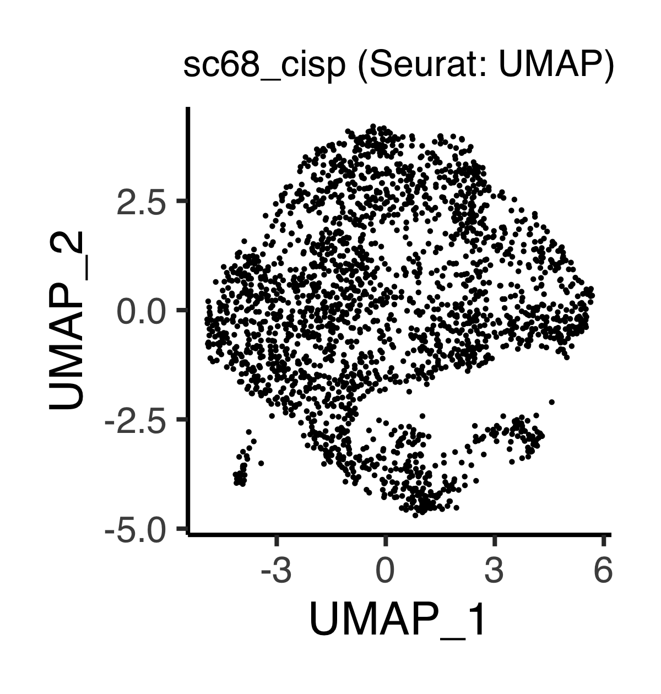
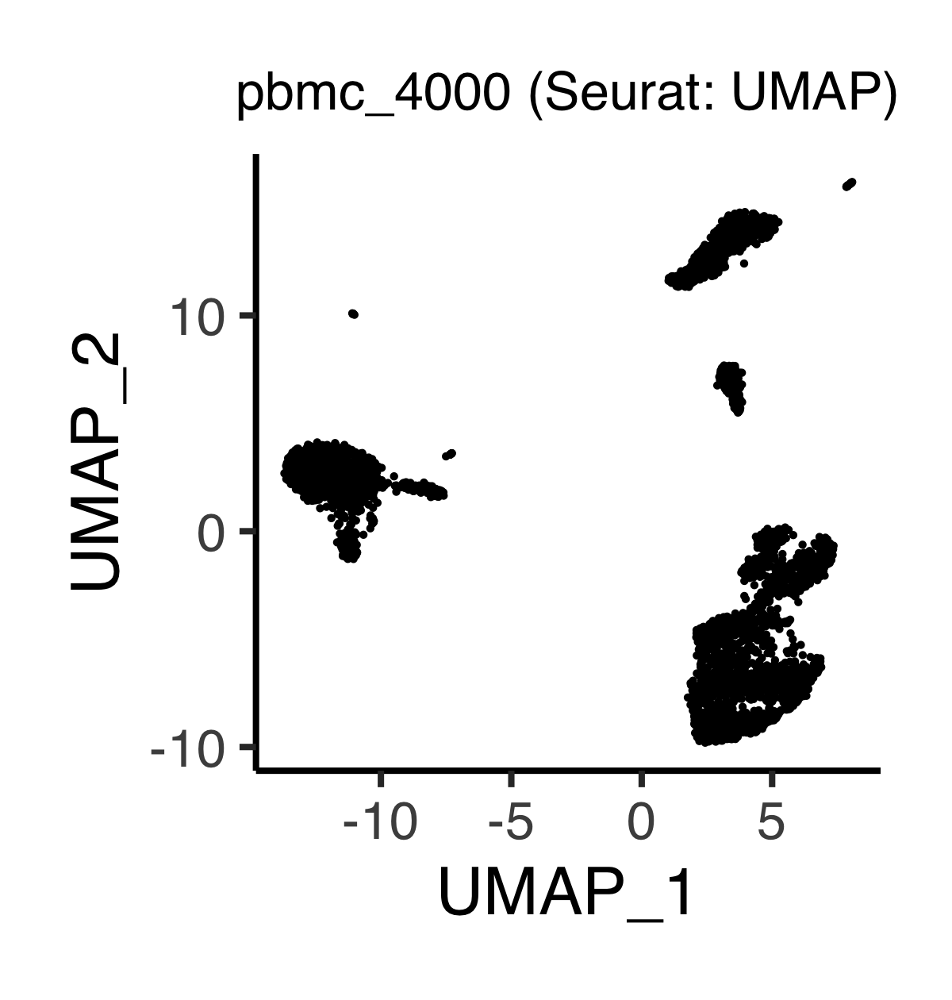


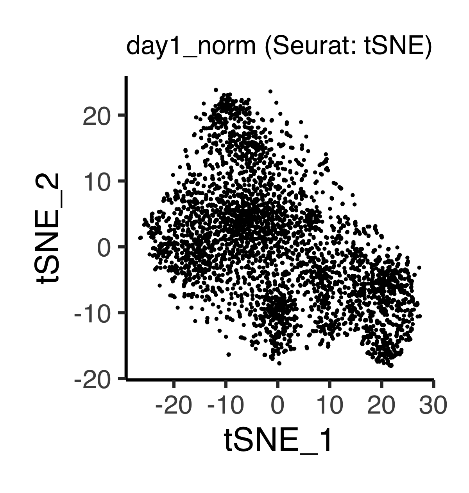
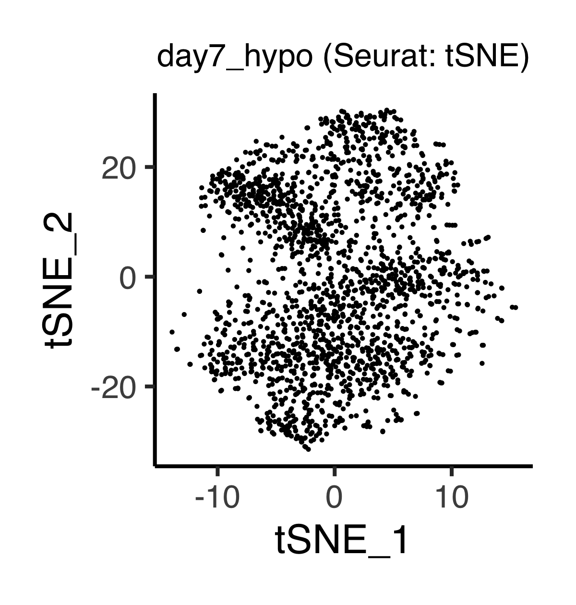


Perform k-means clusterings and compute several clustering validity scores by
using `NbClust()`.
```{r, eval = FALSE}
compute_nbclust <- function(obj, plot_type){
  if(plot_type == "umap"){
    mat <- obj@reductions[["umap"]]@cell.embeddings
  }else if(plot_type == "tsne"){
    mat <- obj@reductions[["tsne"]]@cell.embeddings
  }
  set.seed(8)
  res <- NbClust(mat, distance = "euclidean", min.nc = 2, max.nc = 7,
                 method = "kmeans", index = "all")
  return(res)
}

data <- list(day1_norm, day7_hypo, sc68_vehi, sc68_cisp, pbmc_4000, pbmc_6000)
names <- c("day1_norm", "day7_hypo", "sc68_vehi", "sc68_cisp", "pbmc_4000",
           "pbmc_6000")
nbclust_umap <- list()
nbclust_tsne <- list()
for(i in 1:length(data)){
  nbclust_umap[[i]] <- compute_nbclust(obj = data[[i]], plot_type = "umap")
}
for(i in 1:length(data)){
  nbclust_tsne[[i]] <- compute_nbclust(obj = data[[i]], plot_type = "tsne")
}
names(nbclust_umap) <- names
names(nbclust_tsne) <- names
```

Save the objects.
```{r, eval = FALSE}
saveRDS(nbclust_umap, file = "backup/20_001_nbclust_umap_seurat.rds")
saveRDS(nbclust_tsne, file = "backup/20_002_nbclust_tsne_seurat.rds")
# ----------------------------------------
# Output an excel file
# ----------------------------------------
dnames <- c("day1_norm", "day7_hypo", "sc68_vehi", "sc68_cisp",
            "pbmc_4000", "pbmc_6000")
dlist <- list()
for(i in 1:length(dnames)){
  res <- rbind(nbclust_umap[[dnames[i]]][["All.index"]], "")
  res <- rbind(res, nbclust_umap[[dnames[i]]][["Best.nc"]])
  dlist <- c(dlist, list(res))
}
names(dlist) <- dnames
filename <- "backup/nbclust_umap_seurat.xlsx"
write.xlsx(dlist, file = filename, row.names = TRUE)
```


### Monocle 3
Load the data.
```{r, eval = FALSE}
day1_norm <- readRDS(file = "backup/01_005_day1_norm_normalized.rds")
day7_hypo <- readRDS(file = "backup/02_005_day7_hypo_normalized.rds")
sc68_vehi <- readRDS(file = "backup/03_005_sc68_vehi_normalized.rds")
sc68_cisp <- readRDS(file = "backup/04_005_sc68_cisp_normalized.rds")
pbmc_4000 <- readRDS(file = "backup/05_005_pbmc_4000_normalized.rds")
pbmc_6000 <- readRDS(file = "backup/06_005_pbmc_6000_normalized.rds")
sc68_vehi_bl <- readRDS(file = "backup/13_001_sc68_vehi_blacklist.rds")
```

Remove the outlier cells from `sc68_vehi`.
```{r, eval = FALSE}
# ----------------------------------------
# For `sc68_vehi`
# ----------------------------------------
mat <- sc68_vehi[["data"]][["bayNorm"]][["Bay_out"]]
inds <- which(colnames(mat) %in% sc68_vehi_bl)
sc68_vehi[["data"]][["bayNorm"]][["Bay_out"]] <- mat[, -inds]
sc68_vehi[["sample"]] <- sc68_vehi[["sample"]][-inds,]
```

Create Monocle 3 objects (cell_data_set (CDS)).
```{r, eval = FALSE}
create_monocle_obj <- function(obj){
  cells <- obj[["sample"]][["barcode"]]
  names(cells) <- obj[["sample"]][["barcode"]]
  genes <- obj[["variable"]][["symbol"]]
  names(genes) <- obj[["variable"]][["symbol"]]
  mat <- obj[["data"]][["bayNorm"]][["Bay_out"]]
  obj <- new_cell_data_set(
    expression_data = as.matrix(mat),
    cell_metadata = as.data.frame(cells),
    gene_metadata = data.frame(gene_short_name=genes))
  return(obj)
}

day1_norm <- create_monocle_obj(obj = day1_norm)
day7_hypo <- create_monocle_obj(obj = day7_hypo)
sc68_vehi <- create_monocle_obj(obj = sc68_vehi)
sc68_cisp <- create_monocle_obj(obj = sc68_cisp)
pbmc_4000 <- create_monocle_obj(obj = pbmc_4000)
pbmc_6000 <- create_monocle_obj(obj = pbmc_6000)
```

Preprocess the data under the default settings of Monocle 3 (version 0.2.3.0),
e.g., `num_dim = 50` and `norm_method = "log"`.
```{r, eval = FALSE}
day1_norm <- preprocess_cds(day1_norm)
day7_hypo <- preprocess_cds(day7_hypo)
sc68_vehi <- preprocess_cds(sc68_vehi)
sc68_cisp <- preprocess_cds(sc68_cisp)
pbmc_4000 <- preprocess_cds(pbmc_4000)
pbmc_6000 <- preprocess_cds(pbmc_6000)
```

Users can visualize the results of PCA by the following command:
```{r, eval = FALSE}
plot_pc_variance_explained(day1_norm)
plot_pc_variance_explained(day7_hypo)
plot_pc_variance_explained(sc68_vehi)
plot_pc_variance_explained(sc68_cisp)
plot_pc_variance_explained(pbmc_4000)
plot_pc_variance_explained(pbmc_6000)
```

Reduce the dimensions and visualize the results.
```{r, eval = FALSE}
day1_norm <- reduce_dimension(day1_norm, reduction_method = "UMAP",
                              preprocess_method = "PCA")
day7_hypo <- reduce_dimension(day7_hypo, reduction_method = "UMAP",
                              preprocess_method = "PCA")
sc68_vehi <- reduce_dimension(sc68_vehi, reduction_method = "UMAP",
                              preprocess_method = "PCA")
sc68_cisp <- reduce_dimension(sc68_cisp, reduction_method = "UMAP",
                              preprocess_method = "PCA")
pbmc_4000 <- reduce_dimension(pbmc_4000, reduction_method = "UMAP",
                              preprocess_method = "PCA")
pbmc_6000 <- reduce_dimension(pbmc_6000, reduction_method = "UMAP",
                              preprocess_method = "PCA")
day1_norm <- reduce_dimension(day1_norm, reduction_method = "tSNE",
                              preprocess_method = "PCA")
day7_hypo <- reduce_dimension(day7_hypo, reduction_method = "tSNE",
                              preprocess_method = "PCA")
sc68_vehi <- reduce_dimension(sc68_vehi, reduction_method = "tSNE",
                              preprocess_method = "PCA")
sc68_cisp <- reduce_dimension(sc68_cisp, reduction_method = "tSNE",
                              preprocess_method = "PCA")
pbmc_4000 <- reduce_dimension(pbmc_4000, reduction_method = "tSNE",
                              preprocess_method = "PCA")
pbmc_6000 <- reduce_dimension(pbmc_6000, reduction_method = "tSNE",
                              preprocess_method = "PCA")
```

The following function `plot_manifold()` shows sample states on t-SNE or UMAP
space.
```{r, eval = FALSE}
plot_manifold <- function(obj, plot_type, title, title_size, xlabel, ylabel){
  if(plot_type == "umap"){
    df <- obj@int_colData@listData[["reducedDims"]]@listData[["UMAP"]]
  }else if(plot_type == "tsne"){
    df <- obj@int_colData@listData[["reducedDims"]]@listData[["tSNE"]]
  }
  p <- ggplot() +
    geom_point(aes(x=df[,1], y=df[,2]), color="black", size=0.5, alpha=1.0) +
    labs(title=title, x=xlabel, y=ylabel) +
    theme_classic(base_size=20, base_family="Helvetica") +
    theme(plot.title=element_text(hjust=0.5, size=title_size),
      plot.margin=unit(c(1.5,1.5,1.5,1.5), "lines"), legend.position="right")
  return(p)
}

data <- list(day1_norm, day7_hypo, sc68_vehi, sc68_cisp, pbmc_4000, pbmc_6000)
names <- c("day1_norm", "day7_hypo", "sc68_vehi", "sc68_cisp",
           "pbmc_4000", "pbmc_6000")
for(i in 1:length(data)){
  p <- plot_manifold(obj = data[[i]], plot_type = "umap",
                     title = paste(names[i], " (Monocle 3: UMAP)", sep = ""),
                     title_size = 16, xlabel = "UMAP_1", ylabel = "UMAP_2")
  filename <- paste("figures/figure_", sprintf("%02d", 10 + i), "_0030.png",
                    sep = "")
  ggsave(file = filename, plot = p, dpi = 300, width = 4, height = 4.2)
}
for(i in 1:length(data)){
  p <- plot_manifold(obj = data[[i]], plot_type = "tsne",
                     title = paste(names[i], " (Monocle 3: tSNE)", sep = ""),
                     title_size = 16, xlabel = "tSNE_1", ylabel = "tSNE_2")
  filename <- paste("figures/figure_", sprintf("%02d", 10 + i), "_0031.png",
                    sep = "")
  ggsave(file = filename, plot = p, dpi = 300, width = 4, height = 4.2)
}
```


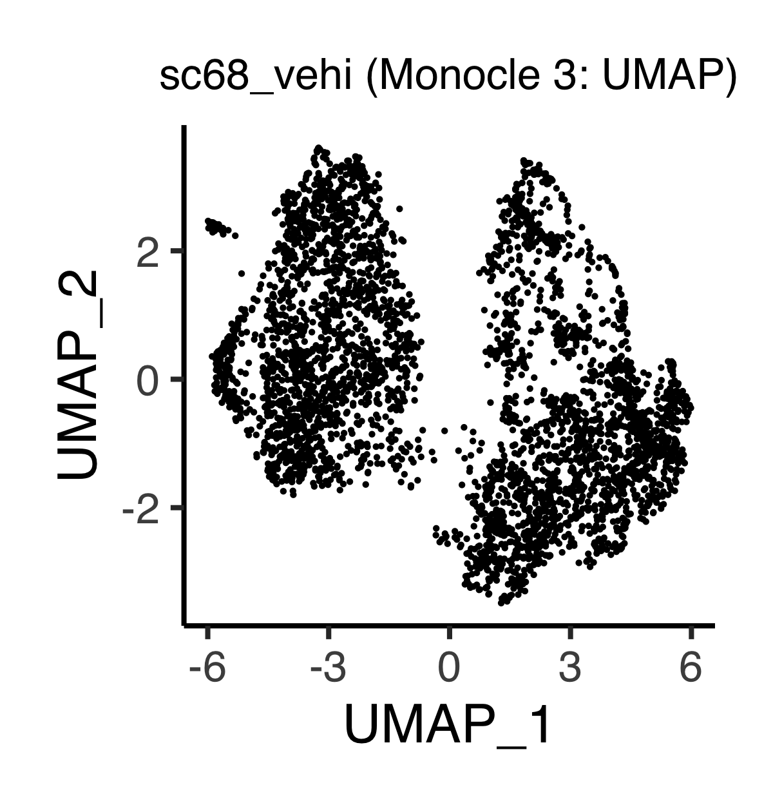

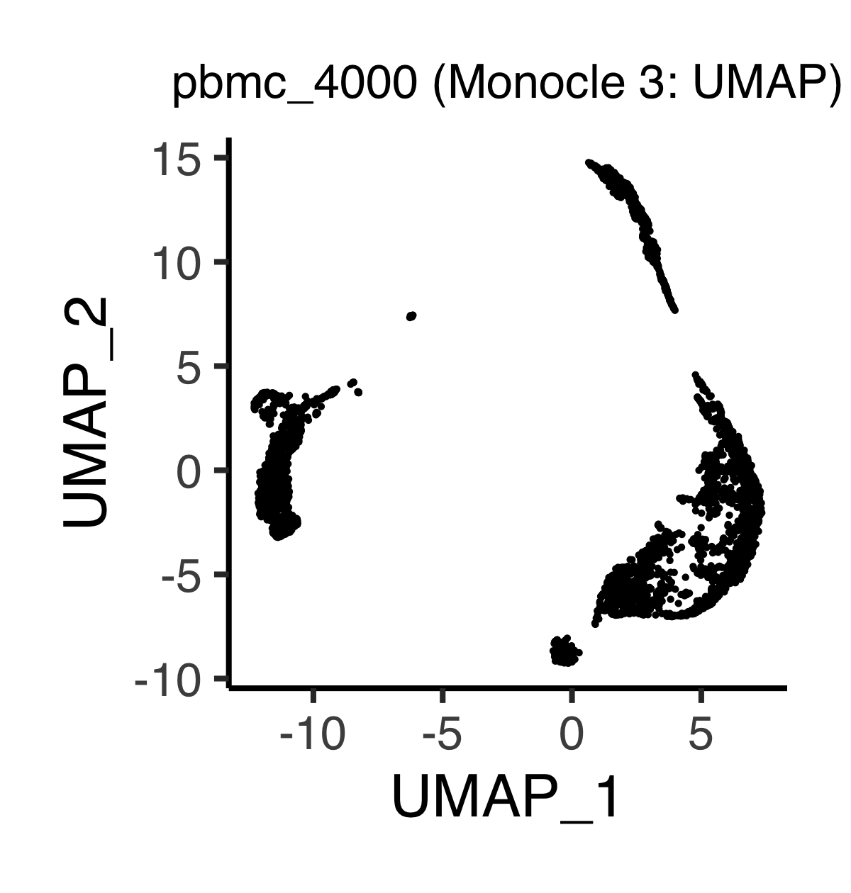


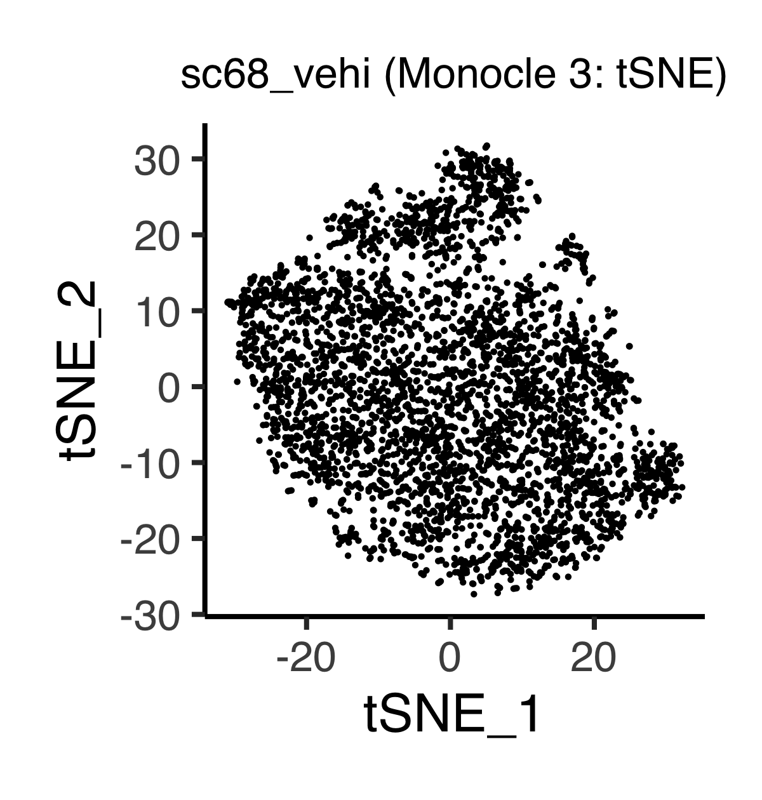


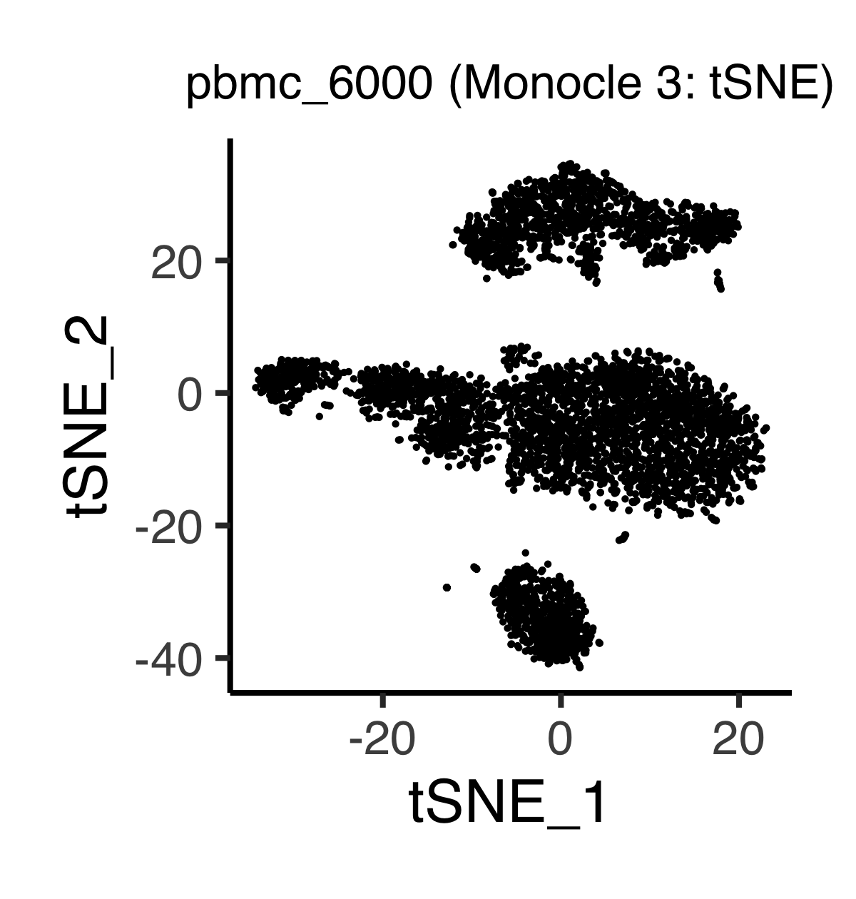

Save the objects.
```{r, eval = FALSE}
saveRDS(day1_norm, file = "backup/11_030_day1_norm_monocle3.rds")
saveRDS(day7_hypo, file = "backup/12_030_day7_hypo_monocle3.rds")
saveRDS(sc68_vehi, file = "backup/13_030_sc68_vehi_monocle3.rds")
saveRDS(sc68_cisp, file = "backup/14_030_sc68_cisp_monocle3.rds")
saveRDS(pbmc_4000, file = "backup/15_030_pbmc_4000_monocle3.rds")
saveRDS(pbmc_6000, file = "backup/16_030_pbmc_6000_monocle3.rds")
```

Load the objects.
```{r, eval = FALSE}
day1_norm <- readRDS(file = "backup/11_030_day1_norm_monocle3.rds")
day7_hypo <- readRDS(file = "backup/12_030_day7_hypo_monocle3.rds")
sc68_vehi <- readRDS(file = "backup/13_030_sc68_vehi_monocle3.rds")
sc68_cisp <- readRDS(file = "backup/14_030_sc68_cisp_monocle3.rds")
pbmc_4000 <- readRDS(file = "backup/15_030_pbmc_4000_monocle3.rds")
pbmc_6000 <- readRDS(file = "backup/16_030_pbmc_6000_monocle3.rds")
```

Perform k-means clusterings and compute several clustering validity scores by
using `NbClust()`.
```{r, eval = FALSE}
compute_nbclust <- function(obj, plot_type){
  if(plot_type == "umap"){
    mat <- obj@int_colData@listData[["reducedDims"]]@listData[["UMAP"]]
  }else if(plot_type == "tsne"){
    mat <- obj@int_colData@listData[["reducedDims"]]@listData[["tSNE"]]
  }
  set.seed(8)
  res <- NbClust(mat, distance = "euclidean", min.nc = 2, max.nc = 7,
                 method = "kmeans", index = "all")
  return(res)
}

data <- list(day1_norm, day7_hypo, sc68_vehi, sc68_cisp, pbmc_4000, pbmc_6000)
names <- c("day1_norm", "day7_hypo", "sc68_vehi", "sc68_cisp", "pbmc_4000",
           "pbmc_6000")
nbclust_umap <- list()
nbclust_tsne <- list()
for(i in 1:length(data)){
  nbclust_umap[[i]] <- compute_nbclust(obj = data[[i]], plot_type = "umap")
}
for(i in 1:length(data)){
  nbclust_tsne[[i]] <- compute_nbclust(obj = data[[i]], plot_type = "tsne")
}
names(nbclust_umap) <- names
names(nbclust_tsne) <- names
```

Save the objects.
```{r, eval = FALSE}
saveRDS(nbclust_umap, file = "backup/30_001_nbclust_umap_monocle3.rds")
saveRDS(nbclust_tsne, file = "backup/30_002_nbclust_tsne_monocle3.rds")
# ----------------------------------------
# Output an excel file
# ----------------------------------------
dnames <- c("day1_norm", "day7_hypo", "sc68_vehi", "sc68_cisp",
            "pbmc_4000", "pbmc_6000")
dlist <- list()
for(i in 1:length(dnames)){
  res <- rbind(nbclust_umap[[dnames[i]]][["All.index"]], "")
  res <- rbind(res, nbclust_umap[[dnames[i]]][["Best.nc"]])
  dlist <- c(dlist, list(res))
}
names(dlist) <- dnames
filename <- "backup/nbclust_umap_monocle3.xlsx"
write.xlsx(dlist, file = filename, row.names = TRUE)
```


### SC3
Load the data.
```{r, eval = FALSE}
day1_norm <- readRDS(file = "backup/01_005_day1_norm_normalized.rds")
day7_hypo <- readRDS(file = "backup/02_005_day7_hypo_normalized.rds")
sc68_vehi <- readRDS(file = "backup/03_005_sc68_vehi_normalized.rds")
sc68_cisp <- readRDS(file = "backup/04_005_sc68_cisp_normalized.rds")
pbmc_4000 <- readRDS(file = "backup/05_005_pbmc_4000_normalized.rds")
pbmc_6000 <- readRDS(file = "backup/06_005_pbmc_6000_normalized.rds")
sc68_vehi_bl <- readRDS(file = "backup/13_001_sc68_vehi_blacklist.rds")
```

Remove the outlier cells from `sc68_vehi`.
```{r, eval = FALSE}
# ----------------------------------------
# For `sc68_vehi`
# ----------------------------------------
mat <- sc68_vehi[["data"]][["bayNorm"]][["Bay_out"]]
inds <- which(colnames(mat) %in% sc68_vehi_bl)
sc68_vehi[["data"]][["bayNorm"]][["Bay_out"]] <- mat[, -inds]

mat <- sc68_vehi[["data"]][["log1p"]]
sc68_vehi[["data"]][["log1p"]] <- mat[, -inds]
sc68_vehi[["sample"]] <- sc68_vehi[["sample"]][-inds,]
```

Create SC3 objects (`SingleCellExperiment`).
```{r, eval = FALSE}
create_sce_object <- function(obj){
  obj_sce <- SingleCellExperiment(
    assay = list(
      counts = as.matrix(obj[["data"]][["bayNorm"]][["Bay_out"]]),
      logcounts = as.matrix(obj[["data"]][["log1p"]])
    ),
    colData = list(barcode = obj[["sample"]][["barcode"]])
  )
  rowData(obj_sce)$feature_symbol <- obj[["variable"]][["symbol"]]
  obj_sce <- obj_sce[!duplicated(rowData(obj_sce)$feature_symbol),]
  
  return(obj_sce)
}

day1_norm <- create_sce_object(obj = day1_norm)
day7_hypo <- create_sce_object(obj = day7_hypo)
sc68_vehi <- create_sce_object(obj = sc68_vehi)
sc68_cisp <- create_sce_object(obj = sc68_cisp)
pbmc_4000 <- create_sce_object(obj = pbmc_4000)
pbmc_6000 <- create_sce_object(obj = pbmc_6000)
```

Run PCA.
```{r, eval = FALSE}
day1_norm <- runPCA(day1_norm)
day7_hypo <- runPCA(day7_hypo)
sc68_vehi <- runPCA(sc68_vehi)
sc68_cisp <- runPCA(sc68_cisp)
pbmc_4000 <- runPCA(pbmc_4000)
pbmc_6000 <- runPCA(pbmc_6000)
```

Run SC3, in which the parameter `ks` is subjectively determined by considering
the biological background of the data.
Here, SC3 could not compute for `sc68_vehi` and `sc68_cisp`.
```{r, eval = FALSE}
day1_norm <- sc3(day1_norm, ks = 2:7, biology = TRUE)
day7_hypo <- sc3(day7_hypo, ks = 2:7, biology = TRUE)
pbmc_4000 <- sc3(pbmc_4000, ks = 2:7, biology = TRUE)
pbmc_6000 <- sc3(pbmc_6000, ks = 2:7, biology = TRUE)
sc68_vehi <- sc3(sc68_vehi, ks = 2:7, biology = TRUE)  # Error
sc68_cisp <- sc3(sc68_cisp, ks = 2:7, biology = TRUE)  # Error
```

Save the objects.
```{r, eval = FALSE}
saveRDS(day1_norm, file = "backup/11_040_day1_norm_sc3.rds")
saveRDS(day7_hypo, file = "backup/12_040_day7_hypo_sc3.rds")
# saveRDS(sc68_vehi, file = "backup/13_040_sc68_vehi_sc3.rds")
# saveRDS(sc68_cisp, file = "backup/14_040_sc68_cisp_sc3.rds")
saveRDS(pbmc_4000, file = "backup/15_040_pbmc_4000_sc3.rds")
saveRDS(pbmc_6000, file = "backup/16_040_pbmc_6000_sc3.rds")
```

Load the objects.
```{r, eval = FALSE}
day1_norm <- readRDS(file = "backup/11_040_day1_norm_sc3.rds")
day7_hypo <- readRDS(file = "backup/12_040_day7_hypo_sc3.rds")
# sc68_vehi <- readRDS(file = "backup/13_040_sc68_vehi_sc3.rds")
# sc68_cisp <- readRDS(file = "backup/14_040_sc68_cisp_sc3.rds")
pbmc_4000 <- readRDS(file = "backup/15_040_pbmc_4000_sc3.rds")
pbmc_6000 <- readRDS(file = "backup/16_040_pbmc_6000_sc3.rds")
```

Compute average silhouette widths.
```{r, eval = FALSE}
compute_asw <- function(obj){
  if(!is.null(obj)){
    res <- list()
    knames <- c()
    for(k in 1:6){
      n <- as.character(k + 1)
#      mat <- obj@metadata[["sc3"]][["consensus"]][[n]][["consensus"]]
#      indices <- c("kl", "ch", "hartigan", "ccc", "scott", "marriot", "trcovw",
#                   "tracew", "friedman", "rubin", "cindex", "db", "silhouette",
#                   "duda", "pseudot2", "beale", "ratkowsky", "ball",
#                   "ptbiserial", "gap", "frey", "mcclain", "gamma", "gplus",
#                   "tau", "dunn", "hubert", "sdindex", "dindex", "sdbw")
#      res[[k]] <- NbClust(mat, method = "ward.D2", index = indices)
      asw <- mean(obj@metadata[["sc3"]][["consensus"]][[n]][["silhouette"]][,3])
      res[[k]] <- asw
      knames[k] <- paste("k_", k + 1, sep = "")
    }
    names(res) <- knames
    return(res)
  }else{
    return(NULL)
  }
}

data <- list(day1_norm, day7_hypo, NULL, NULL, pbmc_4000, pbmc_6000)
names <- c("day1_norm", "day7_hypo", "NULL", "NULL", "pbmc_4000", "pbmc_6000")
asw_sc3 <- list()
for(i in 1:length(data)){
  asw_sc3[[i]] <- compute_nbclust(obj = data[[i]])
}
names(asw_sc3) <- names
```

Save the objects.
```{r, eval = FALSE}
saveRDS(asw_sc3, file = "backup/40_001_asw_sc3.rds")
# ----------------------------------------
# Output an excel file
# ----------------------------------------
dnames <- c("day1_norm", "day7_hypo", "sc68_vehi", "sc68_cisp",
            "pbmc_4000", "pbmc_6000")
res <- c()
for(n in 1:length(dnames)){
  if(!is.null(asw_sc3[[n]])){
    tmp <- t(unlist(asw_sc3[[n]]))
  }else{
    tmp <- matrix(ncol = length(dnames), nrow = 1, NA)
  }
  rownames(tmp) <- dnames[n]
  res <- rbind(res, tmp)
}
filename <- "backup/asw_sc3.xlsx"
write.xlsx(res, file = filename, row.names = TRUE)
```


### Principal component analysis (PCA)
Load the data.
```{r, eval = FALSE}
day1_norm <- readRDS(file = "backup/01_005_day1_norm_normalized.rds")
day7_hypo <- readRDS(file = "backup/02_005_day7_hypo_normalized.rds")
sc68_vehi <- readRDS(file = "backup/03_005_sc68_vehi_normalized.rds")
sc68_cisp <- readRDS(file = "backup/04_005_sc68_cisp_normalized.rds")
pbmc_4000 <- readRDS(file = "backup/05_005_pbmc_4000_normalized.rds")
pbmc_6000 <- readRDS(file = "backup/06_005_pbmc_6000_normalized.rds")
sc68_vehi_bl <- readRDS(file = "backup/13_001_sc68_vehi_blacklist.rds")
```

Remove the outlier cells from `sc68_vehi`.
```{r, eval = FALSE}
# ----------------------------------------
# For `sc68_vehi`
# ----------------------------------------
mat <- sc68_vehi[["data"]][["log1p"]]
inds <- which(colnames(mat) %in% sc68_vehi_bl)
sc68_vehi[["data"]][["log1p"]] <- mat[, -inds]
```

Run PCA for the z-score matrix of gene expression.
```{r, eval = FALSE}
do_pca <- function(obj){
  mat <- t(obj[["data"]][["log1p"]])
  set.seed(8)
  obj[["reduction"]][["pca"]] <- prcomp(mat, scale = TRUE)
  return(obj)
}

day1_norm <- do_pca(day1_norm)
day7_hypo <- do_pca(day7_hypo)
sc68_vehi <- do_pca(sc68_vehi)
sc68_cisp <- do_pca(sc68_cisp)
pbmc_4000 <- do_pca(pbmc_4000)
pbmc_6000 <- do_pca(pbmc_6000)
```

The following command can calculate the cumulative sum over whole sum.
These results are used to determine the dimensions of the principal components.
In what follows, we use the PC whose contribution ratio is greater than
or equal to 0.9 for the first time.
```{r, eval = FALSE}
day1_norm_pc <- which(cumsum(day1_norm[["reduction"]][["pca"]][["sdev"]]) /
                      sum(day1_norm[["reduction"]][["pca"]][["sdev"]]) > 0.9)[1]
day7_hypo_pc <- which(cumsum(day7_hypo[["reduction"]][["pca"]][["sdev"]]) /
                      sum(day7_hypo[["reduction"]][["pca"]][["sdev"]]) > 0.9)[1]
sc68_vehi_pc <- which(cumsum(sc68_vehi[["reduction"]][["pca"]][["sdev"]]) /
                      sum(sc68_vehi[["reduction"]][["pca"]][["sdev"]]) > 0.9)[1]
sc68_cisp_pc <- which(cumsum(sc68_cisp[["reduction"]][["pca"]][["sdev"]]) /
                      sum(sc68_cisp[["reduction"]][["pca"]][["sdev"]]) > 0.9)[1]
pbmc_4000_pc <- which(cumsum(pbmc_4000[["reduction"]][["pca"]][["sdev"]]) /
                      sum(pbmc_4000[["reduction"]][["pca"]][["sdev"]]) > 0.9)[1]
pbmc_6000_pc <- which(cumsum(pbmc_6000[["reduction"]][["pca"]][["sdev"]]) /
                      sum(pbmc_6000[["reduction"]][["pca"]][["sdev"]]) > 0.9)[1]
```

The following functions computes t-SNE and UMAP.
```{r, eval = FALSE}
do_tsne <- function(obj, pca_dim, tsne_dim){
  mat <- as.matrix(obj[["reduction"]][["pca"]][["x"]][, 1:pca_dim])
  set.seed(8)
  res <- Rtsne(mat, dim = tsne_dim, pca = FALSE)
  obj[["reduction"]][["tsne"]] <- res
  return(obj)
}

do_umap <- function(obj, pca_dim, umap_dim){
  mat <- as.matrix(obj[["reduction"]][["pca"]][["x"]][, 1:pca_dim])
  set.seed(8)
  res <- umap(mat, n_components = umap_dim)
  obj[["reduction"]][["umap"]] <- res
  return(obj)
}

day1_norm <- do_umap(obj = day1_norm, pca_dim = day1_norm_pc, umap_dim = 2)
day7_hypo <- do_umap(obj = day7_hypo, pca_dim = day7_hypo_pc, umap_dim = 2)
sc68_vehi <- do_umap(obj = sc68_vehi, pca_dim = sc68_vehi_pc, umap_dim = 2)
sc68_cisp <- do_umap(obj = sc68_cisp, pca_dim = sc68_cisp_pc, umap_dim = 2)
pbmc_4000 <- do_umap(obj = pbmc_4000, pca_dim = pbmc_4000_pc, umap_dim = 2)
pbmc_6000 <- do_umap(obj = pbmc_6000, pca_dim = pbmc_6000_pc, umap_dim = 2)

day1_norm <- do_tsne(obj = day1_norm, pca_dim = day1_norm_pc, tsne_dim = 2)
day7_hypo <- do_tsne(obj = day7_hypo, pca_dim = day7_hypo_pc, tsne_dim = 2)
sc68_vehi <- do_tsne(obj = sc68_vehi, pca_dim = sc68_vehi_pc, tsne_dim = 2)
sc68_cisp <- do_tsne(obj = sc68_cisp, pca_dim = sc68_cisp_pc, tsne_dim = 2)
pbmc_4000 <- do_tsne(obj = pbmc_4000, pca_dim = pbmc_4000_pc, tsne_dim = 2)
pbmc_6000 <- do_tsne(obj = pbmc_6000, pca_dim = pbmc_6000_pc, tsne_dim = 2)
```

Save the objects.
```{r, eval = FALSE}
saveRDS(day1_norm, file = "backup/11_050_day1_norm_pca.rds")
saveRDS(day7_hypo, file = "backup/12_050_day7_hypo_pca.rds")
saveRDS(sc68_vehi, file = "backup/13_050_sc68_vehi_pca.rds")
saveRDS(sc68_cisp, file = "backup/14_050_sc68_cisp_pca.rds")
saveRDS(pbmc_4000, file = "backup/15_050_pbmc_4000_pca.rds")
saveRDS(pbmc_6000, file = "backup/16_050_pbmc_6000_pca.rds")
```

Load the objects.
```{r, eval = FALSE}
day1_norm <- readRDS(file = "backup/11_050_day1_norm_pca.rds")
day7_hypo <- readRDS(file = "backup/12_050_day7_hypo_pca.rds")
sc68_vehi <- readRDS(file = "backup/13_050_sc68_vehi_pca.rds")
sc68_cisp <- readRDS(file = "backup/14_050_sc68_cisp_pca.rds")
pbmc_4000 <- readRDS(file = "backup/15_050_pbmc_4000_pca.rds")
pbmc_6000 <- readRDS(file = "backup/16_050_pbmc_6000_pca.rds")
```

The following function `plot_manifold()` shows sample states on t-SNE or UMAP
space.
```{r, eval = FALSE}
plot_manifold <- function(obj, plot_type, title, title_size, xlabel, ylabel){
  if(plot_type == "umap"){
    df <- obj[["reduction"]][["umap"]][["layout"]]
  }else if(plot_type == "tsne"){
    df <- obj[["reduction"]][["tsne"]][["Y"]]
  }
  p <- ggplot() +
    geom_point(aes(x=df[,1], y=df[,2]), color="black", size=0.5, alpha=1.0) +
    labs(title=title, x=xlabel, y=ylabel) +
    theme_classic(base_size=20, base_family="Helvetica") +
    theme(plot.title=element_text(hjust=0.5, size=title_size),
      plot.margin=unit(c(1.5,1.5,1.5,1.5), "lines"), legend.position="right")
  return(p)
}

data <- list(day1_norm, day7_hypo, sc68_vehi, sc68_cisp, pbmc_4000, pbmc_6000)
names <- c("day1_norm", "day7_hypo", "sc68_vehi", "sc68_cisp",
           "pbmc_4000", "pbmc_6000")
for(i in 1:length(data)){
  p <- plot_manifold(obj = data[[i]], plot_type = "umap",
                     title = paste(names[i], " (PCA + UMAP)", sep = ""),
                     title_size = 16, xlabel = "UMAP_1", ylabel = "UMAP_2")
  filename <- paste("figures/figure_", sprintf("%02d", 10 + i), "_0050.png",
                    sep = "")
  ggsave(file = filename, plot = p, dpi = 300, width = 4, height = 4.2)
}
for(i in 1:length(data)){
  p <- plot_manifold(obj = data[[i]], plot_type = "tsne",
                     title = paste(names[i], " (PCA + tSNE)", sep = ""),
                     title_size = 16, xlabel = "tSNE_1", ylabel = "tSNE_2")
  filename <- paste("figures/figure_", sprintf("%02d", 10 + i), "_0051.png",
                    sep = "")
  ggsave(file = filename, plot = p, dpi = 300, width = 4, height = 4.2)
}
```


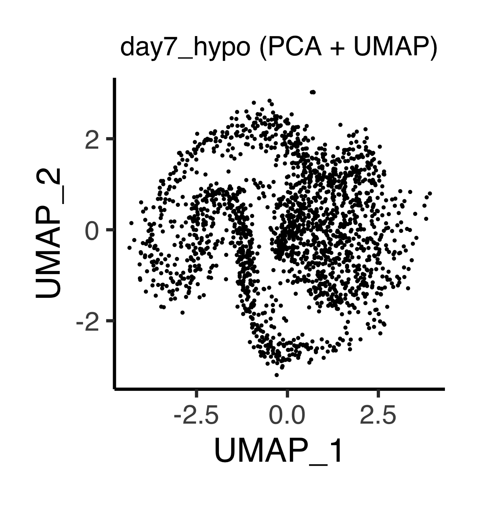


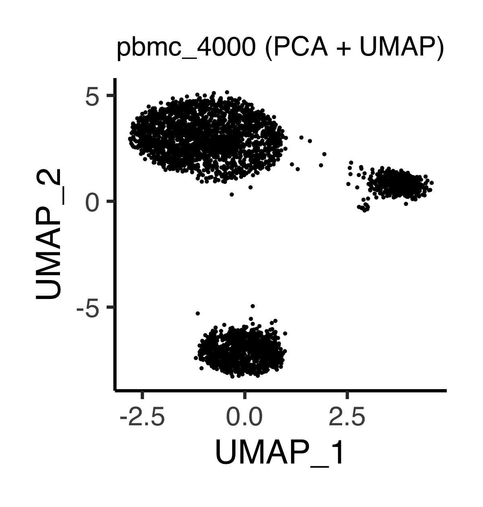
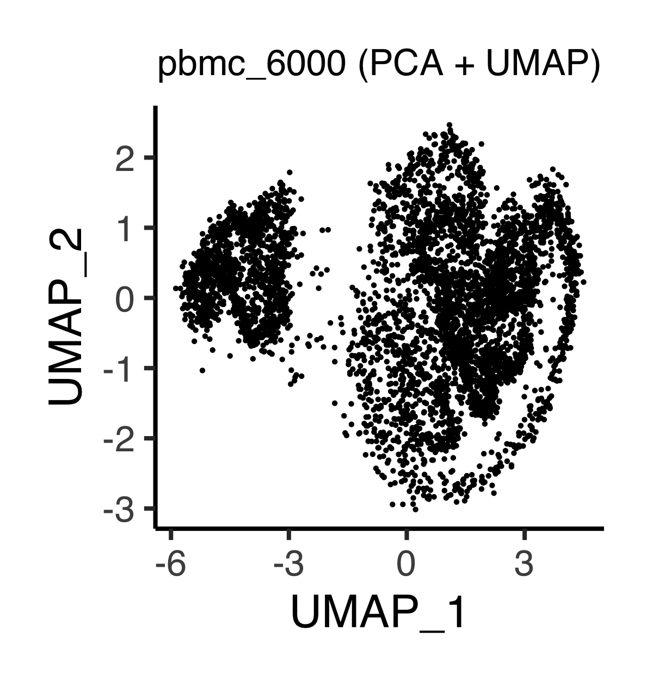

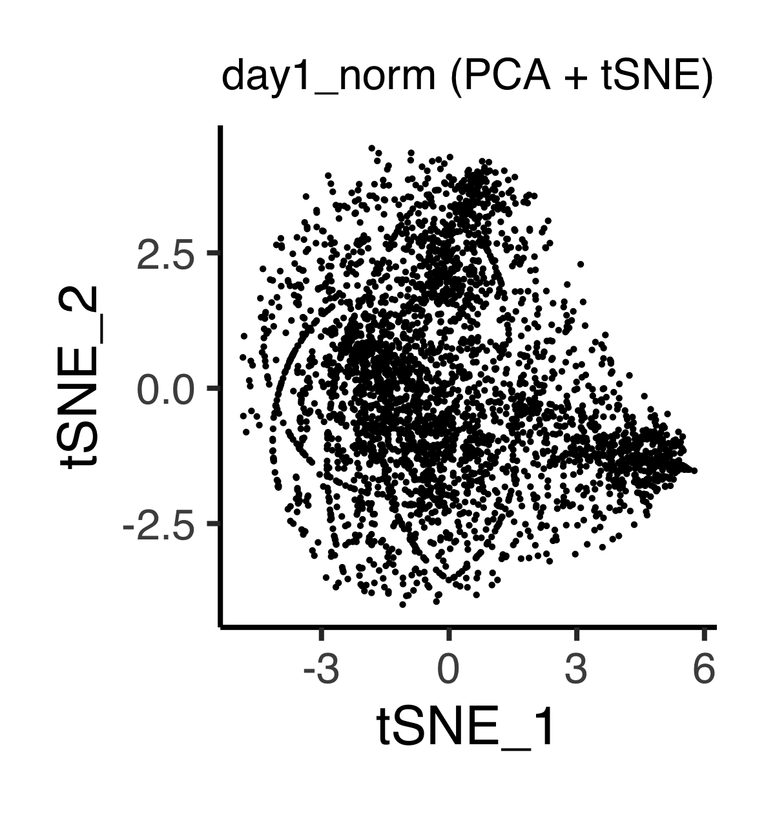
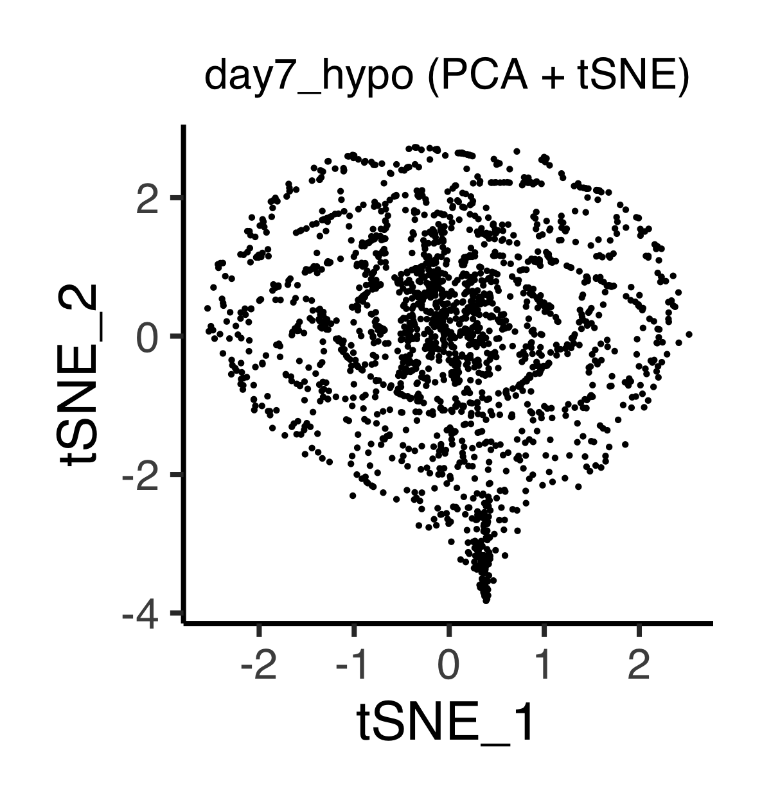


Perform k-means clusterings and compute several clustering validity scores by
using `NbClust()`.
```{r, eval = FALSE}
compute_nbclust <- function(obj, plot_type){
  if(plot_type == "umap"){
    mat <- obj[["reduction"]][["umap"]][["layout"]]
  }else if(plot_type == "tsne"){
    mat <- obj[["reduction"]][["tsne"]][["Y"]]
  }
  set.seed(8)
  res <- NbClust(mat, distance = "euclidean", min.nc = 2, max.nc = 7,
                 method = "kmeans", index = "all")
  return(res)
}

data <- list(day1_norm, day7_hypo, sc68_vehi, sc68_cisp, pbmc_4000, pbmc_6000)
names <- c("day1_norm", "day7_hypo", "sc68_vehi", "sc68_cisp", "pbmc_4000",
           "pbmc_6000")
nbclust_umap <- list()
nbclust_tsne <- list()
for(i in 1:length(data)){
  nbclust_umap[[i]] <- compute_nbclust(obj = data[[i]], plot_type = "umap")
}
for(i in 1:length(data)){
  nbclust_tsne[[i]] <- compute_nbclust(obj = data[[i]], plot_type = "tsne")
}
names(nbclust_umap) <- names
names(nbclust_tsne) <- names
```

Save the objects.
```{r, eval = FALSE}
saveRDS(nbclust_umap, file = "backup/50_001_nbclust_umap_pca.rds")
saveRDS(nbclust_tsne, file = "backup/50_002_nbclust_tsne_pca.rds")
# ----------------------------------------
# Output an excel file
# ----------------------------------------
dnames <- c("day1_norm", "day7_hypo", "sc68_vehi", "sc68_cisp",
            "pbmc_4000", "pbmc_6000")
dlist <- list()
for(i in 1:length(dnames)){
  res <- rbind(nbclust_umap[[dnames[i]]][["All.index"]], "")
  res <- rbind(res, nbclust_umap[[dnames[i]]][["Best.nc"]])
  dlist <- c(dlist, list(res))
}
names(dlist) <- dnames
filename <- "backup/nbclust_umap_pca.xlsx"
write.xlsx(dlist, file = filename, row.names = TRUE)
```


### ASURAT
Note again that ASURAT can cluster cells from the viewpoints of cell type
(by using DO and CO) and biological functions (by using GO, etc.).
In this section, we choose proper databases for producing the greater ASWs.

Load the data.
```{r, eval = FALSE}
source("R/function_general.R")
source("R/function_sign.R")
source("R/plot.R")
day1_norm <- readRDS(file = "backup/01_500_day1_norm_all.rds")
day7_hypo <- readRDS(file = "backup/02_500_day7_hypo_all.rds")
sc68_vehi <- readRDS(file = "backup/03_005_sc68_vehi_normalized.rds")
sc68_cisp <- readRDS(file = "backup/04_005_sc68_cisp_normalized.rds")
pbmc_4000 <- readRDS(file = "backup/05_500_pbmc_4000_all.rds")
pbmc_6000 <- readRDS(file = "backup/06_500_pbmc_6000_all.rds")
sc68_vehi_bl <- readRDS(file = "backup/13_001_sc68_vehi_blacklist.rds")
```

Remove the outlier cells from `sc68_vehi`.
```{r, eval = FALSE}
# ----------------------------------------
# For `sc68_vehi`
# ----------------------------------------
mat <- sc68_vehi[["data"]][["bayNorm"]][["Bay_out"]]
inds <- which(colnames(mat) %in% sc68_vehi_bl)
sc68_vehi[["data"]][["bayNorm"]][["Bay_out"]] <- mat[, -inds]

mat <- sc68_vehi[["data"]][["log1p"]]
sc68_vehi[["data"]][["log1p"]] <- mat[, -inds]

mat <- sc68_vehi[["data"]][["centered"]]
sc68_vehi[["data"]][["centered"]] <- mat[, -inds]
sc68_vehi[["sample"]] <- sc68_vehi[["sample"]][-inds,]
```

Compute the correlation matrix for `sc68_vehi` and save the result.
```{r, eval = FALSE}
do_cor_variables <- function(obj, method){
  res <- list()
  tmat <- t(obj[["data"]][["log1p"]])
  for(m in method){
    res <- c(res, list(cor(tmat, method = m)))
  }
  names(res) <- method
  return(res)
}
sc68_vehi_cor <- do_cor_variables(obj = sc68_vehi, method = c("spearman"))

# Save the correlation matrix.
saveRDS(sc68_vehi_cor, file = "backup/13_002_sc68_vehi_correlation_wo_bl.rds")

# Load the correlation matrix.
sc68_vehi_cor <- readRDS(file = "backup/13_002_sc68_vehi_correlation_wo_bl.rds")
```

Below are the R codes to obtain the low-dimensional representations for
`sc68_vehi` and `sc68_cisp`.
Please see Chapter 8 "ASURAT using Disease Ontology DB" for the details.
```{r, eval = FALSE}
sc68_vehi_cor <- readRDS(file = "backup/13_002_sc68_vehi_correlation_wo_bl.rds")
sc68_cisp_cor <- readRDS(file = "backup/04_006_sc68_cisp_correlation.rds")
tidy_DO <- readRDS(file = "data/2020_001_databases/20201213_tidy_DO_human.rds")
IC_DO <- readRDS(file = "data/2020_001_databases/20201213_IC_DO_human.rds")
sc68_vehi[["sign"]][["DO"]] <- tidy_DO
sc68_cisp[["sign"]][["DO"]] <- tidy_DO
sc68_vehi <- do_quickQC_sign(obj = sc68_vehi, data_type = "DO",
                             min_ngenes = 2, max_ngenes = 1000)
sc68_cisp <- do_quickQC_sign(obj = sc68_cisp, data_type = "DO",
                             min_ngenes = 2, max_ngenes = 1000)
sc68_vehi <- separate_variables_sign(obj = sc68_vehi, obj_cor = sc68_vehi_cor,
                                     data_type = "DO", method = "spearman",
                                     th_posi = 0.36, th_nega = -0.22)
sc68_cisp <- separate_variables_sign(obj = sc68_cisp, obj_cor = sc68_cisp_cor,
                                     data_type = "DO", method = "spearman",
                                     th_posi = 0.38, th_nega = -0.26)
sc68_vehi <- select_sign(obj = sc68_vehi, data_type = "DO",
                         min_cnt = 2, min_cnt_weak = 2)
sc68_cisp <- select_sign(obj = sc68_cisp, data_type = "DO",
                         min_cnt = 2, min_cnt_weak = 2)
sc68_vehi <- compute_SemSim_sign(obj = sc68_vehi, data_type = "DO",
                                 measure = "Jiang", orgdb = NULL,
                                 treeTable = NULL, IC = IC_DO)
sc68_cisp <- compute_SemSim_sign(obj = sc68_cisp, data_type = "DO",
                                 measure = "Jiang", orgdb = NULL,
                                 treeTable = NULL, IC = IC_DO)
sc68_vehi <- reduce_sign(obj = sc68_vehi, data_type = "DO",
                         threshold = 0.80, keep_rareID = TRUE)
sc68_cisp <- reduce_sign(obj = sc68_cisp, data_type = "DO",
                         threshold = 0.80, keep_rareID = TRUE)
sc68_vehi <- make_signxsample_matrix(obj = sc68_vehi, data_type = "DO",
                                     weight_strg = 0.5, weight_vari = 0.5)
sc68_cisp <- make_signxsample_matrix(obj = sc68_cisp, data_type = "DO",
                                     weight_strg = 0.5, weight_vari = 0.5)
sc68_vehi <- do_tsne_sign(obj = sc68_vehi, data_type = "DO",
                          category = "disease", pca_dim = NULL, tsne_dim = 2)
sc68_cisp <- do_tsne_sign(obj = sc68_cisp, data_type = "DO",
                          category = "disease", pca_dim = NULL, tsne_dim = 2)
```

Run `umap` for all the data.
```{r, eval = FALSE}
day1_norm <- do_umap_sign(obj = day1_norm, data_type = "GO",
                          category = "BP", pca_dim = NULL, umap_dim = 2)
day7_hypo <- do_umap_sign(obj = day7_hypo, data_type = "GO",
                          category = "BP", pca_dim = NULL, umap_dim = 2)
sc68_vehi <- do_umap_sign(obj = sc68_vehi, data_type = "DO",
                          category = "disease", pca_dim = NULL, umap_dim = 2)
sc68_cisp <- do_umap_sign(obj = sc68_cisp, data_type = "DO",
                          category = "disease", pca_dim = NULL, umap_dim = 2)
pbmc_4000 <- do_umap_sign(obj = pbmc_4000, data_type = "CO",
                          category = "cell", pca_dim = NULL, umap_dim = 2)
pbmc_6000 <- do_umap_sign(obj = pbmc_6000, data_type = "GO",
                          category = "BP", pca_dim = NULL, umap_dim = 2)
```

Visualize the results.
```{r, eval = FALSE}
# ----------------------------------------
# UMAP
# ----------------------------------------
p <- plot_umap_sign(obj = day1_norm, data_type = "GO", category = "BP",
                    algo_name = NULL, theta = NULL, phi = NULL,
                    title = "day1_norm (GO: BP)", title_size = 16,
                    xlabel = "UMAP_1", ylabel = "UMAP_2", zlabel = NULL,
                    default_color = FALSE)
filename <- "figures/figure_11_0060.png"
ggsave(file = filename, plot = p, dpi = 300, width = 4, height = 4.2)
```

```{r, eval = FALSE, echo = FALSE, results = "hide"}
p <- plot_umap_sign(obj = day7_hypo, data_type = "GO", category = "BP",
                    algo_name = NULL, theta = NULL, phi = NULL,
                    title = "day7_hypo (GO: BP)", title_size = 16,
                    xlabel = "UMAP_1", ylabel = "UMAP_2", zlabel = NULL,
                    default_color = FALSE)
filename <- "figures/figure_12_0060.png"
ggsave(file = filename, plot = p, dpi = 300, width = 4, height = 4.2)
p <- plot_umap_sign(obj = sc68_vehi, data_type = "DO", category = "disease",
                    algo_name = NULL, theta = NULL, phi = NULL,
                    title = "sc68_vehi (DO: disease)", title_size = 16,
                    xlabel = "UMAP_1", ylabel = "UMAP_2", zlabel = NULL,
                    default_color = FALSE)
filename <- "figures/figure_13_0060.png"
ggsave(file = filename, plot = p, dpi = 300, width = 4, height = 4.2)
p <- plot_umap_sign(obj = sc68_cisp, data_type = "DO", category = "disease",
                    algo_name = NULL, theta = NULL, phi = NULL,
                    title = "sc68_cisp (DO: disease)", title_size = 16,
                    xlabel = "UMAP_1", ylabel = "UMAP_2", zlabel = NULL,
                    default_color = FALSE)
filename <- "figures/figure_14_0060.png"
ggsave(file = filename, plot = p, dpi = 300, width = 4, height = 4.2)
p <- plot_umap_sign(obj = pbmc_4000, data_type = "CO", category = "cell",
                    algo_name = NULL, theta = NULL, phi = NULL,
                    title = "pbmc_4000 (CO: cell)", title_size = 16,
                    xlabel = "UMAP_1", ylabel = "UMAP_2", zlabel = NULL,
                    default_color = FALSE)
filename <- "figures/figure_15_0060.png"
ggsave(file = filename, plot = p, dpi = 300, width = 4, height = 4.2)
p <- plot_umap_sign(obj = pbmc_6000, data_type = "GO", category = "BP",
                    algo_name = NULL, theta = NULL, phi = NULL,
                    title = "pbmc_6000 (GO: BP)", title_size = 18,
                    xlabel = "UMAP_1", ylabel = "UMAP_2", zlabel = NULL,
                    default_color = FALSE)
filename <- "figures/figure_16_0060.png"
ggsave(file = filename, plot = p, dpi = 300, width = 4, height = 4.2)
# ----------------------------------------
# t-SNE
# ----------------------------------------
p <- plot_tsne_sign(obj = day1_norm, data_type = "GO", category = "BP",
                    algo_name = NULL, theta = NULL, phi = NULL,
                    title = "day1_norm (GO: BP)", title_size = 16,
                    xlabel = "tSNE_1", ylabel = "tSNE_2", zlabel = NULL,
                    default_color = FALSE)
filename <- "figures/figure_11_0061.png"
ggsave(file = filename, plot = p, dpi = 300, width = 4, height = 4.2)
p <- plot_tsne_sign(obj = day7_hypo, data_type = "GO", category = "BP",
                    algo_name = NULL, theta = NULL, phi = NULL,
                    title = "day7_hypo (GO: BP)", title_size = 16,
                    xlabel = "tSNE_1", ylabel = "tSNE_2", zlabel = NULL,
                    default_color = FALSE)
filename <- "figures/figure_12_0061.png"
ggsave(file = filename, plot = p, dpi = 300, width = 4, height = 4.2)
p <- plot_tsne_sign(obj = sc68_vehi, data_type = "DO", category = "disease",
                    algo_name = NULL, theta = NULL, phi = NULL,
                    title = "sc68_vehi (DO: disease)", title_size = 16,
                    xlabel = "tSNE_1", ylabel = "tSNE_2", zlabel = NULL,
                    default_color = FALSE)
filename <- "figures/figure_13_0061.png"
ggsave(file = filename, plot = p, dpi = 300, width = 4, height = 4.2)
p <- plot_tsne_sign(obj = sc68_cisp, data_type = "DO", category = "disease",
                    algo_name = NULL, theta = NULL, phi = NULL,
                    title = "sc68_cisp (DO: disease)", title_size = 16,
                    xlabel = "tSNE_1", ylabel = "tSNE_2", zlabel = NULL,
                    default_color = FALSE)
filename <- "figures/figure_14_0061.png"
ggsave(file = filename, plot = p, dpi = 300, width = 4, height = 4.2)
p <- plot_tsne_sign(obj = pbmc_4000, data_type = "CO", category = "cell",
                    algo_name = NULL, theta = NULL, phi = NULL,
                    title = "pbmc_4000 (CO: cell)", title_size = 16,
                    xlabel = "tSNE_1", ylabel = "tSNE_2", zlabel = NULL,
                    default_color = FALSE)
filename <- "figures/figure_15_0061.png"
ggsave(file = filename, plot = p, dpi = 300, width = 4, height = 4.2)
p <- plot_tsne_sign(obj = pbmc_6000, data_type = "GO", category = "BP",
                    algo_name = NULL, theta = NULL, phi = NULL,
                    title = "pbmc_6000 (GO: BP)", title_size = 16,
                    xlabel = "tSNE_1", ylabel = "tSNE_2", zlabel = NULL,
                    default_color = FALSE)
filename <- "figures/figure_16_0061.png"
ggsave(file = filename, plot = p, dpi = 300, width = 4, height = 4.2)
```

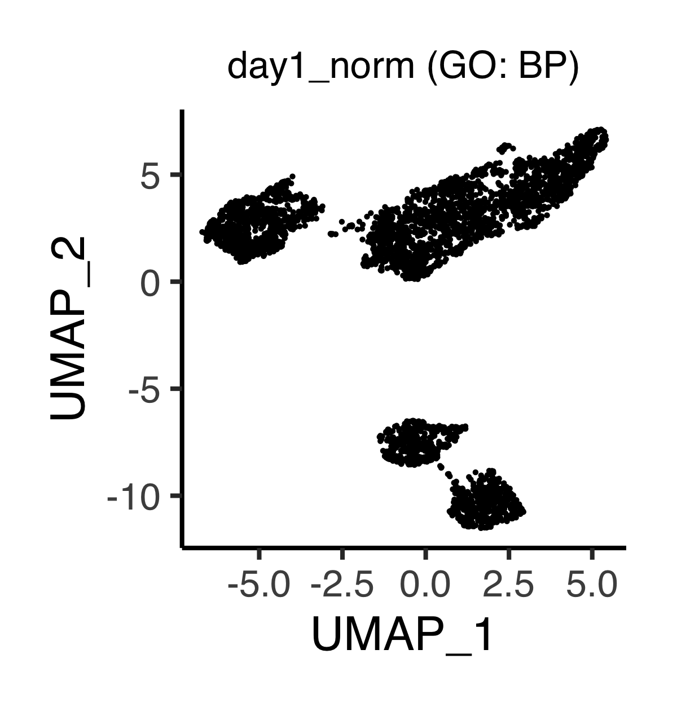


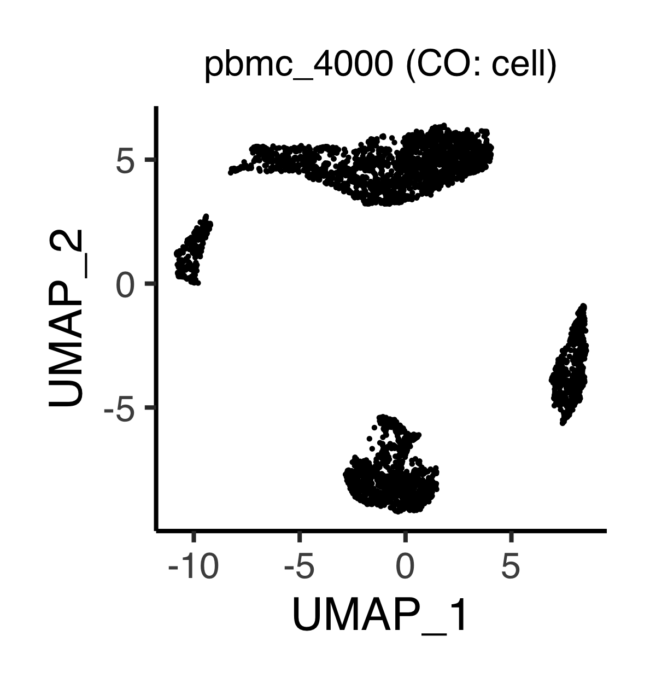


Save the objects.
```{r, eval = FALSE}
saveRDS(day1_norm, file = "backup/11_060_day1_norm_asurat.rds")
saveRDS(day7_hypo, file = "backup/12_060_day7_hypo_asurat.rds")
saveRDS(sc68_vehi, file = "backup/13_060_sc68_vehi_asurat.rds")
saveRDS(sc68_cisp, file = "backup/14_060_sc68_cisp_asurat.rds")
saveRDS(pbmc_4000, file = "backup/15_060_pbmc_4000_asurat.rds")
saveRDS(pbmc_6000, file = "backup/16_060_pbmc_6000_asurat.rds")
```

Load the objects.
```{r, eval = FALSE}
day1_norm <- readRDS(file = "backup/11_060_day1_norm_asurat.rds")
day7_hypo <- readRDS(file = "backup/12_060_day7_hypo_asurat.rds")
sc68_vehi <- readRDS(file = "backup/13_060_sc68_vehi_asurat.rds")
sc68_cisp <- readRDS(file = "backup/14_060_sc68_cisp_asurat.rds")
pbmc_4000 <- readRDS(file = "backup/15_060_pbmc_4000_asurat.rds")
pbmc_6000 <- readRDS(file = "backup/16_060_pbmc_6000_asurat.rds")
```

Perform k-means clusterings and compute several clustering validity scores by
using `NbClust()`.
```{r, eval = FALSE}
compute_nbclust <- function(obj, plot_type, data_type, category){
  if(plot_type == "umap"){
    mat <- obj[["reduction"]][["umap"]][[data_type]][[category]][["layout"]]
  }else if(plot_type == "tsne"){
    mat <- obj[["reduction"]][["tsne"]][[data_type]][[category]][["Y"]]
  }
  set.seed(8)
  res <- NbClust(mat, distance = "euclidean", min.nc = 2, max.nc = 7,
                 method = "kmeans", index = "all")
  return(res)
}

data <- list(day1_norm, day7_hypo, sc68_vehi, sc68_cisp, pbmc_4000, pbmc_6000)
names <- c("day1_norm", "day7_hypo", "sc68_vehi", "sc68_cisp", "pbmc_4000",
           "pbmc_6000")
data_types <- c("GO", "GO", "DO", "DO", "CO", "GO")
categories <- c("BP", "BP", "disease", "disease", "cell", "BP")
nbclust_umap <- list()
nbclust_tsne <- list()
for(i in 1:length(data)){
  nbclust_umap[[i]] <- compute_nbclust(obj = data[[i]], plot_type = "umap",
                                       data_types[i], categories[i])
}
for(i in 1:length(data)){
  nbclust_tsne[[i]] <- compute_nbclust(obj = data[[i]], plot_type = "tsne",
                                       data_types[i], categories[i])
}
names(nbclust_umap) <- names
names(nbclust_tsne) <- names
```

Save the objects.
```{r, eval = FALSE}
saveRDS(nbclust_umap, file = "backup/60_001_nbclust_umap_asurat.rds")
saveRDS(nbclust_tsne, file = "backup/60_002_nbclust_tsne_asurat.rds")
# ----------------------------------------
# Output an excel file
# ----------------------------------------
dnames <- c("day1_norm", "day7_hypo", "sc68_vehi", "sc68_cisp",
            "pbmc_4000", "pbmc_6000")
dlist <- list()
for(i in 1:length(dnames)){
  res <- rbind(nbclust_umap[[dnames[i]]][["All.index"]], "")
  res <- rbind(res, nbclust_umap[[dnames[i]]][["Best.nc"]])
  dlist <- c(dlist, list(res))
}
names(dlist) <- dnames
filename <- "backup/nbclust_umap_asurat.xlsx"
write.xlsx(dlist, file = filename, row.names = TRUE)
```


### Comparing clustering validity indices
Load the objects.
```{r, eval = FALSE}
nbclust_umap_seurat   <- readRDS(file = "backup/20_001_nbclust_umap_seurat.rds")
nbclust_umap_monocle3 <- readRDS(
  file = "backup/30_001_nbclust_umap_monocle3.rds")
asw_sc3               <- readRDS(file = "backup/40_001_asw_sc3.rds")
nbclust_umap_pca      <- readRDS(file = "backup/50_001_nbclust_umap_pca.rds")
nbclust_umap_asurat   <- readRDS(file = "backup/60_001_nbclust_umap_asurat.rds")

nbclust_tsne_seurat   <- readRDS(file = "backup/20_002_nbclust_tsne_seurat.rds")
nbclust_tsne_monocle3 <- readRDS(
  file = "backup/30_002_nbclust_tsne_monocle3.rds")
nbclust_tsne_pca      <- readRDS(file = "backup/50_002_nbclust_tsne_pca.rds")
nbclust_tsne_asurat   <- readRDS(file = "backup/60_002_nbclust_tsne_asurat.rds")
```

Plot the average silhouette widths across all the methods.
```{r, eval = FALSE}
method_names <- c("Seurat", "Monocle 3", "SC3", "PCA", "ASURAT")
max_k <- 6  # ASWs are computed for k = 2, 3, ..., (max_k + 1),
            # where k is the number of clusters
xlabel <- "Number of clusters"
ylabel <- "Average silhouette width"
# ========================================
# UMAP
# ========================================
names <- c("day1_norm (UMAP)", "day7_hypo (UMAP)", "sc68_vehi (UMAP)",
           "sc68_cisp (UMAP)", "pbmc_4000 (UMAP)", "pbmc_6000 (UMAP)")
ymin <- 0.3
ymax <- 0.905
for(i in 1:6){
  # ----------------------------------------
  # From day1_norm (i = 1) to pbmc_6000 (i = 6)
  # ----------------------------------------
  si <- list(
    as.data.frame(nbclust_umap_seurat[[i]][["All.index"]])$Silhouette,
    as.data.frame(nbclust_umap_monocle3[[i]][["All.index"]])$Silhouette,
    as.numeric(unlist(asw_sc3[[i]])),
    as.data.frame(nbclust_umap_pca[[i]][["All.index"]])$Silhouette,
    as.data.frame(nbclust_umap_asurat[[i]][["All.index"]])$Silhouette)
  res <- c()
  for(l in 1:length(si)){
    for(k in 1:max_k){
      if(l != 3){    # For other than SC3
        res <- rbind(res, c(k + 1, si[[l]][k], l, method_names[l]))
      }else{
        if((i != 3) & (i != 4)){    # For other than `sc68_vehi` and `sc68_cisp`
          res <- rbind(res, c(k + 1, si[[l]][k], l, method_names[l]))
        }else{
          res <- rbind(res, c(k + 1, log(0), l, method_names[l]))
        }
      }
    }
  }
  colnames(res) <- c("identity", "asw", "method_id", "method_name")
  df <- as.data.frame(res)
  my_colors <- brewer.pal(5, name = "Set1")
  # ----------------------------------------
  # For annotations
  # ----------------------------------------
  if((i == 5) || (i == 6)){
    anno_xmin = 3.7
    anno_xmax = 6.3
  }else{
    anno_xmin = 0
    anno_xmax = 0
  }
  p <- ggplot() +
    geom_hline(yintercept = .6, linetype = "dashed", col = "black", size = .8) +
    annotate("rect", xmin = anno_xmin, xmax = anno_xmax,
             ymin = ymin, ymax = ymax, alpha = 0.3,
             color = "black", fill = "gray") +
    geom_point(aes(x = as.integer(df[,1]), y = as.numeric(df[,2]),
                   color = as.factor(df[,3])), size = 5, alpha = 0.8) +
    labs(title = names[i], x = "Number of clusters",
         y = "Average silhouette width", colour = "") +
    xlim(1.7, (max_k+1+0.3)) + ylim(ymin, ymax) +
    scale_colour_manual(values = my_colors, name = "Method",
                        labels = unique(df[,4])) +
    theme_classic(base_size = 22, base_family = "Helvetica") +
    theme(plot.title = element_text(hjust = 0.5, size = 16),
          plot.margin = unit(c(1.5,1.5,1.5,1.5), "lines"),
          legend.position = "right") +
    coord_cartesian(clip = 'off')
  filename <- paste("figures/figure_90_", sprintf("%04d", i), ".png", sep = "")
  ggsave(file = filename, plot = p, dpi = 300, width = 6.7, height = 4.5)
}
# ========================================
# t-SNE
# ========================================
names <- c("day1_norm (t-SNE)", "day7_hypo (t-SNE)", "sc68_vehi (t-SNE)",
           "sc68_cisp (t-SNE)", "pbmc_4000 (t-SNE)", "pbmc_6000 (t-SNE)")
ymin <- 0.3
ymax <- 0.67
for(i in 1:6){
  # ----------------------------------------
  # From day1_norm (i = 1) to pbmc_6000 (i = 6)
  # ----------------------------------------
  si <- list(
    as.data.frame(nbclust_tsne_seurat[[i]][["All.index"]])$Silhouette,
    as.data.frame(nbclust_tsne_monocle3[[i]][["All.index"]])$Silhouette,
    NA,
    as.data.frame(nbclust_tsne_pca[[i]][["All.index"]])$Silhouette,
    as.data.frame(nbclust_tsne_asurat[[i]][["All.index"]])$Silhouette)
  res <- c()
  for(l in 1:length(si)){
    for(k in 1:max_k){
      if(!is.na(si[[l]])){
        res <- rbind(res, c(k + 1, si[[l]][k], l, method_names[l]))
      }else{
        next
      }
    }
  }
  colnames(res) <- c("identity", "asw", "method_id", "method_name")
  df <- as.data.frame(res)
  my_colors <- brewer.pal(5, name = "Set1")
  my_colors[3] <- my_colors[4]
  my_colors[4] <- my_colors[5]
  # ----------------------------------------
  # For annotations
  # ----------------------------------------
  if((i == 5) || (i == 6)){
    anno_xmin = 3.7
    anno_xmax = 6.3
  }else{
    anno_xmin = 0
    anno_xmax = 0
  }
  p <- ggplot() +
    annotate("rect", xmin = anno_xmin, xmax = anno_xmax,
             ymin = ymin, ymax = ymax, alpha = 0.3,
             color = "black", fill = "gray") +
    geom_point(aes(x = as.integer(df[,1]), y = as.numeric(df[,2]),
                   color = as.factor(df[,3])), size = 5, alpha = 0.8) +
    labs(title = names[i], x = "Number of clusters",
         y = "Average silhouette width", colour = "") +
    xlim(1.7, (max_k+1+0.3)) + ylim(ymin, ymax) +
    scale_colour_manual(values = my_colors, name = "Method",
                        labels = unique(df[,4])) +
    theme_classic(base_size = 22, base_family = "Helvetica") +
    theme(plot.title = element_text(hjust = 0.5, size = 16),
          plot.margin = unit(c(1.5,1.5,1.5,1.5), "lines"),
          legend.position = "right") +
    coord_cartesian(clip = 'off')
  filename <- paste("figures/figure_91_", sprintf("%04d", i), ".png", sep = "")
  ggsave(file = filename, plot = p, dpi = 300, width = 6.7, height = 4.5)
}
```


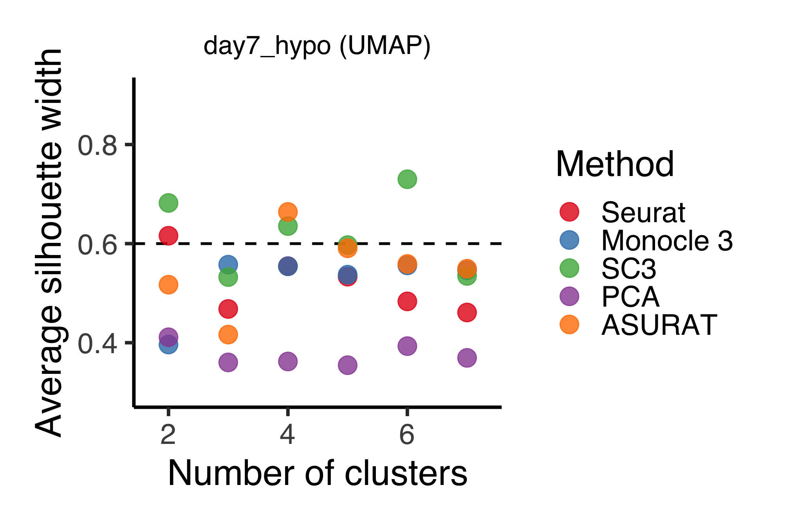
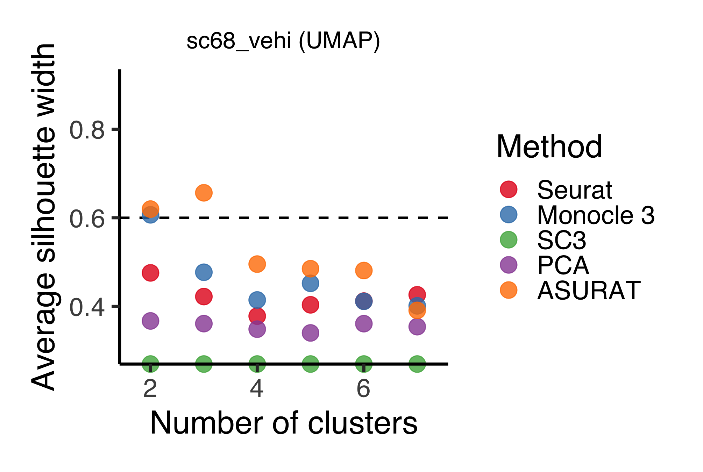
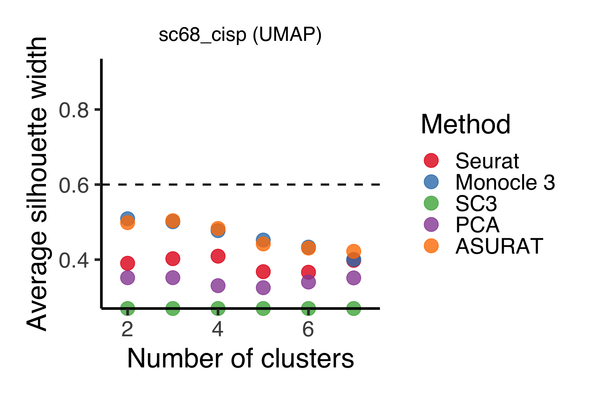
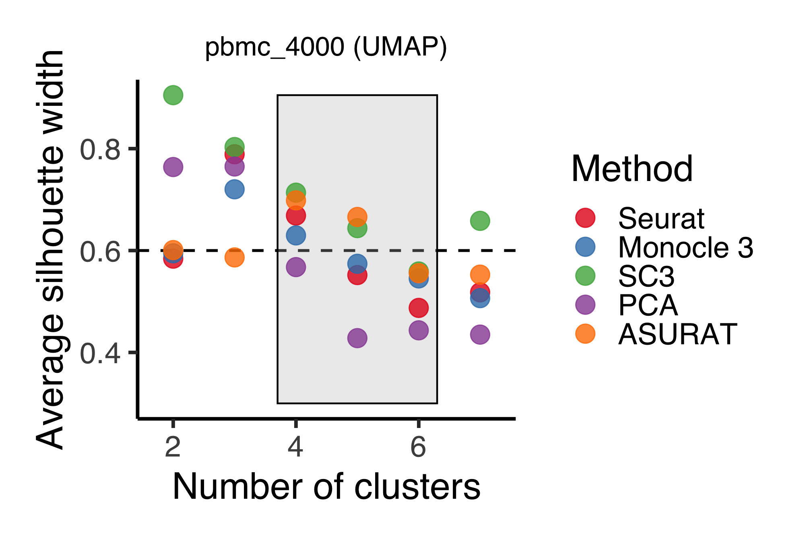
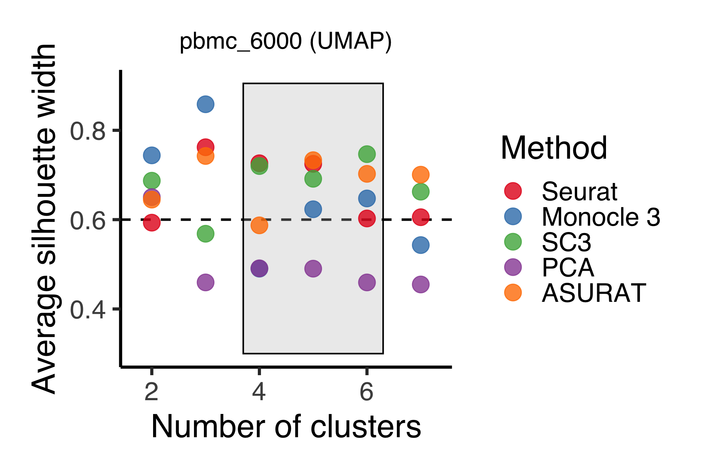

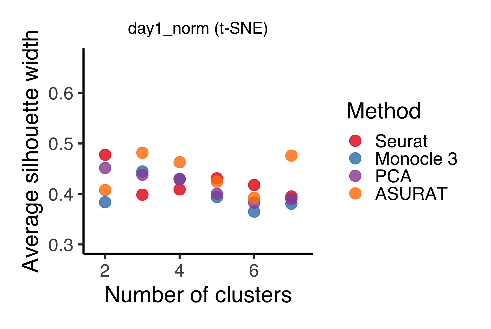
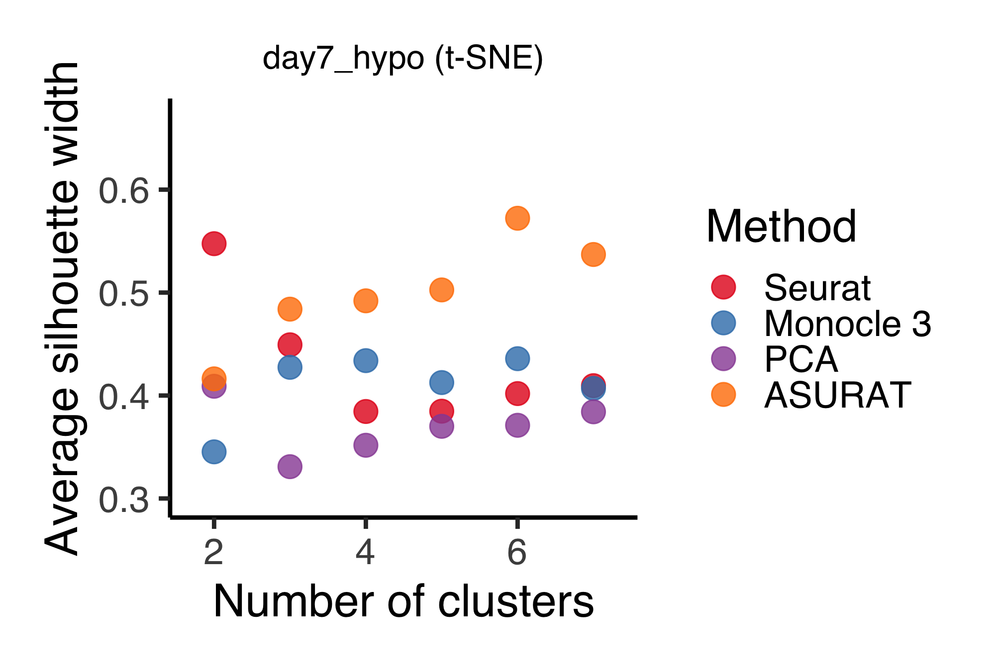

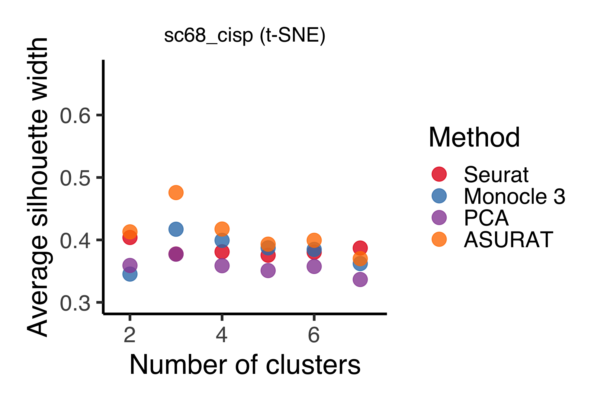

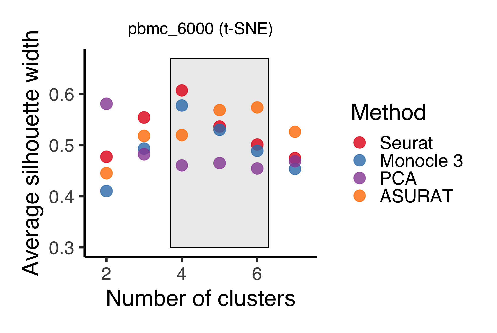


## Cell-type inference in `pbmc_4000` and `pbmc_6000`
In this section, we infer the cell types existing in the PBMC datasets
by using Seurat, Monocle 3 plus Garnett, SC3, and ASURAT.


### Seurat
Load the objects.
```{r, eval = FALSE}
source("R/function_seurat.R")
pbmc_4000 <- readRDS(file = "backup/15_020_pbmc_4000_seurat.rds")
pbmc_6000 <- readRDS(file = "backup/16_020_pbmc_6000_seurat.rds")
```

Run `FindClusters()` for clustering cells.
```{r, eval = FALSE}
pbmc_4000 <- FindClusters(pbmc_4000, resolution = 0.08)
pbmc_6000 <- FindClusters(pbmc_6000, resolution = 0.15)
```

The following function `plot_umap_seurat()` shows cell states on a UMAP space.
Note that the labels of groups are added by 1 from the original Seurat's
labeling (0, 1, 2, ...).
The arguments are `obj`, `title`, `title_size, ``xlabel`, `ylabel`, and
`default_color` (if `TRUE`, the default color of ggplot is used,
otherwise rainbow).
```{r, eval = FALSE}
# ----------------------------------------
# For `pbmc_4000`
# ----------------------------------------
p <- plot_umap_seurat(obj = pbmc_4000, title = "pbmc_4000", title_size = 24,
                      xlabel = "UMAP_1", ylabel = "UMAP_2",
                      default_color = TRUE)
filename <- "figures/figure_15_0025.png"
ggsave(file = filename, plot = p, dpi = 300, width = 5, height = 4)
```

```{r, eval = FALSE, echo = FALSE, results = "hide"}
# ----------------------------------------
# For `pbmc_6000`
# ----------------------------------------
p <- plot_umap_seurat(obj = pbmc_6000, title = "pbmc_6000", title_size = 24,
                      xlabel = "UMAP_1", ylabel = "UMAP_2",
                      default_color = TRUE)
filename <- "figures/figure_16_0025.png"
ggsave(file = filename, plot = p, dpi = 300, width = 5, height = 4)
```


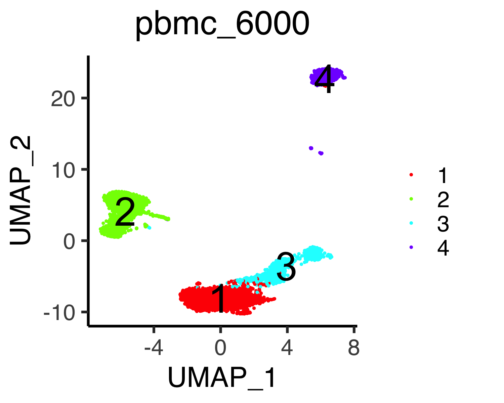

Find differentially expressed genes using Seurat's function and stores the
results into `obj@misc[["markers"]]`.
```{r, eval = FALSE}
pbmc_4000@misc[["markers"]] <- FindAllMarkers(
  pbmc_4000, only.pos = T, min.pct = 0.25, logfc.threshold = 0.25)
pbmc_6000@misc[["markers"]] <- FindAllMarkers(
  pbmc_6000, only.pos = T, min.pct = 0.25, logfc.threshold = 0.25)
```

Save the objects.
```{r, eval = FALSE}
saveRDS(pbmc_4000, file = "backup/15_021_pbmc_4000_marker_seurat.rds")
saveRDS(pbmc_6000, file = "backup/16_021_pbmc_6000_marker_seurat.rds")
```

Load the objects.
```{r, eval = FALSE}
pbmc_4000 <- readRDS(file = "backup/15_021_pbmc_4000_marker_seurat.rds")
pbmc_6000 <- readRDS(file = "backup/16_021_pbmc_6000_marker_seurat.rds")
```

Users can check the marker genes of each cluster by the following command:
```{r, eval = FALSE}
datatable(pbmc_4000@misc[["markers"]], rownames = FALSE)
datatable(pbmc_6000@misc[["markers"]], rownames = FALSE)
```

* `pbmc_4000`

<iframe src="figures/pbmc_4000_marker_seurat.html" style="width:100%; height:530px;"></iframe>

* `pbmc_6000`

<iframe src="figures/pbmc_6000_marker_seurat.html" style="width:100%; height:530px;"></iframe>

Based on the above results and the manual investigation using GeneCards,
we annotated each group as follows:

* `pbmc_4000`
```
0: T cell         # CD3D, IL32, TRAC, CD3E
1: MC             # S100A8, LYZ, CD14
2: B cell         # CD79A, MS4A1, IGHM
3: NK/NKT cell    # NKG7, CD160
4: NK/NKT cell    # KLRF1, GZMB, CD160
5: Immune cell    # PTCRA, JCHAIN, MZB1, GZMB, ..
```

* `pbmc_6000`
```
0: T cell         # CD3D, TCF7, CD27, CD3E
1: MC             # S100A8, LYZ, CD14
2: NK/NKT cell    # NKG7, GZMA, FGFBP2, GNLY
3: B cell         # CD79A, VPREB3, BANK1
```

Identify the cell types.
```{r, eval = FALSE}
# ----------------------------------------
# For `pbmc_4000`
# ----------------------------------------
tmp <- as.integer(as.character(pbmc_4000@meta.data[["seurat_clusters"]]))
tmp[tmp == 0] <- "T"
tmp[tmp == 1] <- "MC"
tmp[tmp == 2] <- "B"
tmp[tmp == 3] <- "NK/NKT"
tmp[tmp == 4] <- "NK/NKT"
tmp[tmp == 5] <- "u.s."   # Unspecified
tmp <- factor(tmp, levels = c("T", "MC", "B", "NK/NKT", "u.s."))
pbmc_4000@meta.data[["mylabel"]] <- tmp
# ----------------------------------------
# For `pbmc_6000`
# ----------------------------------------
tmp <- as.integer(as.character(pbmc_6000@meta.data[["seurat_clusters"]]))
tmp[tmp == 0] <- "T"
tmp[tmp == 1] <- "MC"
tmp[tmp == 2] <- "NK/NKT"
tmp[tmp == 3] <- "B"
tmp <- factor(tmp, levels = c("T", "MC", "B", "NK/NKT"))
pbmc_6000@meta.data[["mylabel"]] <- tmp
```

The following function `plot_manifold()` shows sample states on UMAP space.
```{r, eval = FALSE}
plot_manifold <- function(obj, title, title_size, xlabel, ylabel){
  # ----------------------------------------
  # Definitions
  # ----------------------------------------
  df <- data.frame(
    x = obj@reductions[["umap"]]@cell.embeddings[,1],
    y = obj@reductions[["umap"]]@cell.embeddings[,2],
    label = obj[["seurat_clusters"]],
    anno = obj[["mylabel"]]
  )
  colnames(df) <- c("x", "y", "label", "anno")
  n_groups <- length(unique(obj$seurat_clusters))
  # ----------------------------------------
  # Color
  # ----------------------------------------
  ggColorHue <- function(n, l=65){   # To produce default colors of ggplot2
    hues <- seq(15, 375, length=n+1)
    hcl(h=hues, l=l, c=100)[1:n]
  }
  my_colors <- ggColorHue(6)
  tmp <- as.character(df$anno)
  tmp[tmp == "T"] <- my_colors[1]
  tmp[tmp == "MC"] <- my_colors[2]
  tmp[tmp == "B"] <- my_colors[3]
  tmp[tmp == "NK/NKT"] <- my_colors[4]
  tmp[tmp == "u.s."] <- my_colors[6]
  tmp <- factor(tmp, levels = my_colors)
  df$col <- tmp
  # ----------------------------------------
  # Positions of labels
  # ----------------------------------------
  cluster_num <- levels(df$label)
  cog <- c()  # Center of gravity
  for(i in cluster_num){
    cog <- rbind(cog, c(
      mean(df[which(df$label == i),]$x),
      mean(df[which(df$label == i),]$y),
      as.character(unique(df[which(df$label == i),]$anno))
    ))
  }
  # ----------------------------------------
  # Plot
  # ----------------------------------------
  p <- ggplot() +
    geom_point(aes(x=df[,1], y=df[,2], color=df[,5]), size=0.5, alpha=1.0) +
    labs(title=title, x=xlabel, y=ylabel, colour="") +
    scale_colour_manual(values=my_colors) +
    theme_classic(base_size=20, base_family="Helvetica") +
    theme(plot.title=element_text(hjust=0.5, size=title_size),
      plot.margin=unit(c(0.5,2,0.5,0.5), "lines"), legend.position="none") +
    geom_text(aes(x=as.numeric(cog[,1]), y=as.numeric(cog[,2]), label=cog[,3]),
      size=8, colour="black")
  
  return(p)
}

# ----------------------------------------
# For `pbmc_4000`
# ----------------------------------------
p <- plot_manifold(obj = pbmc_4000, title = "pbmc_4000 (Seurat)",
                   title_size = 24, xlabel = "UMAP_1", ylabel = "UMAP_2")
filename <- "figures/figure_15_0026.png"
ggsave(file = filename, plot = p, dpi = 300, width = 4.9, height = 5)
```

```{r, eval = FALSE, echo = FALSE, results = "hide"}
# ----------------------------------------
# For `pbmc_6000`
# ----------------------------------------
p <- plot_manifold(obj = pbmc_6000, title = "pbmc_6000 (Seurat)",
                   title_size = 24, xlabel = "UMAP_1", ylabel = "UMAP_2")
filename <- "figures/figure_16_0026.png"
ggsave(file = filename, plot = p, dpi = 300, width = 4.9, height = 5)
```

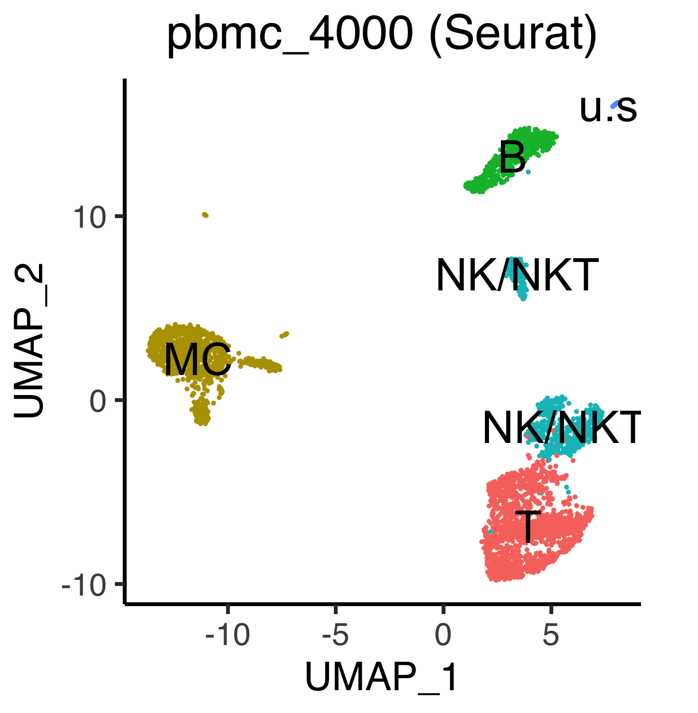


The numbers of cells are stored in a table.
```{r, eval = FALSE}
identify_cell <- function(obj){
  tmp <- obj@meta.data[["mylabel"]]
  cells <- levels(tmp)
  df <- c()
  for(cell in cells){
    df <- rbind(df, c(cell, length(tmp[tmp==cell])))
  }
  df <- as.data.frame(df)
  colnames(df) <- c("cell_type", "n")
  return(df)
}

pbmc_4000_cell <- identify_cell(obj = pbmc_4000)
pbmc_6000_cell <- identify_cell(obj = pbmc_6000)
```

Save the objects.
```{r, eval = FALSE}
saveRDS(pbmc_4000_cell, file = "backup/05_025_pbmc_4000_cell_seurat.rds")
saveRDS(pbmc_6000_cell, file = "backup/06_025_pbmc_6000_cell_seurat.rds")
```


### Monocle 3
Load the objects.
```{r, eval = FALSE}
pbmc_4000 <- readRDS(file = "backup/15_030_pbmc_4000_monocle3.rds")
pbmc_6000 <- readRDS(file = "backup/16_030_pbmc_6000_monocle3.rds")
```

Group cells into clusters by using a community detection algorithm.
```{r, eval = FALSE}
pbmc_4000 <- cluster_cells(pbmc_4000, resolution = 1e-5)
pbmc_6000 <- cluster_cells(pbmc_6000, resolution = 1e-5)
```

Save the objects.
```{r, eval = FALSE}
saveRDS(pbmc_4000, file = "backup/15_031_pbmc_4000_monocle3.rds")
saveRDS(pbmc_6000, file = "backup/16_031_pbmc_6000_monocle3.rds")
```

Load the objects.
```{r, eval = FALSE}
pbmc_4000 <- readRDS(file = "backup/15_031_pbmc_4000_monocle3.rds")
pbmc_6000 <- readRDS(file = "backup/16_031_pbmc_6000_monocle3.rds")
```

Visualize the cell states on a UMAP space.
```{r, eval = FALSE}
plot_manifold <- function(obj, plot_type, title, title_size, xlabel, ylabel){
  # ----------------------------------------
  # Definitions
  # ----------------------------------------
  df <- data.frame(
    x = reducedDims(obj)$UMAP[,1],
    y = reducedDims(obj)$UMAP[,2],
    label = obj@clusters@listData[["UMAP"]][["clusters"]]
  )
  colnames(df) <- c("x", "y", "label")
  n_groups <- length(unique(df$label))
  # ----------------------------------------
  # Color
  # ----------------------------------------
  ggColorHue <- function(n, l=65){   # To produce default colors of ggplot2
    hues <- seq(15, 375, length=n+1)
    hcl(h=hues, l=l, c=100)[1:n]
  }
  my_colors <- ggColorHue(n_groups)
  # ----------------------------------------
  # Positions of labels
  # ----------------------------------------
  cluster_num <- levels(df$label)
  cog <- c()  # Center of gravity
  for(i in cluster_num){
    cog <- rbind(cog, c(
      mean(df[which(df$label == i),]$x),
      mean(df[which(df$label == i),]$y),
      as.character(unique(df[which(df$label == i),]$label))
    ))
  }
  # ----------------------------------------
  # Plot
  # ----------------------------------------
  p <- ggplot() +
    geom_point(aes(x=df[,1], y=df[,2], color=df[,3]), size=0.5, alpha=1.0) +
    labs(title=title, x=xlabel, y=ylabel, colour="") +
    scale_colour_manual(values=my_colors) +
    theme_classic(base_size=20, base_family="Helvetica") +
    theme(plot.title=element_text(hjust=0.5, size=title_size),
      plot.margin=unit(c(0.5,2,0.5,0.5), "lines"), legend.position="right") +
    geom_text(aes(x=as.numeric(cog[,1]), y=as.numeric(cog[,2]), label=cog[,3]),
      size=8, colour="black")
  
  return(p)
}

# ----------------------------------------
# For `pbmc_4000`
# ----------------------------------------
p <- plot_manifold(obj = pbmc_4000, title = "pbmc_4000 (Monocle 3)",
                   title_size = 24, xlabel = "UMAP_1", ylabel = "UMAP_2")
filename <- "figures/figure_15_0035.png"
ggsave(file = filename, plot = p, dpi = 300, width = 5, height = 4)
```

```{r, eval = FALSE, echo = FALSE, results = "hide"}
# ----------------------------------------
# For `pbmc_6000`
# ----------------------------------------
p <- plot_manifold(obj = pbmc_6000, title = "pbmc_6000 (Monocle 3)",
                   title_size = 24, xlabel = "UMAP_1", ylabel = "UMAP_2")
filename <- "figures/figure_16_0035.png"
ggsave(file = filename, plot = p, dpi = 300, width = 5, height = 4)
```


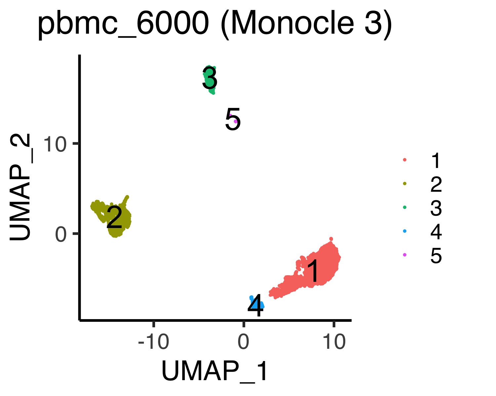

Investigate the marker genes for each cluster.
```{r, eval = FALSE}
pbmc_4000_marker <- top_markers(pbmc_4000, group_cells_by = "cluster",
                                reference_cells = 1000, cores = 2)
pbmc_6000_marker <- top_markers(pbmc_6000, group_cells_by = "cluster",
                                reference_cells = 1000, cores = 2)
```

Find marker genes by ranking them according to the argument `pseudo_R2`.
```{r, eval = FALSE}
pbmc_4000_topmarker <- pbmc_4000_marker %>%
  filter(fraction_expressing >= 0.10) %>% group_by(cell_group) %>%
  top_n(50, pseudo_R2)

pbmc_6000_topmarker <- pbmc_6000_marker %>%
  filter(fraction_expressing >= 0.10) %>% group_by(cell_group) %>%
  top_n(50, pseudo_R2)
```

The following Monocle 3's function `plot_genes_by_group()` visualizes the
expression levels of genes and fraction of cells.
```{r, eval = FALSE}
top_genes <- unique(pbmc_4000_topmarker %>% pull(gene_id))
p <- plot_genes_by_group(pbmc_4000, top_genes, group_cells_by = "cluster",
                         ordering_type = "cluster_row_col", max.size = 3)
filename <- "figures/figure_15_0036.png"
ggsave(file = filename, plot = p, dpi = 300, width = 5, height = 14)

top_genes <- unique(pbmc_6000_topmarker %>% pull(gene_id))
p <- plot_genes_by_group(pbmc_6000, top_genes, group_cells_by = "cluster",
                         ordering_type = "cluster_row_col", max.size = 3)
filename <- "figures/figure_16_0036.png"
ggsave(file = filename, plot = p, dpi = 300, width = 5, height = 14)
```

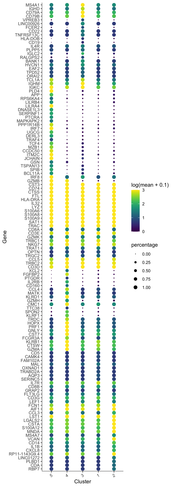


Below are the process for using `Garnett`, which may help users infer cell
types.
```{r, eval = FALSE}
pbmc_4000_garnett_markers <- pbmc_4000_topmarker %>%
  filter(marker_test_q_value < 0.01 & specificity >= 0.5) %>%
  group_by(cell_group) %>% top_n(50, marker_score)
pbmc_4000_garnett_markers <- pbmc_4000_garnett_markers %>%
  group_by(gene_short_name) %>% filter(n() == 1)

pbmc_6000_garnett_markers <- pbmc_6000_topmarker %>%
  filter(marker_test_q_value < 0.01 & specificity >= 0.5) %>%
  group_by(cell_group) %>% top_n(50, marker_score)
pbmc_6000_garnett_markers <- pbmc_6000_garnett_markers %>%
  group_by(gene_short_name) %>% filter(n() == 1)
```

Users can check the marker genes of each cluster by the following command:
```{r, eval = FALSE}
datatable(pbmc_4000_topmarker, rownames = FALSE)
datatable(pbmc_6000_topmarker, rownames = FALSE)
datatable(pbmc_4000_garnett_markers, rownames = FALSE)
datatable(pbmc_6000_garnett_markers, rownames = FALSE)
```

* `pbmc_4000` (Monocle 3)

<iframe src="figures/pbmc_4000_marker_monocle3.html" style="width:100%; height:300px;"></iframe>

* `pbmc_4000` (Monocle 3 plus Garnett)

<iframe src="figures/pbmc_4000_marker_monocle3_garnett.html" style="width:100%; height:300px;"></iframe>

* `pbmc_6000` (Monocle 3)

<iframe src="figures/pbmc_6000_marker_monocle3.html" style="width:100%; height:300px;"></iframe>

* `pbmc_6000` (Monocle 3 plus Garnett)

<iframe src="figures/pbmc_6000_marker_monocle3_garnett.html" style="width:100%; height:300px;"></iframe>

Based on the above results and the manual investigation using GeneCards,
we annotated each group as follows:

* pbmc_4000
```
1: T cell         # CD3D, IL32, TRAC, CD3E
2: MC             # S100A8, LYZ
3: B cell         # CD79A, MS4A1, IGHM
4: NK/NKT cell    # NKG7, GNLY, CD160
5: B cell         # BCL11A, MZB1
```

* pbmc_6000
```
1: T cell         # CD3D, TCF7, CD27, CD3E
2: MC             # S100A8, LYZ, CD14
3: B cell         # CD79B, VPREB3, BANK1
4: NK/NKT cell    # NKG7, GZMA, FGFBP2, GNLY
5: Immune cell    # MZB1, CD27
```

Identify the cell types.
```{r, eval = FALSE}
# ----------------------------------------
# For `pbmc_4000`
# ----------------------------------------
tmp <- as.integer(as.character(clusters(pbmc_4000)))
tmp[tmp == 1] <- "T"
tmp[tmp == 2] <- "MC"
tmp[tmp == 3] <- "B"
tmp[tmp == 4] <- "NK/NKT"
tmp[tmp == 5] <- "B"
tmp <- factor(tmp, levels = c("T", "MC", "B", "NK/NKT"))
colData(pbmc_4000)$assigned_cell_type <- tmp
# ----------------------------------------
# For `pbmc_6000`
# ----------------------------------------
tmp <- as.integer(as.character(clusters(pbmc_6000)))
tmp[tmp == 1] <- "T"
tmp[tmp == 2] <- "MC"
tmp[tmp == 3] <- "B"
tmp[tmp == 4] <- "NK/NKT"
tmp[tmp == 5] <- "u.s."
tmp <- factor(tmp, levels = c("T", "MC", "B", "NK/NKT", "u.s."))
colData(pbmc_6000)$assigned_cell_type <- tmp
```

The following function `plot_manifold()` shows sample states on UMAP space.
```{r, eval = FALSE}
plot_manifold <- function(obj, title, title_size, xlabel, ylabel){
  # ----------------------------------------
  # Definitions
  # ----------------------------------------
  df <- data.frame(
    x = reducedDims(obj)$UMAP[,1],
    y = reducedDims(obj)$UMAP[,2],
    label = obj@clusters@listData[["UMAP"]][["clusters"]],
    anno = obj@colData@listData[["assigned_cell_type"]]
  )
  colnames(df) <- c("x", "y", "label", "anno")
  n_groups <- length(unique(obj$seurat_clusters))
  # ----------------------------------------
  # Color
  # ----------------------------------------
  ggColorHue <- function(n, l=65){   # To produce default colors of ggplot2
    hues <- seq(15, 375, length=n+1)
    hcl(h=hues, l=l, c=100)[1:n]
  }
  my_colors <- ggColorHue(6)
  tmp <- as.character(df$anno)
  tmp[tmp == "T"] <- my_colors[1]
  tmp[tmp == "MC"] <- my_colors[2]
  tmp[tmp == "B"] <- my_colors[3]
  tmp[tmp == "NK/NKT"] <- my_colors[4]
  tmp[tmp == "u.s."] <- my_colors[6]
  tmp <- factor(tmp, levels = my_colors)
  df$col <- tmp
  # ----------------------------------------
  # Positions of labels
  # ----------------------------------------
  cluster_num <- levels(df$label)
  cog <- c()  # Center of gravity
  for(i in cluster_num){
    cog <- rbind(cog, c(
      mean(df[which(df$label == i),]$x),
      mean(df[which(df$label == i),]$y),
      as.character(unique(df[which(df$label == i),]$anno))
    ))
  }
  # ----------------------------------------
  # Plot
  # ----------------------------------------
  p <- ggplot() +
    geom_point(aes(x=df[,1], y=df[,2], color=df[,5]), size=0.5, alpha=1.0) +
    labs(title=title, x=xlabel, y=ylabel, colour="") +
    scale_colour_manual(values=my_colors) +
    theme_classic(base_size=20, base_family="Helvetica") +
    theme(plot.title=element_text(hjust=0.5, size=title_size),
      plot.margin=unit(c(0.5,2,0.5,0.5), "lines"), legend.position="none") +
    geom_text(aes(x=as.numeric(cog[,1]), y=as.numeric(cog[,2]), label=cog[,3]),
      size=8, colour="black")
  
  return(p)
}

# ----------------------------------------
# For `pbmc_4000`
# ----------------------------------------
p <- plot_manifold(obj = pbmc_4000, title = "pbmc_4000 (Monocle 3)",
                   title_size = 24, xlabel = "UMAP_1", ylabel = "UMAP_2")
filename <- "figures/figure_15_0037.png"
ggsave(file = filename, plot = p, dpi = 300, width = 4.9, height = 5)
```

```{r, eval = FALSE, echo = FALSE, results = "hide"}
# ----------------------------------------
# For `pbmc_6000`
# ----------------------------------------
p <- plot_manifold(obj = pbmc_6000, title = "pbmc_6000 (Monocle 3)",
                   title_size = 24, xlabel = "UMAP_1", ylabel = "UMAP_2")
filename <- "figures/figure_16_0037.png"
ggsave(file = filename, plot = p, dpi = 300, width = 4.9, height = 5)
```


The numbers of cells are stored in a table.
```{r, eval = FALSE}
identify_cell <- function(obj){
  tmp <- obj@colData@listData[["assigned_cell_type"]]
  cells <- levels(tmp)
  df <- c()
  for(cell in cells){
    df <- rbind(df, c(cell, length(tmp[tmp==cell])))
  }
  df <- as.data.frame(df)
  colnames(df) <- c("cell_type", "n")
  return(df)
}

pbmc_4000_cell <- identify_cell(obj = pbmc_4000)
pbmc_6000_cell <- identify_cell(obj = pbmc_6000)
```

Save the objects.
```{r, eval = FALSE}
saveRDS(pbmc_4000_cell, file = "backup/05_035_pbmc_4000_cell_monocle3.rds")
saveRDS(pbmc_6000_cell, file = "backup/06_035_pbmc_6000_cell_monocle3.rds")
```


### SC3
Load the objects.
```{r, eval = FALSE}
pbmc_4000 <- readRDS(file = "backup/15_040_pbmc_4000_sc3.rds")
pbmc_6000 <- readRDS(file = "backup/16_040_pbmc_6000_sc3.rds")
```

Differentially expressed genes are calculated using non-parametric
Kruskal-Wallis test in `SC3` package.
```{r, eval = FALSE}
p <- sc3_plot_de_genes(pbmc_4000, k = 5)
filename <- "figures/figure_15_0040.png"
ggsave(file = filename, plot = p, dpi = 300, width = 8.5, height = 8.5)

p <- sc3_plot_de_genes(pbmc_6000, k = 5)
filename <- "figures/figure_16_0040.png"
ggsave(file = filename, plot = p, dpi = 300, width = 8.5, height = 8.5)
```


Find marker genes by using `sc3_plot_markers()` in `SC3` package.
Although we changed the argument `k` from 2 to 8, the following values seemed
to be the best of all.
```{r, eval = FALSE}
p <- sc3_plot_markers(pbmc_4000, k = 8)
filename <- "figures/figure_15_0041.png"
ggsave(file = filename, plot = p, dpi = 300, width = 8.5, height = 8.5)

p <- sc3_plot_markers(pbmc_6000, k = 6)
filename <- "figures/figure_16_0041.png"
ggsave(file = filename, plot = p, dpi = 300, width = 8.5, height = 8.5)
```

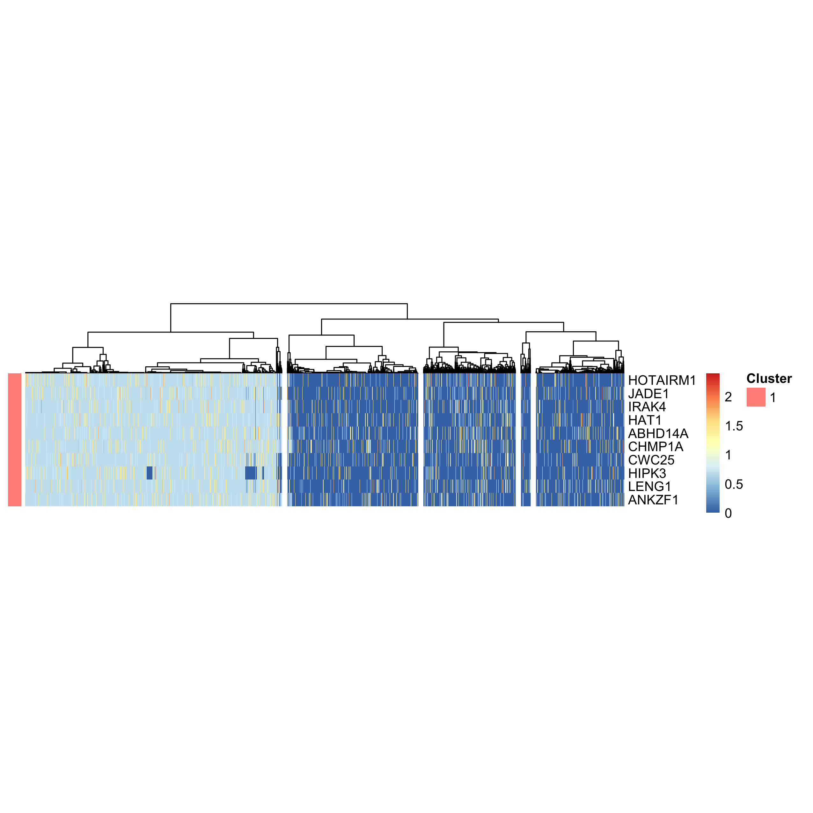


Based on the above results and the manual investigation using GeneCards,
we annotated each group as follows:

* pbmc_4000
```
1: NK/NKT cell    # GZMH, (TPD52L2)
2: u.s.
3: u.s.
4: u.s.
5: u.s.
6: u.s.
7: u.s.
8: u.s.
```

* pbmc_6000
```
1: u.s.
2: u.s.
3: B cell         # CD79A, MS4A1
4: NK/NKT cell    # GZMK
5: Immune cell    # FCGR3A, MS4A7
6: NK/NKT cell    # GZMB, GZMA, GZMH
```

Identify the cell types.
```{r, eval = FALSE}
# ----------------------------------------
# For `pbmc_4000`
# ----------------------------------------
tmp <- as.integer(as.character(pbmc_4000@colData@listData[["sc3_8_clusters"]]))
tmp[tmp == 1] <- "NK/NKT"
tmp[tmp == 2] <- "u.s."
tmp[tmp == 3] <- "u.s."
tmp[tmp == 4] <- "u.s."
tmp[tmp == 5] <- "u.s."
tmp[tmp == 6] <- "u.s."
tmp[tmp == 7] <- "u.s."
tmp[tmp == 8] <- "u.s."
tmp <- factor(tmp, levels = c("NK/NKT", "u.s."))
colData(pbmc_4000)$assigned_cell_type <- tmp
# ----------------------------------------
# For `pbmc_6000`
# ----------------------------------------
tmp <- as.integer(as.character(pbmc_6000@colData@listData[["sc3_6_clusters"]]))
tmp[tmp == 1] <- "u.s."
tmp[tmp == 2] <- "u.s."
tmp[tmp == 3] <- "B"
tmp[tmp == 4] <- "NK/NKT"
tmp[tmp == 5] <- "u.s."
tmp[tmp == 6] <- "NK/NKT"
tmp <- factor(tmp, levels = c("B", "NK/NKT", "u.s."))
colData(pbmc_6000)$assigned_cell_type <- tmp
```

Save the objects.
```{r, eval = FALSE}
saveRDS(pbmc_4000, file = "backup/15_041_pbmc_4000_sc3.rds")
saveRDS(pbmc_6000, file = "backup/16_041_pbmc_6000_sc3.rds")
```

Load the objects.
```{r, eval = FALSE}
pbmc_4000 <- readRDS(file = "backup/15_041_pbmc_4000_sc3.rds")
pbmc_6000 <- readRDS(file = "backup/16_041_pbmc_6000_sc3.rds")
```

The numbers of cells are stored in a table.
```{r, eval = FALSE}
identify_cell <- function(obj){
  tmp <- colData(obj)$assigned_cell_type
  cells <- levels(tmp)
  df <- c()
  for(cell in cells){
    df <- rbind(df, c(cell, length(tmp[tmp==cell])))
  }
  df <- as.data.frame(df)
  colnames(df) <- c("cell_type", "n")
  return(df)
}

pbmc_4000_cell <- identify_cell(obj = pbmc_4000)
pbmc_6000_cell <- identify_cell(obj = pbmc_6000)
```

Save the objects.
```{r, eval = FALSE}
saveRDS(pbmc_4000_cell, file = "backup/05_045_pbmc_4000_cell_sc3.rds")
saveRDS(pbmc_6000_cell, file = "backup/06_045_pbmc_6000_cell_sc3.rds")
```


### ASURAT
Load the objects.
```{r, eval = FALSE}
pbmc_4000 <- readRDS(file = "backup/05_500_pbmc_4000_all.rds")
pbmc_6000 <- readRDS(file = "backup/06_500_pbmc_6000_all.rds")
```

Visualize the sign scores upregulated in specific cell clusters, using violin
plots.
Please see Chapter 9 "ASURAT using Cell Ontology DB" for the details.

* `pbmc_4000`


* `pbmc_6000`


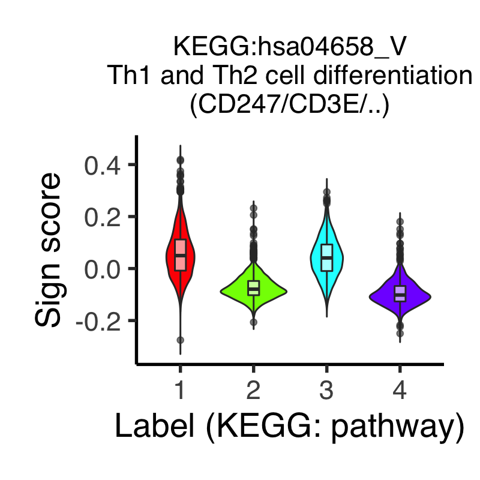


Show the population sizes by two-variable bar graphs.


Based on the above results and the manual investigation using GeneCards,
we annotated each group as follows:

* pbmc_4000
```
1: T cell
2: Monocyte
3: B cell
4: NK/NKT cell
5: NK/NKT cell
```

* pbmc_6000
```
1: T cell
2: Monocyte
3: NK/NKT cell
4: B cell
5: Dendritic cell
```

Identify the cell types.
```{r, eval = FALSE}
# ----------------------------------------
# For `pbmc_4000`
# ----------------------------------------
tmp <- pbmc_4000[["sample"]][["seuratFindClusters_CO_cell"]]
tmp[tmp == 1] <- "T"
tmp[tmp == 2] <- "MC"
tmp[tmp == 3] <- "B"
tmp[tmp == 4] <- "NK/NKT"
tmp[tmp == 5] <- "NK/NKT"
tmp <- factor(tmp, levels = c("T", "MC", "B", "NK/NKT"))
pbmc_4000[["sample"]][["assigned_cell_type"]] <- tmp
# ----------------------------------------
# For `pbmc_6000`
# ----------------------------------------
tmp <- pbmc_6000[["sample"]][["seuratFindClusters_CO_cell"]]
tmp[tmp == 1] <- "T"
tmp[tmp == 2] <- "MC"
tmp[tmp == 3] <- "B"
tmp[tmp == 4] <- "NK/NKT"
tmp[tmp == 5] <- "DC"
tmp <- factor(tmp, levels = c("T", "MC", "B", "NK/NKT", "DC"))
pbmc_6000[["sample"]][["assigned_cell_type"]] <- tmp
```

The following function `plot_manifold()` shows sample states on UMAP space.
```{r, eval = FALSE}
plot_manifold <- function(obj, title, title_size, xlabel, ylabel){
  # ----------------------------------------
  # Definitions
  # ----------------------------------------
  df <- data.frame(
    x = obj[["reduction"]][["umap"]][["CO"]][["cell"]][["layout"]][,1],
    y = obj[["reduction"]][["umap"]][["CO"]][["cell"]][["layout"]][,2],
    label = obj[["sample"]][["seuratFindClusters_CO_cell"]],
    anno = obj[["sample"]][["assigned_cell_type"]]
  )
  colnames(df) <- c("x", "y", "label", "anno")
  n_groups <- length(unique(df$label))
  # ----------------------------------------
  # Color
  # ----------------------------------------
  ggColorHue <- function(n, l=65){   # To produce default colors of ggplot2
    hues <- seq(15, 375, length=n+1)
    hcl(h=hues, l=l, c=100)[1:n]
  }
  my_colors <- ggColorHue(6)
  tmp <- as.character(df$anno)
  tmp[tmp == "T"] <- my_colors[1]
  tmp[tmp == "MC"] <- my_colors[2]
  tmp[tmp == "B"] <- my_colors[3]
  tmp[tmp == "NK/NKT"] <- my_colors[4]
  if(length(tmp[tmp == "DC"]) != 0){
    tmp[tmp == "DC"] <- my_colors[5]
  }
  tmp <- factor(tmp, levels = my_colors)
  df$col <- tmp
  # ----------------------------------------
  # Positions of labels
  # ----------------------------------------
  cluster_num <- unique(sort(df$label))
  cog <- c()  # Center of gravity
  for(i in cluster_num){
    cog <- rbind(cog, c(
      mean(df[which(df$label == i),]$x),
      mean(df[which(df$label == i),]$y),
      as.character(unique(df[which(df$label == i),]$anno))
    ))
  }
  # ----------------------------------------
  # Plot
  # ----------------------------------------
  p <- ggplot() +
    geom_point(aes(x=df[,1], y=df[,2], color=df[,5]), size=0.5, alpha=1.0) +
    labs(title=title, x=xlabel, y=ylabel, colour="") +
    scale_colour_manual(values=my_colors) +
    theme_classic(base_size=20, base_family="Helvetica") +
    theme(plot.title=element_text(hjust=0.5, size=title_size),
      plot.margin=unit(c(0.5,2,0.5,0.5), "lines"), legend.position="none") +
    geom_text(aes(x=as.numeric(cog[,1]), y=as.numeric(cog[,2]), label=cog[,3]),
      size=8, colour="black")
  
  return(p)
}

# ----------------------------------------
# For `pbmc_4000`
# ----------------------------------------
p <- plot_manifold(obj = pbmc_4000, title = "pbmc_4000 (CO: cell)",
                   title_size = 24, xlabel = "UMAP_1", ylabel = "UMAP_2")
filename <- "figures/figure_15_0065.png"
ggsave(file = filename, plot = p, dpi = 300, width = 4.9, height = 5)
```

```{r, eval = FALSE, echo = FALSE, results = "hide"}
# ----------------------------------------
# For `pbmc_6000`
# ----------------------------------------
p <- plot_manifold(obj = pbmc_6000, title = "pbmc_6000 (CO: cell)",
                   title_size = 24, xlabel = "UMAP_1", ylabel = "UMAP_2")
filename <- "figures/figure_16_0065.png"
ggsave(file = filename, plot = p, dpi = 300, width = 4.9, height = 5)
```


The numbers of cells are stored in a table.
```{r, eval = FALSE}
identify_cell <- function(obj){
  tmp <- obj[["sample"]][["assigned_cell_type"]]
  cells <- levels(tmp)
  df <- c()
  for(cell in cells){
    df <- rbind(df, c(cell, length(tmp[tmp==cell])))
  }
  df <- as.data.frame(df)
  colnames(df) <- c("cell_type", "n")
  return(df)
}

pbmc_4000_cell <- identify_cell(obj = pbmc_4000)
pbmc_6000_cell <- identify_cell(obj = pbmc_6000)
```

Save the objects.
```{r, eval = FALSE}
saveRDS(pbmc_4000_cell, file = "backup/05_065_pbmc_4000_cell_asurat.rds")
saveRDS(pbmc_6000_cell, file = "backup/06_065_pbmc_6000_cell_asurat.rds")
```


## Identifying cell types in `pbmc_4000` and `pbmc_6000`
Load the objects.
```{r, eval = FALSE}
pbmc_4000_seurat <- readRDS(file = "backup/05_025_pbmc_4000_cell_seurat.rds")
pbmc_6000_seurat <- readRDS(file = "backup/06_025_pbmc_6000_cell_seurat.rds")
pbmc_4000_monocle <- readRDS(file = "backup/05_035_pbmc_4000_cell_monocle3.rds")
pbmc_6000_monocle <- readRDS(file = "backup/06_035_pbmc_6000_cell_monocle3.rds")
pbmc_4000_sc3 <- readRDS(file = "backup/05_045_pbmc_4000_cell_sc3.rds")
pbmc_6000_sc3 <- readRDS(file = "backup/06_045_pbmc_6000_cell_sc3.rds")
pbmc_4000_asurat <- readRDS(file = "backup/05_065_pbmc_4000_cell_asurat.rds")
pbmc_6000_asurat <- readRDS(file = "backup/06_065_pbmc_6000_cell_asurat.rds")
```

The hypothetical results can be obtained from Cao et al., Front. Genet. (2020).
```{r, eval = FALSE}
pbmc_4000_cao <- data.frame(
  cell_type = c("T", "MC", "B", "NK/NKT", "Megakaryocyte"),
  n = c(0.4226, 0.2707, 0.1509, 0.1546, 0.0012)
)
pbmc_6000_cao <- data.frame(
  cell_type = c("T", "MC", "B", "NK/NKT", "Megakaryocyte"),
  n = c(0.4920, 0.2652, 0.1292, 0.1102, 0.0035)
)
```

Change the numbers of cells into ratios.
```{r, eval = FALSE}
take_ratio <- function(df){
  df$n <- as.numeric(df$n) / sum(as.numeric(df$n))
  return(df)
}
pbmc_4000_seurat <- take_ratio(pbmc_4000_seurat)
pbmc_4000_monocle <- take_ratio(pbmc_4000_monocle)
pbmc_4000_sc3 <- take_ratio(pbmc_4000_sc3)
pbmc_4000_asurat <- take_ratio(pbmc_4000_asurat)

pbmc_6000_seurat <- take_ratio(pbmc_6000_seurat)
pbmc_6000_monocle <- take_ratio(pbmc_6000_monocle)
pbmc_6000_sc3 <- take_ratio(pbmc_6000_sc3)
pbmc_6000_asurat <- take_ratio(pbmc_6000_asurat)
```

Add the names of algorithms.
```{r, eval = FALSE}
pbmc_4000_seurat$algorithm <- "Seurat"
pbmc_4000_monocle$algorithm <- "Monocle 3"
pbmc_4000_sc3$algorithm <- "SC3"
pbmc_4000_cao$algorithm <- "SCSA"
pbmc_4000_asurat$algorithm <- "ASURAT"

pbmc_6000_seurat$algorithm <- "Seurat"
pbmc_6000_monocle$algorithm <- "Monocle 3"
pbmc_6000_sc3$algorithm <- "SC3"
pbmc_6000_cao$algorithm <- "SCSA"
pbmc_6000_asurat$algorithm <- "ASURAT"
```

Concatenate all of the data.
```{r, eval = FALSE}
colnames(pbmc_4000_seurat)[1] <- "cell_type"
colnames(pbmc_6000_seurat)[1] <- "cell_type"

df <- rbind(rbind(rbind(rbind(rbind(rbind(rbind(
  pbmc_4000_asurat, pbmc_4000_seurat), pbmc_4000_monocle), pbmc_4000_sc3),
  pbmc_6000_asurat), pbmc_6000_seurat), pbmc_6000_monocle), pbmc_6000_sc3)
```

Rename the names of cell types.
```{r, eval = FALSE}
df[which(df$cell_type == "T"),]$cell_type <- "T cell"
df[which(df$cell_type == "MC"),]$cell_type <- "Monocyte"
df[which(df$cell_type == "B"),]$cell_type <- "B cell"
df[which(df$cell_type == "NK/NKT"),]$cell_type <- "NK/NKT cell"
df[which(df$cell_type == "DC"),]$cell_type <- "Dendritic cell"
df[which(df$cell_type == "u.s."),]$cell_type <- "Unspecified"
# ----------------------------------------
# Seurat
# ----------------------------------------
dg <- pbmc_4000_seurat
dg[which(dg$cell_type == "T"),]$cell_type <- "T cell"
dg[which(dg$cell_type == "MC"),]$cell_type <- "Monocyte"
dg[which(dg$cell_type == "B"),]$cell_type <- "B cell"
dg[which(dg$cell_type == "NK/NKT"),]$cell_type <- "NK/NKT cell"
dg[which(dg$cell_type == "u.s."),]$cell_type <- "Unspecified"
pbmc_4000_seurat <- dg

dg <- pbmc_6000_seurat
dg[which(dg$cell_type == "T"),]$cell_type <- "T cell"
dg[which(dg$cell_type == "MC"),]$cell_type <- "Monocyte"
dg[which(dg$cell_type == "B"),]$cell_type <- "B cell"
dg[which(dg$cell_type == "NK/NKT"),]$cell_type <- "NK/NKT cell"
pbmc_6000_seurat <- dg
# ----------------------------------------
# Monocle 3
# ----------------------------------------
dg <- pbmc_4000_monocle
dg[which(dg$cell_type == "T"),]$cell_type <- "T cell"
dg[which(dg$cell_type == "MC"),]$cell_type <- "Monocyte"
dg[which(dg$cell_type == "B"),]$cell_type <- "B cell"
dg[which(dg$cell_type == "NK/NKT"),]$cell_type <- "NK/NKT cell"
pbmc_4000_monocle <- dg

dg <- pbmc_6000_monocle
dg[which(dg$cell_type == "T"),]$cell_type <- "T cell"
dg[which(dg$cell_type == "MC"),]$cell_type <- "Monocyte"
dg[which(dg$cell_type == "B"),]$cell_type <- "B cell"
dg[which(dg$cell_type == "NK/NKT"),]$cell_type <- "NK/NKT cell"
dg[which(dg$cell_type == "u.s."),]$cell_type <- "Unspecified"
pbmc_6000_monocle <- dg
# ----------------------------------------
# SC3
# ----------------------------------------
dg <- pbmc_4000_sc3
dg[which(dg$cell_type == "NK/NKT"),]$cell_type <- "NK/NKT cell"
dg[which(dg$cell_type == "u.s."),]$cell_type <- "Unspecified"
pbmc_4000_sc3 <- dg

dg <- pbmc_6000_sc3
dg[which(dg$cell_type == "B"),]$cell_type <- "B cell"
dg[which(dg$cell_type == "NK/NKT"),]$cell_type <- "NK/NKT cell"
dg[which(dg$cell_type == "u.s."),]$cell_type <- "Unspecified"
pbmc_6000_sc3 <- dg
# ----------------------------------------
# ASURAT
# ----------------------------------------
dg <- pbmc_4000_asurat
dg[which(dg$cell_type == "T"),]$cell_type <- "T cell"
dg[which(dg$cell_type == "MC"),]$cell_type <- "Monocyte"
dg[which(dg$cell_type == "B"),]$cell_type <- "B cell"
dg[which(dg$cell_type == "NK/NKT"),]$cell_type <- "NK/NKT cell"
pbmc_4000_asurat <- dg

dg <- pbmc_6000_asurat
dg[which(dg$cell_type == "T"),]$cell_type <- "T cell"
dg[which(dg$cell_type == "MC"),]$cell_type <- "Monocyte"
dg[which(dg$cell_type == "B"),]$cell_type <- "B cell"
dg[which(dg$cell_type == "NK/NKT"),]$cell_type <- "NK/NKT cell"
dg[which(dg$cell_type == "DC"),]$cell_type <- "Dendritic cell"
pbmc_6000_asurat <- dg
# ----------------------------------------
# Cao
# ----------------------------------------
dg <- pbmc_4000_cao
dg[which(dg$cell_type == "T"),]$cell_type <- "T cell"
dg[which(dg$cell_type == "MC"),]$cell_type <- "Monocyte"
dg[which(dg$cell_type == "B"),]$cell_type <- "B cell"
dg[which(dg$cell_type == "NK/NKT"),]$cell_type <- "NK/NKT cell"
pbmc_4000_cao <- dg

dg <- pbmc_6000_cao
dg[which(dg$cell_type == "T"),]$cell_type <- "T cell"
dg[which(dg$cell_type == "MC"),]$cell_type <- "Monocyte"
dg[which(dg$cell_type == "B"),]$cell_type <- "B cell"
dg[which(dg$cell_type == "NK/NKT"),]$cell_type <- "NK/NKT cell"
pbmc_6000_cao <- dg
```

Show the annotation results.
```{r, eval = FALSE}
xlabel = ""
ylabel = "Ratio"
my_colors <- brewer.pal(5, name="Set1")
size = 4.5
alpha = 0.85
jitter_size = 0.2
set.seed(29)
p <- ggplot() +
  geom_boxplot(aes(x=df$cell_type, y=df$n), color="white", alpha=0, size=0,
               coef = 1e10) +
  # ----------------------------------------
  # Cao et al., 2020.
  # ----------------------------------------
  geom_jitter(aes(x=pbmc_4000_cao$cell_type, y=pbmc_4000_cao$n),
              color="black", size=size, shape=15, alpha = 1,
              position=position_jitter(w = jitter_size, h = 0)) +
  geom_jitter(aes(x=pbmc_6000_cao$cell_type, y=pbmc_6000_cao$n),
              color="black", size=size, shape=15, alpha = 1,
              position=position_jitter(w = jitter_size, h = 0)) +
  # ----------------------------------------
  # pbmc_4000
  # ----------------------------------------
  geom_jitter(aes(x=pbmc_4000_seurat$cell_type, y=pbmc_4000_seurat$n),
              color=my_colors[1], size=size, shape=16, alpha = alpha,
              position=position_jitter(w = jitter_size, h = 0)) +
  geom_jitter(aes(x=pbmc_4000_monocle$cell_type, y=pbmc_4000_monocle$n),
              color=my_colors[2], size=size, shape=16, alpha = alpha,
              position=position_jitter(w = jitter_size, h = 0)) +
  geom_jitter(aes(x=pbmc_4000_sc3$cell_type, y=pbmc_4000_sc3$n),
              color=my_colors[3], size=size, shape=16, alpha = alpha,
              position=position_jitter(w = jitter_size, h = 0)) +
  geom_jitter(aes(x=pbmc_4000_asurat$cell_type, y=pbmc_4000_asurat$n),
              color=my_colors[5], size=size, shape=16, alpha = alpha,
              position=position_jitter(w = jitter_size, h = 0)) +
  # ----------------------------------------
  # pbmc_6000
  # ----------------------------------------
  geom_jitter(aes(x=pbmc_6000_seurat$cell_type, y=pbmc_6000_seurat$n),
              color=my_colors[1], size=size, shape=16, alpha = alpha,
              position=position_jitter(w = jitter_size, h = 0)) +
  geom_jitter(aes(x=pbmc_6000_monocle$cell_type, y=pbmc_6000_monocle$n),
              color=my_colors[2], size=size, shape=16, alpha = alpha,
              position=position_jitter(w = jitter_size, h = 0)) +
  geom_jitter(aes(x=pbmc_6000_sc3$cell_type, y=pbmc_6000_sc3$n),
              color=my_colors[3], size=size, shape=16, alpha = alpha,
              position=position_jitter(w = jitter_size, h = 0)) +
  geom_jitter(aes(x=pbmc_6000_asurat$cell_type, y=pbmc_6000_asurat$n),
              color=my_colors[5], size=size, shape=16, alpha = alpha,
              position=position_jitter(w = jitter_size, h = 0)) +
  ylim(0, 0.9) +
  scale_x_discrete(guide=guide_axis(angle=45)) +
  labs(title="", x=xlabel, y=ylabel, colour="") +
  theme_minimal(base_size=16, base_family="Helvetica") +
  theme(plot.title=element_text(hjust=0.5),
        panel.grid=element_line(color="gray80"),
        plot.margin=unit(c(0.5,2,0.5,0.5), "lines"), legend.position="right")

filename <- "figures/figure_95_0001.png"
ggsave(file = filename, plot = p, dpi = 300, width = 4.4, height = 4.5)
```


