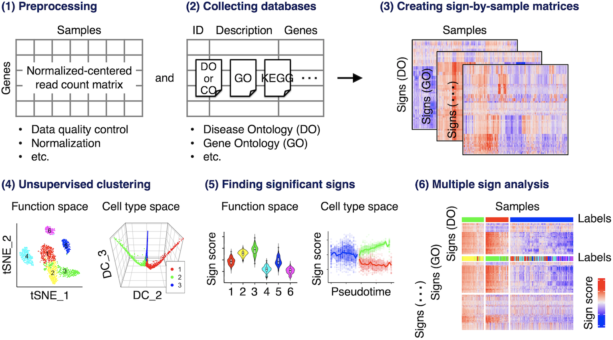

# ASURAT (version 0.0.0.9000)

ASURAT is a single-cell RNA sequencing (scRNA-seq) data analysis pipeline, developed for simultaneously clustering cells and biological interpretation.

Introduction, documentation, and tutorial can be found at

https://keita-iida.github.io/ASURAT/


## ASURAT's workflow
<br><br>



<br><br>


## Quick start inputting a Seurat object

Although the above [URL](https://keita-iida.github.io/ASURAT/) does not assume Seurat-based analyses, it is beneficial to begin with a Seurat object `obj` including `obj@assays[["RNA"]]@counts` data.

Load a Seurat object (below is an example).

```{r, eval = FALSE}
cerv_seurat <- readRDS(file = "backup/cerv_small_seurat.rds")  # Seurat object
```

Below are stopgap installations. See [Chapter 1](https://keita-iida.github.io/ASURAT/) for all the requirements.

```{r, eval = FALSE}
library(tidyverse)                # For efficient handling of data.frame
library(org.Hs.eg.db)             # For using human genome annotation package
library(Seurat)                   # For using Seurat
source("R/function_general.R")		# ASURAT's function
```

Create an ASURAT object.

```{r, eval = FALSE}
cerv <- make_asurat_obj(mat = cerv_seurat@assays[["RNA"]]@counts,
                        obj_name = "cerv_small")
```

Convert gene symbols into Entrez IDs by using `org.Hs.eg.db` package.
```{r, eval = FALSE}
dictionary <- AnnotationDbi::select(org.Hs.eg.db,
                                    key = cerv[["variable"]][["symbol"]],
                                    columns = c("ENTREZID"), keytype = "SYMBOL")
dictionary <- dictionary[!duplicated(dictionary$SYMBOL), ]
names(dictionary) <- c("symbol", "entrez")
cerv[["variable"]] <- dictionary
```

The following function `log1p_data()` performs log transform of the input data with a pseudo count `eps`.

```{r, eval = FALSE}
log1p_data <- function(obj, eps){
  obj[["history"]][["log1p_data"]][["eps"]] <- eps
  mat <- as.matrix(obj[["data"]][["raw"]])
  lmat <- log(mat + eps)
  obj[["data"]][["log1p"]] <- as.data.frame(lmat)
  return(obj)
}

cerv <- log1p_data(obj = cerv, eps = 1)
```

The following function `centralize_data()` centralizes the input data on a gene-by-gene basis.

```{r, eval = FALSE}
centralize_data <- function(obj){
  mat <- as.matrix(obj[["data"]][["log1p"]])
  cmat <- sweep(mat, 1, apply(mat, 1, mean), FUN = "-")
  obj[["data"]][["centered"]] <- as.data.frame(cmat)
  return(obj)
}

cerv <- centralize_data(obj = cerv)
```

The following function `do_cor_variables()` computes a correlation matrix from the input data.
Users can choose a measure of correlation coefficient by setting `method` (vector form is also accepted but not recommended due to the file size) such as `pearson`, `spearman`, and `kendall`.

```{r, eval = FALSE}
do_cor_variables <- function(obj, method){
  res <- list()
  tmat <- t(obj[["data"]][["log1p"]])
  for(m in method){
    res <- c(res, list(cor(tmat, method = m)))
  }
  names(res) <- method
  return(res)
}

cerv_cor <- do_cor_variables(obj = cerv, method = c("spearman"))
```

Save the objects. Please note that the suffixes of the following filenames, such as `09` and `005`, are only for identifying the computational steps (there is no special significance).

```{r, eval = FALSE}
saveRDS(cerv, file = "backup/09_005_cerv_correlation.rds")
saveRDS(cerv_cor, file = "backup/09_006_cerv_correlation.rds")
```


### ASURAT using several databases

Go to [Chapter 8](https://keita-iida.github.io/ASURAT/asurat-using-disease-ontology-database.html) for analyses using Disease Ontology database.

Go to [Chapter 9](https://keita-iida.github.io/ASURAT/asurat-using-cell-ontology-database-optional.html) for analyses using Cell Ontology database.

Go to [Chapter 10](https://keita-iida.github.io/ASURAT/asurat-using-gene-ontology-database-optional.html) for analyses using Gene Ontology database.

Go to [Chapter 11](https://keita-iida.github.io/ASURAT/asurat-using-kegg-optional.html) for analyses using Kyoto Encyclopedia of Genes and Genomes (KEGG)  database.

Go to [Chapter 12](https://keita-iida.github.io/ASURAT/asurat-using-reactome-optional.html) for analyses using Reactome database.
